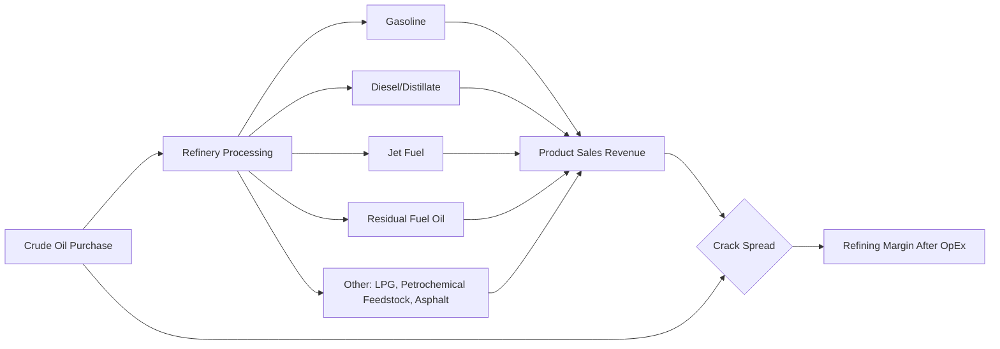

## Refining Economics and Crack Spreads

### Definition and Scope

Refining economics examines the profitability of converting crude oil into salable petroleum products (gasoline, diesel, jet fuel, fuel oil, and others) through the physical and chemical processes of a refinery. The central economic concept is the **crack spread** — the price differential between crude oil input costs and refined product output values — which serves as the primary proxy for refining margin and the key economic signal driving refinery utilization, investment, and shutdown decisions.

### The Refining Value Chain

**Key Points**

- Refineries do not produce a single output; they yield a "basket" of products from each barrel of crude, with the specific mix (product yield slate) determined by refinery configuration and processing complexity
- Product yield is not fixed by nature alone — refineries can adjust processing (via catalytic cracking, hydrocracking) to shift output toward higher-value products depending on prevailing product price spreads
- Refining economics is fundamentally a **spread business**, not an absolute-price business: refiners are exposed primarily to the differential between crude cost and product revenue, not to the outright level of oil prices

### Crack Spread Fundamentals

The basic crack spread formula for a simplified single-product case:

$$\text{Crack Spread} = P_{product} - P_{crude}$$

expressed in $/barrel, where both crude and product prices are converted to consistent barrel-equivalent units (products are often quoted per gallon and must be converted: 1 barrel = 42 gallons).

**Key Points**

- A positive and widening crack spread signals favorable refining margins, incentivizing higher refinery utilization rates
- A narrowing or negative crack spread signals margin compression, potentially prompting reduced runs, deferred maintenance timing shifts, or in severe/sustained cases, permanent refinery closure
- Crack spreads are quoted for specific crude benchmarks (WTI, Brent, Dubai) and specific product benchmarks (RBOB gasoline, ULSD diesel, jet/kerosene), and the choice of benchmark pair matters because it reflects the specific regional refining economics being analyzed

### Standard Crack Spread Configurations

**1:1 Crack Spread (single product)**

Simplest measure — compares one product directly against crude, useful for isolating a specific product's margin contribution:

$$\text{Gasoline Crack} = P_{RBOB} \times 42 - P_{WTI}$$

**3:2:1 Crack Spread**

The most widely cited industry benchmark, approximating a typical U.S. refinery yield: 3 barrels of crude input yield approximately 2 barrels of gasoline and 1 barrel of distillate (diesel/heating oil) output:

$$\text{3:2:1 Crack} = \frac{2 \times P_{gasoline} \times 42 + 1 \times P_{diesel} \times 42 - 3 \times P_{crude}}{3}$$

**5:3:2 Crack Spread**

A variant reflecting a somewhat different product mix (heavier distillate weighting), used in some regional contexts where diesel/distillate demand share is higher relative to gasoline.

**Key Points**

- The 3:2:1 ratio approximates historical U.S. Gulf Coast refinery output patterns and is the most commonly quoted "crack spread" in U.S. energy market commentary and futures market analysis
- European and Asian refining margins are frequently benchmarked using different ratios or dated Brent/product combinations (e.g., Singapore complex margins) reflecting regional refinery configurations and product demand patterns, since European and Asian demand skews more heavily toward diesel than U.S. demand
- [Inference] The "correct" crack ratio to use for any specific refinery analysis depends on that refinery's actual yield slate; the standard 3:2:1 or 5:3:2 benchmarks are market-convention approximations rather than a description of any single real refinery's precise output

### Refinery Complexity and Margin Capture

Not all refineries can capture the same crack spread from the same crude input — this depends on **refinery complexity**, commonly measured via the **Nelson Complexity Index (NCI)**, which weights different processing units (atmospheric distillation, catalytic cracking, coking, hydrocracking, reforming) by their relative capital intensity.

**Key Points**

- **Simple/topping refineries**: primarily atmospheric distillation, producing a yield slate closer to the natural composition of the crude; limited ability to upgrade heavier fractions into higher-value light products
- **Complex refineries**: include secondary conversion units (fluid catalytic cracking, hydrocracking, coking) that break heavier molecules into lighter, higher-value products, enabling processing of cheaper heavy/sour crudes into the same high-value product slate a simple refinery could only achieve from expensive light/sweet crude
- Higher complexity refineries can generally capture a wider effective margin because they have more flexibility to process advantaged (cheaper, heavier, higher-sulfur) crude grades while still producing high-value light products, though this comes with materially higher capital and operating cost
- [Inference] The specific margin uplift attributable to complexity varies by crude slate available, regional light-heavy crude price differentials, and each refinery's actual unit configuration — complexity indices provide a relative ranking rather than a precise dollar-margin prediction

### Crude Quality Differentials and Refining Economics

Refining margins are also shaped by the price differential between crude qualities:

$$\text{Light-Heavy Differential} = P_{light,sweet} - P_{heavy,sour}$$

**Key Points**

- Complex refineries configured to process heavy, sour (high-sulfur) crude can benefit when this differential widens, since they pay less for input crude while still producing the same light-product output slate as a simple refinery running expensive light crude
- Sulfur content ("sour" vs "sweet") requires desulfurization processing (hydrotreating) to meet product specifications (particularly ultra-low-sulfur diesel standards), adding processing cost that must be weighed against the crude cost discount
- API gravity (density) differentials similarly affect which crude grades are economical for a given refinery's configuration — heavier (lower API gravity) crude typically trades at a discount reflecting the additional processing required to convert it into light products

### Refinery Fixed and Variable Cost Structure

**Key Points**

- **Fixed costs**: labor, insurance, property taxes, scheduled turnaround/maintenance reserves — incurred regardless of throughput level
- **Variable costs**: energy consumption (refineries are energy-intensive, often consuming a portion of processed crude equivalent as fuel for the refining process itself, sometimes termed "refinery fuel and loss"), catalyst and chemical consumption, variable maintenance
- **Utilization rate** is a key operating decision variable: refiners aim to run at high utilization when crack spreads are favorable to spread fixed costs over more barrels, and may reduce runs, or use planned maintenance ("turnaround") timing strategically, during periods of weak margins
- Refinery **netback economics** for crude buyers is closely related: netback value equals product revenue minus refining costs and transport, representing the maximum price a refiner can economically pay for a given crude while still achieving target margins

### Worked Example: 3:2:1 Crack Spread Calculation

**Example**

Given the following illustrative prices:

- WTI crude: $75.00/barrel
- RBOB gasoline: $2.20/gallon
- ULSD diesel: $2.45/gallon

Convert product prices to $/barrel:

$$P_{gasoline} = 2.20 \times 42 = \$92.40/\text{bbl}$$

$$P_{diesel} = 2.45 \times 42 = \$102.90/\text{bbl}$$

Apply the 3:2:1 formula:

$$\text{3:2:1 Crack} = \frac{2(92.40) + 1(102.90) - 3(75.00)}{3} = \frac{184.80 + 102.90 - 225.00}{3} = \frac{62.70}{3} \approx \$20.90/\text{bbl}$$

This $20.90/bbl represents the theoretical gross refining margin per barrel of crude processed, before deducting operating costs, energy consumption, and other refinery-level expenses.

[Inference] This calculation uses illustrative price levels for demonstration purposes only; actual crack spreads fluctuate continuously with crude and product market conditions and should be sourced from live market data (e.g., NYMEX futures quotes) for any current analysis.

### Seasonal and Structural Drivers of Crack Spreads

**Key Points**

- **Seasonal gasoline demand**: crack spreads for gasoline commonly widen heading into peak driving season (spring/summer in the Northern Hemisphere) due to higher demand and seasonal fuel specification changes (summer-grade RVP requirements in some jurisdictions)
- **Seasonal diesel/heating oil demand**: distillate cracks can widen in winter months in colder regions due to heating oil demand overlapping with diesel demand
- **Refinery maintenance ("turnaround") season**: planned refinery outages, often concentrated in spring and fall shoulder seasons, reduce effective refining capacity and can widen crack spreads independent of underlying demand shifts
- **Unplanned outages**: hurricanes affecting Gulf Coast refining capacity, geopolitical supply disruptions, or unplanned mechanical failures can cause sharp, temporary crack spread spikes by constraining product supply
- **Structural shifts**: long-term trends such as fuel efficiency standards, electric vehicle adoption affecting gasoline demand, or shifts in regional refining capacity (plant closures, new capacity additions, particularly large new complex refineries) affect the medium-to-long-run structural level of crack spreads

### Crack Spreads as a Financial Hedging Tool

Refiners face **basis risk** from being simultaneously exposed to crude input costs and product output prices, which can move independently. Crack spread futures and options (traded on exchanges such as NYMEX/CME) allow refiners to hedge this margin directly rather than hedging crude and product legs separately.

**Key Points**

- A refiner can lock in a target crack spread by simultaneously buying crude oil futures (hedging input cost) and selling product futures (hedging output revenue), effectively "manufacturing" a synthetic forward margin
- This is functionally a paper transaction mirroring the physical refining process, allowing risk management independent of actual physical operations
- Crack spread options provide asymmetric protection — allowing a refiner to protect against margin compression while retaining upside if spreads widen — at the cost of an upfront option premium
- [Inference] The effectiveness of crack spread hedges in practice depends on the correlation between the specific futures contracts used and a given refiner's actual physical yield slate and delivery location, which introduces basis risk that pure crack spread hedging does not fully eliminate

### Global Regional Variation in Refining Margins

| Region | Typical Benchmark | Key Structural Factors |
| --- | --- | --- |
| U.S. Gulf Coast | WTI-based 3:2:1 crack | High complexity refineries processing discounted heavy/sour crude; strong export orientation for products |
| U.S. Midwest | WTI/WCS-based crack | Access to discounted Canadian heavy crude via pipeline |
| Northwest Europe | Brent-based margins (often diesel-weighted) | Structural diesel demand deficit historically met by imports; older, less complex refinery base in some areas |
| Singapore/Asia-Pacific | Dubai-based complex margins | Major regional refining/export hub; benchmark for Asian product pricing |

[Inference] Regional refining capacity, crude sourcing patterns, and margin structures shift over time with new refinery construction, closures, and changing trade flows, so specific regional margin comparisons should be verified against current market data rather than treated as static.

### Limitations of Crack Spread Analysis

**Key Points**

- Crack spreads represent **gross** margin only — they exclude refinery operating costs (energy, labor, catalysts, maintenance), so a positive crack spread does not automatically imply net profitability
- Standard crack ratios (3:2:1, 5:3:2) are approximations of an "average" refinery yield and may not accurately represent the economics of any specific individual refinery with a different configuration or crude slate
- Crack spreads do not capture the value of non-fuel refinery outputs (petrochemical feedstocks, lubricants, asphalt, LPG) which can be economically significant for some refinery configurations
- Spot crack spread calculations reflect a snapshot and can be volatile; refiners typically evaluate margins over rolling averages or forward curves for planning and investment decisions rather than acting on instantaneous spot spread movements

### Related Topics

- Nelson Complexity Index and refinery configuration economics
- Crude oil quality differentials (API gravity, sulfur content) and pricing
- Light-heavy crude price differentials and heavy crude processing economics
- Crack spread futures and options hedging strategies
- Refinery turnaround planning and maintenance scheduling economics
- Regional refined product trade flows and arbitrage
- Ultra-low-sulfur diesel specifications and hydrotreating cost economics
- Petrochemical feedstock economics and refinery-petrochemical integration
- Refinery capacity investment decisions and new-build economics