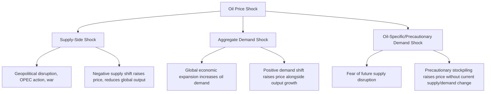

## Oil Price Shocks and Macroeconomic Transmission

### Definition and Scope

Oil price shocks refer to sudden, significant, and often unanticipated changes in crude oil prices that propagate through national and global economies via multiple transmission channels, affecting inflation, output, employment, exchange rates, and trade balances. Understanding this transmission is a foundational topic in energy economics because oil remains a critical input across transportation, industrial production, and petrochemical sectors, making its price volatility a recurring source of macroeconomic disturbance.

### Classification of Oil Price Shocks

Modern oil economics literature, particularly following the work of Kilian (2009) and related structural VAR analysis, distinguishes shocks by their underlying **source**, since the macroeconomic consequences differ substantially depending on whether a price change originates from supply or demand factors.

**Key Points**

- **Supply-driven shocks** (e.g., 1973 Arab oil embargo, 1979 Iranian Revolution, 1990 Gulf War, 2022 Russian invasion of Ukraine's effect on energy markets) typically raise prices while simultaneously depressing global output, producing the classic combination of inflation and recession, historically termed "stagflation"
- **Demand-driven shocks** originating from strong global economic growth (e.g., mid-2000s commodity boom associated with rapid emerging-market industrialization) raise oil prices as a byproduct of expansion, meaning higher prices coincide with robust global output rather than causing a downturn
- **Precautionary demand shocks** reflect shifts in expectations about future oil availability (geopolitical risk premiums, fear of disruption) that raise prices through speculative and inventory-building behavior even without an immediate physical supply or demand change
- [Inference] Distinguishing shock types in real time is analytically difficult; the shock-decomposition literature typically relies on structural VAR models applied retrospectively, so real-time classification of an ongoing price movement carries meaningful uncertainty

### Primary Transmission Channels

**1. Direct Income/Terms-of-Trade Channel**

For oil-importing economies, a price increase represents a transfer of real income to oil-exporting economies, reducing domestic purchasing power and aggregate demand.

$$\Delta \text{Real Income} \approx -\left(\frac{\text{Oil Imports}}{\text{GDP}}\right) \times \frac{\Delta P_{oil}}{P_{oil}}$$

This approximates the direct GDP-share cost of a given percentage oil price increase, scaled by the economy's oil import dependence.

**2. Cost-Push Inflation Channel**

Oil is a direct input (transportation fuel) and indirect input (via petrochemicals, shipping, production costs) across many sectors, so higher oil prices raise headline and, with pass-through lags, core inflation measures.

**3. Investment/Uncertainty Channel**

Sharp oil price volatility increases uncertainty about future costs and demand, prompting firms to postpone capital investment decisions — an effect documented in the "oil price volatility" literature as distinct from the level effect of price changes.

**4. Monetary Policy Response Channel**

Central banks facing oil-driven inflation may raise interest rates to contain price growth, which can compound the direct demand-reducing effect of the price shock itself, a dynamic central to debates over whether 1970s-era stagflation resulted more from the oil shocks themselves or from the monetary policy response to them.

**5. Exchange Rate and Trade Balance Channel**

Oil-importing countries typically see trade balances deteriorate as import costs rise, while oil-exporting countries see export revenues and often currency values strengthen, creating asymmetric effects across countries depending on net trade position.

**6. Sectoral Reallocation Channel**

Beyond aggregate effects, oil price changes shift resources between energy-intensive and energy-efficient sectors and goods (e.g., reduced demand for larger vehicles, altered airline cost structures), which the Hamilton and related literature identifies as a distinct "reallocation" effect that can depress aggregate activity even independent of the pure demand-reduction channel, due to frictions in reallocating labor and capital across sectors.

### Asymmetric Effects: Price Increases vs. Decreases

**Key Points**

- A substantial body of empirical research (notably Mork, 1989, and subsequent literature) finds that oil price *increases* have historically been associated with larger and more robust negative effects on GDP growth than the positive effects associated with comparable price *decreases* — an asymmetry sometimes attributed to the reallocation/adjustment-cost channel operating more strongly in one direction, or to consumer/firm behavioral asymmetries
- [Inference] The degree and even the existence of this asymmetry remains actively debated in the academic literature, with some more recent studies finding the relationship has weakened or become less statistically robust in post-2000 data compared to earlier decades — this should be treated as a contested empirical question rather than a settled stylized fact
- Oil-price *decreases* can still have negative macroeconomic effects concentrated in oil-producing regions or countries (reduced investment, employment, and fiscal revenue in the energy sector), even while net-importing economies benefit overall

### Historical Episodes as Illustrative Case Studies

| Episode | Primary Shock Type | Key Macroeconomic Outcome |
| --- | --- | --- |
| 1973-74 Oil Embargo | Supply | Sharp price increase; contributed to stagflation in oil-importing economies |
| 1979-80 Iranian Revolution | Supply | Second major price spike; compounded existing inflationary pressures |
| 1986 Oil Price Collapse | Supply (OPEC production increase) | Price collapse; benefited importers, severely impacted oil-exporting economies and energy-sector investment |
| 2003-2008 Price Run-up | Primarily demand (emerging market growth) | Sustained high prices alongside global economic expansion, differing from prior supply-shock episodes |
| 2008 Price Spike and Collapse | Mixed (demand peak followed by global financial crisis demand collapse) | Extreme volatility; price collapse coincided with, but was not the primary cause of, the broader financial crisis |
| 2014-2016 Price Decline | Supply (U.S. shale production growth) and demand softening | Benefited importing economies; significant stress in oil-exporting economies and shale-sector investment/employment |
| 2020 COVID-19 Demand Collapse | Demand (extreme, including brief negative WTI futures pricing) | Unprecedented demand destruction from pandemic mobility restrictions |
| 2022 Post-Invasion Price Spike | Supply/geopolitical | Contributed to inflationary pressures already elevated from post-pandemic supply chain conditions |

[Inference] The shock-type classifications above reflect the general consensus characterization in energy economics literature for each episode, though most real-world episodes involve some mixture of supply, demand, and precautionary elements rather than a single pure shock type.

### Modeling Approach: Structural VAR Framework

The dominant empirical methodology for decomposing and analyzing oil shock transmission is the **Structural Vector Autoregression (SVAR)** approach, which models the joint dynamics of oil prices and macroeconomic variables while imposing identifying restrictions to separate shock types.

A simplified representation of the system:

$$A_0 Y_t = \sum_{i=1}^{p} A_i Y_{t-i} + \epsilon_t$$

where $Y_t$ typically includes variables such as global oil production, global economic activity (often proxied by an index of real economic activity or shipping rates), real oil price, and domestic macroeconomic variables (GDP, inflation), and $A_0$ contains the contemporaneous identifying restrictions distinguishing supply from demand shocks.

**Key Points**

- Identification typically relies on assumptions such as short-run supply inelasticity (oil production does not respond immediately to demand shocks within the same period) to separate the shocks statistically
- These models allow researchers to construct **impulse response functions** showing how GDP, inflation, and other variables respond over time to a one-standard-deviation shock of each type
- [Inference] SVAR identification assumptions are inherently debatable and different studies using different identifying restrictions or variable sets can produce meaningfully different quantitative impulse-response estimates for the same historical episode

### Oil Intensity and Vulnerability Determinants

Not all economies are equally exposed to oil price shocks. Key determinants of vulnerability include:

**Key Points**

- **Oil intensity of GDP**: energy consumed per unit of economic output; economies with higher oil intensity (often correlated with heavy industry, transportation-dependent geography, or lower energy efficiency standards) experience larger direct impact
- **Net import dependence**: net oil-importing economies bear the income-transfer cost of price increases, while net exporters benefit; economies that are only marginally net importers/exporters may see more muted aggregate effects
- **Fiscal and monetary policy space**: economies with credible inflation-targeting frameworks and stable expectations may experience shorter and shallower inflationary pass-through than economies with weaker policy credibility
- **Energy efficiency trends**: declining oil intensity of GDP in many advanced economies since the 1970s (following efficiency improvements prompted partly by the original oil shocks themselves) is frequently cited as a reason why more recent oil price spikes have generally produced comparatively milder macroeconomic effects in these economies than earlier episodes; [Inference] the precise magnitude of this "declining vulnerability" effect versus other contributing factors (better monetary policy, more diversified energy sources) is difficult to isolate empirically and remains a subject of ongoing research

### Pass-Through to Consumer Prices

The degree to which crude oil price changes translate into retail fuel and broader consumer prices is termed **pass-through**, and is neither instantaneous nor complete.

$$\text{Pass-Through Rate} = \frac{\Delta P_{retail}}{\Delta P_{crude}}$$

**Key Points**

- Retail gasoline/diesel prices typically show relatively high and fairly rapid pass-through from crude price changes, since fuel taxes, distribution, and marketing margins are a smaller proportion of the retail price when crude prices are elevated
- Pass-through to broader core inflation (excluding direct energy prices) tends to be smaller in magnitude and occurs with a longer lag, operating through indirect channels (transportation and input costs embedded in other goods and services)
- Asymmetric pass-through — retail prices sometimes rising faster than they fall in response to equivalent crude price movements — has been documented in various country-specific studies and is sometimes referred to informally as the "rockets and feathers" phenomenon, though [Inference] the extent and persistence of this asymmetry varies across studies, time periods, and retail market structures, and should not be assumed as a universal constant

### Diagram: Transmission Pathway Summary

<svg xmlns="http://www.w3.org/2000/svg" viewBox="0 0 720 460">
<title>Oil Price Shock Macroeconomic Transmission Pathways (svg_diagram)</title>
\<style\>
.lbl { font-family: Arial, sans-serif; font-size: 13px; fill: #1a1a1a; }
.hdr { font-family: Arial, sans-serif; font-size: 16px; font-weight: bold; fill: #111111; }
.box { stroke: #333; stroke-width: 1.2; }
.arrow { stroke: #444; stroke-width: 1.5; fill: none; marker-end: url(#arrowhead); }
\</style\>
<rect x="0" y="0" width="720" height="460" fill="#ffffff" />
<text x="360" y="26" text-anchor="middle" class="hdr">Oil Price Shock Macroeconomic Transmission Pathways (svg_diagram)</text>
<rect x="290" y="50" width="140" height="45" class="box" fill="#f2d38a" />
<text x="360" y="78" text-anchor="middle" class="lbl">Oil Price Shock</text>
<path class="arrow" d="M320,95 C260,140 200,150 150,180" />
<path class="arrow" d="M400,95 C460,140 520,150 570,180" />
<path class="arrow" d="M360,95 L360,180" />
<rect x="60" y="180" width="180" height="45" class="box" fill="#a8d0e6" />
<text x="150" y="208" text-anchor="middle" class="lbl">Income/Terms-of-Trade</text>
<rect x="270" y="180" width="180" height="45" class="box" fill="#a8d0e6" />
<text x="360" y="208" text-anchor="middle" class="lbl">Cost-Push Inflation</text>
<rect x="480" y="180" width="180" height="45" class="box" fill="#a8d0e6" />
<text x="570" y="208" text-anchor="middle" class="lbl">Investment Uncertainty</text>
<path class="arrow" d="M150,225 L150,290" />
<path class="arrow" d="M360,225 L360,290" />
<path class="arrow" d="M570,225 L570,290" />
<rect x="60" y="290" width="180" height="45" class="box" fill="#c9e4b5" />
<text x="150" y="318" text-anchor="middle" class="lbl">Reduced Consumption</text>
<rect x="270" y="290" width="180" height="45" class="box" fill="#c9e4b5" />
<text x="360" y="318" text-anchor="middle" class="lbl">Monetary Policy Tightening</text>
<rect x="480" y="290" width="180" height="45" class="box" fill="#c9e4b5" />
<text x="570" y="318" text-anchor="middle" class="lbl">Deferred Capital Spending</text>
<path class="arrow" d="M150,335 C250,380 450,380 550,335" />
<path class="arrow" d="M360,335 L360,390" />
<rect x="260" y="390" width="200" height="50" class="box" fill="#e0a4a4" />
<text x="360" y="420" text-anchor="middle" class="lbl">Aggregate GDP/Output Effect</text>
</svg>

### Distinguishing Level Effects from Volatility Effects

**Key Points**

- Separate from the effect of the price *level*, oil price *volatility* itself has been identified in the literature as an independent drag on investment and output, operating through the option-value-of-waiting mechanism in irreversible investment decisions
- This implies that even a temporary price spike that later reverses can leave lasting economic effects if it generates a sustained increase in perceived future price uncertainty
- [Inference] Empirically separating the pure volatility effect from correlated level and demand effects is methodologically challenging, and estimates of the volatility channel's independent contribution vary across studies

### Policy Implications

**Key Points**

- **Strategic petroleum reserves**: maintained by the U.S. and other IEA member countries partly to dampen the price and macroeconomic impact of acute supply-driven shocks by allowing coordinated release during disruptions
- **Fuel subsidy and taxation policy**: some governments use fuel subsidies to shield consumers from price pass-through, though this can create substantial fiscal costs and distort consumption incentives, particularly during sustained high-price periods
- **Monetary policy framework design**: the debate over whether central banks should "look through" temporary oil-driven inflation (treating it as a one-time price-level shift rather than an underlying inflation trend) versus responding directly remains a live policy question, informed heavily by the 1970s experience and its reassessment in subsequent research
- **Energy diversification and efficiency policy**: reducing structural oil dependence is frequently framed as a macroeconomic stability objective (reducing shock exposure) in addition to its environmental and energy-security rationales

### Related Topics

- Structural VAR methodology for identifying supply and demand shocks
- Strategic Petroleum Reserve economics and release mechanisms
- OPEC and OPEC+ production decisions and price-setting behavior
- Exchange rate pass-through and petrocurrency dynamics
- Monetary policy response to supply-side inflation shocks
- Oil price volatility and irreversible investment theory
- Energy intensity trends and decoupling of GDP growth from oil consumption
- Fuel subsidy reform and fiscal policy in oil-importing/exporting economies
- Sectoral reallocation effects and labor market adjustment costs