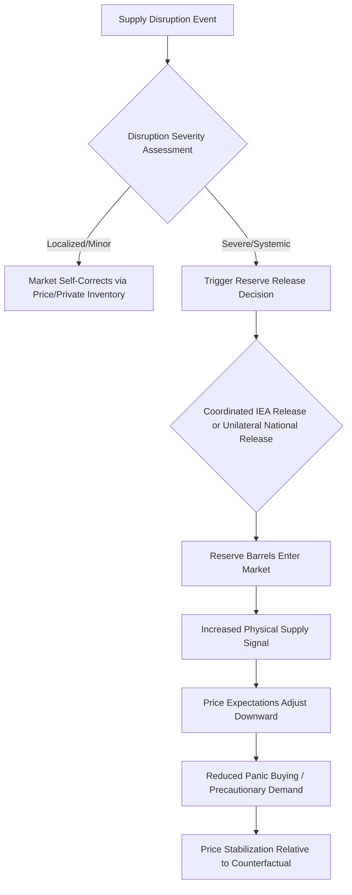

## Strategic Petroleum Reserves and Supply Security

### Definition and Scope

Strategic petroleum reserves (SPRs) are government-controlled stockpiles of crude oil and, in some cases, refined products, maintained to buffer national and global economies against acute supply disruptions. Supply security more broadly encompasses the policy and market mechanisms — reserves, diversification, demand restraint, and international coordination — designed to reduce the economic and strategic vulnerability created by dependence on oil supplies subject to geopolitical, technical, or natural disruption risk.

### Origins and Institutional Framework

**Key Points**

- The modern strategic reserve system emerged directly from the 1973-74 Arab oil embargo, which exposed the vulnerability of oil-importing industrialized economies to coordinated supply disruption
- The **International Energy Agency (IEA)** was established in 1974 specifically to coordinate collective response to oil supply emergencies among member countries, including a formal requirement that member countries maintain minimum stock levels
- IEA member countries are generally required to hold oil stocks equivalent to at least 90 days of net oil imports, held either as government-controlled strategic reserves, mandated industry/commercial stocks, or a combination of both, depending on national policy design
- The U.S. Strategic Petroleum Reserve (SPR), authorized under the Energy Policy and Conservation Act of 1975, is the largest government-controlled emergency reserve, stored primarily in engineered underground salt caverns along the U.S. Gulf Coast

### Reserve Structures Across Major Economies

| Country/Region | Reserve Model | Notable Features |
| --- | --- | --- |
| United States | Government-owned SPR | Salt cavern storage, Gulf Coast; drawn down substantially in 2022 in response to price spikes |
| Japan | Government + mandated private stocks | High import dependence drives large relative stockholding requirements |
| South Korea | Government + private stocks | Similar high-import-dependence rationale |
| European Union/Germany | Mix of government agency stocks and mandated industry stockholding | Structure varies significantly by member state |
| China | State Strategic Reserve (non-IEA member) | Reserve size and release policy are less transparently disclosed than IEA member reporting |
| India | Strategic reserve facilities (non-IEA member) | Developed to reduce vulnerability given very high net import dependence |

[Inference] Reserve structures, minimum holding requirements, and actual stock levels change periodically through policy revision, and country-specific figures should be verified against current government/IEA reporting rather than treated as fixed.

### Physical Storage Mechanisms

**Key Points**

- **Salt cavern storage** (used extensively by the U.S. SPR): crude oil is stored in large underground caverns solution-mined out of salt dome formations, offering low-cost, large-volume, geologically stable storage with minimal leakage risk due to salt's self-sealing properties under pressure
- **Above-ground tank storage**: conventional steel tank farms, more common for smaller reserves and refined product stocks, offering more flexible siting but at higher per-barrel storage cost and greater surface footprint
- **Mandated commercial/industry stocks**: rather than government ownership, some systems require refiners, importers, or fuel marketers to hold minimum inventory levels as a condition of operating license, effectively distributing the reserve-holding function to private industry
- Drawdown speed varies by storage type and infrastructure: salt cavern reserves connected to pipeline networks can typically be mobilized relatively quickly compared to more logistically constrained storage arrangements, though [Unverified] specific maximum drawdown rate figures change with infrastructure investment and should be confirmed against current official reserve documentation for any precise capacity claim

### Economic Rationale: Market Failure Justification

The economic case for government-held strategic reserves rests on addressing specific market failures that private storage alone would not fully correct:

**Key Points**

- **Externality argument**: the macroeconomic costs of a severe supply disruption (recession, inflation, unemployment) extend beyond the direct costs borne by oil market participants, creating a positive externality from reserve availability that private firms have insufficient incentive to fully internalize when making their own storage decisions
- **Public good characteristics**: national supply security has some non-excludable, non-rival characteristics at the macroeconomic level — the benefit of avoided recession accrues broadly across the economy, not just to reserve owners
- **Coordination and credibility**: government reserves can be released with public communication designed explicitly to influence market expectations and calm panic-driven price spikes, a signaling function that dispersed private storage decisions do not replicate as effectively
- **Private storage disincentives**: private firms holding large inventories face costs (storage, capital tied up, price risk) without capturing the full social benefit of stockholding during emergencies, and may in fact have incentive to draw down private stocks during a price spike to capture near-term profit rather than hold them as a buffer — a classic divergence between private and social optimum

### Reserve Release Mechanisms

**Key Points**

- **Emergency/coordinated release**: formal IEA-coordinated releases (e.g., in response to the 1991 Gulf War, 2005 Hurricane Katrina, and 2022 in response to the Russian invasion of Ukraine's market effects) involve member countries jointly releasing stocks to signal ample supply and stabilize prices during acute disruptions
- **Unilateral national release**: individual countries, most notably the U.S., have at various times released SPR stocks unilaterally in response to domestic price concerns, sometimes without formal IEA coordination
- **Exchange/loan mechanisms**: reserves can be lent to refiners with a requirement to return equivalent barrels later (a "swap"), used sometimes for smaller-scale, non-emergency market operations rather than outright sales
- **Sale mechanisms**: competitive sale of reserve barrels to refiners, either through emergency drawdown authority or, separately, routine legislatively mandated sales sometimes used for government budgetary purposes unrelated to emergency response — a use of reserves that has drawn some policy criticism for potentially conflating fiscal and supply-security objectives

### Diagram: SPR Release Decision and Market Transmission

### Effectiveness and Empirical Debate

**Key Points**

- Empirical assessment of SPR release effectiveness is complicated by the counterfactual problem: it is difficult to observe what prices would have done absent a release, since releases are typically announced alongside other market-relevant information and occur during already-volatile periods
- Some analyses find that reserve releases, particularly large or unexpectedly announced ones, can produce a measurable, though often described as modest and temporary, dampening effect on prices — functioning partly through a signaling/expectations channel rather than solely through the physical volume released relative to global daily consumption
- [Inference] The relative size of most national reserves compared to total daily global oil consumption (many national reserves represent a period of weeks to a few months of national consumption, not global consumption) means physical volume alone is unlikely to fully explain observed price effects, supporting the view that expectation/signaling effects are an important part of the transmission mechanism — though the precise magnitude of price effects from any specific historical release remains a matter of ongoing empirical debate rather than settled consensus
- Critics have raised concerns that unilateral releases used partly for near-term political or budgetary reasons rather than genuine emergency response may reduce the reserve's future credibility and effectiveness as a supply-security tool, and may also complicate the reserve's ability to refill during periods when it would otherwise be economical to do so

### Reserve Refilling Economics

**Key Points**

- After a drawdown, reserves must eventually be refilled through crude oil purchases, and the economics of refilling are sensitive to prevailing market prices — purchasing to refill during a period of elevated prices is more costly than purchasing during a price trough
- This creates a policy tension: a reserve drawn down during a price spike (when prices are high) may face refilling costs that are also elevated if the broader price environment remains high following the disruption, though ideally refilling proceeds opportunistically during subsequent lower-price periods
- Refilling purchases themselves can have a modest demand-side price effect if conducted at scale, meaning the timing and pace of refill purchases is itself an economically relevant policy choice, distinct from the initial release decision

### Supply Security Beyond Reserves

Strategic petroleum reserves represent one component of a broader supply security policy toolkit:

**Key Points**

- **Diversification of supply sources**: reducing reliance on any single supplier or transit route (e.g., chokepoints such as the Strait of Hormuz or Strait of Malacca) reduces vulnerability to disruption at a single geographic point
- **Demand-side flexibility and efficiency**: reducing oil intensity of the economy lowers the absolute exposure to any given price shock, complementing reserve policy rather than substituting for it
- **Domestic production capacity**: spare production capacity, both domestically and among allied/friendly producers, provides an alternative buffer mechanism distinct from stored inventory
- **Fuel switching capability**: industrial and power-generation capacity that can switch between fuel types during a disruption reduces the economy's inelastic dependence on oil specifically
- **International cooperation frameworks**: beyond the IEA, various bilateral and multilateral arrangements for information sharing, coordinated response planning, and market transparency initiatives (e.g., the Joint Organisations Data Initiative, JODI, for oil market data transparency) support supply security objectives

### Chokepoint Risk and Reserve Policy Interaction

**Key Points**

- A significant share of globally traded oil transits a small number of maritime chokepoints (the Strait of Hormuz being the most frequently cited in energy security analysis given the volume of Gulf oil exports passing through it), creating concentrated geopolitical risk
- Strategic reserves are frequently sized and positioned partly with chokepoint disruption scenarios explicitly in mind, since a chokepoint closure could simultaneously affect multiple supply sources passing through the same transit route
- [Inference] The specific volume of oil transiting any given chokepoint as a share of global trade changes over time with shifts in production and trade patterns, so current figures should be checked against up-to-date trade flow data rather than assumed static

### Non-Traditional and Emerging Reserve Considerations

**Key Points**

- **Refined product reserves**: some countries maintain reserves of refined products (particularly diesel and gasoline) in addition to or instead of crude, addressing the risk that a crude-only reserve does not directly solve if refining capacity itself is disrupted or bottlenecked
- **Reserve adequacy in an energy transition context**: as economies diversify away from oil dependence over time, questions have emerged in policy literature about the appropriate long-run sizing of strategic reserves relative to a gradually changing baseline of oil consumption, though [Speculation] the specific pace and manner in which reserve policy will be adjusted in response to demand transition trends remains an evolving and country-specific policy question rather than one with an established consensus answer
- **Cybersecurity and infrastructure resilience**: increasingly, supply security discussions extend beyond physical stockpiles to the resilience of the broader digital and physical infrastructure (pipelines, ports, refineries) against non-traditional disruption sources

### Related Topics

- Oil price shocks and macroeconomic transmission mechanisms
- IEA collective action mechanisms and member country obligations
- OPEC and OPEC+ spare capacity as a supply-security buffer
- Maritime chokepoint risk and global oil trade flow analysis
- Refining capacity constraints and product-specific supply security
- Energy diversification policy and import dependence reduction strategies
- Commodity storage economics and inventory theory
- Geopolitical risk premiums in oil price formation