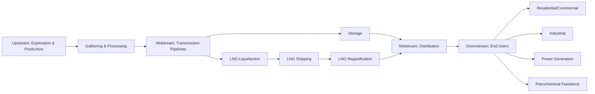

## Natural Gas Value Chain: Upstream, Midstream, Downstream

### Definition and Scope

The natural gas value chain describes the sequence of physical and economic activities that move natural gas from subsurface reservoirs to final consumers, conventionally divided into three segments — upstream, midstream, and downstream — each with distinct cost structures, risk profiles, market organization, and regulatory treatment. Understanding this segmentation is foundational to natural gas economics because pricing, investment decisions, and regulatory frameworks differ substantially across segments even though they form a single interconnected physical system.

### Value Chain Overview

### Upstream Segment

**Definition**: Exploration, appraisal, drilling, and production of natural gas from geological reservoirs, encompassing both conventional and unconventional resource development.

**Key Points**

- **Conventional gas**: extracted from porous, permeable reservoir rock where gas flows relatively freely to the wellbore under natural reservoir pressure
- **Unconventional gas**: includes shale gas, tight gas, and coalbed methane, requiring specialized extraction techniques — primarily horizontal drilling combined with hydraulic fracturing — to release gas from low-permeability formations
- **Associated gas**: produced alongside crude oil in oil wells, meaning its production volume is partly determined by oil-drilling economics rather than gas price signals alone, which can create supply dynamics somewhat decoupled from gas market pricing
- **Non-associated gas**: produced from wells targeting gas as the primary product, making production decisions more directly responsive to gas price economics

**Upstream Cost Structure**

$$\text{Upstream Breakeven Price} = \frac{\text{Drilling \& Completion CapEx} + \text{Lifting Costs (PV)} + \text{Land/Royalty Costs}}{\text{Estimated Ultimate Recovery (EUR)}}$$

**Key Points**

- **Drilling and completion costs** dominate unconventional shale gas economics, with substantial variation by formation, well design (lateral length, number of fracturing stages), and regional service cost inflation
- **Lifting costs** (operating cost per unit of gas produced once a well is online) are typically much lower than initial capital cost, meaning existing wells often continue producing profitably even during periods of depressed prices, since only marginal operating cost, not sunk capital cost, determines short-run shut-in decisions
- **Estimated Ultimate Recovery (EUR)** and the production decline curve are central technical-economic inputs; unconventional wells typically exhibit steep initial production decline rates in the first one to two years followed by a much shallower long-tail decline, requiring continuous drilling of new wells to maintain aggregate field-level output — sometimes termed the "decline curve treadmill" effect on unconventional basin economics
- Upstream investment decisions are governed by breakeven price thresholds specific to each basin/play; [Inference] published basin-level breakeven estimates vary meaningfully across sources depending on assumed well productivity, service cost environment, and capital structure assumptions, so specific breakeven figures should be treated as directional rather than universally precise

### Gathering and Processing (Upstream-Midstream Interface)

**Key Points**

- **Gathering systems**: smaller-diameter, lower-pressure pipeline networks that collect raw gas from individual wellheads and transport it to a central processing point, typically owned and operated separately from long-haul transmission infrastructure
- **Processing plants**: remove natural gas liquids (NGLs — ethane, propane, butanes, and natural gasoline), water vapor, and impurities (notably hydrogen sulfide and carbon dioxide, when present) to meet the quality specifications ("pipeline spec") required for transmission pipeline transport
- **NGL extraction economics**: processing plant operators face an economic choice regarding how much ethane and other NGLs to extract versus leave in the gas stream ("ethane rejection" vs. "ethane recovery"), a decision driven by the relative price of NGLs as separate petrochemical feedstocks/fuels versus their heating value if left in the gas stream — this decision fluctuates with relative price movements between NGL products and natural gas itself

### Midstream Segment

**Definition**: Transportation, storage, and, where applicable, liquefaction/regasification infrastructure that moves processed gas from production areas to distribution systems or export terminals.

**Key Points**

- **Transmission pipelines**: high-pressure, large-diameter pipelines moving large gas volumes over long distances, typically operating as regulated infrastructure with cost-of-service or negotiated rate structures depending on jurisdiction
- **Compressor stations**: positioned periodically along transmission pipelines to maintain pressure and gas flow over distance, representing a meaningful ongoing operating cost and energy consumption component of transmission economics
- **Underground storage**: depleted gas reservoirs, aquifers, or salt caverns used to store gas seasonally, allowing supply built up during low-demand periods (typically summer in many markets) to be withdrawn during high-demand periods (winter heating season), smoothing the mismatch between relatively stable production and highly seasonal demand
- **LNG value chain component**: liquefaction (cooling gas to approximately -162°C to condense it to liquid form, reducing volume roughly 600-fold for efficient shipping), specialized LNG shipping via cryogenic tankers, and regasification at import terminals to return the LNG to gaseous form for pipeline injection

**Midstream Economics: Regulated Infrastructure Model**

**Key Points**

- Transmission and distribution pipelines commonly exhibit natural monopoly characteristics (high fixed infrastructure cost, low marginal cost of additional throughput up to capacity), which is the standard economic justification for regulatory oversight of tariffs and access terms in many jurisdictions
- **Cost-of-service regulation**: regulators set allowed tariffs based on a determination of prudent capital investment (rate base), a permitted rate of return on that capital, plus recovery of operating expenses — a framework intended to allow infrastructure investment recovery while limiting monopoly pricing power
- **Open access requirements**: in many liberalized gas markets, pipeline operators are required to provide non-discriminatory access to third-party shippers, structurally separating the transportation function from gas ownership/marketing to promote competitive gas trading

### Diagram: Pipeline Capacity and Storage Seasonal Balancing

<svg xmlns="http://www.w3.org/2000/svg" viewBox="0 0 720 400">
<title>Seasonal Storage Injection and Withdrawal Cycle (svg_diagram)</title>
\<style\>
.lbl { font-family: Arial, sans-serif; font-size: 13px; fill: #1a1a1a; }
.hdr { font-family: Arial, sans-serif; font-size: 16px; font-weight: bold; fill: #111111; }
.ax { stroke: #333; stroke-width: 1.5; }
.line { fill: none; stroke: #2b6cb0; stroke-width: 2.5; }
\</style\>
<rect x="0" y="0" width="720" height="400" fill="#ffffff" />
<text x="360" y="26" text-anchor="middle" class="hdr">Seasonal Storage Injection and Withdrawal Cycle (svg_diagram)</text>
<line x1="70" y1="330" x2="670" y2="330" class="ax" />
<line x1="70" y1="330" x2="70" y2="60" class="ax" />
<text x="360" y="365" text-anchor="middle" class="lbl">Month (Jan - Dec)</text>
<text x="30" y="200" text-anchor="middle" class="lbl" transform="rotate(-90 30,200)">Storage Inventory Level</text>
<path class="line" d="M70,150 C120,220 180,280 260,300 C340,310 400,300 460,240 C520,180 580,110 630,90 L670,80" />

<text x="150" y="320" class="lbl" fill="`#c05621`">Winter Withdrawal</text>

<text x="480" y="200" class="lbl" fill="`#2f855a`">Summer Injection</text>

<line x1="260" y1="60" x2="260" y2="330" stroke="#999" stroke-dasharray="3,3" />
<text x="260" y="55" text-anchor="middle" class="lbl" font-size="11">Storage Trough</text>
<line x1="630" y1="60" x2="630" y2="330" stroke="#999" stroke-dasharray="3,3" />
<text x="630" y="55" text-anchor="middle" class="lbl" font-size="11">Storage Peak</text>

<text x="20" y="390" class="lbl" font-size="11">Illustrative seasonal pattern; actual timing and magnitude vary by market and weather year.</text>

</svg>

### Downstream Segment

**Definition**: Local distribution and final delivery of natural gas to end-use consumers across residential, commercial, industrial, and power-generation sectors.

**Key Points**

- **Local Distribution Companies (LDCs)**: operate lower-pressure distribution pipeline networks delivering gas to individual residential and commercial customers, typically regulated as monopoly utilities at the state/provincial or municipal level given the impracticality of duplicate distribution infrastructure
- **Residential/commercial demand**: highly weather-sensitive (space heating dominant use in many markets), creating pronounced seasonal and even daily demand swings that must be balanced through storage, supply contracting, and, in extreme conditions, demand curtailment
- **Industrial demand**: used both as a fuel source and, significantly, as a **petrochemical feedstock** (ammonia/fertilizer production, methanol, ethylene via NGL-derived feedstocks), typically exhibiting more stable, less weather-driven consumption patterns than residential use, though still sensitive to industrial-sector economic cycles
- **Power generation demand**: natural gas-fired generation (combined-cycle plants for baseload/intermediate load, simple-cycle peaker plants for peak demand response) represents a major and, in many markets, growing downstream demand segment, with demand patterns tied to electricity system dispatch economics and increasingly to its role balancing variable renewable generation

### Downstream Pricing Structures

**Key Points**

- Residential and small commercial customers typically pay a **bundled rate** combining commodity cost, transportation, distribution, and various regulatory/tax charges, often set through regulated tariff schedules
- Larger industrial and power-generation customers frequently purchase gas through **unbundled arrangements**, contracting separately for the commodity (often at a wholesale hub price plus basis differential) and for transportation/delivery capacity, allowing more direct exposure to and management of wholesale price volatility
- **Basis differentials** — the price difference between a national/regional benchmark hub (e.g., Henry Hub in the U.S.) and a specific local delivery point — reflect regional supply-demand balance and pipeline capacity constraints, and are a key economic signal for where new midstream infrastructure investment may be warranted

### Segment-by-Segment Risk and Capital Intensity Comparison

| Segment | Primary Risk Type | Capital Intensity | Typical Regulatory Treatment |
| --- | --- | --- | --- |
| Upstream | Geological, price, drilling cost risk | High (front-loaded) | Generally market-based pricing; environmental/permitting regulation |
| Gathering/Processing | Volume/throughput risk, NGL price risk | Moderate-High | Varies; often less heavily regulated than transmission |
| Midstream Transmission | Regulatory, long-term contract/volume risk | Very high, long asset life | Commonly cost-of-service or negotiated-rate regulation |
| Storage | Seasonal price spread risk | High | Varies by market structure |
| LNG (liquefaction/shipping/regas) | Long-term contract risk, large capital commitment | Extremely high | Often project-financed with long-term offtake contracts |
| Distribution (LDC) | Demand/weather risk, regulatory rate-case risk | Moderate-High | Typically rate-of-return regulated monopoly |

### Contractual Structures Across the Chain

**Key Points**

- **Upstream**: production is typically sold under a mix of spot sales at wholesale hub prices and shorter-term bilateral contracts, with less reliance on the ultra-long-term contracts historically common in some other energy sectors
- **Midstream transmission**: capacity is typically contracted through **firm** (guaranteed capacity, higher priority and price) versus **interruptible** (lower priority, lower price, subject to curtailment during constrained periods) transportation service agreements
- **LNG**: historically dominated by long-term (15-20+ year) contracts with pricing formulas linked to oil prices or other indices, providing the revenue certainty needed to support extremely high liquefaction and shipping capital costs; more recently, a growing share of LNG trade has shifted toward shorter-term and spot transactions, increasing market flexibility but also price volatility exposure for participants
- **Downstream**: LDCs typically secure a portfolio of supply contracts (baseload, seasonal, and spot purchases) combined with storage and pipeline capacity contracts to reliably serve fluctuating end-user demand within regulatory reliability and cost-recovery frameworks

### Vertical Integration vs. Segment Specialization

**Key Points**

- Some companies operate across multiple value chain segments (vertically integrated majors with upstream production, midstream infrastructure, and sometimes downstream marketing operations), potentially capturing margin across the full chain and internalizing some coordination/transaction costs
- Many markets, particularly following historical restructuring and liberalization initiatives (e.g., U.S. FERC Order 636 unbundling pipeline transportation from gas sales), have moved toward greater segment specialization, with independent producers, dedicated midstream companies (often structured as Master Limited Partnerships in the U.S. context), and separate LDCs operating with more arms-length commercial relationships
- [Inference] The relative prevalence of vertical integration versus specialization varies significantly by country and regulatory history, reflecting different historical liberalization paths rather than a single universal industry structure

### Interdependencies and Bottleneck Economics

**Key Points**

- A bottleneck in any single segment can constrain value realization across the entire chain — insufficient pipeline takeaway capacity from a productive basin can suppress local wellhead prices even amid strong downstream demand elsewhere, a phenomenon observed periodically in rapidly developing shale plays outpacing midstream buildout
- This interdependency means midstream infrastructure investment timing is a critical economic variable: underinvestment creates basis blowouts and stranded upstream production potential, while overinvestment relative to actual production growth can leave pipeline capacity underutilized, affecting the economics of the regulated infrastructure owner
- LNG value chain economics similarly depend on synchronized investment across liquefaction capacity, shipping fleet availability, and regasification/import infrastructure — a mismatch in any link can constrain the realizable trade volume regardless of upstream production capability

### Related Topics

- Shale gas and unconventional resource development economics
- Henry Hub pricing and natural gas hub benchmark mechanisms
- LNG contract structures and oil-indexed versus spot pricing
- Natural gas storage economics and seasonal price spread arbitrage
- Pipeline regulation: cost-of-service versus negotiated rate mechanisms
- Natural gas liquids (NGL) extraction and petrochemical feedstock economics
- Basis differentials and regional natural gas pricing dynamics
- Natural gas demand in power generation and renewable integration
- Master Limited Partnership (MLP) structures in midstream infrastructure finance