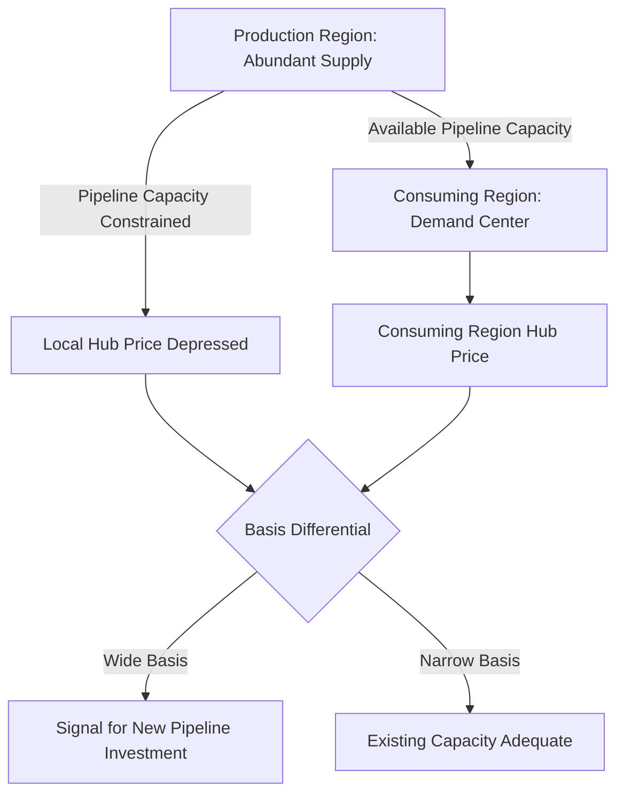

## Pipeline Economics and Regional Market Segmentation

### Definition and Scope

Pipeline economics analyzes the cost structure, investment decisions, and pricing mechanisms of natural gas (and, with adapted principles, crude oil and product) transportation infrastructure, while regional market segmentation examines how limited pipeline capacity, geographic distance, and infrastructure bottlenecks divide what might otherwise be a single national or continental gas market into distinct regional price zones connected by, and priced relative to, transportation costs and capacity constraints.

### Pipeline Cost Structure

**Key Points**

- **Capital expenditure (CapEx)** dominates pipeline economics: construction cost is driven by pipe diameter, length, terrain difficulty, regulatory/permitting complexity, and required compression infrastructure, and is overwhelmingly a sunk, fixed cost once construction is complete
- **Operating expenditure (OpEx)** is comparatively low relative to CapEx and includes compressor station fuel/energy consumption, maintenance, integrity management (corrosion monitoring, leak detection), and administrative costs
- This cost structure — very high fixed cost, very low marginal cost of moving an additional unit of gas up to capacity — is the classic signature of a **natural monopoly**, providing the standard economic rationale for regulatory oversight of most transmission pipeline tariffs in jurisdictions with liberalized gas markets
- Because CapEx is sunk once built, pipeline operators have strong incentive to maximize utilization of existing capacity, and tariff structures are often designed to encourage high load-factor usage

### The Natural Monopoly and Regulatory Response

$$\text{Average Cost} = \frac{CapEx_{annualized} + OpEx}{Q_{throughput}}$$

Because average cost declines as throughput $Q$ rises toward capacity (fixed costs spread over more volume), a single large pipeline is typically more cost-efficient than multiple smaller competing pipelines serving the same route — the defining condition of natural monopoly.

**Key Points**

- **Cost-of-service regulation**: the traditional regulatory approach, where a regulator (e.g., FERC in the U.S., national energy regulators elsewhere) determines a permitted "rate base" (prudent invested capital), applies an allowed rate of return, and adds recoverable operating costs to set the maximum tariff the pipeline may charge
- **Negotiated rates**: an alternative or complementary mechanism in some jurisdictions allowing shippers and pipeline operators to agree on rates outside the full cost-of-service process, typically used where sufficient competitive alternatives exist to protect shippers from monopoly pricing
- **Open access requirements**: many liberalized markets require pipeline operators to offer non-discriminatory access to all shippers on published tariff terms, structurally separating the transportation function from gas ownership and trading to prevent a vertically integrated pipeline owner from favoring its own gas sales

### Firm vs. Interruptible Capacity

Pipeline capacity is typically contracted and priced according to service reliability tier:

**Key Points**

- **Firm transportation (FT)**: guarantees capacity availability except in specified extreme circumstances (e.g., pipeline integrity emergencies), commanding a higher reservation charge paid regardless of actual usage, reflecting the priority claim on scarce capacity
- **Interruptible transportation (IT)**: offers capacity on an as-available basis at a lower price, subject to curtailment when the pipeline is operating at or near full firm-capacity commitments, appealing to shippers with flexible timing needs or those seeking lower-cost transport when risk of curtailment is acceptable
- This two-tier structure allows pipeline operators to monetize capacity utilization more fully — selling reliability to shippers who value it while still generating revenue from unused firm capacity through interruptible sales during periods when firm capacity holders are not using their full contracted volumes
- **Capacity release markets**: in some jurisdictions, firm capacity holders who do not need their full contracted capacity in a given period can resell ("release") that capacity to other shippers, creating a secondary market that improves overall system utilization efficiency

### Regional Market Segmentation: Core Mechanism

Regional price segmentation arises because pipeline capacity between two points is finite, and when demand for transportation exceeds available capacity, the price differential (basis) between the two regions can diverge from the pure cost of transportation, reflecting the scarcity value of capacity itself.

$$P_{destination} = P_{origin} + T_{cost} + B$$

where $T_{cost}$ is the marginal cost of transportation and $B$ is the **basis differential** — an additional premium or discount reflecting capacity scarcity, quality differences, or local supply-demand imbalance beyond pure transport cost.

**Key Points**

- When a production region generates more gas than existing pipeline capacity can economically move to demand centers, local prices in the production region can fall well below prices in well-connected consuming regions — sometimes described in industry commentary as regional gas being "stranded" or "trapped"
- This basis differential is itself an economic signal: a sufficiently wide and persistent basis differential indicates that new pipeline capacity could be profitable, since the potential toll revenue from the price arbitrage may exceed the cost of construction — a key driver of midstream investment decision-making
- As new pipeline capacity comes online connecting a previously constrained region, the basis differential typically narrows (though rarely to exactly zero, given ongoing transport cost and residual capacity constraints), a dynamic that has been observed repeatedly as shale gas basins have been progressively connected to broader pipeline networks

### Hub Pricing and Benchmark Formation

**Key Points**

- **Trading hubs**: physical or notional points where multiple pipelines interconnect, allowing gas to be bought, sold, and priced at a standardized reference location rather than negotiated individually at every possible delivery point
- **Henry Hub** (Louisiana, U.S.) is the most widely referenced North American benchmark, serving as the delivery point for NYMEX natural gas futures contracts and the reference price against which most other North American regional prices are quoted as a basis differential
- Other major regional hubs exist in different markets (e.g., National Balancing Point (NBP) in the UK, Title Transfer Facility (TTF) in the Netherlands for continental Europe), each serving an analogous benchmark-setting function within their respective interconnected pipeline networks
- The existence of a liquid, transparent hub price is itself an important market-development milestone, since it enables standardized futures and derivatives trading, financial hedging, and more efficient price discovery than a market relying solely on bilateral point-to-point contract negotiation

### Diagram: Basis Differential Across a Constrained Corridor

<svg xmlns="http://www.w3.org/2000/svg" viewBox="0 0 720 380">
<title>Basis Differential Along a Capacity-Constrained Pipeline Corridor (svg_diagram)</title>
\<style\>
.lbl { font-family: Arial, sans-serif; font-size: 13px; fill: #1a1a1a; }
.hdr { font-family: Arial, sans-serif; font-size: 16px; font-weight: bold; fill: #111111; }
.bar { stroke: #333; stroke-width: 1; }
\</style\>
<rect x="0" y="0" width="720" height="380" fill="#ffffff" />
<text x="360" y="26" text-anchor="middle" class="hdr">Basis Differential Along a Capacity-Constrained Corridor (svg_diagram)</text>
<line x1="80" y1="320" x2="650" y2="320" stroke="#333" stroke-width="1.5" />
<line x1="80" y1="320" x2="80" y2="60" stroke="#333" stroke-width="1.5" />
<text x="365" y="355" text-anchor="middle" class="lbl">Location Along Corridor</text>
<text x="35" y="190" text-anchor="middle" class="lbl" transform="rotate(-90 35,190)">Price ($/MMBtu)</text>
<rect x="120" y="260" width="80" height="60" class="bar" fill="#a3c9e0" />
<text x="160" y="345" text-anchor="middle" class="lbl">Production Hub</text>
<text x="160" y="250" text-anchor="middle" class="lbl">$1.80</text>
<rect x="420" y="130" width="80" height="190" class="bar" fill="#e0a469" />
<text x="460" y="345" text-anchor="middle" class="lbl">Demand Hub</text>
<text x="460" y="120" text-anchor="middle" class="lbl">$3.20</text>
<line x1="200" y1="290" x2="420" y2="225" stroke="#c05621" stroke-width="2" stroke-dasharray="6,3" />
<text x="300" y="200" text-anchor="middle" class="lbl" fill="#c05621">Transport Cost + Basis</text>

<text x="20" y="370" class="lbl" font-size="11">Illustrative price levels; actual differentials vary continuously with market conditions.</text>

</svg>

### Worked Example: Pipeline Investment Decision

**Example**

A proposed 500-mile pipeline would cost $2 billion to construct (CapEx), with annual OpEx of $40 million, financed with an annualized capital recovery factor implying $180 million/year in total revenue requirement. The pipeline's designed capacity is 1.5 billion cubic feet per day (Bcf/d).

Required tariff to fully recover costs at full utilization:

$$\text{Tariff} = \frac{180{,}000{,}000}{1.5 \text{ Bcf/d} \times 365 \text{ days} \times 1{,}000{,}000 \text{ Mcf/Bcf}} \approx \$0.329/\text{Mcf}$$

If the observed basis differential between the production hub and demand hub is currently $0.60/Mcf, this exceeds the required tariff, suggesting the pipeline could be commercially viable (assuming sustained shipper commitment) while still leaving a margin, which may narrow the basis differential once the pipeline enters service and adds capacity to the corridor.

[Inference] This is a simplified illustrative calculation excluding financing structure detail, contract tenor risk, potential capacity underutilization below 100%, and the dynamic feedback effect of new capacity on the basis differential itself; real pipeline investment decisions incorporate substantially more detailed shipper commitment analysis and risk-adjusted return modeling.

### Long-Term Capacity Contracts and Project Financing

**Key Points**

- Given the very high capital cost and long asset life of major transmission pipelines (often 40+ years of operational life), new pipeline construction typically requires long-term firm capacity commitments from shippers (often 10-20+ years) before construction proceeds, since lenders and equity investors need revenue certainty to finance the project
- This creates a **chicken-and-egg dynamic** in some emerging supply regions: shippers may be reluctant to commit to long-term capacity until production growth is proven, while pipeline developers may be unable to secure financing without committed shipper volumes — a coordination problem sometimes resolved through anchor shipper agreements with major producers or through regulatory mechanisms designed to facilitate infrastructure development
- Long-term contracted capacity can create a divergence between contracted (paid-for) capacity and actual utilized capacity if demand or supply patterns shift after the contract is signed, a risk borne differently depending on whether the tariff structure is primarily a fixed reservation charge (shipper bears underutilization risk) versus a usage-based charge (pipeline bears underutilization risk)

### Cross-Border and International Pipeline Economics

**Key Points**

- International pipelines introduce additional economic and political-risk dimensions beyond domestic transmission economics, including currency risk, differing regulatory jurisdictions on either side of a border, and exposure to bilateral political relationships between the countries involved
- Transit pipelines crossing a third country (neither the producing nor the primary consuming country) introduce an additional stakeholder with potential leverage over transit fees or, in disputes, transit reliability — a dynamic that has featured prominently in various European pipeline transit relationships and is a recurring theme in international energy security analysis
- [Inference] The specific economic and geopolitical dynamics of any given cross-border pipeline are highly context-dependent on the particular countries, contracts, and political relationships involved, and general statements should not be assumed to apply uniformly across all cross-border pipeline situations

### Regional Market Integration Over Time

**Key Points**

- As pipeline networks mature and additional interconnections are built, previously segmented regional markets tend to become more integrated, with basis differentials converging toward the marginal cost of transportation and residual capacity-scarcity premiums
- This integration process has been observed in numerous contexts as shale gas production regions were progressively connected to broader interstate (or, internationally, cross-border) pipeline grids, though [Inference] the pace and extent of integration in any specific market depends on the scale of production growth relative to the pace of infrastructure buildout, and some regions may experience renewed or persistent segmentation if production growth outpaces new pipeline construction
- LNG import and export capability can also affect regional market integration by providing an additional supply/demand balancing channel that operates independently of domestic pipeline connectivity, linking previously more isolated regional markets to global price dynamics

### Regulatory Frameworks Compared

| Jurisdiction/System | Typical Regulatory Approach | Notable Feature |
| --- | --- | --- |
| United States (interstate) | FERC cost-of-service and negotiated rate regulation | Open access mandated since late-1980s/1990s restructuring (Order 436, Order 636) |
| European Union | Third-party access regulation under EU gas market directives | Unbundling of transmission system operators from supply/production in many member states |
| United Kingdom | Ofgem-regulated National Transmission System | Entry-exit tariff system distinct from point-to-point contract models |
| Emerging/developing gas markets | Varies widely; often less formalized open-access regimes | Market structure frequently still evolving toward more liberalized models |

[Inference] Regulatory frameworks are subject to ongoing legislative and administrative revision; specific rule names, order numbers, and current regulatory requirements should be verified against current regulator publications for any application requiring precise regulatory compliance detail.

### Related Topics

- Natural gas value chain: upstream, midstream, downstream segmentation
- Henry Hub and international gas trading hub benchmark formation
- Natural gas storage economics and seasonal price spread arbitrage
- LNG value chain and its role in regional market integration
- Master Limited Partnership (MLP) structures in midstream infrastructure finance
- Open access regulation and pipeline unbundling history
- Basis differential trading and financial hedging instruments
- Cross-border energy infrastructure and transit risk analysis