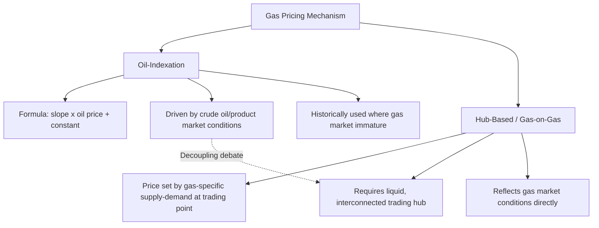

## Gas Pricing Mechanisms: Oil-Indexation vs Hub-Based Pricing

### Definition and Scope

Gas pricing mechanisms refer to the alternative frameworks by which natural gas commodity prices are determined in commercial contracts and markets, with the two dominant historical paradigms being oil-indexation (pricing gas as a formula-derived function of crude oil or refined product prices) and hub-based (gas-on-gas) pricing (pricing gas according to its own supply-demand balance at a liquid trading hub). The evolution and coexistence of these mechanisms across different regions is a central theme in natural gas market economics, reflecting differing histories of market liberalization, infrastructure development, and contracting practice.

### Oil-Indexation: Mechanism and Rationale

**Formula Structure**

$$P_{gas} = a \times P_{oil/product} + b$$

where $a$ (the "slope" or "gearing") determines sensitivity to oil price movements and $b$ is a constant or base-load component, both commercially negotiated between buyer and seller, sometimes with additional terms such as price review clauses, floors, ceilings, or averaging periods (e.g., pricing based on a trailing average of oil prices over several preceding months, sometimes called a "lag").

**Key Points**

- Oil-indexation emerged historically in European and Asian long-term gas contracts (particularly pipeline gas from Russia and Norway to Europe, and LNG contracts to Japan and Korea) at a time when no sufficiently liquid, transparent gas-specific price benchmark existed in these importing regions
- The underlying economic logic was **substitution/competing-fuels pricing**: since gas often directly competed with oil products (heating oil, fuel oil) for the same end-use applications (heating, industrial fuel, power generation) at the time these contracts were established, indexing gas to oil prices approximated the value gas would need to offer to remain competitive against its substitute fuel
- Oil-indexation also served a **project finance function**: because crude oil had (and generally retains) a long history of transparent, liquid pricing, indexing long-term gas sale revenue to oil provided lenders financing capital-intensive upstream and LNG liquefaction projects with a bankable, predictable revenue formula, even in the absence of a mature gas-specific market
- The **lag/averaging mechanism** common in oil-indexed formulas (using a trailing multi-month average of oil prices rather than the current spot price) smooths short-term oil price volatility, providing more stable and predictable near-term revenue for both parties, though this also means gas prices under such contracts adjust with a delay relative to real-time oil market movements

### Hub-Based (Gas-on-Gas) Pricing: Mechanism and Rationale

**Key Points**

- Hub-based pricing determines gas prices through actual trading activity at a physical or notional pricing point, where the price reflects the real-time or near-real-time balance of gas supply and demand at that location, independent of oil market movements
- This requires a sufficiently developed, liquid trading market — multiple buyers and sellers, adequate pipeline interconnection allowing gas to physically flow to/from the hub, and market infrastructure (exchanges, clearing mechanisms, published price indices) supporting transparent price discovery
- Major hub benchmarks include **Henry Hub** (United States, also the delivery point for NYMEX gas futures), **National Balancing Point (NBP)** (United Kingdom), and **Title Transfer Facility (TTF)** (Netherlands, increasingly the dominant continental European benchmark)
- Hub pricing is generally regarded in the industry and academic literature as reflecting the actual marginal value of gas within its own market more directly than oil-indexation, since it responds to gas-specific supply and demand conditions (weather, storage levels, production changes) rather than conditions in a separate commodity market

### Comparative Structure

### Historical Evolution: From Oil-Indexation Toward Hub Pricing

**Key Points**

- The trajectory in most liberalized gas markets, particularly North America and increasingly Europe, has been a gradual shift from oil-indexation toward hub-based pricing as domestic and regional gas markets matured, pipeline interconnection expanded, and trading liquidity developed
- The United States transitioned to predominantly hub-based (Henry Hub-referenced) pricing earlier than most other major markets, following broader market liberalization and unbundling reforms in the 1980s-1990s that separated pipeline transportation from gas commodity sales and fostered competitive gas trading
- Continental Europe underwent a more gradual and, at various points, contested transition, with legacy long-term oil-indexed pipeline import contracts (historically significant in Russian and Norwegian gas supply to the region) coexisting for an extended period alongside growing hub liquidity at NBP and later TTF, with the balance shifting substantially toward hub-based pricing over time, particularly following European regulatory efforts to promote gas market liberalization and price review mechanisms in existing long-term contracts
- Asian gas markets, particularly for LNG, have historically retained a larger share of oil-indexed contracting than North America or Europe, though a growing share of Asian LNG purchasing has incorporated hub-referenced pricing (including Henry Hub-linked U.S. LNG export contracts and spot purchases referenced to the Japan-Korea Marker, JKM) over recent years
- [Inference] The specific current share of oil-indexed versus hub-based contracting in any given region changes over time as contracts are renegotiated, renewed, or replaced, so precise current percentage breakdowns should be verified against up-to-date industry data (e.g., IGU annual wholesale gas price surveys) rather than assumed static

### Economic Trade-offs: Price Stability vs. Market Efficiency

**Key Points**

- **Oil-indexation** offers relative price predictability and smoothing (particularly with averaging/lag mechanisms), which can be valued by buyers and financiers seeking revenue certainty, but can produce gas prices materially disconnected from actual gas market supply-demand fundamentals — for example, gas prices remaining elevated under an oil-indexed formula even during a period of gas oversupply and weak gas-specific demand, or vice versa
- **Hub-based pricing** more accurately reflects real-time gas market conditions, supporting more efficient resource allocation (production, storage, and consumption decisions responding to actual gas scarcity or abundance signals) but exposes both buyers and sellers to greater short-term price volatility tied to weather, storage levels, and gas-specific supply disruptions
- This trade-off is a recurring theme in the industry-versus-academic debate over contract design: buyers and sellers each weigh the value of price stability/predictability against the potential cost of paying (or receiving) a price disconnected from the underlying gas market's actual fundamentals

### Price Review and Renegotiation Mechanisms

**Key Points**

- Long-term oil-indexed contracts commonly include **price review clauses**, allowing either party to formally request renegotiation of the pricing formula periodically (e.g., every few years) if market conditions have diverged substantially from the formula's original assumptions
- Price reviews and associated arbitration processes have historically been a significant mechanism by which oil-indexed contracts have evolved to incorporate greater hub-price influence over time — rather than abandoning oil-indexation outright, many contracts have been renegotiated toward **hybrid formulas** blending oil-indexed and hub-referenced components
- **Hybrid/blended pricing formulas** represent a middle path, combining a partial oil-indexed component (retaining some revenue stability) with a partial hub-referenced component (better reflecting current gas market value), and have become increasingly common as a negotiated compromise in markets transitioning away from pure oil-indexation

### Diagram: Price Behavior Comparison Under Diverging Market Conditions

<svg xmlns="http://www.w3.org/2000/svg" viewBox="0 0 720 400">
<title>Illustrative Price Paths: Oil-Indexed vs Hub-Based Gas Pricing (svg_diagram)</title>
\<style\>
.lbl { font-family: Arial, sans-serif; font-size: 13px; fill: #1a1a1a; }
.hdr { font-family: Arial, sans-serif; font-size: 16px; font-weight: bold; fill: #111111; }
.line1 { fill: none; stroke: #c05621; stroke-width: 2.5; }
.line2 { fill: none; stroke: #2b6cb0; stroke-width: 2.5; stroke-dasharray: 6,3; }
\</style\>
<rect x="0" y="0" width="720" height="400" fill="#ffffff" />
<text x="360" y="26" text-anchor="middle" class="hdr">Illustrative Price Paths: Oil-Indexed vs Hub-Based Gas Pricing (svg_diagram)</text>
<line x1="70" y1="340" x2="670" y2="340" stroke="#333" stroke-width="1.5" />
<line x1="70" y1="340" x2="70" y2="60" stroke="#333" stroke-width="1.5" />
<text x="370" y="375" text-anchor="middle" class="lbl">Time</text>
<text x="30" y="200" text-anchor="middle" class="lbl" transform="rotate(-90 30,200)">Price</text>
<path class="line1" d="M70,250 C170,230 270,180 370,175 C470,170 570,190 670,200" />
<path class="line2" d="M70,260 C170,300 270,320 370,150 C470,110 570,260 670,180" />

<text x="500" y="160" class="lbl" fill="`#c05621`">Oil-Indexed (smoothed, lagged)</text>

<text x="480" y="100" class="lbl" fill="`#2b6cb0`">Hub-Based (volatile, real-time)</text>

<text x="20" y="395" class="lbl" font-size="11">Illustrative shapes only; actual price divergence patterns vary by period and market.</text>

</svg>

### Worked Example: Formula Comparison

**Example**

Consider a hypothetical long-term contract with an oil-indexed formula: $P_{gas} = 0.15 \times P_{oil} + 1.00$ (in $/MMBtu, with $P_{oil}$ in $/barrel), compared against a hub-referenced alternative directly tracking TTF spot price.

If crude oil is trading at $80/barrel:

$$P_{gas,oil-indexed} = 0.15 \times 80 + 1.00 = \$13.00/\text{MMBtu}$$

If, at the same time, the TTF hub spot price reflects a well-supplied gas market and is trading at $9.50/MMBtu, the oil-indexed formula would generate a materially higher contract price than the prevailing hub market price — illustrating the type of divergence that has historically motivated buyers to seek price review or renegotiation toward hub-referenced terms.

[Inference] The specific slope and constant values used here are illustrative only, chosen to demonstrate the calculation mechanism; actual contract formula parameters are commercially negotiated and vary substantially by contract, region, and vintage.

### Impact on Market Behavior and Risk Management

**Key Points**

- Hub-based pricing supports the development of liquid financial derivatives markets (futures, options, swaps referenced to hub prices), enabling more precise price-risk hedging for producers, buyers, and traders than is generally feasible under bespoke bilateral oil-indexed formulas
- Oil-indexed contracts can create a distinct risk management challenge: a gas buyer or seller exposed to an oil-indexed formula may need to hedge using oil derivatives (despite their actual physical exposure being to gas), introducing basis risk between the oil hedge and the actual oil-indexed gas price formula, which may not move in perfect lockstep given formula-specific lag and averaging mechanics
- The relative maturity of hub-based markets has also historically supported greater market entry by financial trading participants (not just physical producers/consumers), contributing to overall market liquidity but also potentially introducing additional short-term price volatility drivers beyond pure physical supply-demand fundamentals

### Regional Snapshot Comparison

| Region | Historical Dominant Mechanism | Current General Trend |
| --- | --- | --- |
| United States | Hub-based (Henry Hub) since market liberalization | Long-established hub-based standard |
| United Kingdom | Transitioned early to hub-based (NBP) | Mature hub-based market |
| Continental Europe | Historically oil-indexed pipeline imports | Substantial and continuing shift toward hub-based (TTF) pricing |
| Japan/Korea (LNG) | Historically dominant oil-indexation | Growing but still partial shift toward hub/spot referencing (JKM, Henry Hub-linked contracts) |
| Emerging LNG importing markets | Often mixed, evolving | Trend generally toward incorporating more hub-referenced and spot-priced volume over time |

[Inference] This table reflects general historical and directional patterns widely discussed in industry literature; precise current contract mix data for any specific country or period should be verified against current industry survey sources (e.g., International Gas Union wholesale price surveys) given that contract portfolios evolve continuously.

### Related Topics

- LNG economics and the globalization of gas markets
- Pipeline economics and regional market segmentation
- Henry Hub, NBP, TTF, and JKM benchmark formation and comparison
- Take-or-pay contract structures and long-term gas supply agreements
- Natural gas storage economics and seasonal price spread arbitrage
- Gas market liberalization and unbundling history (e.g., U.S. FERC reforms, EU gas directives)
- Financial derivatives and hedging instruments in gas markets
- Price review and arbitration mechanisms in long-term energy contracts