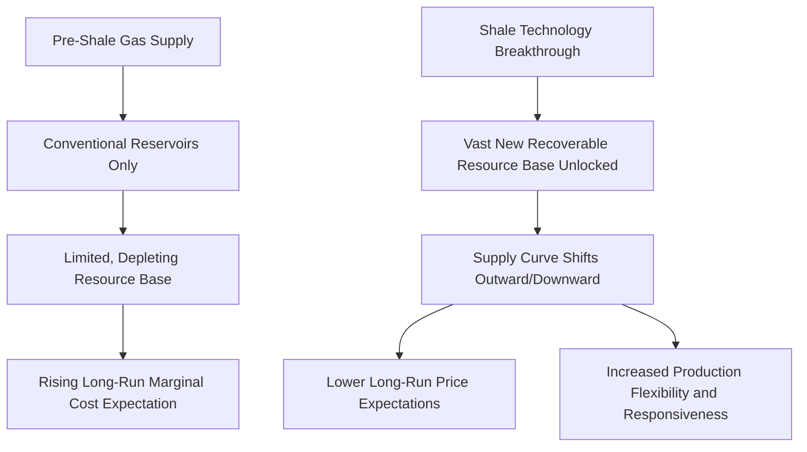

## Shale Gas Revolution and Its Market Impacts

### Definition and Scope

The shale gas revolution refers to the rapid, large-scale expansion of natural gas (and associated liquids/oil) production from low-permeability shale and other unconventional rock formations, driven primarily by the combined application of horizontal drilling and hydraulic fracturing technology beginning in the mid-2000s, predominantly in the United States. This development fundamentally altered global natural gas supply economics, price levels, trade patterns, and the broader competitive position of gas relative to other fuels.

### Technological Foundations

**Key Points**

- **Horizontal drilling**: allows a well to be drilled vertically to the target depth and then turned to extend horizontally through the productive shale layer, dramatically increasing the length of reservoir rock exposed to a single wellbore compared to a purely vertical well, improving the economics of accessing thin, laterally extensive shale formations
- **Hydraulic fracturing ("fracking")**: involves pumping a high-pressure mixture of water, sand (proppant), and chemical additives into the wellbore to create and prop open small fractures in the low-permeability shale rock, creating pathways for trapped gas to flow to the wellbore that would not otherwise exist given shale's naturally very low permeability
- Neither technology was newly invented during the shale revolution; both had existed in more limited forms for decades. The transformative development was the **combination and refinement** of horizontal drilling with multi-stage hydraulic fracturing (fracturing at numerous discrete points along the horizontal lateral), along with accumulated technical learning that progressively improved well productivity and reduced costs
- [Inference] The specific pace and sequence of technical refinement that enabled commercially viable shale gas production is attributed in industry and academic accounts to a combination of private-sector innovation (notably associated with companies pursuing the Barnett Shale in Texas through the 1990s and 2000s) and earlier government-funded research support, though the relative contribution of each is a matter of some historical debate rather than settled consensus

### Key U.S. Shale Basins

**Key Points**

- **Barnett Shale** (Texas): widely regarded as the pioneering commercial shale gas play, where the technology combination was first proven at commercial scale
- **Marcellus Shale** (Appalachian region, primarily Pennsylvania and surrounding states): became one of the largest-producing shale gas basins, notable for its proximity to major Northeastern U.S. demand centers relative to other basins
- **Haynesville Shale** (Louisiana/Texas): a significant dry gas play, particularly relevant given its proximity to Gulf Coast LNG export and industrial demand infrastructure
- **Permian Basin** (Texas/New Mexico): primarily known for oil production but also a major source of **associated gas** produced alongside crude oil, meaning its gas output has historically been influenced significantly by oil-drilling economics rather than gas price signals alone
- [Inference] Relative production rankings among these and other basins change over time with drilling activity shifts, and current basin-level production figures should be checked against up-to-date government or industry production data rather than assumed static

### Supply Curve Transformation

**Key Points**

- Prior to the shale revolution, prevailing expert and market expectations in the U.S. generally anticipated declining domestic gas production and growing reliance on gas imports (including substantial planned LNG import terminal capacity), reflecting the perceived resource-depletion trajectory of conventional gas reservoirs
- The technically and commercially viable shale resource base proved to be extremely large relative to prior conventional resource estimates, effectively shifting the long-run domestic gas supply curve outward and lowering expected long-run marginal production costs
- This supply shift fundamentally altered the domestic (and eventually global, via the subsequent rise of U.S. LNG exports) balance of gas market power and price expectations, representing one of the most significant structural supply shocks in modern energy market history

### Domestic U.S. Price Impact

**Key Points**

- U.S. natural gas prices (Henry Hub) declined substantially and structurally from the pre-shale-era price levels that had prevailed through the mid-2000s, as shale supply growth outpaced demand growth for an extended period, particularly pronounced following the 2008-2009 period as shale production scaled rapidly
- This price decline was not merely a temporary market fluctuation but reflected a **structural shift in the marginal cost of supply**, given the scale of the newly accessible shale resource base and continuing technological improvement (increasing well productivity, reducing drilling and completion costs per unit of gas recovered) over the following years
- The sustained lower and less volatile domestic gas price environment (relative to the pre-shale era and relative to oil-indexed international benchmarks) had significant knock-on effects across multiple downstream sectors, discussed below
- [Inference] While the general direction and structural nature of this price decline is well-established in energy market analysis, precise quantitative magnitude comparisons across different time periods depend on the specific comparison years and inflation-adjustment methodology chosen, and should be sourced from primary price data (e.g., EIA Henry Hub historical series) for any analysis requiring specific figures

### Market Impact 1: Power Generation Fuel Switching

**Key Points**

- Sustained lower and more stable natural gas prices significantly improved the competitive position of natural gas-fired power generation relative to coal-fired generation in U.S. wholesale electricity markets, contributing to a substantial and sustained shift in the U.S. generation fuel mix away from coal and toward natural gas over the following decade-plus
- Combined-cycle gas turbine plants, benefiting from both improved fuel economics and generally lower construction costs and shorter construction lead times than coal or nuclear plants, became an increasingly favored technology choice for new generation capacity additions
- This fuel-switching dynamic also contributed to measurable reductions in power-sector carbon dioxide and other emissions in the U.S. over this period, since natural gas combustion produces meaningfully lower CO2 emissions per unit of electricity generated than coal combustion, a point frequently referenced in energy transition and climate policy discussions, though [Inference] natural gas combustion still produces significant CO2 emissions relative to zero-carbon generation sources, and the net climate impact of the shale-driven gas boom also depends on methane leakage rates across the production and transport chain, which remains an area of ongoing scientific measurement and some debate regarding precise magnitude

### Market Impact 2: Industrial Competitiveness and Petrochemical Investment

**Key Points**

- Lower and more predictable domestic gas prices, combined with the associated increase in natural gas liquids (NGL) production (particularly ethane, a key petrochemical feedstock) from many shale plays, significantly improved the cost competitiveness of U.S. petrochemical manufacturing, particularly ethylene production (a foundational building block for plastics manufacturing) which uses ethane as a primary feedstock in the U.S. context
- This contributed to a wave of new and expanded petrochemical facility investment in the U.S. Gulf Coast region over the following years, as the region's feedstock cost advantage relative to other global regions using more expensive naphtha-based feedstocks became a significant competitive differentiator
- More broadly, industries with significant natural gas input costs (fertilizer/ammonia production, various manufacturing sectors) benefited from the improved and more predictable domestic energy cost environment

### Market Impact 3: LNG Export Development

**Key Points**

- Perhaps the most structurally significant longer-term market impact was the transformation of the U.S. from an anticipated LNG *importer* (reflected in LNG import terminal capacity built or planned in the pre-shale era, much of which was subsequently underutilized or repurposed) into a major global LNG *exporter*
- U.S. LNG export capacity development, beginning with the conversion and expansion of existing import terminal infrastructure and subsequent new-build liquefaction facilities, added a substantial new source of globally traded LNG supply, with contract pricing often referenced to Henry Hub (a departure from the traditional oil-indexed LNG contract model dominant in prior decades)
- This addition of a major new, relatively lower-cost, gas-benchmark-priced LNG supply source to the global market has been a significant contributing factor to the broader trend toward gas market globalization and the gradual shift away from oil-indexation in international LNG contracting, discussed further in related topics
- [Inference] The precise magnitude of U.S. LNG export capacity's influence on global gas pricing dynamics relative to other contemporaneous factors (demand growth in Asia, other new supply sources, broader energy market conditions) is difficult to isolate with precision, and should be understood as one among several significant contributing factors rather than a sole determinant

### Diagram: Shale Revolution Transmission to Downstream Markets

<svg xmlns="http://www.w3.org/2000/svg" viewBox="0 0 720 440">
<title>Shale Gas Revolution Transmission to Downstream Markets (svg_diagram)</title>
\<style\>
.lbl { font-family: Arial, sans-serif; font-size: 13px; fill: #1a1a1a; }
.hdr { font-family: Arial, sans-serif; font-size: 16px; font-weight: bold; fill: #111111; }
.box { stroke: #333; stroke-width: 1.2; }
.arrow { stroke: #444; stroke-width: 1.5; fill: none; marker-end: url(#a2); }
\</style\>
<rect x="0" y="0" width="720" height="440" fill="#ffffff" />
<text x="360" y="26" text-anchor="middle" class="hdr">Shale Gas Revolution Transmission to Downstream Markets (svg_diagram)</text>
<rect x="270" y="50" width="180" height="45" class="box" fill="#f2d38a" />
<text x="360" y="78" text-anchor="middle" class="lbl">Shale Supply Expansion</text>
<path class="arrow" d="M360,95 L360,145" />
<rect x="270" y="145" width="180" height="45" class="box" fill="#c9e4b5" />
<text x="360" y="173" text-anchor="middle" class="lbl">Lower, Stable Gas Prices</text>
<path class="arrow" d="M300,190 C220,230 160,250 130,280" />
<path class="arrow" d="M360,190 L360,280" />
<path class="arrow" d="M420,190 C500,230 560,250 590,280" />
<rect x="40" y="280" width="180" height="55" class="box" fill="#a8d0e6" />
<text x="130" y="303" text-anchor="middle" class="lbl">Coal-to-Gas Power</text>
<text x="130" y="320" text-anchor="middle" class="lbl">Fuel Switching</text>
<rect x="270" y="280" width="180" height="55" class="box" fill="#a8d0e6" />
<text x="360" y="303" text-anchor="middle" class="lbl">Petrochemical</text>
<text x="360" y="320" text-anchor="middle" class="lbl">Investment Boom</text>
<rect x="500" y="280" width="180" height="55" class="box" fill="#a8d0e6" />
<text x="590" y="303" text-anchor="middle" class="lbl">LNG Export</text>
<text x="590" y="320" text-anchor="middle" class="lbl">Capacity Growth</text>
<path class="arrow" d="M130,335 L130,385" />
<path class="arrow" d="M360,335 L360,385" />
<path class="arrow" d="M590,335 L590,385" />
<rect x="40" y="385" width="180" height="40" class="box" fill="#e0a4a4" />
<text x="130" y="410" text-anchor="middle" class="lbl">Power-Sector Emissions Shift</text>
<rect x="270" y="385" width="180" height="40" class="box" fill="#e0a4a4" />
<text x="360" y="410" text-anchor="middle" class="lbl">Gulf Coast Manufacturing Growth</text>
<rect x="500" y="385" width="180" height="40" class="box" fill="#e0a4a4" />
<text x="590" y="410" text-anchor="middle" class="lbl">Global Gas Market Globalization</text>
</svg>

### The Decline-Curve Economics of Shale Production

**Key Points**

- Shale gas wells typically exhibit a distinctive production profile: a sharp initial production peak followed by a steep decline in the first one to two years of operation, followed by a much shallower, longer "tail" of continued lower-rate production over many subsequent years
- This decline curve profile means that maintaining or growing aggregate field-level or basin-level production requires continuous ongoing drilling of new wells to offset the rapid decline of previously drilled wells — a dynamic sometimes referred to as needing to "run to stand still," which has significant implications for the sensitivity of aggregate shale production to drilling activity levels and capital expenditure
- This characteristic also means shale production can, in principle, respond more quickly to price signals (both upward and downward) than conventional production with flatter decline profiles, since a relatively short pause or acceleration in drilling activity can meaningfully affect aggregate production levels within a shorter time horizon than would be the case for long-lived conventional fields — a dynamic sometimes cited as contributing to shale's role as a relatively responsive, quasi "swing producer" characteristic within global oil and gas markets, though [Inference] the degree to which shale fully replicates a traditional "swing producer" role comparable to historically discussed OPEC spare capacity dynamics remains a subject of ongoing analysis and is not a universally agreed characterization

### Regional and Global Spillover Effects

**Key Points**

- The success of U.S. shale gas (and subsequently shale oil) development prompted exploration interest in analogous shale resources in other countries (various European, Latin American, and Asian shale formations have been assessed), though [Inference] commercial-scale shale gas development at a magnitude comparable to the U.S. experience has generally not been replicated to the same extent in most other regions to date, reflecting a combination of geological differences, regulatory and permitting environments, population density and land-access considerations, water availability constraints, and differing midstream infrastructure development conditions across countries
- The increased global gas supply associated with U.S. LNG exports has been cited as a contributing factor supporting the broader global gas market globalization and price benchmark diversification trends discussed in related topics, providing importing countries with additional, diversified supply sources beyond traditional pipeline suppliers

### Environmental and Regulatory Considerations

**Key Points**

- Hydraulic fracturing and associated shale development have been subject to ongoing environmental and regulatory scrutiny in multiple jurisdictions, with attention focused on issues including water usage and wastewater management, potential groundwater contamination risk, induced seismicity in certain circumstances, and methane emissions/leakage across the production and transport chain
- Regulatory approaches to hydraulic fracturing have varied substantially by jurisdiction, ranging from permitted development under specific regulatory frameworks in most major U.S. shale-producing states, to moratoria or outright bans in some other jurisdictions and, at various points, in some U.S. states as well
- [Inference] The environmental and regulatory landscape surrounding shale development continues to evolve, and specific current regulatory status by jurisdiction should be verified against current government sources given the pace of policy change in this area

### Related Topics

- Natural gas value chain: upstream, midstream, downstream
- LNG economics and the globalization of gas markets
- Gas pricing mechanisms: oil-indexation vs hub-based pricing
- Coal-to-gas fuel switching economics in power generation
- Natural gas liquids (NGL) extraction and petrochemical feedstock economics
- Decline curve analysis and unconventional resource production economics
- Methane emissions measurement and lifecycle greenhouse gas accounting for natural gas
- U.S. petrochemical investment cycles and Gulf Coast manufacturing competitiveness