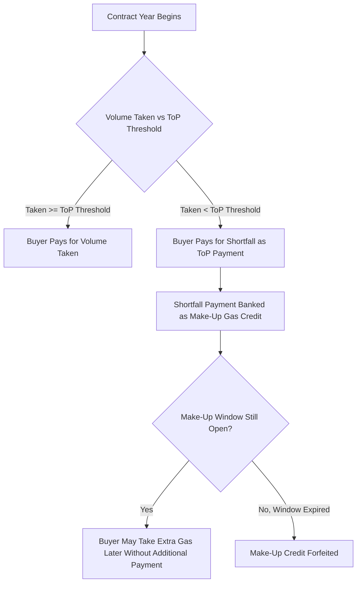

## Take-or-Pay Contracts and Long-Term Contracting Structures

### Overview

Take-or-pay (ToP) contracts are long-term supply agreements in which a buyer commits to either take delivery of a specified minimum quantity of natural gas (or pay for it even if not taken) over a defined period. These structures emerged as the dominant contracting mechanism in natural gas markets to solve a fundamental economic problem: gas infrastructure (wells, pipelines, liquefaction trains) requires enormous upfront capital investment with long payback periods, and financiers need assurance of stable revenue streams before committing capital. Long-term contracting structures broadly encompass ToP provisions alongside related mechanisms—minimum bill clauses, price review provisions, destination clauses, and market-linked pricing formulas—that collectively allocate risk between producers, midstream operators, and buyers across decades-long horizons.

### The Economic Rationale for Long-Term Contracts

#### Capital Intensity and Asset Specificity

Natural gas value chains involve highly capital-intensive, long-lived, and often **asset-specific** infrastructure:

- Upstream: dedicated wells and gathering systems tied to specific reservoirs
- Midstream: pipelines connecting specific supply basins to specific demand centers
- LNG: liquefaction trains, dedicated shipping, and regasification terminals

[Inference] Because much of this infrastructure has few alternative uses once built (a pipeline cannot easily be relocated, and an LNG train is sunk capital tied to a specific project), the transaction cost economics literature on asset specificity (following Williamson-style reasoning) suggests that market participants are exposed to significant **hold-up risk**—the risk that a counterparty could renegotiate terms opportunistically once the asset is built and the investor's bargaining position has weakened. Long-term contracts, particularly with ToP provisions, are the standard institutional response to this risk, since they lock in revenue commitments before capital is committed.

#### The Financing Function

**Key Points**

- Lenders financing large gas infrastructure projects (especially LNG liquefaction facilities and greenfield pipelines) typically require **bankable contracts**—long-term ToP agreements with creditworthy offtakers—as a condition of project financing
- The ToP structure effectively transfers **volume risk** to the buyer (who must pay regardless of whether they take delivery) while the seller typically retains **delivery/performance risk** (obligation to have the gas available)
- This risk allocation makes future cash flows predictable enough to support project debt with tenors matching the contract length (often 15–20 years for LNG)

### Anatomy of a Take-or-Pay Contract

#### Core Structural Elements

| Element | Function |
| --- | --- |
| Contract Quantity (CQ) / Annual Contract Quantity (ACQ) | The reference volume against which take-or-pay obligations are measured |
| Take-or-Pay percentage | The minimum percentage of ACQ the buyer must pay for, whether taken or not (commonly 80-100% historically, though modern deals vary widely) |
| Make-up gas rights | Provision allowing the buyer to "make up" (take without additional payment) previously paid-for-but-untaken volumes in future periods, usually within a specified window |
| Carry-forward / banking rights | Mechanism allowing over-deliveries or under-deliveries to be carried forward and reconciled over time |
| Price formula | Mechanism determining the price paid per unit (see pricing section below) |
| Force majeure clause | Excuses performance obligations (for both parties) during defined uncontrollable events |
| Destination clause | (LNG-specific) Restricts the buyer from reselling/rerouting cargoes to other markets |
| Take obligation floor | Minimum volume the buyer must actually take (not just pay for), relevant to some contract variants |

#### The Take-or-Pay Payment Mechanic

If the buyer takes less than the ToP threshold volume in a given period, they must still pay for the shortfall as if it had been delivered:

$$\text{ToP Payment} = \max(0, \, Q_{ToP} - Q_{taken}) \times P_{contract}$$

Where:

- $Q_{ToP}$ = the take-or-pay quantity threshold (e.g., 85% of ACQ)
- $Q_{taken}$ = actual volume physically taken by the buyer
- $P_{contract}$ = the contract price applicable to that period

If make-up rights exist, this payment is often treated as a **prepayment** for future gas rather than a pure penalty—the buyer can later take additional volumes (above future ACQ) without further payment, up to the banked make-up balance, usually within a specified number of years before the right expires ("use it or lose it").

#### Why Make-Up Rights Matter Economically

Without make-up rights, a ToP payment is effectively a sunk penalty—pure downside risk transfer to the buyer. With make-up rights, the payment is more accurately characterized as a **prepaid option** on future volume, which meaningfully changes how the obligation should be valued and disclosed (e.g., in buyer financial statements, ToP prepayments with make-up rights are often treated differently from straight penalty payments under applicable accounting standards). [Inference] This distinction has been a recurring point of contention in commercial disputes and arbitration, since the value of make-up rights depends heavily on whether the buyer realistically expects to need or use the additional volumes before expiry.

### Pricing Formulas in Long-Term Contracts

#### Historical Basis: Oil Indexation

Particularly in LNG and pipeline gas trade in Asia and continental Europe, long-term contracts have traditionally used **oil-linked pricing formulas**, reflecting gas's historical role as a substitute fuel for oil in power generation and industrial use:

$$P_{gas} = a \times P_{oil} + b$$

Where $a$ (the slope, often called the "gas-oil coefficient") and $b$ (a constant term) are negotiated parameters, and $P_{oil}$ is typically a benchmark like Japan Crude Cocktail (JCC) or Brent, often with an S-curve modification (dampening the linkage at extreme oil price levels).

#### Shift Toward Gas-on-Gas / Hub-Indexed Pricing

Since the shale gas revolution and the growth of liquid trading hubs, long-term contracts increasingly reference **gas market hub prices** rather than oil:

- Henry Hub (U.S. benchmark)
- National Balancing Point (NBP, UK)
- Title Transfer Facility (TTF, Netherlands/Continental Europe)
- Japan-Korea Marker (JKM, for spot LNG cargoes into Northeast Asia)

$$P_{gas} = \text{Hub Price} + \text{Fixed Adder (liquefaction/transport/margin)}$$

**Key Points**

- Hub-indexed pricing better reflects local gas supply-demand fundamentals rather than an external commodity's price dynamics
- [Inference] The shift toward hub indexation has generally been viewed as reducing basis risk mismatch for buyers who ultimately compete or resell in gas-on-gas markets, though it removes the historical oil-price "hedge" that some buyers valued when their own downstream pricing was also oil-linked
- Many contracts blend both approaches, or include periodic **price review clauses** allowing renegotiation if pricing diverges significantly from prevailing market indices

#### Price Review Clauses

Long-term contracts (especially 15-20 year LNG SPAs) often include contractual mechanisms for periodic price reopeners, given the impossibility of fixing an appropriate price formula for multiple decades in advance:

- Triggered at fixed intervals (e.g., every 3 years) or by material market divergence
- Can lead to arbitration if parties cannot agree on revised terms bilaterally
- [Unverified] The frequency and outcomes of price reviews vary considerably by contract vintage and counterparties, and specific negotiated terms are typically confidential, so aggregate patterns are difficult to verify precisely from public sources

### Take-or-Pay in Different Market Segments

#### Upstream Gas Purchase Agreements

Producer-to-midstream or producer-to-utility contracts historically used ToP to guarantee producers a market for gas from a specific field, supporting upstream development financing. [Inference] In many liberalized markets (post-deregulation in the U.S. following FERC Order 636 and similar reforms elsewhere), the prevalence of rigid long-term ToP contracts in the domestic upstream-to-utility segment declined significantly in favor of shorter-term and more liquid spot/hub-based trading, as unbundling separated merchant gas sales from regulated transportation.

#### Pipeline Transportation Contracts

Pipeline capacity is typically contracted separately from the gas commodity itself via **firm transportation (FT) agreements**, which function similarly to ToP in that the shipper pays a demand charge for reserved capacity regardless of actual utilization:

$$\text{Total FT Cost} = (\text{Reservation Charge} \times \text{Contracted Capacity}) + (\text{Usage Charge} \times \text{Volume Shipped})$$

The reservation charge is a fixed, capacity-based (not volume-based) cost—economically similar in function to a ToP commitment, since it must be paid whether or not the capacity is used.

#### LNG Sale and Purchase Agreements (SPAs)

LNG SPAs represent the most prominent modern use of ToP structures, given the extreme capital intensity of liquefaction facilities:

- **Free-on-Board (FOB)**: buyer takes title at the liquefaction terminal and arranges/owns shipping
- **Delivered Ex-Ship (DES)**: seller retains responsibility (and typically ownership) for shipping until the cargo reaches the buyer's regasification terminal

**Key Points**

- Traditional LNG SPAs were long-term (15-20+ years), large-volume, destination-restricted, and oil-indexed
- [Inference] Since roughly the 2010s, the LNG market has seen growing diversification toward shorter-tenor contracts, smaller volumes, more portfolio/flexible destination terms, and hub-indexed pricing, driven by the emergence of portfolio players (large integrated trading arms of major energy companies) and growing spot/short-term market liquidity, though long-term ToP-style contracts remain the primary vehicle for financing new liquefaction capacity

### Illustration: Take-or-Pay Payment and Make-Up Mechanics

### Worked Example

**Example**

A utility signs a 15-year gas purchase agreement with an Annual Contract Quantity (ACQ) of 100,000 MMBtu/day and a ToP percentage of 85%.

In Year 3, due to mild weather, the utility only takes 70,000 MMBtu/day on average.

$$Q_{ToP} = 0.85 \times 100{,}000 = 85{,}000 \, \text{MMBtu/day}$$

$$\text{Shortfall} = 85{,}000 - 70{,}000 = 15{,}000 \, \text{MMBtu/day}$$

At a contract price of $3.50/MMBtu, the annual ToP payment for the shortfall (assuming a 365-day year) would be:

$$15{,}000 \times 365 \times 3.50 = \$19{,}162{,}500$$

If the contract includes a 3-year make-up window, the utility can take up to 15,000 MMBtu/day of additional gas above future ACQ (without further payment) within the next 3 years, provided actual demand allows it. If the utility cannot use this credit within the window, [Inference] the forfeited amount effectively becomes a sunk cost that retroactively raised the realized average price paid per unit of gas actually consumed over the life of the contract.

### Risk Allocation Comparison

| Risk Type | Take-or-Pay (Buyer-Favorable Terms) | Take-or-Pay (Seller-Favorable Terms) |
| --- | --- | --- |
| Volume/demand risk | Partially retained by seller (lower ToP %) | Shifted to buyer (higher ToP %) |
| Price risk | Depends on pricing formula, independent of ToP % | Depends on pricing formula, independent of ToP % |
| Delivery/performance risk | Retained by seller | Retained by seller |
| Force majeure risk | Allocated per FM clause, typically excuses both parties | Allocated per FM clause, typically excuses both parties |

### Contract Renegotiation and Disputes

Long-term contracts spanning decades inevitably face circumstances not contemplated at signing—demand destruction, new competing supply, price divergence between contract formula and prevailing market prices. This has historically led to:

- **Price reopener arbitrations**: formal dispute resolution processes when parties invoke price review clauses and cannot agree bilaterally
- **Renegotiation of ToP percentages**: particularly following demand shocks, buyers have sought reduced ToP obligations to align contractual commitments with realized off-take
- **Contract restructuring/buyouts**: in extreme cases, parties may negotiate an early termination or volume reduction in exchange for compensation

[Unverified] The specific outcomes and terms of individual price review arbitrations are generally confidential and not systematically disclosed, so general claims about "typical" arbitration outcomes across the industry should be treated cautiously; publicly available information mostly comes from parties' own disclosures or secondary commentary rather than the arbitration awards themselves.

### Interaction with Portfolio and Trading Strategies

As gas and LNG markets have grown more liquid, ToP-committed volumes are increasingly managed as part of a broader **portfolio optimization** strategy rather than as isolated bilateral relationships:

- Portfolio players with multiple ToP-sourced supply contracts and multiple sales contracts optimize which cargoes/volumes go to which destination, capturing arbitrage across regional price differentials (e.g., diverting a cargo from a lower-priced to a higher-priced region, where destination flexibility permits)
- ToP-sourced volumes can be **resold into spot markets** if the buyer's own demand falls short of contracted quantity, converting what would otherwise be a shortfall payment into a trading opportunity, provided contractual destination/resale restrictions allow it

### Common Analytical Pitfalls

- Treating ToP percentage and pricing formula as independent, unrelated negotiation points, when in practice they are often negotiated as a package reflecting overall risk allocation
- Assuming ToP payments are always pure penalties, ignoring the material effect of make-up gas rights on the economic substance of the obligation
- Conflating firm transportation reservation charges (a capacity commitment) with commodity ToP provisions (a volume/value commitment)—they serve analogous risk-transfer functions but apply to different parts of the value chain
- Assuming all modern LNG contracts still follow the traditional 20-year, oil-indexed, destination-restricted template, when the market has diversified considerably

**Related Topics**

- LNG SPA destination clauses and their treatment under competition law (EU antitrust scrutiny of destination restrictions)
- Project finance structures for LNG liquefaction trains and the role of bankable offtake agreements
- Oil indexation formulas and the S-curve mechanism in gas pricing
- Portfolio LNG trading and cargo diversion economics
- Regulatory unbundling of merchant gas sales and pipeline transportation (e.g., FERC Order 636)
- Force majeure interpretation in long-term energy contracts
- Gas-on-gas competition vs. oil-indexed pricing regimes across regional markets