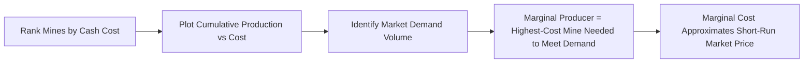

## Coal Mining Economics and Cost Structures

### Overview

Coal mining economics examines the cost structures, capital requirements, and operational decisions governing coal extraction, and how these factors determine mine profitability, supply response to price signals, and long-run industry structure. Coal mining cost economics differ substantially by mining method (surface vs. underground), geological conditions, coal rank/quality, and regional labor and regulatory environments, making coal one of the more heterogeneous commodities in terms of production cost dispersion across the global supply curve.

### Mining Methods and Their Cost Implications

#### Surface (Opencast/Open-Pit) Mining

Surface mining is used where coal seams lie close enough to the surface that overburden (the rock and soil above the coal seam) can be economically removed to access the coal.

**Key Points**

- Generally lower cost per tonne than underground mining, due to higher productivity (fewer workers per tonne extracted) and simpler equipment logistics
- Cost is heavily driven by the **stripping ratio**—the volume/mass of overburden that must be removed per unit of coal recovered
- Common surface methods include strip mining, open-pit mining, and mountaintop removal (region-specific, particularly in parts of the U.S. Appalachian coalfield)

The stripping ratio is a central determinant of surface mining economics:

$$SR = \frac{V_{overburden}}{V_{coal}}$$

As a seam becomes progressively deeper or thinner (or overburden hardness increases), the stripping ratio rises, and unit costs rise correspondingly—eventually reaching a point where surface mining becomes uneconomic relative to underground methods or where the deposit itself becomes sub-economic entirely.

#### Underground Mining

Underground methods are used where coal seams lie too deep for economic surface extraction. Two dominant underground methods exist:

| Method | Description | Relative Cost/Productivity Characteristics |
| --- | --- | --- |
| Room-and-pillar | Coal extracted in a grid pattern, leaving pillars of coal to support the roof | Lower capital intensity than longwall; lower recovery rate (some coal left in pillars); more flexible for variable seam conditions |
| Longwall | A long wall face of coal is sheared mechanically in a continuous process, with hydraulic roof supports advancing as extraction proceeds and the roof allowed to collapse behind (controlled subsidence) | Higher capital intensity (specialized longwall shearer and hydraulic support equipment); significantly higher productivity and recovery rate once operational; less flexible for highly variable geology |

[Inference] Longwall mining generally achieves higher output per worker and higher seam recovery than room-and-pillar, but requires substantial upfront capital investment and relatively consistent, well-characterized seam geology to justify that investment, meaning the choice between methods often reflects a mine's geological consistency and expected operating life as much as pure cost comparison.

### Cost Structure Components

#### Fixed vs. Variable Cost Breakdown

Coal mine costs are typically decomposed into the following broad categories:

| Cost Category | Nature | Examples |
| --- | --- | --- |
| Capital expenditure (CapEx) | Largely fixed, front-loaded | Mine development, equipment purchase, infrastructure (rail spurs, preparation plants) |
| Labor | Semi-fixed to variable depending on workforce structure | Wages, benefits, safety training, often unionized in many jurisdictions |
| Equipment operating costs | Variable | Fuel, maintenance, consumables (explosives, wear parts) |
| Overburden removal (surface) / Roof support and ventilation (underground) | Variable, scales with stripping ratio or depth | Blasting, hauling, ground control |
| Coal preparation/washing | Variable, scales with raw coal processed | Beneficiation to remove ash/impurities and improve marketable quality |
| Transportation to market | Variable, often substantial share of delivered cost | Rail, barge, conveyor, port handling for export coal |
| Royalties and severance taxes | Variable, tied to production volume or value | Payments to landowners/governments based on tonnage or revenue |
| Reclamation and closure liabilities | Long-term fixed/deferred obligation | Land restoration, water treatment, post-closure environmental monitoring |

#### Cash Cost vs. All-In Sustaining Cost (AISC)

Mining industry cost reporting (borrowed largely from metals mining convention but applied similarly in coal) typically distinguishes:

$$\text{Cash Cost} = \text{Direct mining costs} + \text{Processing} + \text{Royalties} - \text{By-product credits (if any)}$$

$$\text{All-In Sustaining Cost (AISC)} = \text{Cash Cost} + \text{Sustaining CapEx} + \text{Reclamation accruals} + \text{Corporate G\&A allocated to the operation}$$

**Key Points**

- Cash cost reflects the near-term marginal cost of continuing to operate an existing mine, and is the relevant benchmark for short-run shutdown decisions
- AISC better reflects the full economic cost of sustaining production over the mine's life, and is the more relevant benchmark for long-run investment and mine-life planning decisions
- A mine can remain cash-cost-positive (worth continuing to operate) even while running below AISC (not economically justifying continued capital reinvestment), which explains why some mines continue producing for extended periods during depressed price environments before ultimately closing

### The Cost Curve and Marginal Producer Dynamics

#### Global Supply Cost Curve Concept

Coal market analysts commonly construct a **global supply cost curve**, ranking all producing mines (or basins) by their cash cost of production, plotted against cumulative production volume. This curve is a standard tool for understanding price formation:

- In competitive commodity markets, the **marginal producer**—the highest-cost mine still needed to meet demand—effectively sets the market clearing price in the short run
- Mines positioned well below the marginal cost point earn economic rent (the "cost curve rent"); those above it are loss-making and face closure pressure if prices remain depressed

#### Illustration: Stylized Coal Cost Curve (svg_diagram)

<svg xmlns="http://www.w3.org/2000/svg" viewBox="0 0 640 380">
<text x="320" y="25" text-anchor="middle" font-size="16" font-weight="bold" fill="#1a1a1a">Stylized Global Coal Cost Curve (svg_diagram)</text>
<line x1="70" y1="320" x2="590" y2="320" stroke="#333" stroke-width="2" />
<line x1="70" y1="320" x2="70" y2="60" stroke="#333" stroke-width="2" />

<text x="330" y="355" text-anchor="middle" font-size="13" fill="#333">Cumulative Global Production (Mt)</text>

<text x="25" y="190" text-anchor="middle" font-size="13" fill="#333" transform="rotate(-90 25 190)">Cash Cost ($/t)</text>

<path d="M 70,290 L 150,285 L 150,260 L 250,255 L 250,220 L 360,210 L 360,170 L 460,155 L 460,110 L 590,90" fill="none" stroke="`#c0392b`" stroke-width="3" />

<line x1="400" y1="60" x2="400" y2="320" stroke="#2980b9" stroke-width="2" stroke-dasharray="6,4" />
<text x="405" y="75" font-size="12" fill="#2980b9" font-weight="bold">Demand Volume</text>

<circle cx="400" cy="150" r="5" fill="#27ae60" />
<text x="410" y="145" font-size="12" fill="#27ae60" font-weight="bold">Marginal Producer Cost</text>

<text x="120" y="270" font-size="11" fill="#555">Low-Cost Basins</text>

<text x="480" y="130" font-size="11" fill="#555">High-Cost Basins</text>

</svg>

#### Regional Cost Heterogeneity

[Inference] Coal cost structures vary enormously across producing regions due to differences in geology (seam thickness, depth, stripping ratios), labor cost and regulatory regimes, and transportation distance to demand centers or export ports. Basins with thick, shallow seams (favorable stripping ratios) and proximity to rail/port infrastructure (e.g., some U.S. Powder River Basin operations, favorable Indonesian and Australian surface deposits) tend to occupy the lower-cost end of the global curve, while thinner, deeper, or more geologically complex deposits requiring underground extraction tend to sit at higher cost positions, though specific rankings shift over time with currency movements, labor costs, and depletion of the most favorable reserves within any given basin.

### Capital Investment Decisions and Mine Life Economics

#### Net Present Value Framework

Coal mine investment decisions (new mine development, or major sustaining capital for an existing mine) are generally evaluated using discounted cash flow analysis:

$$NPV = \sum_{t=0}^{T} \frac{(P_t - C_t) \times Q_t - CapEx_t}{(1+r)^t}$$

Where:

- $P_t$ = expected coal price in period $t$
- $C_t$ = unit operating cost in period $t$
- $Q_t$ = production volume in period $t$
- $CapEx_t$ = capital expenditure in period $t$
- $r$ = discount rate reflecting project risk and cost of capital
- $T$ = mine life (determined by reserve base and extraction rate)

**Key Points**

- Long-lived assets and multi-year price cycles make coal mine investment decisions highly sensitive to long-run price expectations, which are themselves difficult to forecast given demand uncertainty (particularly given energy transition dynamics affecting long-run thermal coal demand)
- [Inference] Given this long-run demand uncertainty, coal mining companies in many jurisdictions have shown increased reluctance to commit large capital toward greenfield thermal coal mine development in recent years, generally preferring to extend/optimize existing operations or focus new investment on metallurgical coal (where steelmaking demand faces less direct substitution pressure in the near-to-medium term), though the degree and pace of this shift varies considerably by company, jurisdiction, and coal grade
- Reserve life and depletion planning directly affect whether sustaining capital investment is economically justified—a mine nearing reserve exhaustion may forgo capital upgrades that wouldn't be recovered before closure

#### Reclamation and Closure Cost Accounting

Mine reclamation obligations (restoring disturbed land, managing long-term water quality, closing underground workings safely) represent a significant deferred liability that must be accounted for in mine economics:

- Many jurisdictions require mining companies to post financial assurance (bonds, trust funds, or guarantees) covering estimated reclamation costs before permits are granted
- These obligations are typically recognized on financial statements as **asset retirement obligations (AROs)**, requiring a discounted estimate of future reclamation costs to be accrued over the operating life of the mine
- [Unverified] Specific reclamation cost estimates and bonding requirements vary substantially by jurisdiction, mine type, and regulatory regime, and general figures should not be assumed to apply uniformly across all coal-producing regions

### Labor Economics and Productivity

**Key Points**

- Labor productivity (output per worker-hour) is a major driver of unit cost differences between mines, methods, and regions
- Mechanization (particularly longwall systems and large-scale surface mining equipment) has historically driven substantial productivity gains, reducing labor cost per tonne even where nominal wages rise
- Labor cost structures differ significantly between unionized and non-unionized operations, and between jurisdictions with differing labor regulations, safety requirements, and prevailing wage levels
- [Inference] Safety regulation compliance costs (ventilation systems, methane monitoring, roof support standards, worker training) represent a material and generally non-discretionary cost component in underground mining specifically, reflecting the elevated safety risks (methane explosion, roof collapse, coal dust) inherent to underground coal extraction relative to surface methods

### Transportation and Logistics Costs

For coal destined for export or distant domestic markets, transportation frequently represents a very substantial share of total delivered cost—in some cases exceeding the mine-gate production cost itself:

$$\text{Delivered Cost} = \text{Mine-gate Cash Cost} + \text{Rail/Barge Freight} + \text{Port Handling} + \text{Ocean Freight (if exported)}$$

**Key Points**

- Landlocked coal basins face inherent cost disadvantages relative to coastal basins with direct port access, since rail freight to port can be a major cost component for export-oriented production
- Ocean freight rates (a function of dry bulk shipping market conditions, vessel size/type, and distance) introduce an additional variable cost layer that fluctuates independently of mining costs themselves, meaning delivered coal competitiveness in a given import market can shift with shipping market cycles even when mine-gate costs are unchanged
- [Inference] This transportation cost structure means that coal trade flows are strongly influenced by relative geographic proximity between producing basins and consuming regions, with basins closer to major demand centers (e.g., intra-Asian seaborne trade) often holding a structural freight cost advantage over more distant competing sources, all else equal

### Worked Example

**Example**

A surface coal mine has the following approximate annual cost structure for a hypothetical scenario:

- Coal production: 5,000,000 tonnes/year
- Stripping ratio: 8:1 (bank cubic meters of overburden per tonne of coal)
- Overburden removal cost: $2.50/bcm
- Direct mining and processing cost (excluding overburden): $8.00/tonne
- Royalty: 5% of gross revenue
- Rail transportation to port: $15.00/tonne
- Contract sale price (FOB port equivalent): $65.00/tonne

Overburden removal cost per tonne of coal:

$$8 \times 2.50 = \$20.00/\text{tonne}$$

Mine-gate cash cost (excluding royalty and transport):

$$20.00 + 8.00 = \$28.00/\text{tonne}$$

Royalty (assuming applied to FOB sale price):

$$0.05 \times 65.00 = \$3.25/\text{tonne}$$

Total delivered cash cost:

$$28.00 + 15.00 + 3.25 = \$46.25/\text{tonne}$$

Implied cash margin:

$$65.00 - 46.25 = \$18.75/\text{tonne}$$

This margin would need to be compared against sustaining capital, reclamation accruals, and corporate overhead allocations to determine whether the operation is generating an adequate all-in return, and [Inference] a sustained price decline toward the mine-gate-plus-transport cash cost level (roughly $46/tonne in this example) would put the operation at risk of curtailment even though it remains well above its narrowest direct mining cost alone.

### Common Analytical Pitfalls

- Comparing mine cash costs across companies or countries without adjusting for differing cost reporting conventions (what is included/excluded in "cash cost" varies by company disclosure practice)
- Ignoring transportation costs when comparing mine-gate production costs across geographically dispersed basins, which can substantially distort perceived relative competitiveness
- Treating stripping ratio as a static parameter, when it typically increases as a surface mine matures and progresses to deeper sections of the deposit, raising unit costs over the mine's life
- Assuming cash cost alone determines whether a mine will continue operating long-term, when AISC (including sustaining capital and reclamation) better reflects the threshold for continued investment and mine life extension
- Overgeneralizing regional cost rankings, since currency fluctuations, labor cost inflation, and reserve depletion can shift relative basin competitiveness over time

**Related Topics**

- Global coal supply cost curves and marginal cost price formation
- Coal export logistics: rail, port, and ocean freight market dynamics
- Mine reclamation liabilities and financial assurance requirements
- Longwall vs. room-and-pillar mining technology and productivity economics
- Energy transition impacts on long-run thermal coal investment decisions
- Metallurgical vs. thermal coal capital allocation trends among major producers
- Coal royalty and severance tax regimes across producing jurisdictions