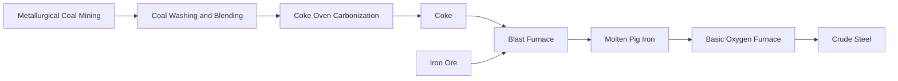

## Thermal Coal vs Metallurgical Coal Markets

### Overview

Thermal coal and metallurgical coal, while both derived from the same broad geological resource, constitute economically distinct markets with different demand drivers, pricing mechanisms, quality requirements, and long-term structural trajectories. Thermal coal is consumed primarily as a combustion fuel for electricity generation and industrial heat, while metallurgical (coking) coal serves as an essential input to the blast furnace steelmaking process. Understanding the divergence between these two markets is central to coal market economics, since price signals, demand elasticity, and substitution dynamics differ substantially between them.

### Fundamental Market Distinction

#### End-Use Divergence

| Dimension | Thermal Coal | Metallurgical Coal |
| --- | --- | --- |
| Primary use | Combustion fuel for power generation, cement kilns, industrial boilers | Carbonized into coke for blast furnace iron/steel production |
| Key value driver | Calorific value (energy content) per unit cost | Coking/caking properties, coke strength, low impurities |
| Substitutability | Faces substitution from natural gas, renewables, nuclear | Faces limited substitution in conventional blast furnace steelmaking; more substitutable in alternative steelmaking routes (e.g., electric arc furnace using scrap, or direct reduced iron) |
| Typical buyers | Utilities, independent power producers, industrial energy users | Integrated steel mills, coke producers |
| Price volatility character | Generally influenced by broader energy market dynamics (gas prices, seasonal demand, carbon policy) | Generally influenced by steel production cycles and quality/grade scarcity of premium coking coals |

**Key Points**

- Because metallurgical coal has few practical substitutes in the dominant blast furnace-basic oxygen furnace (BF-BOF) steelmaking route, its demand is tied closely to global steel production and construction/infrastructure/automotive cycles rather than to energy market dynamics broadly
- Thermal coal demand is more directly exposed to competition from alternative power generation fuels and technologies, making its long-run demand trajectory more sensitive to energy policy, carbon pricing, and renewable energy cost trends

### Thermal Coal Market Structure

#### Demand Drivers

- **Electricity generation**: the dominant use globally, with demand tied to power sector fuel mix decisions, electricity demand growth, and the relative cost competitiveness of coal-fired generation versus natural gas, renewables, and nuclear
- **Industrial heat and cement production**: thermal coal is also used directly as a process fuel in industries such as cement manufacturing, though at lower volumes than power generation
- **Seasonality**: in many markets, thermal coal demand for power generation exhibits seasonal patterns tied to heating and cooling demand, broadly analogous to (though generally less pronounced than) natural gas seasonality, since coal-fired plants often serve baseload rather than purely weather-driven peaking roles

#### Pricing Benchmarks

Thermal coal trades against several major regional price indices, each referencing a specific quality specification (typically a stated GCV, ash, and sulfur band):

| Benchmark | Region/Reference | Notes |
| --- | --- | --- |
| Newcastle (Australia) | Asia-Pacific seaborne benchmark | Widely referenced for high-CV thermal coal exported from Australia |
| Richards Bay (South Africa) | Atlantic/global seaborne benchmark | Reference for South African export coal |
| API2 (Rotterdam-based) | European/Atlantic import benchmark | Reflects CIF ARA (Amsterdam-Rotterdam-Antwerp) delivered coal |
| API4 | South African FOB export benchmark | Related to Richards Bay export pricing |

[Inference] Because thermal coal is a relatively fungible energy commodity once quality-adjusted, these benchmark prices tend to be linked by international arbitrage (shipping cost differentials aside), though regional price divergences can persist due to freight costs, quality mix differences, and localized demand/supply imbalances (e.g., temporary regional demand spikes from extreme weather or supply disruptions).

#### Substitution and Fuel-Switching Dynamics

**Key Points**

- In many power markets, thermal coal competes directly with natural gas for marginal generation dispatch, with the relative price of coal versus gas (adjusted for plant efficiency and carbon costs where applicable) determining short-run fuel-switching behavior
- Carbon pricing mechanisms (emissions trading schemes, carbon taxes) directly affect thermal coal's competitive position relative to lower-carbon-intensity fuels, since coal combustion generally emits more CO2 per unit of energy generated than natural gas
- [Inference] The long-run growth trajectory of renewable generation capacity and battery storage is generally expected to continue eroding thermal coal's role in the marginal generation stack in many markets over time, though the pace of this transition varies enormously by country depending on existing generation fleet age, energy security considerations, and policy commitments, and thermal coal remains a significant and in some regions growing component of the generation mix, particularly where it offers lower-cost energy security relative to alternatives

### Metallurgical Coal Market Structure

#### Demand Drivers

- **Global steel production**: metallurgical coal demand is fundamentally derived demand from steel production via the BF-BOF route, making it closely correlated with construction activity, infrastructure investment, automotive manufacturing, and broader industrial/manufacturing cycles
- **Regional steel industry structure**: demand is concentrated in major steel-producing regions, with China historically representing a very large share of global steel output and therefore global metallurgical coal consumption, alongside India, Japan, South Korea, and other steel-producing economies
- [Unverified] The precise share of global metallurgical coal demand attributable to any single country fluctuates with steel production cycles and should be verified against current-year production statistics rather than assumed static, given the significant year-to-year variability in steel output across major producing economies

#### Grade Segmentation and Pricing

Unlike thermal coal (differentiated primarily by a continuous quality spectrum around calorific value), metallurgical coal markets are segmented by distinct grade categories reflecting different roles in the coking/blast furnace process:

| Grade | Role | Relative Pricing |
| --- | --- | --- |
| Premium Hard Coking Coal (HCC) | Primary coking component; low volatile matter, strong coking properties | Highest-priced grade; sets the primary metallurgical coal benchmark |
| Hard Coking Coal (standard) | Coking component, slightly lower quality than premium | Priced at a differential to premium HCC |
| Semi-Soft Coking Coal (SSCC) | Blending component with weaker coking properties | Priced at a discount to hard coking coal |
| Pulverized Coal for Injection (PCI) | Injected directly into blast furnace tuyeres as a supplementary reductant/fuel, does not require coking properties | Priced differently from coking grades, generally closer to thermal coal quality characteristics but valued for blast furnace injection performance |

**Key Points**

- Because premium hard coking coal reserves with the necessary coking properties are geologically scarcer than general thermal-grade coal, metallurgical coal (particularly premium grades) has historically traded at a substantial premium to thermal coal
- Metallurgical coal pricing has shifted over time from traditional annual benchmark contract pricing toward more frequent (quarterly, and increasingly spot/index-linked) pricing mechanisms, [Inference] broadly following a similar trend toward greater market-based, shorter-tenor pricing that has also been observed in other bulk commodity markets (e.g., iron ore) since roughly the 2010s, reflecting buyer and seller preference for pricing that tracks prevailing market conditions more closely than long-fixed annual benchmarks

#### Illustration: Metallurgical Coal Value Chain

### Comparative Price Behavior and Correlation

#### Divergent Price Cycles

**Key Points**

- Thermal and metallurgical coal prices, while historically correlated to some degree (given shared mining regions, transportation infrastructure, and occasional supply-side production overlap), can diverge significantly during periods when their respective demand drivers move independently—for example, a steel production boom driving metallurgical coal prices sharply higher while thermal coal prices remain comparatively stable if power sector demand is flat
- Supply-side events affecting a specific coal-producing region (e.g., weather disruptions in a major exporting country affecting port/rail logistics) can simultaneously affect both markets if the affected infrastructure serves both coal types, creating short-term price co-movement even when underlying demand drivers differ
- [Inference] Because metallurgical coal is generally a smaller, more concentrated market (fewer economically viable coking coal deposits globally relative to the much larger and more geographically dispersed thermal coal resource base), metallurgical coal prices have historically tended to exhibit greater volatility during periods of steel demand disruption or supply-side shocks, though the specific volatility comparison in any given period depends on the nature and magnitude of the shocks affecting each market

#### Illustration: Thermal vs. Metallurgical Coal Price Driver Divergence (svg_diagram)

<svg xmlns="http://www.w3.org/2000/svg" viewBox="0 0 640 380">
<text x="320" y="25" text-anchor="middle" font-size="16" font-weight="bold" fill="#1a1a1a">Divergent Demand Drivers (svg_diagram)</text>

<rect x="60" y="70" width="220" height="260" rx="10" fill="none" stroke="#2980b9" stroke-width="2" />
<text x="170" y="100" text-anchor="middle" font-size="14" font-weight="bold" fill="#2980b9">Thermal Coal</text>
<text x="80" y="135" font-size="12" fill="#333">- Power generation demand</text>
<text x="80" y="160" font-size="12" fill="#333">- Gas price competition</text>
<text x="80" y="185" font-size="12" fill="#333">- Carbon policy exposure</text>
<text x="80" y="210" font-size="12" fill="#333">- Renewables substitution</text>
<text x="80" y="235" font-size="12" fill="#333">- Seasonal heating/cooling</text>
<text x="80" y="260" font-size="12" fill="#333">- Energy security policy</text>

<rect x="360" y="70" width="220" height="260" rx="10" fill="none" stroke="#c0392b" stroke-width="2" />
<text x="470" y="100" text-anchor="middle" font-size="14" font-weight="bold" fill="#c0392b">Metallurgical Coal</text>
<text x="380" y="135" font-size="12" fill="#333">- Global steel production</text>
<text x="380" y="160" font-size="12" fill="#333">- Construction/infrastructure cycles</text>
<text x="380" y="185" font-size="12" fill="#333">- Automotive manufacturing</text>
<text x="380" y="210" font-size="12" fill="#333">- Coking grade scarcity</text>
<text x="380" y="235" font-size="12" fill="#333">- Limited BF-BOF substitution</text>
<text x="380" y="260" font-size="12" fill="#333">- Iron ore market linkage</text>

<text x="320" y="345" text-anchor="middle" font-size="12" fill="#555" font-style="italic">Shared: mining regions, transport infrastructure, occasional price co-movement</text>

</svg>

### Structural Outlook Divergence

#### Thermal Coal: Energy Transition Exposure

[Inference] Thermal coal faces more direct long-run structural demand pressure than metallurgical coal in most policy and market scenarios discussed in energy transition analysis, given the availability of increasingly cost-competitive substitute generation technologies (renewables paired with storage, natural gas, in some markets nuclear) and the direct policy focus on power sector decarbonization in many jurisdictions. This has contributed to reduced willingness among many financial institutions and investors to fund new thermal coal mining capacity, though existing operations in many regions continue producing, and thermal coal demand growth continues in some developing economies prioritizing energy access and security.

#### Metallurgical Coal: Steelmaking Transition Uncertainty

**Key Points**

- Metallurgical coal's long-run outlook is tied to the pace of transition within the steel industry itself, particularly the potential growth of alternative steelmaking routes such as **direct reduced iron (DRI)** using hydrogen or natural gas, and increased **electric arc furnace (EAF)** steelmaking using recycled scrap steel, both of which reduce or eliminate the need for coking coal
- [Inference] The pace of this transition in steelmaking is generally expected to be considerably slower and more uncertain than the power sector's transition away from thermal coal, given the significant capital, technology maturity, and green hydrogen cost barriers currently facing large-scale fossil-free primary steelmaking, meaning metallurgical coal demand is broadly expected by many industry analysts to remain material for a longer horizon than thermal coal demand in current policy environments, though this assessment is inherently sensitive to the pace of technological and policy developments that are difficult to forecast with confidence

### Common Analytical Pitfalls

- Treating "coal demand" as a single undifferentiated aggregate when thermal and metallurgical coal have fundamentally different demand drivers, substitution dynamics, and long-run outlooks
- Assuming price movements in one coal market directly predict or drive movements in the other, when correlation is partial and driven mainly by shared supply-side/logistics factors rather than shared demand fundamentals
- Applying thermal coal's energy-transition-driven demand narrative uniformly to metallurgical coal, when the steelmaking transition faces materially different technological and cost barriers
- Overlooking the wide grade dispersion within metallurgical coal (premium HCC through PCI), which can lead to mischaracterizing the entire metallurgical coal market based on premium grade price movements alone

**Related Topics**

- Global steel production cycles and their linkage to metallurgical coal and iron ore demand
- Direct reduced iron (DRI) and electric arc furnace (EAF) steelmaking as substitutes for BF-BOF coking coal demand
- Carbon pricing mechanisms and their differential impact on thermal vs. metallurgical coal competitiveness
- Coal export logistics and shared infrastructure dependencies between thermal and metallurgical coal supply chains
- Coal quality grading systems underpinning benchmark index specifications
- Renewable energy cost trends and their effect on thermal coal's role in power generation dispatch