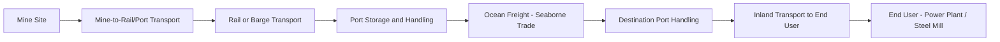

## Coal Transportation and Logistics Economics

### Overview

Coal transportation and logistics economics examines the cost structures, infrastructure requirements, and market dynamics governing the physical movement of coal from mine to end user. Because coal is a high-volume, relatively low-value-per-unit-mass bulk commodity, transportation costs frequently represent a substantial—sometimes dominant—share of the total delivered cost, meaning logistics economics often determines competitive positioning between supply basins as much as, or more than, mining cost differences alone. This is particularly pronounced in international seaborne trade, where freight costs directly shape which producing regions can competitively serve which importing markets.

### The Coal Logistics Chain

#### Overview of the Value Chain

Coal moves through a sequence of distinct transportation and handling stages between mine and final consumption point, each with its own cost structure and infrastructure requirements:

For domestic (non-exported) coal, the chain is typically shorter, often mine-to-rail/truck directly to the consuming plant, bypassing the port and ocean freight stages entirely.

### Inland Transportation Modes

#### Rail Transportation

Rail is the dominant mode for moving coal over medium-to-long inland distances, given coal's bulk density and volume characteristics.

**Key Points**

- Rail transportation typically involves substantial fixed infrastructure costs (track, rolling stock, loading/unloading facilities) alongside variable per-tonne-mile operating costs (fuel, crew, maintenance, wear)
- Unit train service (dedicated trains that shuttle continuously between a single mine/loadout and a single destination without being broken up) achieves significant cost efficiencies relative to shipping coal via mixed general freight rail service, due to reduced handling, faster cycle times, and specialized loading/unloading infrastructure
- Rail freight rates are influenced by distance, route competition (whether multiple rail carriers serve a given origin-destination pair), contract structure (long-term rate agreements vs. spot rates), and the railroad's own cost recovery requirements
- [Inference] In many coal-producing regions, rail transportation cost per tonne-mile tends to decline with contract volume commitments and dedicated unit-train infrastructure investment, which is one reason large-scale, long-term coal supply agreements often include coordinated rail logistics arrangements between producer, railroad, and consumer

#### Barge Transportation

Where inland waterway systems are available, barge transportation offers a lower-cost alternative to rail for bulk coal movement, though with more limited geographic reach.

- Generally the lowest-cost inland transportation mode per tonne-mile where navigable waterways connect origin and destination
- Constrained by waterway availability, seasonal water level fluctuations (which can affect vessel draft and loading capacity), and lock/dam transit capacity on regulated river systems
- [Unverified] The specific cost advantage of barge relative to rail varies considerably by region, waterway condition, and prevailing fuel costs, and general claims about barge-rail cost differentials should be verified against current regional data rather than assumed as a fixed ratio

#### Truck Transportation

Trucking is generally used for short-haul movements (mine-to-rail transfer points, mine-mouth power plants, or final delivery legs) rather than long-distance bulk movement, given its comparatively high cost per tonne-mile relative to rail or barge for longer distances.

#### Conveyor and Slurry Pipeline Systems

For specific situations—particularly **mine-mouth power plants** sited immediately adjacent to the coal source—conveyor belt systems can eliminate transportation costs almost entirely by feeding coal directly from mine to combustion facility. Coal slurry pipelines (coal ground and mixed with water, pumped through a pipeline, then dewatered at the destination) have been used in a small number of specific long-distance applications, though [Unverified] their broader commercial adoption has been limited relative to rail, and specific current operational examples should be verified rather than assumed to be widespread.

### Port Infrastructure and Handling

#### Export Terminal Economics

Coal export terminals represent significant fixed capital investments, and their capacity and efficiency directly affect the throughput (and therefore competitiveness) of the coal basins they serve.

**Key Points**

- Port handling costs include stockpiling, blending (combining different coal qualities/sources to meet cargo specifications), loading equipment, and vessel berthing/loading time
- Port capacity constraints can act as a binding bottleneck on export volumes even when mining capacity and demand would otherwise support higher throughput, and in such cases, port capacity expansion (or the lack thereof) becomes a critical determinant of a basin's ability to grow export market share
- Demurrage charges (penalties for vessels waiting beyond agreed loading/unloading time) can become a material cost factor during periods of port congestion, effectively raising the delivered cost of coal shipped through congested terminals

#### Illustration: Port Bottleneck Effect on Delivered Cost (svg_diagram)

<svg xmlns="http://www.w3.org/2000/svg" viewBox="0 0 640 360">
<text x="320" y="25" text-anchor="middle" font-size="16" font-weight="bold" fill="#1a1a1a">Port Congestion Impact on Delivered Cost (svg_diagram)</text>
<line x1="80" y1="300" x2="580" y2="300" stroke="#333" stroke-width="2" />
<line x1="80" y1="300" x2="80" y2="60" stroke="#333" stroke-width="2" />

<text x="330" y="335" text-anchor="middle" font-size="13" fill="#333">Export Volume Attempted</text>

<text x="30" y="180" text-anchor="middle" font-size="13" fill="#333" transform="rotate(-90 30 180)">Delivered Cost per Tonne</text>

<path d="M 80,270 C 250,265 380,250 450,220 C 500,190 530,140 570,80" fill="none" stroke="#c0392b" stroke-width="3" />
<line x1="450" y1="60" x2="450" y2="300" stroke="#2980b9" stroke-width="2" stroke-dasharray="6,4" />
<text x="455" y="75" font-size="12" fill="#2980b9" font-weight="bold">Port Capacity Limit</text>

<text x="150" y="290" font-size="11" fill="#555">Costs rise gradually with volume</text>

<text x="480" y="150" font-size="11" fill="#555">Demurrage/congestion costs spike near capacity</text>

</svg>

### Ocean Freight and Seaborne Trade Economics

#### Vessel Types and Freight Rate Determination

Seaborne coal trade primarily uses dry bulk carriers, sized according to trade route and port draft constraints:

| Vessel Class | Approximate Deadweight Tonnage | Typical Use |
| --- | --- | --- |
| Panamax | ~60,000-80,000 DWT | Widely used across many coal trade routes |
| Capesize | ~150,000-180,000+ DWT | Larger cargoes, typically longer-haul routes with adequate port draft |
| Supramax/Handymax | ~50,000-60,000 DWT | Smaller cargoes, ports with draft/berth limitations |

**Key Points**

- Ocean freight rates are determined in a global dry bulk shipping market that is itself subject to independent supply-demand dynamics (vessel fleet size, shipbuilding order books, scrapping rates, and demand from other dry bulk commodities such as iron ore and grain competing for the same vessel capacity)
- Freight rates fluctuate based on bunker fuel costs, vessel availability, port congestion at both loading and discharge ports, and broader dry bulk shipping market cycles that are largely independent of coal-specific supply-demand fundamentals
- [Inference] Because freight rates are set in a market shared with other bulk commodities, a surge in demand for iron ore or grain shipping capacity can indirectly raise the effective freight cost for coal cargoes even without any change in coal-specific market conditions, illustrating that seaborne coal delivered costs are exposed to shipping market risk that is distinct from and additional to coal price risk itself

#### Freight Cost as a Share of Delivered Price

$$\text{Delivered Price (CIF)} = \text{FOB Price} + \text{Ocean Freight} + \text{Insurance}$$

The relative significance of freight cost varies substantially by trade route distance:

- **Short-haul intra-regional trade** (e.g., within the Asia-Pacific basin): freight typically represents a smaller proportion of delivered cost
- **Long-haul trans-oceanic trade** (e.g., Atlantic basin supply to Asia-Pacific demand): freight can represent a very substantial share of delivered cost, materially affecting competitiveness against geographically closer alternative suppliers

[Inference] This freight-driven cost differential is a primary reason why seaborne coal trade tends to exhibit strong regional trade pattern preferences (e.g., geographically proximate supply-demand pairings), with longer-haul trade flows generally occurring only when price differentials between regions are large enough to absorb the additional freight cost, or when nearer sources cannot supply sufficient volume or the required quality specification.

### FOB vs. CIF/DES Contract Terms

Coal trade contracts specify where risk, cost, and responsibility transfer between seller and buyer, which directly affects who bears freight and insurance cost/risk:

| Term | Full Name | Risk/Cost Transfer Point |
| --- | --- | --- |
| FOB | Free on Board | Seller's responsibility ends once cargo is loaded onto the vessel at origin port; buyer arranges and pays for ocean freight and insurance |
| CIF | Cost, Insurance, and Freight | Seller arranges and pays freight and insurance to destination port, but risk transfers to buyer once loaded at origin |
| DES / DAP | Delivered Ex-Ship / Delivered at Place | Seller retains responsibility (and typically bears freight cost and risk) until the cargo arrives at the destination port |

**Key Points**

- The choice of contract term shifts freight market exposure between buyer and seller, and sophisticated market participants may prefer a particular term based on their own shipping expertise, chartering relationships, or desire to control logistics risk
- Freight rate volatility means that FOB versus CIF/DES contract choice has real economic significance beyond a mere administrative distinction—it determines which party bears the risk of freight rate movements between contract signing and delivery

### Coal Blending Economics

Coal blending—combining coal from different sources or seams—occurs at multiple points in the logistics chain (mine site, port stockyard, or even at the power plant) and serves both quality and economic optimization purposes:

**Key Points**

- Blending allows producers/traders to meet specific buyer quality specifications (calorific value, ash, sulfur bands) by combining higher- and lower-quality coal streams, effectively creating a marketable product from coal that might not individually meet a target specification
- From an economic optimization perspective, blending can allow a supplier to sell a wider range of raw coal qualities profitably, rather than being limited to selling only coal that naturally meets buyer specifications without blending
- [Inference] Port-based blending facilities add a layer of logistics complexity and cost (stockpile management, blending equipment, quality control testing) but can materially expand the range of raw coal a supplier can economically monetize, which is one reason major export terminals often include dedicated blending infrastructure

### Domestic vs. Export Logistics Cost Structures

#### Domestic (Mine-Mouth and Rail-Served) Logistics

- **Mine-mouth plants**: power plants built adjacent to the coal source to minimize or eliminate transportation cost, typically via direct conveyor delivery; this arrangement sacrifices flexibility in fuel sourcing for very low delivered fuel cost
- **Rail-served domestic plants**: bear ongoing rail freight cost, which varies with distance from mine to plant and prevailing rail contract/rate conditions

#### Export Logistics

Export-oriented coal must clear a longer and more cost-intensive logistics chain (rail/barge to port, port handling, ocean freight, destination port handling, inland transport to end user), making total delivered cost for exported coal generally higher and more variable than domestically consumed coal from the same basin, all else equal.

### Worked Example

**Example**

A coal producer is evaluating the delivered economics of exporting coal from an inland mine to an Asian import market, with the following approximate cost components:

- Mine-gate cash cost: $35.00/tonne
- Rail freight, mine to port: $18.00/tonne
- Port handling and blending fee: $4.50/tonne
- FOB export price achieved: $65.00/tonne
- Ocean freight (FOB contract, borne by buyer in this case): not included in seller's cost calculation under FOB terms

Seller's FOB netback:

$$\text{FOB Netback} = 65.00 - 35.00 - 18.00 - 4.50 = \$7.50/\text{tonne}$$

If the same producer instead sold on a CIF basis at a CIF price of $85.00/tonne, and ocean freight to the destination market is estimated at $16.00/tonne:

$$\text{CIF Netback} = 85.00 - 16.00 - 35.00 - 18.00 - 4.50 = \$11.50/\text{tonne}$$

[Inference] In this illustrative scenario, selling on a CIF basis yields a higher netback than the FOB sale, but this comparison assumes the producer can arrange ocean freight at the estimated $16.00/tonne rate; if freight rates rise unexpectedly between contract agreement and shipment, the CIF netback would be correspondingly reduced, illustrating why the choice between FOB and CIF contract structures involves a real transfer of freight market risk rather than being purely a pricing convention.

### Common Analytical Pitfalls

- Comparing mine-gate production costs across basins without incorporating transportation costs to the relevant demand market, which can substantially misrepresent true competitive positioning
- Treating ocean freight rates as stable or predictable, when they are set in an independent, often volatile dry bulk shipping market subject to its own supply-demand cycles
- Assuming FOB and CIF prices for the same coal are simply related by a fixed freight differential, when actual freight costs fluctuate and the risk allocation between contract terms has real economic consequences
- Overlooking port and rail infrastructure capacity constraints as potential binding limits on export growth, independent of mining capacity or overseas demand
- Ignoring blending economics when assessing the market value of raw, unblended coal production from a given mine or basin

**Related Topics**

- Dry bulk shipping market cycles and their linkage to coal, iron ore, and grain freight rates
- Rail infrastructure investment and unit train logistics economics
- Port capacity planning and demurrage cost management in coal export terminals
- Coal blending strategies for meeting benchmark quality specifications
- FOB vs. CIF contract risk allocation in international commodity trade
- Mine-mouth power plant economics and captive coal supply arrangements
- Regional seaborne coal trade flow patterns and geographic freight cost advantages