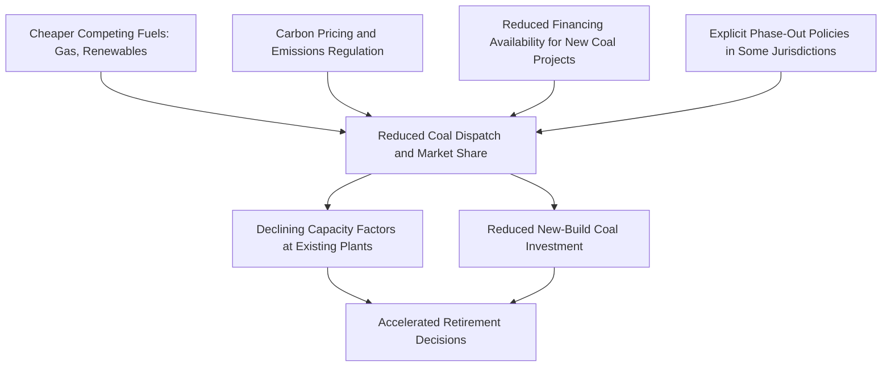
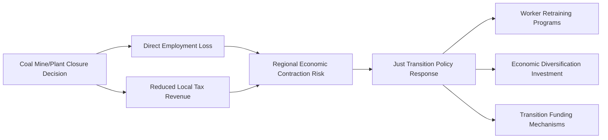

## Coal Industry Decline and Structural Transition Economics

### Overview

Coal industry decline and structural transition economics examines the economic forces driving the contraction of coal production and consumption in many markets, and the associated adjustment costs, policy responses, and asset-level consequences of that transition. This is distinct from cyclical demand fluctuations—it concerns a structural, longer-run reallocation of capital, labor, and energy market share away from coal, driven by a combination of relative cost shifts (cheaper competing fuels and technologies), environmental policy, and changing investor and financing behavior. The pace, scope, and permanence of this transition vary substantially by region, coal grade (thermal vs. metallurgical), and policy environment, and should not be treated as a uniform global phenomenon.

### Drivers of Structural Decline

#### Relative Cost Competitiveness Shifts

**Key Points**

- The emergence of low-cost shale gas in some markets (most notably the United States following the shale gas revolution) shifted the relative variable cost competitiveness of gas-fired generation versus coal-fired generation, contributing to coal-to-gas switching in power generation dispatch and reduced coal demand in affected markets
- Declining renewable energy technology costs (particularly utility-scale solar photovoltaic and onshore wind) over an extended period have progressively improved renewables' cost-competitiveness against new-build (and in some cases existing) coal generation in many regions
- [Inference] Because these cost shifts operate primarily through ordinary market mechanisms (relative variable and levelized costs affecting dispatch and investment decisions) rather than solely through direct regulation, coal's declining competitive position in many markets reflects a combination of market-driven and policy-driven forces that are often difficult to fully disentangle in any given jurisdiction's specific outcome

#### Environmental and Climate Policy

- Carbon pricing mechanisms (emissions trading schemes, carbon taxes) directly raise coal generation's variable cost relative to lower-emissions-intensity alternatives, as detailed in dispatch economics
- Direct regulatory measures in some jurisdictions (emissions performance standards, plant-specific retirement mandates, restrictions on new coal plant permitting or financing) have also directly constrained coal's role in specific markets
- International climate commitments and national decarbonization targets have in many cases translated into explicit coal phase-out policies or timelines in a number of countries, though the specific scope, binding nature, and timeline of such policies vary considerably by jurisdiction

#### Financing and Investment Availability

**Key Points**

- Many major financial institutions, insurers, and institutional investors have adopted policies restricting or excluding financing, underwriting, or investment in new coal mining or coal-fired power generation projects, reflecting both climate risk considerations and reputational/ESG-related investment mandates
- [Inference] This reduced availability of financing has likely raised the effective cost of capital for coal-related projects that can still secure financing, and has made greenfield coal project development considerably more difficult in many markets, independent of the project's own underlying cost competitiveness, since capital availability itself has become a binding constraint in ways not previously as significant
- [Unverified] The precise magnitude of this financing effect on project viability is difficult to quantify systematically across the industry, since it interacts with jurisdiction-specific policy, project-specific creditworthiness, and the availability of alternative (e.g., state-backed or specialized) financing sources that may not be subject to the same restrictions

### Illustration: Converging Pressures on Coal's Structural Position

### Asymmetric Transition Across Coal Segments

#### Thermal Coal vs. Metallurgical Coal Transition Pace

As established in thermal-vs-metallurgical coal market analysis, the structural transition pressures described above apply asymmetrically:

**Key Points**

- Thermal coal faces more direct and immediate substitution pressure, since gas, renewables, and storage represent increasingly viable substitutes for coal-fired power generation in many markets
- Metallurgical coal faces substitution pressure primarily through the slower-moving transition of the steel industry toward alternative production routes (direct reduced iron/hydrogen-based steelmaking, increased electric arc furnace/scrap-based production), which [Inference] is generally expected by many industry analysts to proceed on a considerably longer timeline than power sector decarbonization, given the substantial technology maturity, capital cost, and green hydrogen availability barriers currently facing large-scale fossil-free primary steelmaking at commercial scale
- This asymmetry means that aggregate "coal industry decline" narratives should be disaggregated by coal type, since metallurgical coal demand trajectories in current policy and technology environments differ meaningfully from thermal coal trajectories in most forecasts

#### Regional Asymmetry

**Key Points**

- Coal demand and production trends vary substantially by region: some markets have seen sustained, multi-year declines in coal consumption (particularly in some developed economies with mature alternative generation infrastructure and explicit phase-out policies), while other markets, particularly some developing economies prioritizing energy access, industrialization, and energy security, have continued to see coal demand growth or sustained high levels of consumption
- [Unverified] Precise current-year regional coal demand and production figures fluctuate and should be verified against up-to-date statistical sources (e.g., international energy agency data) rather than assumed static, given the meaningful year-to-year variation and ongoing policy developments across major coal-consuming regions

### Asset-Level Consequences: Stranded Assets

#### The Stranded Asset Concept

A **stranded asset**, in this context, refers to a coal mining or coal power generation asset whose economic life is curtailed before the end of its originally anticipated operating life or before its capital investment is fully recovered, due to structural market or policy changes rather than ordinary technical obsolescence or exhaustion of reserves.

$$\text{Stranded Value} = \text{Remaining Book Value} - \text{Present Value of Actual Remaining Cash Flows}$$

**Key Points**

- Stranded asset risk is particularly relevant for long-lived, capital-intensive coal assets (power plants, mines with long reserve life) financed on the assumption of a multi-decade operating horizon, since early retirement or curtailment prevents full recovery of the original capital investment through operating cash flows
- [Inference] The financial risk of asset stranding has been cited by financial regulators, central banks, and investors in some jurisdictions as a systemic risk consideration for financial institutions with material coal-sector exposure, motivating both voluntary divestment/exclusion policies and, in some cases, regulatory stress-testing or disclosure requirements related to climate transition risk
- Asset stranding risk affects not only equity/asset owners but also lenders, insurers, and, in some cases, communities and workers dependent on the affected assets for employment and tax revenue

### Labor Market and Regional Economic Transition

#### Employment and Community Impacts

Coal industry decline carries direct labor market and regional economic consequences beyond asset-level financial effects:

**Key Points**

- Coal mining and coal-fired power generation employment is often geographically concentrated in specific regions/communities where these industries have historically represented a significant share of local employment and tax base, meaning industry decline can have outsized local economic effects even where the industry represents a small share of a national economy overall
- Workforce transition challenges include skills mismatch (coal industry-specific technical skills not always directly transferable to emerging energy sector roles), geographic immobility of affected workers, and the erosion of local tax revenue supporting public services and infrastructure in affected communities
- [Inference] These localized impacts have motivated policy interest in "just transition" frameworks in a number of jurisdictions—policy approaches explicitly designed to address the labor market and community-level economic consequences of coal industry decline (worker retraining programs, economic diversification investment, transition funding mechanisms)—though the specific design, funding level, and effectiveness of such programs vary considerably across jurisdictions and are subject to ongoing policy debate

### Illustration: Regional Transition Economic Flow

### Reclamation, Legacy Liabilities, and Closure Economics

#### Long-Tail Closure Obligations

Coal industry decline intersects with the long-tail reclamation and closure liabilities discussed in mining cost economics, but at an industry-wide structural level:

**Key Points**

- Accelerated or unplanned mine/plant closures can create financial stress for the timing and adequacy of reclamation funding, particularly where reclamation bonds or trust funds were sized based on assumptions of a longer operating life and gradual accumulation of closure funding over time
- [Inference] In cases where a coal company faces financial distress or bankruptcy during industry contraction, reclamation and closure obligations may become a contested creditor claim, raising the risk that reclamation funding proves insufficient if the responsible company cannot fulfill its obligations, which has motivated regulatory attention in some jurisdictions toward strengthening upfront financial assurance requirements rather than relying on the company's ongoing solvency
- Legacy environmental liabilities (acid mine drainage, land subsidence, water contamination) can persist and require management long after mining or plant operations cease, representing an ongoing economic and regulatory consideration independent of the pace of industry decline itself

### Portfolio and Capital Reallocation by Industry Participants

**Key Points**

- Major diversified energy and mining companies have in many cases pursued strategic divestment of thermal coal assets specifically (selling to other operators, including sometimes less-regulated or less-scrutinized buyers, or pursuing managed closure), while in some cases retaining metallurgical coal assets given the different demand outlook discussed above
- [Inference] This divestment pattern has raised policy and academic discussion regarding whether asset sales to different (sometimes smaller, less capitalized, or less publicly scrutinized) owners actually reduce the associated production, emissions, or closure/reclamation risk, or whether it primarily shifts the asset (and its associated liabilities and risks) to a different, potentially less well-resourced owner without necessarily accelerating the underlying decline in production—this remains a debated question in the literature and among stakeholders rather than a settled conclusion
- Capital previously allocated to coal-sector investment has in many cases been redirected by diversified energy companies toward renewable energy, natural gas, or other lower-carbon-intensity investments, reflecting both return expectations and portfolio risk management considerations

### Worked Example

**Example**

A coal-fired power plant with an original expected operating life of 40 years and $800 million in undepreciated capital value faces an early retirement decision after 25 years of operation, due to a combination of declining capacity factor (from renewable displacement in the merit order) and a newly announced regulatory requirement for a costly emissions control upgrade.

Remaining book value (undepreciated capital) at time of retirement decision: $800 million (illustrative, assuming straight-line depreciation was paused or the plant was under-depreciated relative to its now-shortened useful life)

If the plant's expected future net cash flows (revenue minus avoidable operating costs) over its remaining originally-planned 15 years, discounted to present value, are estimated at $300 million, but the required emissions control upgrade costs $450 million:

$$\text{Continue Operating NPV} = 300 - 450 = -\$150 \, \text{million (negative — retirement favored)}$$

$$\text{Stranded Value} \approx 800 - 300 = \$500 \, \text{million (illustrative, before considering any salvage or alternative site value)}$$

[Inference] This illustrates how a single regulatory or capital-triggering event (here, a mandated compliance upgrade) can crystallize a stranded asset outcome that might not have occurred purely from gradual capacity factor decline alone, since the magnitude of the required capital investment relative to the plant's remaining expected cash flow directly determines whether continued operation remains economically justified.

### Common Analytical Pitfalls

- Treating "coal industry decline" as a single uniform global trend, when regional and coal-grade (thermal vs. metallurgical) variation is substantial and often more significant than aggregate global statistics suggest
- Conflating market-driven cost competitiveness shifts with policy-driven decline, when in practice most real-world outcomes reflect an interacting combination of both forces that is difficult to cleanly separate
- Overlooking metallurgical coal's distinct and generally slower transition timeline when applying thermal coal-specific decline narratives to the broader coal industry
- Ignoring labor market and regional economic effects when assessing industry transition purely from an asset/financial perspective, since these effects carry independent economic and policy significance
- Assuming asset divestment by large, scrutinized companies necessarily reduces the underlying environmental or production footprint of the divested asset, when it may simply transfer ownership and associated risk to a different party

**Related Topics**

- Just transition policy frameworks and worker retraining program design
- Stranded asset risk assessment methodologies in climate-related financial disclosure
- Coal mine reclamation bonding and financial assurance regulatory reform
- Divestment and capital reallocation strategies among diversified energy companies
- Regional economic diversification strategies for coal-dependent communities
- Metallurgical coal demand outlook and steelmaking decarbonization technology pathways
- Carbon pricing mechanism design and its differential impact across coal market segments