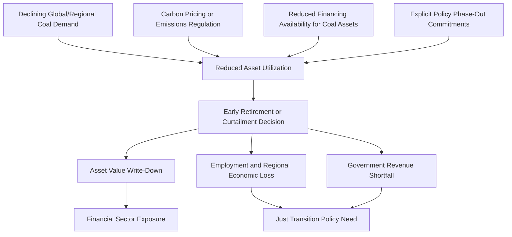

## Stranded Assets in Coal-Dependent Economies

### Overview

Stranded assets in coal-dependent economies refers to the economic, financial, and fiscal consequences that arise when coal mining and coal-fired power generation assets lose economic value or are retired before the end of their originally anticipated operating life, in economies where coal plays an outsized role in employment, government revenue, energy supply, and export earnings. While stranded asset risk exists in any coal market, its consequences are magnified and structurally distinct in economies where coal is not merely one industry among many but a central pillar of the fiscal and economic base—creating transition challenges that extend well beyond the affected companies themselves to encompass national fiscal stability, energy security, and regional economic structure.

### Defining Stranded Assets in This Context

#### Core Concept

A stranded asset is one whose value is written down, retired, or curtailed earlier than originally planned due to structural changes in market conditions, technology, or policy, rather than ordinary technical exhaustion or obsolescence.

$$\text{Stranded Value} = \text{Remaining Book/Reserve Value} - \text{Present Value of Realizable Future Cash Flows}$$

**Key Points**

- In a coal-dependent economy, stranding can occur at multiple linked levels simultaneously: individual mine/plant assets, state-owned enterprise balance sheets, sub-national government fiscal positions (where coal royalties/taxes fund public budgets), and broader regional economic infrastructure built around coal industry employment
- [Inference] This multi-level exposure distinguishes coal-dependent economies from more diversified economies with coal industry presence, since the same underlying stranding event (e.g., early mine or plant closure) can simultaneously trigger asset write-downs, fiscal revenue shortfalls, and regional economic contraction in a way that is more difficult to absorb through economic diversification or fiscal buffers

### Structural Features of Coal-Dependent Economies

#### Fiscal Dependence on Coal Revenue

Many coal-dependent economies and sub-national jurisdictions rely on coal-related revenue streams as a material or even dominant component of public finances:

| Revenue Source | Description |
| --- | --- |
| Royalties | Payments to government based on coal production volume or value, often a primary revenue source for resource-owning jurisdictions |
| Corporate/severance taxes | Taxes levied specifically on coal production or extraction activity |
| Export duties | Taxes applied to coal exports, relevant particularly for major exporting economies |
| State-owned enterprise dividends | Profit distributions where coal mining or coal power generation is conducted through state-owned enterprises |

[Unverified] The specific share of any given jurisdiction's public revenue attributable to coal varies enormously and changes over time with coal prices and production volumes, so general claims about fiscal dependence should be verified against current, jurisdiction-specific budget data rather than treated as a fixed, universal figure.

#### Employment and Economic Structure Concentration

**Key Points**

- Coal-dependent economies and regions often exhibit high employment concentration in coal mining, coal transportation, and coal-fired power generation, alongside substantial indirect employment in supporting industries (equipment supply, local services, transportation)
- Regional economic structures built around coal industry activity (housing markets, local business ecosystems, public infrastructure sized for a coal-industry-scale population and tax base) create additional structural rigidity that amplifies the economic impact of coal industry contraction beyond direct job losses alone
- [Inference] This concentration means that stranded asset events in such regions are less likely to be smoothly absorbed by regional labor market reallocation compared to more economically diversified regions, since alternative employment opportunities matching the skill profile, wage level, and geographic location of displaced coal workers may be limited

### Mechanisms Driving Asset Stranding

#### Illustration: Stranding Trigger Pathways

#### Price and Demand-Driven Stranding

As addressed in coal industry decline economics, structural demand decline (from substitution by cheaper alternatives, carbon pricing, or policy phase-outs) can render existing coal assets uneconomic to continue operating or to complete previously planned capital investment, triggering the asset-level stranding mechanics discussed there. In a coal-dependent economy, this same mechanism has amplified downstream effects due to the fiscal and employment concentration described above.

#### Reserve-Level Stranding: "Unburnable Carbon"

A distinct but related concept in stranded asset analysis concerns **reserve-level stranding**—the possibility that a portion of a country's or company's coal reserves may never be economically extracted at all, because climate policy constraints (consistent with international climate goals) would require leaving a substantial share of known fossil fuel reserves in the ground.

**Key Points**

- This "unburnable carbon" framing originated primarily in climate policy and financial risk literature examining the compatibility of known fossil fuel reserves with global carbon budget constraints
- [Inference] For a coal-dependent economy with reserves that have been valued (on company balance sheets, or implicitly in national wealth accounting) on the assumption of eventual extraction, this reserve-level stranding risk represents a potentially much larger latent economic exposure than asset-level stranding of currently operating mines and plants alone, since it concerns resources not yet extracted rather than only currently operating assets
- [Unverified] The extent to which this reserve-level stranding risk is actually reflected in current company valuations, sovereign wealth accounting, or investor risk assessments varies considerably and is a subject of ongoing debate and methodological disagreement in the financial and academic literature, rather than a settled, uniformly applied practice

### Financial Sector Transmission Channels

#### Exposure Pathways

Financial institutions with lending, investment, or insurance exposure to coal-dependent economies face several transmission channels through which coal asset stranding can create financial risk:

| Channel | Mechanism |
| --- | --- |
| Direct corporate lending/investment | Loans or equity investment in coal mining/power companies whose assets or cash flows are impaired by stranding |
| Sovereign/sub-sovereign exposure | Government bonds or municipal debt in jurisdictions with significant coal revenue dependence, exposed to fiscal shortfall risk |
| Sector-wide credit risk | Broader regional economic contraction (from coal industry decline) affecting the creditworthiness of a wider range of borrowers in the affected region, beyond coal companies themselves |
| Insurance underwriting exposure | Insurers covering coal-related physical assets, business interruption, or associated infrastructure |

**Key Points**

- [Inference] This has motivated financial regulators and central banks in a number of jurisdictions to incorporate climate transition risk—including coal asset stranding risk—into financial stability assessments, climate stress testing frameworks, and disclosure requirements, reflecting a view that concentrated coal-sector exposure represents a systemic risk consideration warranting supervisory attention, though the specific scope and rigor of such frameworks vary considerably across jurisdictions
- Credit rating agencies have in some cases incorporated coal transition and stranded asset risk into sovereign and corporate credit assessments for issuers with material coal-sector exposure, though [Unverified] the specific weight given to this factor in any particular rating decision is not typically disclosed in detail and varies by issuer and rating agency methodology

### Illustration: Fiscal Vulnerability Structure (svg_diagram)

<svg xmlns="http://www.w3.org/2000/svg" viewBox="0 0 640 380">
<text x="320" y="25" text-anchor="middle" font-size="16" font-weight="bold" fill="#1a1a1a">Coal-Dependent Fiscal Exposure Structure (svg_diagram)</text>
<rect x="240" y="50" width="160" height="50" rx="8" fill="#7f8c8d" />
<text x="320" y="80" text-anchor="middle" font-size="13" fill="white">Coal Production Base</text>
<line x1="320" y1="100" x2="150" y2="150" stroke="#333" stroke-width="2" />
<line x1="320" y1="100" x2="320" y2="150" stroke="#333" stroke-width="2" />
<line x1="320" y1="100" x2="490" y2="150" stroke="#333" stroke-width="2" />
<rect x="70" y="150" width="160" height="50" rx="8" fill="#2980b9" />
<text x="150" y="180" text-anchor="middle" font-size="12" fill="white">Government Royalties/Taxes</text>
<rect x="240" y="150" width="160" height="50" rx="8" fill="#c0392b" />
<text x="320" y="180" text-anchor="middle" font-size="12" fill="white">Direct/Indirect Employment</text>
<rect x="410" y="150" width="160" height="50" rx="8" fill="#27ae60" />
<text x="490" y="180" text-anchor="middle" font-size="12" fill="white">Financial Sector Exposure</text>
<line x1="150" y1="200" x2="320" y2="260" stroke="#333" stroke-width="2" />
<line x1="320" y1="200" x2="320" y2="260" stroke="#333" stroke-width="2" />
<line x1="490" y1="200" x2="320" y2="260" stroke="#333" stroke-width="2" />
<rect x="190" y="260" width="260" height="60" rx="8" fill="#8e44ad" />
<text x="320" y="285" text-anchor="middle" font-size="13" fill="white">Compounded Stranding Impact:</text>
<text x="320" y="305" text-anchor="middle" font-size="12" fill="white">Fiscal + Employment + Financial Risk</text>
</svg>

### Just Transition Policy Frameworks

#### Policy Rationale and Components

Given the compounded fiscal, employment, and financial risks described above, coal-dependent economies and regions have been a primary focus of **just transition** policy design—frameworks intended to manage the economic and social consequences of coal industry decline in an equitable and economically stabilizing manner.

**Key Points**

- Common just transition policy components include: worker retraining and reskilling programs, targeted economic diversification investment in affected regions, transition funding mechanisms (grants, dedicated transition funds, sometimes financed through carbon pricing revenue recycling), and social protection measures (extended unemployment benefits, early retirement provisions for affected workers)
- [Inference] The design and adequacy of just transition frameworks varies considerably by jurisdiction's fiscal capacity, political commitment, and institutional capacity to implement complex multi-stakeholder regional economic transition programs, and empirical assessment of their effectiveness is an active and evolving area of policy research rather than a settled body of established best practice
- International and multilateral financial institutions have in some cases provided targeted financing or technical assistance for just transition programs in coal-dependent developing economies, reflecting recognition that domestic fiscal capacity alone may be insufficient to fund adequate transition support in lower-income coal-dependent contexts

### Reclamation and Legacy Liability Financing Risk

#### Compounded Financial Assurance Risk

As discussed in mining cost economics, mine reclamation obligations represent long-tail financial liabilities. In a coal-dependent economy experiencing structural decline, this risk is compounded:

**Key Points**

- If reclamation bonds or trust funds were sized based on assumptions of continued company solvency and gradual, planned closure timelines, an accelerated or disorderly industry contraction (company bankruptcies, unplanned early closures) increases the risk that accumulated reclamation funding proves insufficient
- [Inference] In economies where coal companies (particularly state-owned enterprises or nationally significant private companies) face financial distress amid industry-wide decline, the government itself may face pressure to absorb reclamation and closure costs that were originally intended to be funded by the responsible companies, effectively transferring private environmental liability onto public fiscal accounts—a risk that has motivated calls in some policy discussions for stronger upfront financial assurance requirements specifically in coal-dependent jurisdictions
- This dynamic illustrates how asset stranding risk in coal-dependent economies extends beyond lost revenue and employment to encompass potential additional fiscal burden from environmental remediation obligations

### Worked Example

**Example**

A hypothetical coal-dependent regional economy has the following structure:

- Coal royalties represent 30% of the regional government's annual budget
- Direct and indirect coal-sector employment represents 20% of the regional workforce
- A major mining company operating in the region announces early closure of its largest mine, five years ahead of its originally planned reserve-life-based closure date, citing declining demand and reduced access to financing for continued operation

Estimated fiscal impact:

$$\text{Annual Royalty Loss} = 0.30 \times \text{Regional Budget} \times \left(\frac{\text{Closed Mine Production}}{\text{Total Regional Production}}\right)$$

If the closed mine represents 40% of total regional coal production, the regional government faces an estimated loss of approximately 12% of its total annual budget (0.30 × 0.40), occurring over a compressed timeframe rather than the gradual, planned decline the original closure date would have allowed for fiscal adjustment.

[Inference] This compressed timeline is a key distinguishing feature of disorderly versus planned/orderly transition: a gradual, five-year-earlier-than-planned closure still represents a significant fiscal shock, but a sudden, unplanned bankruptcy-driven closure would compress this same fiscal and employment adjustment into an even shorter timeframe, substantially increasing the risk that regional government and affected workers/communities lack adequate time to implement offsetting fiscal or economic diversification measures, which is a central argument in the policy literature for early, planned transition management over reactive crisis response.

### Common Analytical Pitfalls

- Treating stranded asset risk in coal-dependent economies as equivalent in scale and manageability to stranded asset risk in more economically diversified coal-producing regions
- Focusing solely on currently operating asset-level stranding while overlooking the potentially larger reserve-level ("unburnable carbon") stranding exposure embedded in valuations of undeveloped reserves
- Assuming just transition policy frameworks are uniformly designed, funded, or effective across jurisdictions, when significant variation exists in fiscal capacity, institutional design, and implementation track record
- Overlooking the compounded, mutually reinforcing nature of fiscal, employment, and financial sector exposure channels, which can amplify a single stranding event's economic impact well beyond what any single channel would suggest in isolation
- Ignoring reclamation/closure liability risk as a distinct fiscal exposure channel separate from lost production revenue and employment impacts

**Related Topics**

- "Unburnable carbon" and carbon budget-constrained reserve valuation methodology
- Central bank and financial regulator climate transition risk stress-testing frameworks
- Just transition policy design and international financing mechanisms for developing coal-dependent economies
- Sovereign and sub-sovereign credit risk assessment incorporating coal transition exposure
- Mine reclamation financial assurance regulatory reform
- Regional economic diversification strategies for resource-dependent economies
- Coal industry decline drivers and asset-level stranding mechanics