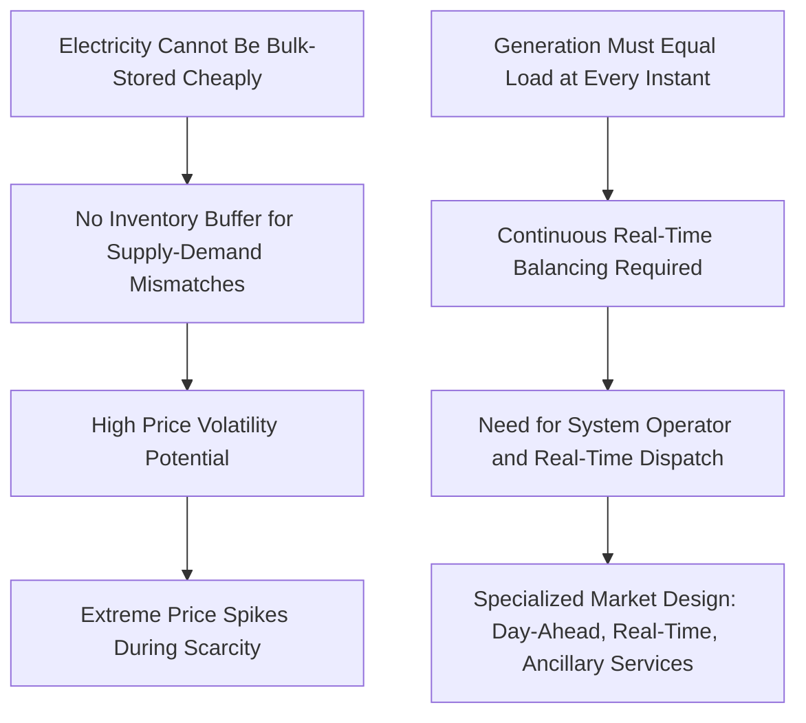

## Electricity as a Unique Commodity: Non-Storability and Instantaneity

### Overview

Electricity possesses a set of physical characteristics that distinguish it fundamentally from virtually all other traded commodities, with non-storability (at meaningful scale and cost, historically) and instantaneity (the requirement that supply and demand balance continuously in real time) being the most economically consequential. These physical properties are not merely technical curiosities—they are the foundational reason why electricity markets require specialized institutional design (system operators, real-time balancing markets, capacity mechanisms) that has no close parallel in the trading of oil, gas, metals, or agricultural commodities. Understanding these properties is prerequisite to understanding virtually every other topic in electricity market design and pricing.

### The Core Physical Properties

#### Non-Storability

Unlike oil, gas, or grain, electricity as a delivered commodity cannot be economically stored in bulk at the point of consumption using conventional means once generated in its final form (as flowing current on the grid). While storage technologies exist (discussed below), historically these have been limited in scale, costly, or lossy relative to direct combustion or renewable generation, meaning that for most of the history of electricity markets, generation and consumption have needed to be matched instantaneously rather than buffered through inventory in the way other commodities are.

**Key Points**

- This contrasts sharply with commodities like natural gas or crude oil, where storage economics (as covered in gas storage economics) allow producers and consumers to decouple the timing of production from the timing of consumption, smoothing price volatility and enabling straightforward arbitrage strategies
- Because bulk electricity storage has historically been limited, price signals in electricity markets must operate primarily through real-time supply-demand balancing rather than through inventory drawdown/replenishment dynamics
- [Inference] This absence of a conventional storage buffer is arguably the single most important reason why electricity exhibits price volatility and price spike behavior far exceeding that of virtually any other regularly traded commodity, since there is no inventory cushion to absorb short-term demand surges or supply shortfalls the way there is with storable commodities

#### Instantaneity and the Real-Time Balancing Requirement

Electricity systems must maintain a continuous, real-time balance between generation and consumption (net of transmission losses) at every moment, because deviations from this balance manifest immediately as physical instability—frequency deviation on alternating current systems—rather than as a gradually accumulating shortage or surplus that can be addressed over subsequent hours or days.

$$\text{Generation}(t) = \text{Load}(t) + \text{Losses}(t) \quad \text{at every instant } t$$

**Key Points**

- Grid frequency (e.g., 50 Hz or 60 Hz depending on the region) serves as the real-time indicator of system balance: frequency rises when generation exceeds load and falls when load exceeds generation, and sustained deviations beyond narrow tolerance bands can trigger automatic protective actions (load shedding, generator trips) up to and including cascading system-wide blackouts if not corrected quickly
- This requirement for instantaneous balance is why electricity markets require a **system operator**—an entity responsible for real-time dispatch coordination—that has no direct analog in most other commodity markets, where transactions can clear and settle without requiring continuous physical coordination of production and consumption timing
- [Inference] The instantaneity requirement is the structural reason why electricity markets are typically organized around very short settlement intervals (five-minute, hourly, or day-ahead/real-time market structures) rather than the longer settlement and delivery windows common in other commodity markets

### Illustration: The Storability-Instantaneity Problem

### Economic Consequences of Non-Storability

#### Price Volatility and Scarcity Pricing

**Key Points**

- Because supply must be matched to demand in real time without an inventory buffer, electricity prices in competitive wholesale markets can and do rise to extremely high levels during periods of tight supply-demand balance (e.g., extreme weather driving high demand alongside generator outages), reflecting the marginal cost of the last available unit of capacity needed to maintain balance—which in scarcity conditions can be extraordinarily high (sometimes reflecting the value of lost load rather than any generator's actual production cost)
- Conversely, prices can fall to zero or even negative in some markets during periods of surplus generation (e.g., high renewable output combined with low demand), since there is no ability to store the surplus generation for later use, and some generators may prefer to pay to keep operating (e.g., to avoid shutdown/restart costs, or due to renewable subsidy structures tied to output) rather than curtail
- [Inference] This combination of potential extreme price spikes and potential negative prices within the same market—sometimes within the same day—is a direct manifestation of non-storability, and represents a volatility profile fundamentally different from storable commodities, where storage arbitrage would typically dampen such extreme short-term price swings

#### Implications for Risk Management and Contracting

Because spot electricity prices can be extremely volatile due to non-storability, market participants (generators, retailers, large consumers) commonly use financial hedging instruments—forward contracts, futures, contracts for differences—to manage exposure to this volatility, since physical storage arbitrage (the primary risk-dampening mechanism available in storable commodity markets) is not generally available to the same degree.

[Inference] This reliance on financial rather than physical hedging mechanisms is a structural feature distinguishing electricity market risk management practice from that of storable commodities, where physical inventory positions can themselves serve a risk management function that has no direct electricity market equivalent absent significant storage capacity.

### The Role and Limits of Emerging Storage Technologies

#### Storage as a Partial Mitigant, Not a Full Solution

**Key Points**

- Battery storage (particularly lithium-ion, increasingly deployed at grid scale), pumped hydroelectric storage (the most established large-scale storage technology historically), and other storage technologies (compressed air, thermal storage, emerging long-duration technologies) do provide a means of shifting electricity consumption/injection timing, partially mitigating the non-storability constraint
- [Inference] However, even with substantial grid-scale storage deployment, storage capacity and duration remain finite relative to total system energy needs in most current grid contexts, meaning the fundamental real-time balancing requirement (instantaneity) persists at the system level even as storage reduces the frequency or severity of extreme price events at the margin—storage changes the degree of the non-storability constraint's economic impact rather than eliminating the underlying physical requirement for real-time balance
- The economics of grid-scale storage (analogous in some respects to the intertemporal arbitrage logic in gas storage economics, but operating over much shorter timescales—typically hours rather than months) involve charging during low-price periods and discharging during high-price periods, subject to round-trip efficiency losses, cycling costs, and capacity/duration limitations specific to the storage technology employed

#### Illustration: Storage's Partial Mitigation Role (svg_diagram)

<svg xmlns="http://www.w3.org/2000/svg" viewBox="0 0 640 360">
<text x="320" y="25" text-anchor="middle" font-size="16" font-weight="bold" fill="#1a1a1a">Storage's Partial Mitigation of Price Volatility (svg_diagram)</text>
<line x1="70" y1="300" x2="590" y2="300" stroke="#333" stroke-width="2" />
<line x1="70" y1="300" x2="70" y2="60" stroke="#333" stroke-width="2" />

<text x="330" y="335" text-anchor="middle" font-size="13" fill="#333">Time of Day</text>

<text x="25" y="180" text-anchor="middle" font-size="13" fill="#333" transform="rotate(-90 25 180)">Wholesale Price</text>

<path d="M 70,250 L 150,270 L 220,90 L 300,80 L 380,260 L 460,280 L 540,100 L 590,90" fill="none" stroke="`#c0392b`" stroke-width="2.5" stroke-dasharray="5,3" />

<text x="480" y="70" font-size="12" fill="`#c0392b`" font-weight="bold">Without Storage</text>

<path d="M 70,230 L 150,225 L 220,180 L 300,175 L 380,220 L 460,225 L 540,190 L 590,180" fill="none" stroke="`#27ae60`" stroke-width="3" />

<text x="480" y="200" font-size="12" fill="`#27ae60`" font-weight="bold">With Storage</text>

<text x="330" y="55" text-anchor="middle" font-size="11" fill="#555" font-style="italic">Storage narrows but does not eliminate real-time balancing needs</text>

</svg>

### Comparison to Other Commodities

#### Storability Spectrum

| Commodity | Storability | Typical Balancing Mechanism |
| --- | --- | --- |
| Crude oil | High (tanks, underground caverns) | Inventory drawdown/build; strategic reserves |
| Natural gas | Moderate-High (underground storage, as covered separately) | Seasonal storage injection/withdrawal cycles |
| Agricultural commodities | Moderate (grain elevators, though subject to spoilage/quality decay over time) | Harvest-to-consumption inventory management |
| Electricity | Very Low (historically), improving with storage deployment | Real-time generation dispatch matched to load; system operator coordination |

**Key Points**

- This comparison illustrates why electricity market design (real-time balancing markets, system operators, ancillary services markets for frequency regulation) has no close institutional parallel in other commodity markets, since those markets can rely on inventory management rather than continuous physical coordination
- [Inference] As grid-scale storage costs continue to decline and deployment scales up, electricity's position on this storability spectrum is gradually shifting, which may over time reduce (though is unlikely to eliminate in the near-to-medium term) some of the extreme volatility and market design complexity historically associated with electricity's uniquely low storability

### Consequences for Market Design

#### Why Electricity Markets Require Specialized Institutions

The non-storability and instantaneity properties directly necessitate several electricity market design features not found in other commodity markets:

**Key Points**

- **System operators**: entities responsible for real-time dispatch coordination and grid frequency/stability management, a function with no direct parallel in markets for storable commodities
- **Multi-timeframe market structures**: day-ahead markets (allowing advance commitment and price discovery) paired with real-time/balancing markets (handling last-minute deviations from day-ahead schedules), reflecting the need to manage uncertainty right up to the moment of physical delivery
- **Ancillary services markets**: markets for frequency regulation, operating reserves, and other services that maintain real-time system stability, which exist specifically because of the instantaneity requirement and have no equivalent concept in markets for storable goods
- **Capacity markets or resource adequacy mechanisms**: mechanisms in some market designs intended to ensure sufficient generation capacity is available to meet demand reliably, addressing a concern that is less prominent in storable commodity markets where inventory can partially substitute for guaranteed real-time production capability

### Worked Example

**Example**

Consider a simplified electricity system on a hot summer afternoon:

- Forecast demand: 10,000 MW
- Available generation capacity: 10,200 MW (a thin 200 MW margin)
- An unexpected generator outage removes 300 MW of capacity from the system

Without storage or demand response, this creates an immediate 100 MW shortfall (10,000 MW demand against 9,900 MW now-available capacity) that cannot be addressed by drawing down a physical inventory of "banked" electricity, unlike a similar unexpected disruption in, say, a refined fuel product market where inventory drawdown could bridge a comparable short-term supply gap.

In this situation, the system operator must immediately call on one or more of the following real-time balancing mechanisms: activating operating reserves (generation held in reserve specifically for such contingencies), invoking demand response (paying or directing large consumers to reduce load), or, in the most severe cases, implementing controlled load shedding (rolling blackouts) to restore balance. [Inference] The wholesale market price during this event would likely spike sharply and immediately, reflecting the scarcity value of the marginal available capacity or demand response needed to close the 100 MW gap, illustrating in miniature why electricity spot prices exhibit far greater short-term volatility than storable commodities facing an equivalent percentage supply disruption, since the storable commodity's price response would typically be dampened by available inventory drawdown while electricity's cannot be.

### Common Analytical Pitfalls

- Treating electricity price volatility as primarily a market design or regulatory failure, when much of the observed extreme volatility is a direct structural consequence of the underlying physical non-storability and instantaneity properties themselves
- Assuming grid-scale battery storage deployment has effectively eliminated the instantaneity constraint, when storage (at current and near-term scale in most systems) mitigates but does not remove the fundamental real-time balancing requirement
- Applying commodity storage arbitrage frameworks (as used for gas or oil) directly to electricity market analysis without accounting for the fundamentally different (much shorter duration, technology-constrained) nature of electricity storage economics
- Overlooking those electricity market institutions (system operators, ancillary services markets, capacity mechanisms) that exist specifically because of non-storability and instantaneity, when analyzing electricity market structure by analogy to other commodity markets

**Related Topics**

- Wholesale electricity market design: day-ahead and real-time market structures
- System operator functions and grid frequency management
- Ancillary services markets: frequency regulation and operating reserves
- Grid-scale battery storage and pumped hydro storage economics
- Capacity markets and resource adequacy mechanisms
- Negative electricity pricing dynamics and renewable curtailment economics
- Demand response as a real-time balancing tool