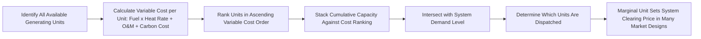

## Generation Cost Structures and Merit Order Dispatch

### Overview

Generation cost structures and merit order dispatch describe how the cost characteristics of different electricity generation technologies determine the order in which they are called upon to produce power, and how this dispatch mechanism functions as the core price-formation process in competitive wholesale electricity markets. Because electricity is non-storable and requires continuous real-time balancing between supply and demand, wholesale markets rely on merit order dispatch—ranking available generation by variable cost and calling it into service in ascending cost order until demand is met—as the fundamental short-run economic mechanism for both efficient resource allocation and price discovery.

### Generation Cost Structure Components

#### Capital, Fixed, and Variable Costs

Every generation technology can be characterized by three broad cost categories, each relevant to a different decision horizon:

| Cost Category | Nature | Relevant Decision Timeframe |
| --- | --- | --- |
| Capital cost (CapEx) | Sunk once incurred; recovered through revenue over the asset's operating life | New-build investment decision |
| Fixed operating cost | Incurred regardless of output level, but avoidable if the plant retires entirely | Long-run retention/retirement decision |
| Variable operating cost | Scales directly with output (fuel, variable O&M, applicable emissions costs) | Short-run dispatch decision |

**Key Points**

- Only variable cost is relevant to the short-run dispatch decision for an already-built plant, since capital cost is sunk and fixed costs are incurred regardless of whether the specific unit is dispatched in a given hour
- This separation is central to understanding merit order dispatch: a generator with very high capital cost but very low variable cost (e.g., nuclear, wind, solar) will be dispatched ahead of a generator with lower capital cost but higher variable cost (e.g., a gas peaking plant), even though the capital-intensive plant may have a higher total (levelized) cost per MWh over its life
- [Inference] This distinction between short-run dispatch cost and long-run total cost is frequently a source of confusion in public and policy discussion of electricity markets, since a technology can simultaneously be "cheap to run" (low variable cost, dispatched frequently) and "expensive to build" (high capital cost, requiring adequate revenue recovery mechanisms beyond energy sales alone)

#### Variable Cost Composition by Technology

| Technology | Primary Variable Cost Driver | Relative Variable Cost Level |
| --- | --- | --- |
| Wind, Solar (utility-scale) | Near-zero (no fuel cost; minimal variable O&M) | Very Low |
| Nuclear | Fuel cost (low per-MWh due to high energy density of nuclear fuel) plus variable O&M | Low |
| Coal | Fuel (coal price × heat rate) plus variable O&M plus any applicable carbon cost | Moderate-High (heat rate and coal price dependent) |
| Natural Gas Combined Cycle (CCGT) | Fuel (gas price × heat rate, generally more efficient heat rate than simple cycle) plus variable O&M | Moderate |
| Natural Gas Simple Cycle / Peakers | Fuel (gas price × heat rate, less efficient than combined cycle) plus variable O&M | High |
| Oil-fired generation | Fuel (oil product price × heat rate) plus variable O&M | Very High (in most modern contexts) |

[Inference] This ranking is illustrative and can shift depending on relative fuel prices, plant-specific heat rates and efficiency, and applicable carbon costs at any given time and location—for example, a very efficient combined cycle gas plant facing low gas prices could have lower variable cost than an older, less efficient coal plant facing higher relative coal prices, reversing the commonly assumed coal-below-gas ordering.

### The Merit Order Mechanism

#### Constructing the Merit Order Curve

The merit order is constructed by ranking all available generating units in ascending order of variable (short-run marginal) cost, then stacking their available capacity cumulatively against this cost ranking to form a step-function supply curve.

**Key Points**

- Units are dispatched in order from lowest to highest variable cost until cumulative dispatched capacity equals system demand (net of imports/exports and accounting for transmission constraints, which can create more complex, locationally-differentiated dispatch outcomes in practice)
- The **marginal unit**—the highest-cost unit needed to meet demand in a given period—is economically significant because, in many market designs (particularly uniform/marginal pricing designs common in many wholesale markets), the marginal unit's variable cost sets the market-clearing price paid to all dispatched generators in that period, not just to the marginal unit itself
- [Inference] This marginal pricing convention means that lower-cost generators (e.g., wind, nuclear, low-cost coal) earn a margin above their own variable cost whenever a higher-cost unit sets the clearing price—often referred to as **inframarginal rent**—which is a standard and expected feature of well-functioning marginal-cost electricity markets rather than an anomaly, since it provides the revenue basis through which capital-intensive, low-variable-cost generators can recover their fixed and capital costs over time

#### Illustration: The Merit Order Supply Curve (svg_diagram)

<svg xmlns="http://www.w3.org/2000/svg" viewBox="0 0 640 380">
<text x="320" y="25" text-anchor="middle" font-size="16" font-weight="bold" fill="#1a1a1a">Merit Order Supply Curve and Marginal Price (svg_diagram)</text>
<line x1="70" y1="320" x2="590" y2="320" stroke="#333" stroke-width="2" />
<line x1="70" y1="320" x2="70" y2="60" stroke="#333" stroke-width="2" />

<text x="330" y="355" text-anchor="middle" font-size="13" fill="#333">Cumulative Capacity (MW)</text>

<text x="25" y="190" text-anchor="middle" font-size="13" fill="#333" transform="rotate(-90 25 190)">Variable Cost ($/MWh)</text>

<rect x="70" y="300" width="80" height="20" fill="#27ae60" />
<text x="110" y="314" text-anchor="middle" font-size="10" fill="white">Wind/Solar</text>
<rect x="150" y="285" width="60" height="35" fill="#8e44ad" />
<text x="180" y="305" text-anchor="middle" font-size="10" fill="white">Nuclear</text>
<rect x="210" y="230" width="130" height="90" fill="#7f8c8d" />
<text x="275" y="278" text-anchor="middle" font-size="11" fill="white">Coal</text>
<rect x="340" y="180" width="120" height="140" fill="#e67e22" />
<text x="400" y="253" text-anchor="middle" font-size="11" fill="white">Gas CCGT</text>
<rect x="460" y="90" width="110" height="230" fill="#c0392b" />
<text x="515" y="213" text-anchor="middle" font-size="10" fill="white">Gas Peakers</text>
<line x1="420" y1="60" x2="420" y2="320" stroke="#2980b9" stroke-width="2" stroke-dasharray="6,4" />
<text x="425" y="75" font-size="12" fill="#2980b9" font-weight="bold">Demand</text>
<line x1="70" y1="195" x2="420" y2="195" stroke="#333" stroke-width="1.5" stroke-dasharray="3,3" />
<text x="80" y="190" font-size="11" fill="#333">Marginal Price (set by CCGT)</text>
</svg>

### Mathematical Representation

#### Dispatch Optimization Problem

At its core, merit order dispatch solves a cost-minimization problem subject to meeting demand and respecting each unit's operational constraints:

$$\min \sum_{i=1}^{n} VC_i \times Q_i$$

Subject to:

$$\sum_{i=1}^{n} Q_i = D, \quad 0 \leq Q_i \leq Capacity_i \quad \forall i$$

Where:

- $VC_i$ = variable cost of generating unit $i$
- $Q_i$ = output level of unit $i$
- $D$ = total system demand
- $Capacity_i$ = maximum available output of unit $i$

**Key Points**

- In real-world system operation, this basic formulation is substantially extended to incorporate unit commitment constraints (minimum up/down times, start-up costs, ramp rate limits), transmission network constraints (which can create locational price differences, discussed as locational marginal pricing in more advanced market design contexts), and reserve requirements for system reliability
- [Inference] These additional real-world constraints mean that actual dispatch outcomes and resulting prices can deviate from the simplified merit order curve described above, particularly during transmission congestion or when unit commitment constraints (e.g., a plant's minimum operating level once started) prevent theoretically optimal simple cost-order dispatch

### Renewables and the Shifting Merit Order

#### Zero Marginal Cost Generation and Merit Order Displacement

Wind and solar generation, once built, have effectively zero variable cost (no fuel input, minimal variable O&M), meaning they are dispatched first in the merit order whenever available, ahead of all fuel-based generation.

**Key Points**

- As renewable generation capacity has grown in many electricity systems, this has progressively displaced higher-variable-cost fossil generation (coal, and to a lesser extent gas) further down (and sometimes entirely out of) the dispatched portion of the merit order during periods of high renewable output, a phenomenon often referred to as the **merit order effect**
- [Inference] The merit order effect has been widely documented and studied as a mechanism by which increased renewable penetration tends to reduce average wholesale electricity prices during periods of high renewable output, since it shifts the marginal unit further to the left on the supply curve (toward lower-cost technologies) or reduces the overall demand-supply intersection point; however, the magnitude of this effect in any specific market and time period depends on the relative scale of renewable capacity, prevailing fossil fuel prices, and demand levels, and should not be assumed to be a fixed or universal quantitative relationship
- This same mechanism reduces the capacity factor and revenue of thermal plants (as covered in coal-fired generation economics), creating the fixed-cost recovery challenges that have contributed to accelerated retirement decisions for some higher-cost thermal units in markets with substantial renewable growth

#### Duck Curve and Net Load Dynamics

**Key Points**

- In systems with substantial solar generation specifically, the pattern of **net load** (total demand minus variable renewable generation) that thermal and dispatchable generators must serve has in many cases developed a distinctive shape—colloquially termed the "duck curve"—with a pronounced midday trough (when solar output is high) followed by a steep ramp-up requirement in the evening as solar output declines while demand remains elevated
- [Inference] This net load shape creates specific merit order and unit commitment challenges distinct from simple average merit order analysis, since dispatchable generators must be capable of rapid ramping to accommodate the steep net load increase, which can favor generation technologies (and storage) with strong ramping capability over technologies that are cost-competitive on a simple variable cost basis but have limited ramp rate flexibility

### Price Formation Under Marginal Pricing Design

#### Uniform (Marginal) Pricing vs. Pay-as-Bid

Most major competitive wholesale electricity markets use a **uniform (marginal) pricing** design, in which all dispatched generators receive the market-clearing price set by the marginal unit, rather than each generator receiving its own specific bid price (**pay-as-bid** pricing, used in some market designs or specific market segments).

**Key Points**

- Uniform marginal pricing is generally argued in the economic literature to provide better incentives for accurate cost/bid revelation by generators (since a generator's own bid does not directly determine its own revenue unless it happens to be the marginal unit), whereas pay-as-bid pricing can incentivize generators to bid strategically above their true cost, anticipating they may be paid their bid price directly
- [Inference] This theoretical efficiency argument for marginal pricing is generally accepted among energy economists, though empirical debate continues in the literature regarding the relative real-world performance of marginal versus pay-as-bid designs under various market conditions and market power scenarios, and the choice between designs remains a live policy and design question with reasonable arguments made on multiple sides depending on specific market structure and competitive conditions

### Worked Example

**Example**

A simplified electricity system has the following available generating units for a given hour, ranked by variable cost:

| Unit | Capacity (MW) | Variable Cost ($/MWh) |
| --- | --- | --- |
| Wind | 500 | $0 |
| Nuclear | 1,000 | $8 |
| Coal | 1,500 | $28 |
| Gas CCGT | 1,200 | $35 |
| Gas Peaker | 800 | $65 |

System demand for this hour: 3,800 MW

Dispatch order and cumulative capacity:

$$500 (\text{Wind}) + 1{,}000 (\text{Nuclear}) + 1{,}500 (\text{Coal}) = 3{,}000 \, \text{MW cumulative}$$

Remaining demand after wind, nuclear, and coal: $3{,}800 - 3{,}000 = 800$ MW, which must be met by the next unit in merit order (Gas CCGT), which is only partially needed (800 MW of its 1,200 MW capacity).

Since Gas CCGT is the marginal unit, the market-clearing price for this hour is $35/MWh, applied to **all** dispatched generation, including wind, nuclear, and coal.

Inframarginal rent example for the coal plant:

$$(35 - 28) \times 1{,}500 = \$10{,}500 \, \text{for this hour}$$

[Inference] This inframarginal rent, accumulated across many hours where the coal plant is dispatched below the marginal price, forms part of its contribution toward covering fixed and capital costs, illustrating why a unit's fixed cost recovery depends not just on being dispatched, but on the frequency and magnitude by which the market-clearing price exceeds its own variable cost across the hours it operates.

### Common Analytical Pitfalls

- Confusing a technology's variable (dispatch) cost with its total levelized cost, leading to incorrect conclusions about a technology's overall economic competitiveness from dispatch frequency alone
- Assuming inframarginal rent is a market inefficiency or "excess profit," when it is a standard and expected mechanism through which capital-intensive, low-variable-cost generators recover fixed and capital costs under marginal pricing design
- Applying a simplified merit order model without accounting for transmission constraints, unit commitment restrictions, and ramping requirements, which can meaningfully alter real-world dispatch and pricing outcomes from the idealized curve
- Treating the merit order effect from renewables as a fixed, universally quantifiable price reduction, when its magnitude is highly context-dependent on relative capacity mix, fuel prices, and demand conditions
- Assuming marginal pricing and pay-as-bid pricing produce economically equivalent outcomes, when they create different generator bidding incentives with potentially different efficiency and market power implications

**Related Topics**

- Locational marginal pricing and transmission congestion effects on dispatch
- Unit commitment optimization: start-up costs, ramp rates, and minimum run times
- Inframarginal rent and generator fixed-cost recovery mechanisms
- The merit order effect and empirical studies of renewable price suppression
- Duck curve dynamics and net load ramping challenges
- Capacity markets as a complement to energy-only marginal pricing markets
- Market power and strategic bidding behavior in wholesale electricity markets