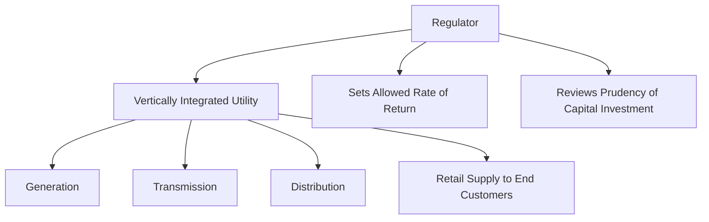
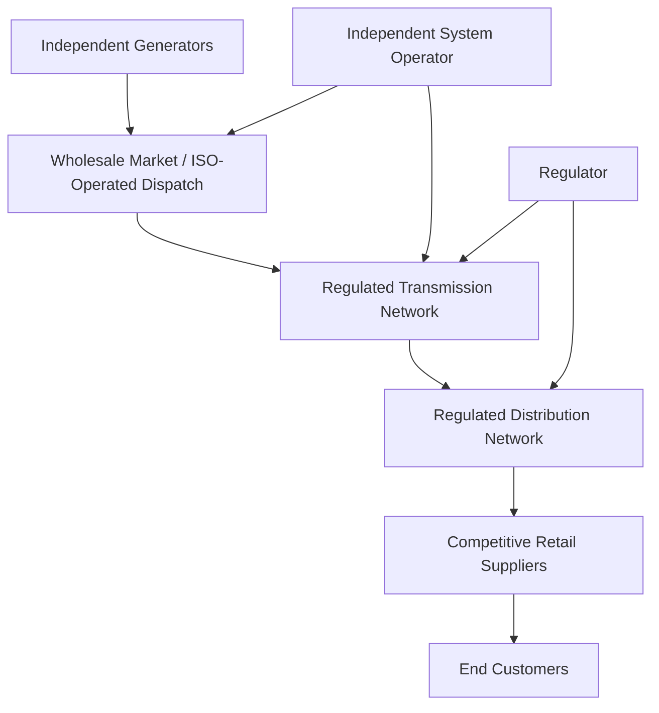

## Vertically Integrated vs Unbundled Electricity Industry Structures

### Overview

The organization of the electricity industry has historically evolved between two fundamentally different structural models: vertical integration, in which a single entity owns and controls generation, transmission, and distribution functions together, and unbundling (or restructuring/liberalization), in which these functions are separated into distinct entities, often subject to different ownership, regulatory, and competitive arrangements. This structural choice has profound implications for how electricity markets are organized, how prices are formed, how investment decisions are made, and how competition (where present) is introduced into different segments of the electricity value chain.

### The Vertically Integrated Model

#### Structure and Rationale

Under a vertically integrated structure, a single utility (whether investor-owned, government-owned, or cooperative) typically owns and operates generation, transmission, and distribution assets as an integrated whole, serving customers within a defined geographic franchise territory under a regulated monopoly framework.

**Key Points**

- The traditional economic rationale for vertical integration in electricity rests on the historical view of electricity supply (particularly transmission and distribution networks) as a **natural monopoly**—an industry where a single provider can serve the market at lower total cost than multiple competing providers, due to substantial economies of scale and the impracticality/inefficiency of duplicating physical network infrastructure
- Under this model, the utility typically earns a regulated rate of return on its capital investment (a **cost-of-service** or **rate-of-return regulation** framework), with prices to end consumers set by a regulatory body to allow recovery of prudently incurred costs plus an allowed return on invested capital
- [Inference] Vertical integration under rate-of-return regulation was the dominant global electricity industry structure for most of the 20th century, reflecting both the natural monopoly characteristics of network infrastructure and, in many cases, a policy view that centralized planning and integrated resource management by a single regulated entity could better ensure reliable, universally accessible electricity service, particularly during the period of rapid electrification and grid buildout

#### Illustration: Vertically Integrated Utility Structure

#### Cost-of-Service Regulation Mechanics

$$\text{Allowed Revenue} = \text{Operating Costs} + (\text{Rate Base} \times \text{Allowed Rate of Return})$$

Where the **rate base** represents the utility's regulator-approved invested capital (net of depreciation), and the allowed rate of return is set to approximate the utility's weighted average cost of capital, providing a mechanism for capital cost recovery under integrated monopoly regulation.

**Key Points**

- This regulatory framework has been noted in the economic literature for creating potential incentive effects—sometimes termed the **Averch-Johnson effect**—where a regulated utility guaranteed a return on capital investment may have an incentive to over-invest in capital assets (rate base) relative to what a purely cost-minimizing firm would choose, since capital investment directly increases the allowed revenue base
- [Inference] Concerns about this and related potential inefficiencies of cost-of-service regulation (including limited direct incentive for cost minimization, since costs are generally passed through to allowed revenue) were among the theoretical motivations cited in the broader policy movement toward electricity industry restructuring and unbundling in many jurisdictions beginning primarily in the 1990s

### The Unbundled (Restructured) Model

#### Structural Separation of Functions

Unbundling separates the electricity value chain into distinct functional and often distinct ownership segments:

| Segment | Typical Post-Unbundling Structure |
| --- | --- |
| Generation | Often opened to competition among multiple independent generating companies, competing in wholesale markets |
| Transmission | Typically remains a regulated monopoly (natural monopoly characteristics persist for high-voltage transmission networks), often operated by an independent entity separate from generation/retail interests |
| System operation | Often assigned to an independent system operator (ISO) or transmission system operator (TSO), responsible for real-time dispatch coordination and market operation, structurally separated from generation ownership to avoid conflicts of interest |
| Distribution | Typically remains a regulated monopoly at the local level (similar natural monopoly logic to transmission), though ownership/operation may or may not be separated from retail supply depending on jurisdiction |
| Retail supply | Often opened to competition, allowing multiple retail suppliers to compete for end-customer contracts, particularly for larger commercial/industrial customers, and in some jurisdictions extended to residential customers as well |

#### Illustration: Unbundled Industry Structure

#### Economic Rationale for Unbundling

**Key Points**

- The core economic argument for unbundling generation and retail supply rests on the view that these segments do **not** share the natural monopoly characteristics of transmission and distribution networks—multiple generators can competitively supply the same market, and multiple retailers can competitively serve the same customer base, without the physical duplication inefficiency that would apply to competing transmission or distribution wires
- Introducing competition in generation and retail supply is argued to create incentives for cost minimization, innovation, and more efficient price discovery (via the merit order dispatch mechanism, as covered separately) than would occur under integrated monopoly cost-of-service regulation
- Structural separation of system operation from generation ownership (via an independent system operator) is intended to prevent a scenario where a vertically integrated utility with both generation and grid operation roles could favor its own generation assets in dispatch or grid access decisions, a potential conflict of interest that unbundling is specifically designed to address
- [Inference] The empirical evidence on whether unbundling and competitive restructuring have delivered the anticipated efficiency and consumer price benefits is mixed and has been the subject of extensive academic and policy debate, with outcomes varying considerably by jurisdiction, market design details, and the specific competitive conditions (e.g., degree of market concentration among generators) that emerged following restructuring—this remains an active area of empirical research rather than a settled consensus

### Degrees and Variants of Unbundling

#### Full vs. Partial Unbundling

Unbundling is not a binary choice but exists along a spectrum, and jurisdictions have adopted varying degrees and combinations of structural separation:

| Unbundling Type | Description |
| --- | --- |
| Accounting/functional unbundling | Separate accounting and management reporting for different functions, but retained common ownership |
| Legal unbundling | Functions organized as separate legal entities, but potentially still under common parent ownership |
| Ownership unbundling | Full separation of ownership, particularly separating transmission network ownership from generation/retail interests |
| Full retail competition | Extension of competitive supply to residential and small commercial customers, not just larger industrial/commercial users |

[Unverified] The specific degree of unbundling adopted, and whether generation, transmission, distribution, and retail are fully or partially separated, varies enormously by jurisdiction and has evolved over time in many markets, so any characterization of a specific country or region's current structure should be verified against current, jurisdiction-specific regulatory information rather than assumed from a generic restructuring narrative.

### Comparative Trade-offs

#### Key Structural Trade-offs Between Models

**Key Points**

- **Investment coordination**: Vertical integration can, in principle, better coordinate generation and network investment planning (since a single entity plans across the full value chain), whereas unbundled structures rely on price signals and often separate regulatory/planning processes to coordinate investment across independently-owned generation, transmission, and distribution segments, which [Inference] can introduce coordination challenges (e.g., ensuring adequate transmission capacity is built to connect new generation, or ensuring adequate generation investment materializes to meet reliability needs) that vertically integrated planning does not face in the same form, though unbundled markets have developed various mechanisms (capacity markets, transmission planning processes) intended to address these coordination challenges
- **Cost discovery and efficiency incentives**: Unbundled, competitive generation and retail segments are generally argued to provide stronger ongoing incentives for cost minimization and innovation than cost-of-service-regulated integrated utilities, though [Inference] this efficiency benefit depends significantly on genuine competitive conditions being present (sufficient number of independent competitors, effective market monitoring against market power exercise) rather than being automatic upon restructuring
- **Regulatory complexity**: Unbundled structures generally require more complex regulatory oversight (separate regulation of natural monopoly transmission/distribution segments, market monitoring for competitive generation/retail segments, coordination between system operator functions and market participants) compared to the more unified (though not necessarily simpler) regulatory relationship in a vertically integrated cost-of-service model
- **Risk allocation**: Vertically integrated utilities under cost-of-service regulation generally bear less market price risk (costs are passed through to regulated rates, subject to prudency review), while unbundled generators operating in competitive wholesale markets bear direct market price risk, which [Inference] has implications for the financing and risk premium associated with generation investment under each model, and has been cited as a factor in some jurisdictions' experience with reduced merchant (unregulated) generation investment during periods of low or volatile wholesale prices

#### Illustration: Trade-off Comparison (svg_diagram)

<svg xmlns="http://www.w3.org/2000/svg" viewBox="0 0 640 380">
<text x="320" y="25" text-anchor="middle" font-size="16" font-weight="bold" fill="#1a1a1a">Vertically Integrated vs Unbundled Trade-offs (svg_diagram)</text>
<rect x="60" y="60" width="250" height="280" rx="10" fill="none" stroke="#2980b9" stroke-width="2" />
<text x="185" y="90" text-anchor="middle" font-size="14" font-weight="bold" fill="#2980b9">Vertically Integrated</text>
<text x="80" y="125" font-size="12" fill="#333">+ Coordinated investment planning</text>
<text x="80" y="150" font-size="12" fill="#333">+ Lower market price risk to utility</text>
<text x="80" y="175" font-size="12" fill="#333">+ Simpler regulatory relationship</text>
<text x="80" y="210" font-size="12" fill="#333">- Weaker cost-minimization incentive</text>
<text x="80" y="235" font-size="12" fill="#333">- Potential capital over-investment bias</text>
<text x="80" y="260" font-size="12" fill="#333">- No competitive price discovery</text>
<rect x="330" y="60" width="250" height="280" rx="10" fill="none" stroke="#c0392b" stroke-width="2" />
<text x="455" y="90" text-anchor="middle" font-size="14" font-weight="bold" fill="#c0392b">Unbundled</text>
<text x="350" y="125" font-size="12" fill="#333">+ Competitive cost discovery</text>
<text x="350" y="150" font-size="12" fill="#333">+ Reduced conflict of interest in dispatch</text>
<text x="350" y="175" font-size="12" fill="#333">+ Market-based price signals</text>
<text x="350" y="210" font-size="12" fill="#333">- Investment coordination challenges</text>
<text x="350" y="235" font-size="12" fill="#333">- More complex regulatory oversight</text>
<text x="350" y="260" font-size="12" fill="#333">- Market price risk to generators</text>
</svg>

### Hybrid and Evolving Structures

**Key Points**

- Many jurisdictions have adopted hybrid arrangements rather than pure vertical integration or pure unbundling—for example, retaining vertically integrated utility structures in some regions/states while operating competitive wholesale generation markets in others, or unbundling generation and retail while a regulated distribution utility retains a "provider of last resort" retail supply role alongside competitive retail suppliers
- [Inference] The introduction of capacity markets, resource adequacy mechanisms, and other administrative constructs in many unbundled markets can be understood partly as policy responses intended to address investment coordination and reliability concerns that arise more readily under unbundled structures than under integrated planning, representing an evolution of unbundled market design over time rather than a static endpoint reached once restructuring occurs
- [Unverified] The trend and pace of further restructuring, re-regulation, or reversion toward more integrated planning approaches varies by jurisdiction and is subject to ongoing policy debate in a number of markets, particularly in the context of energy transition planning needs, and should not be assumed to follow a single consistent global trajectory

### Worked Example

**Example**

Consider two hypothetical jurisdictions building an equivalent amount of new generation capacity:

**Jurisdiction A (Vertically Integrated, Cost-of-Service Regulated)**: The incumbent utility proposes a new generation plant to its regulator, demonstrating the investment is prudent and needed to meet forecast demand. Once approved, the plant is added to the utility's rate base, and its cost (plus allowed return) is recovered through regulated rates charged to captive customers within the utility's franchise territory, largely independent of wholesale market price conditions.

**Jurisdiction B (Unbundled, Competitive Generation)**: An independent power producer evaluates building the same plant based on its expectation of future wholesale market prices, potential capacity market revenue (if such a mechanism exists in that market), and its assessment of competitive risk from other potential entrants. The plant is built only if the developer's own risk-adjusted return expectations are met based on projected market revenue, without a comparable guaranteed cost-of-service recovery mechanism.

[Inference] This comparison illustrates a fundamental difference in investment risk allocation: in Jurisdiction A, investment risk (whether the plant proves to be needed and cost-effective) is substantially borne by captive ratepayers through the regulatory prudency review process, while in Jurisdiction B, that same risk is borne primarily by the private investor/developer, who may respond by requiring a higher expected return to compensate for the additional market risk, or by delaying investment until market price signals are judged sufficiently favorable—a difference with real implications for the pace, timing, and risk-adjusted cost of new generation capacity development under each structural model.

### Common Analytical Pitfalls

- Treating vertical integration and unbundling as a strict binary, when most real-world jurisdictions exhibit hybrid or partial arrangements along a spectrum of possible structures
- Assuming unbundling automatically delivers competitive efficiency benefits, when the realization of such benefits depends significantly on the specific competitive conditions and market design details implemented, not merely on the act of structural separation itself
- Overlooking those investment coordination and reliability mechanisms (capacity markets, resource adequacy requirements) that many unbundled markets have developed specifically to address challenges that vertically integrated planning does not face in the same form
- Assuming the historical shift toward unbundling represents a settled, universally superior structural endpoint, when significant academic and policy debate persists regarding the comparative merits of each model under different market conditions and policy objectives

**Related Topics**

- Rate-of-service regulation mechanics and the Averch-Johnson effect
- Independent system operator (ISO) and transmission system operator (TSO) functions
- Capacity markets and resource adequacy mechanisms as investment coordination tools
- Retail electricity competition and provider-of-last-resort obligations
- Transmission planning and investment coordination in unbundled markets
- Market power monitoring and mitigation in competitive generation markets
- Merit order dispatch and wholesale price formation under competitive market structures