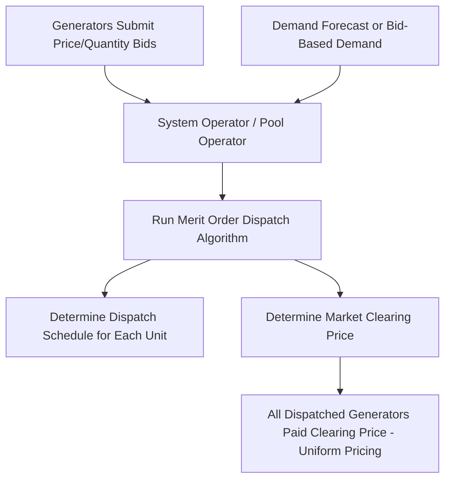
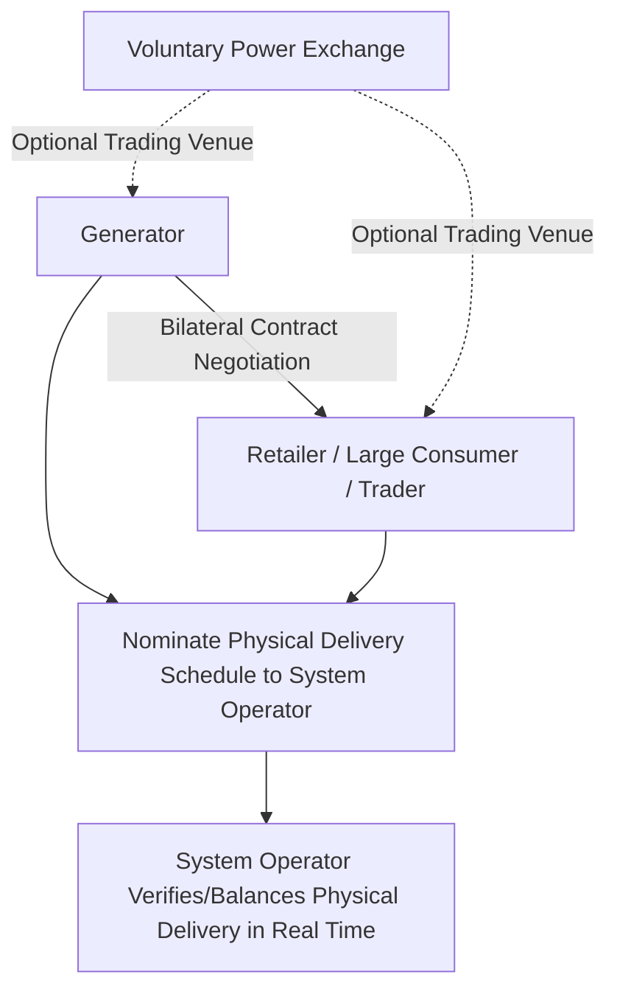

## Wholesale Electricity Market Design: Pools and Bilateral Markets

### Overview

Wholesale electricity market design concerns the institutional and transactional frameworks through which electricity generation is bought and sold at the wholesale level, prior to distribution and retail sale to end consumers. Two broad organizing models have emerged internationally: **pool-based markets** (also called mandatory or centralized pools), in which generation is centrally dispatched and priced through a system operator-run auction mechanism, and **bilateral markets**, in which buyers and sellers negotiate and contract directly (or through decentralized exchanges) without a mandatory centralized dispatch mechanism. Most real-world electricity markets today combine elements of both approaches, but understanding the pure forms of each model clarifies the underlying design trade-offs.

### The Pool Model

#### Structure and Mechanics

In a pool-based market, generators submit bids (typically specifying quantity and price) to a central market operator, which uses these bids—together with a demand forecast or bid-based demand—to determine the least-cost dispatch order via the merit order mechanism, and to establish a market-clearing price for each settlement period (commonly hourly or sub-hourly, such as five-minute intervals).

**Key Points**

- Participation in a mandatory pool is typically compulsory for generators above a certain size threshold within the relevant jurisdiction—all such generation must be bid into and dispatched through the pool, rather than allowing generators to bypass the pool via private bilateral arrangements for physical delivery
- The pool operator is generally the same entity (or closely coordinated with the entity) responsible for real-time system operation, since the dispatch decision and the pricing outcome are directly linked in this model
- Settlement in a pool occurs against the pool price: generators are paid the market-clearing price for their dispatched output, and load-serving entities/retailers pay the market-clearing price for their metered consumption, though many participants also use separate financial hedging contracts (discussed below) to manage their exposure to pool price volatility

#### Advantages Attributed to the Pool Model

**Key Points**

- Centralized, transparent price discovery: the pool price is a single, publicly observable reference price for each settlement period, providing a clear market signal and reducing information asymmetry compared to a purely bilateral, potentially opaque negotiation process
- Direct integration with physical dispatch: because the pool operator simultaneously determines dispatch and price, there is less risk of a mismatch between commercial transactions and physical grid operation needs compared to models where commercial trading and physical dispatch are more loosely coupled
- [Inference] The centralized bidding and dispatch process can, in principle, more readily incorporate complex technical constraints (unit commitment costs, ramp rates, transmission limits) into the price formation process itself, since the same entity managing physical dispatch is also determining the price, potentially producing prices that more accurately reflect real-time system conditions than a purely bilaterally-negotiated price might

### The Bilateral Market Model

#### Structure and Mechanics

In a purely bilateral market structure, generators and buyers (retailers, large consumers, or traders) negotiate contracts directly (over-the-counter) or through a voluntary power exchange, specifying quantity, price, and delivery terms without a mandatory centralized bidding/dispatch auction determining the transaction price.

**Key Points**

- Bilateral contracts specify commercial terms independently, but physical delivery must still ultimately be scheduled and coordinated with the system operator to ensure actual grid balance—the commercial transaction and the physical dispatch coordination are more separated in this model than in a pool
- A **balancing market** or **real-time imbalance settlement** mechanism is still generally required even in predominantly bilateral market designs, to reconcile the difference between contracted/scheduled positions and actual real-time delivery, since imperfect forecasting and unexpected events will inevitably create deviations from bilaterally scheduled positions that must be resolved to maintain instantaneous physical balance
- [Inference] This means that even markets characterized as "bilateral" in their primary commercial trading structure still require a residual centralized balancing mechanism, since the instantaneity requirement discussed in electricity's unique physical properties cannot be avoided regardless of how the underlying commercial contracting is organized

#### Advantages Attributed to the Bilateral Model

**Key Points**

- Contracting flexibility: parties can negotiate customized contract terms (duration, quantity profiles, pricing formulas, risk-sharing arrangements) tailored to their specific needs, rather than being limited to the standardized products and settlement periods of a centralized pool
- Reduced reliance on a single centralized price-setting mechanism: proponents argue this can reduce certain forms of market power concern associated with concentrated influence over a single mandatory clearing price, though [Inference] bilateral markets can face their own distinct market power and transparency concerns (e.g., reduced price transparency in privately negotiated contracts, potential for market concentration among a small number of large bilateral counterparties), so this comparative advantage is contested rather than a clear-cut general conclusion
- Greater alignment with general commodity trading practice: bilateral trading structures are more similar to trading conventions common in other commodity markets (oil, gas, metals), which [Inference] may offer some familiarity advantage for market participants and traders already active in other commodity markets, though this is a practical/institutional consideration rather than a fundamental economic efficiency argument

### Comparative Framework

#### Illustration: Pool vs. Bilateral Structural Comparison (svg_diagram)

<svg xmlns="http://www.w3.org/2000/svg" viewBox="0 0 640 380">
<text x="320" y="25" text-anchor="middle" font-size="16" font-weight="bold" fill="#1a1a1a">Pool vs Bilateral Market Structures (svg_diagram)</text>
<rect x="60" y="60" width="250" height="280" rx="10" fill="none" stroke="#2980b9" stroke-width="2" />
<text x="185" y="90" text-anchor="middle" font-size="14" font-weight="bold" fill="#2980b9">Pool Model</text>
<text x="80" y="125" font-size="12" fill="#333">+ Centralized transparent pricing</text>
<text x="80" y="150" font-size="12" fill="#333">+ Tight dispatch-price linkage</text>
<text x="80" y="175" font-size="12" fill="#333">+ Incorporates technical constraints</text>
<text x="80" y="210" font-size="12" fill="#333">- Standardized product/timing</text>
<text x="80" y="235" font-size="12" fill="#333">- Mandatory participation typical</text>
<text x="80" y="260" font-size="12" fill="#333">- Single clearing price power concern</text>
<rect x="330" y="60" width="250" height="280" rx="10" fill="none" stroke="#c0392b" stroke-width="2" />
<text x="455" y="90" text-anchor="middle" font-size="14" font-weight="bold" fill="#c0392b">Bilateral Model</text>
<text x="350" y="125" font-size="12" fill="#333">+ Custom contract flexibility</text>
<text x="350" y="150" font-size="12" fill="#333">+ Familiar commodity trading form</text>
<text x="350" y="175" font-size="12" fill="#333">+ Diversified counterparty risk</text>
<text x="350" y="210" font-size="12" fill="#333">- Reduced price transparency</text>
<text x="350" y="235" font-size="12" fill="#333">- Still needs balancing mechanism</text>
<text x="350" y="260" font-size="12" fill="#333">- Looser dispatch-commercial link</text>
</svg>

### Financial Hedging Layered on Physical Market Structure

#### Contracts for Differences and Financial Transmission Rights

Regardless of whether the underlying physical market is organized as a pool or bilateral structure, market participants commonly use financial contracts to hedge exposure to the volatile spot/pool price:

**Key Points**

- A **Contract for Differences (CfD)** is a financial arrangement in which two parties agree on a fixed ("strike") price for a given quantity of electricity; if the spot/pool price is below the strike price, one party compensates the other for the difference, and vice versa, without necessarily involving physical delivery under the CfD itself (physical delivery still occurs through the underlying pool or bilateral physical arrangement)
- **Financial Transmission Rights (FTRs)**, relevant particularly in markets with locational marginal pricing, allow participants to hedge against price differences between locations arising from transmission congestion, a risk that exists in both pool and bilateral market structures where locational pricing is used
- [Inference] This layering of financial hedging instruments over the underlying physical market structure means that, in practice, most participants in either pool or bilateral markets are not simply exposed to raw, unhedged spot price volatility, but manage this exposure through a combination of forward contracts, CfDs, and other financial instruments—meaning the practical risk experience of market participants often depends as much on the depth and liquidity of available financial hedging markets as on the underlying physical market structure itself

### Hybrid Real-World Market Designs

#### The Common Contemporary Pattern

**Key Points**

- Most major contemporary wholesale electricity markets combine elements of both models: a **day-ahead market** (often pool-like, with centralized bid-based clearing) that establishes scheduled positions and a reference price, paired with **bilateral forward and futures contracting** that allows participants to hedge and manage risk ahead of the day-ahead timeframe, and a **real-time/balancing market** that reconciles actual physical delivery against scheduled positions
- [Inference] This hybrid pattern reflects a practical convergence in market design: pure mandatory pool models faced criticism in some jurisdictions for limiting contracting flexibility and being potentially more susceptible to certain forms of market power exercise over the single clearing price, while pure bilateral models still require centralized real-time balancing given electricity's physical instantaneity requirement—leading most market designers toward combining centralized day-ahead/real-time price discovery with voluntary bilateral/forward contracting layered on top
- [Unverified] The specific balance and terminology used to describe a given jurisdiction's market design (whether it is characterized primarily as a "pool," a "bilateral market with balancing," or a specific named hybrid model) varies by region and evolves over time with market reforms, so current jurisdiction-specific market design details should be verified against up-to-date regulatory/market operator documentation rather than assumed from historical characterizations

### Worked Example

**Example**

Consider a retailer serving a fixed load obligation of 500 MW for a given hour, operating in a hybrid market design:

**Bilateral forward position**: The retailer has previously contracted 400 MW bilaterally at a fixed price of $40/MWh for delivery in this hour, hedging most of its expected load.

**Day-ahead/real-time exposure**: The remaining 100 MW must be purchased at the prevailing day-ahead or real-time pool price, which clears at $55/MWh for this hour due to higher-than-forecast system demand.

Total cost for this hour:

$$(400 \times 40) + (100 \times 55) = 16{,}000 + 5{,}500 = \$21{,}500$$

Effective blended price per MWh:

$$\frac{21{,}500}{500} = \$43/\text{MWh}$$

[Inference] This example illustrates how the bilateral forward contract effectively dampens the retailer's exposure to the pool price spike in this hour, since only the unhedged 100 MW portion is exposed to the higher $55/MWh pool price, while the hedged 400 MW remains locked in at the previously agreed $40/MWh—demonstrating the practical risk management function that bilateral/forward contracting provides even within a market design that also relies on a centralized pool-like mechanism for price discovery and physical balancing.

### Common Analytical Pitfalls

- Treating "pool" and "bilateral" as mutually exclusive market designs, when most real-world electricity markets combine elements of both, typically through a day-ahead/real-time centralized mechanism layered with voluntary bilateral forward contracting
- Assuming a purely bilateral market structure eliminates the need for centralized coordination, when the physical instantaneity requirement of electricity still necessitates a real-time balancing mechanism regardless of how commercial contracting is organized
- Confusing the physical delivery/dispatch mechanism with financial hedging instruments (CfDs, forward contracts), which can be layered on top of either a pool or bilateral physical market structure and serve a distinct risk management function
- Assuming market design choice (pool vs. bilateral) alone determines the degree of price transparency or market power risk, when both models face their own distinct forms of these concerns that depend significantly on specific market rules and competitive structure, not solely on the pool/bilateral distinction itself

**Related Topics**

- Day-ahead and real-time market structures and their settlement mechanics
- Contracts for Differences (CfDs) and forward contracting for electricity price risk management
- Financial Transmission Rights and locational price risk hedging
- Merit order dispatch and marginal price formation mechanisms
- Market power monitoring and mitigation in wholesale electricity markets
- Balancing market design and real-time imbalance settlement
- Retail electricity procurement strategies and load-serving entity risk management