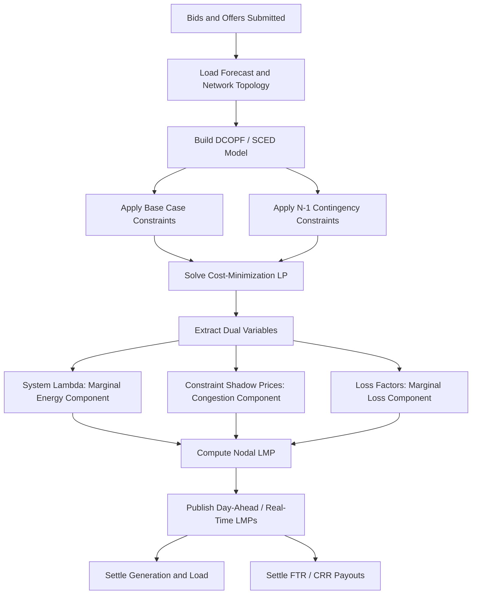

## Locational Marginal Pricing and Transmission Constraints

### Definition and Conceptual Foundation

Locational Marginal Pricing (LMP) is the pricing methodology used in organized wholesale electricity markets to value electric energy at specific locations (nodes) on the transmission network. The LMP at a given node represents the marginal cost of supplying the next increment of electricity demand at that location, accounting for generation marginal costs, transmission losses, and transmission congestion.

Formally, the LMP at node $i$ is decomposed into three additive components:

$$LMP_i = MEC + MLC_i + MCC_i$$

Where:

- $MEC$ (Marginal Energy Component) — the system-wide marginal cost of energy, typically referenced to a hub or the marginal unit at the reference bus
- $MLC_i$ (Marginal Loss Component) — the cost attributable to marginal transmission losses at node $i$ relative to the reference bus
- $MCC_i$ (Marginal Congestion Component) — the cost attributable to binding transmission constraints between node $i$ and the reference bus

This decomposition is standard across all U.S. Independent System Operators (ISOs) and Regional Transmission Organizations (RTOs) that use LMP-based markets, including PJM, MISO, ERCOT, CAISO, ISO-NE, NYISO, and SPP.

### Economic Rationale

In a network with no transmission constraints and no losses, a single system-wide marginal price would clear the market, consistent with a copper-plate model of the grid. Real transmission networks, however, have finite thermal, voltage, and stability limits on specific lines and interfaces. When the least-cost dispatch to meet demand would violate one or more of these limits, the system operator must re-dispatch generation — calling on more expensive generators on one side of the constraint and backing down cheaper generators on the other side. This re-dispatch causes prices to diverge across locations, and the LMP framework captures that divergence transparently, giving market participants accurate locational price signals for both short-run dispatch decisions and long-run investment (generation siting, transmission expansion, demand response location).

### Mathematical Formulation: The DC Optimal Power Flow (DCOPF)

LMPs are computed as the shadow prices (dual variables) of the energy balance and transmission constraints in a security-constrained economic dispatch (SCED) problem. Most ISOs use a DC power flow approximation for computational tractability in real-time and day-ahead markets, given the scale of the network (thousands of nodes, tens of thousands of constraints solved every 5 minutes in real-time markets).

**Primal problem** (cost minimization):

$$\min \sum_{g} C_g(P_g)$$

Subject to:

$$\sum_{g} P_g - \sum_{d} P_d = 0 \quad (\lambda)$$

$$\sum_{g} GSF_{g,k} \cdot P_g - \sum_{d} GSF_{d,k} \cdot P_d \leq F_k^{max} \quad (\mu_k), \quad \forall k \in K$$

$$P_g^{min} \leq P_g \leq P_g^{max}$$

Where:

- $C_g(P_g)$ is the cost function of generator $g$
- $\lambda$ is the dual variable (shadow price) on the system energy balance constraint — the Marginal Energy Component
- $GSF_{g,k}$ is the Generation Shift Factor (also called Power Transfer Distribution Factor, PTDF) representing the fraction of an injection at bus $g$ that flows over constrained facility $k$
- $F_k^{max}$ is the thermal or operational limit on facility $k$
- $\mu_k \geq 0$ is the shadow price (Lagrange multiplier) on binding constraint $k$ — non-zero only when the constraint binds

**LMP at bus $i$** derived from the dual solution:

$$LMP_i = \lambda - \sum_{k \in K} GSF_{i,k} \cdot \mu_k$$

(This form typically already nets out losses through a separate loss-factor term, $\lambda \cdot DF_i$, in production market implementations; the simplified formula above isolates the congestion effect for pedagogical clarity.)

**Full production form including losses:**

$$LMP_i = \lambda \cdot (1 + DF_i) - \sum_{k \in K} GSF_{i,k} \cdot \mu_k$$

Where $DF_i$ is the marginal loss factor at bus $i$, the partial derivative of system losses with respect to injection at bus $i$.

### Generation Shift Factors (GSFs / PTDFs)

GSFs quantify how a 1 MW injection at a source bus and withdrawal at a reference (slack) bus changes flow on a given transmission element. They are derived from the network's admittance matrix (susceptance matrix in the DC approximation) and are central to both LMP calculation and to congestion management (e.g., PJM's use of GSFs in Flowgate-based Financial Transmission Rights).

$$GSF_{i,k} = \frac{\partial f_k}{\partial P_i}$$

GSFs are linear in the DC approximation, which is why DCOPF is tractable at the scale required for 5-minute real-time dispatch across large interconnections. Full AC power flow (accounting for reactive power, voltage magnitude constraints, and true line losses) is used for reliability studies and some regional markets' loss calculations, but the DC approximation dominates real-time LMP computation due to its convex, linear structure.

### Congestion and Its Price Signal

Congestion arises when the unconstrained economic dispatch would cause a flow on some transmission element $k$ to exceed $F_k^{max}$. The system operator must then deviate from the least-cost dispatch, and the marginal cost of that deviation — the shadow price $\mu_k$ — is embedded in the LMPs of every bus with a non-zero GSF relative to that constraint.

**Key properties:**

- If a constraint is non-binding, $\mu_k = 0$ and it contributes nothing to any nodal price.
- If binding, $\mu_k > 0$, and LMP differences between two nodes reflect the cost of congestion between them along the relevant paths.
- Congestion revenue (also called the "congestion rent") is captured by the market operator as the difference between what load pays and what generation is paid:

$$CongestionRevenue = \sum_{d} LMP_d \cdot P_d - \sum_{g} LMP_g \cdot P_g$$

This revenue is typically redistributed to Financial Transmission Rights (FTR) or Transmission Congestion Rights (TCR) holders, which are financial instruments allowing market participants to hedge locational basis risk.

### Illustrative Example: Two-Bus Constrained System

Consider a simplified two-bus system connected by a single transmission line with a 100 MW limit.

- **Bus A**: Cheap generator, marginal cost $20/MWh, 300 MW available
- **Bus B**: Expensive generator, marginal cost $50/MWh, 300 MW available
- **Load**: 200 MW at Bus B, 0 MW at Bus A
- **Line limit (A→B)**: 100 MW

**Unconstrained dispatch** would call 200 MW from Bus A (cheapest) to serve the 200 MW load at Bus B, requiring 200 MW to flow over the line — infeasible given the 100 MW limit.

**Constrained (actual) dispatch:**

- Bus A generator dispatched at 100 MW (limited by the line)
- Bus B generator dispatched at 100 MW (makes up the shortfall)

**Resulting LMPs:**

- $LMP_A = \$20/MWh$ (Bus A's generator remains marginal and unconstrained locally)
- $LMP_B = \$50/MWh$ (Bus B's expensive generator is now marginal to serve the last MW of local load)

**Congestion component** on the line: $MCC = LMP_B - LMP_A = \$30/MWh$, exactly the shadow price of the binding 100 MW limit.

**Congestion revenue collected:** $(\$50 - \$20) \times 100\text{ MW} = \$3{,}000/hr$, which funds FTR payouts for holders of A→B transmission rights.

### Visualizing the Two-Bus Constrained Dispatch

<svg xmlns="http://www.w3.org/2000/svg" viewBox="0 0 700 320" font-family="Arial, sans-serif">
<text x="350" y="25" text-anchor="middle" font-size="16" font-weight="bold">Two-Bus LMP Example Under Binding Transmission Constraint (svg_diagram)</text>

<circle cx="150" cy="160" r="55" fill="#dceefb" stroke="#2b7cb0" stroke-width="2" />
<text x="150" y="150" text-anchor="middle" font-size="14" font-weight="bold">Bus A</text>
<text x="150" y="168" text-anchor="middle" font-size="12">Gen: \$20/MWh</text>
<text x="150" y="184" text-anchor="middle" font-size="12">Dispatch: 100 MW</text>

<circle cx="550" cy="160" r="55" fill="#fbe3dc" stroke="#c1440e" stroke-width="2" />
<text x="550" y="150" text-anchor="middle" font-size="14" font-weight="bold">Bus B</text>
<text x="550" y="168" text-anchor="middle" font-size="12">Gen: \$50/MWh</text>
<text x="550" y="184" text-anchor="middle" font-size="12">Dispatch: 100 MW</text>

<line x1="205" y1="160" x2="495" y2="160" stroke="#444" stroke-width="4" />
<text x="350" y="140" text-anchor="middle" font-size="12" fill="#b00000" font-weight="bold">Line limit: 100 MW (BINDING)</text>
<polygon points="480,153 500,160 480,167" fill="#444" />

<rect x="510" y="230" width="80" height="40" fill="#eee" stroke="#333" stroke-width="1.5" />
<text x="550" y="255" text-anchor="middle" font-size="12">Load: 200 MW</text>
<line x1="550" y1="215" x2="550" y2="230" stroke="#333" stroke-width="2" />

<rect x="90" y="230" width="120" height="55" fill="#fffbe0" stroke="#c9a227" stroke-width="1.5" />
<text x="150" y="250" text-anchor="middle" font-size="13" font-weight="bold">LMP_A = \$20/MWh</text>
<text x="150" y="268" text-anchor="middle" font-size="11">MCC = \$0</text>
<rect x="490" y="55" width="140" height="55" fill="#fffbe0" stroke="#c9a227" stroke-width="1.5" />
<text x="560" y="75" text-anchor="middle" font-size="13" font-weight="bold">LMP_B = \$50/MWh</text>
<text x="560" y="93" text-anchor="middle" font-size="11">MCC = \$30/MWh</text>
</svg>

### Financial Transmission Rights (FTRs) and Congestion Hedging

Because LMP differences between locations create basis risk for market participants (a generator selling at Bus A while serving load at Bus B is exposed to the $LMP_B - LMP_A$ spread), ISOs issue FTRs (PJM, MISO, ISO-NE, NYISO terminology) or TCRs (ERCOT terminology) or CRRs (Congestion Revenue Rights, CAISO terminology). These are financial instruments, settled based on day-ahead LMP differences between a source and sink node, that pay the holder the congestion price difference for a defined path and time period, regardless of physical energy flow.

$$FTR\ Payout = (LMP_{sink} - LMP_{source}) \times MW\ Quantity$$

FTRs are typically allocated through:

- **Auction Revenue Rights (ARRs)** for load-serving entities based on historical usage, convertible to FTRs
- **Centralized FTR auctions** (monthly and annual, in most RTOs) where any market participant may bid

A critical revenue-adequacy property: total FTR payouts are only guaranteed to be fully covered by actual congestion revenue if the FTR portfolio is "feasible" relative to the transmission network's simultaneous capability — this is why ISOs run Simultaneous Feasibility Tests (SFTs) before awarding FTRs.

### Loss Components and Marginal Loss Pricing

Transmission losses are a nonlinear (approximately quadratic) function of line flows, but most production LMP engines linearize losses around the current operating point for tractability within the DCOPF/SCED framework. The marginal loss component reflects that injecting power at a location electrically distant from load centers incurs a higher marginal loss cost than injecting near load.

$$MLC_i = \lambda \cdot DF_i$$

where $DF_i = \frac{\partial Losses}{\partial P_i}$

**Important distinction:** Marginal losses (used in LMP) differ from average losses. Since losses are quadratic in flow, the marginal loss factor is approximately twice the average loss factor at the same operating point — a frequently tested conceptual point in market design and settlement analysis. [Inference: exact ratio depends on the specific loss curve shape and topology; the "roughly 2x" relationship holds for a simple resistive line under a quadratic loss approximation but is not a universal constant across all network configurations.]

### Contingency Analysis and Security-Constrained Dispatch

Real-time LMP calculation is not based solely on the current (base case) network topology. ISOs run **Security-Constrained Economic Dispatch (SCED)**, which incorporates a set of contingencies (N-1 or, in some cases, N-1-1) — the loss of any single major transmission element or generator — and ensures the dispatch solution remains feasible even if that contingency occurs. This means constraints can bind not because of an actual current overload, but because of a *potential post-contingency* overload, a practice generally referred to as contingency-constrained or "SCED with security constraints." This significantly increases the number of constraints (and therefore potential congestion price components) relevant to the LMP calculation — often by one to two orders of magnitude relative to base-case-only constraints, since each monitored element must be checked against many contingency scenarios. [Inference: exact scaling factor is system- and ISO-specific and depends on network topology and the contingency list maintained by that operator.]

### Mermaid Diagram: LMP Calculation Workflow

### Regional Implementation Differences

| ISO/RTO | LMP Nodes (approx.) | Loss Treatment | Congestion Hedge Instrument | Dispatch Interval |
| --- | --- | --- | --- | --- |
| PJM | ~10,000+ pricing nodes | Marginal losses embedded | FTR | 5 min (RT) |
| MISO | ~40,000+ nodes | Marginal losses embedded | FTR | 5 min (RT) |
| ERCOT | ~4,000+ settlement points | Distributed loss factors (historically); marginal-loss transition ongoing | CRR/TCR | 5 min (RT) |
| CAISO | ~5,000+ nodes | Marginal losses embedded | CRR | 5 min (RT) |
| ISO-NE | ~1,000+ nodes | Marginal losses embedded | FTR | 5 min (RT) |
| NYISO | ~500+ zones/nodes (zonal generation pricing, nodal load) | Marginal losses embedded | TCC (Transmission Congestion Contract) | 5 min (RT) |

[Unverified: exact node counts fluctuate over time as topology changes and are best confirmed against each ISO's current market data portal for a specific study year.]

### Practical Implications for Market Participants

**For generators:** Locating near load centers or on the "advantaged" side of frequently binding constraints tends to yield persistently higher LMPs; interconnection queue studies increasingly incorporate expected congestion exposure at candidate points of interconnection.

**For load-serving entities:** Retail rate design in restructured markets must decide how much locational price granularity to pass through to end consumers versus averaging across a zone, which has significant equity and efficiency implications (the "postage stamp vs. locational pricing" debate in retail rate design).

**For transmission planners:** Persistent, high-value congestion between two areas is one of the principal economic justifications used in RTO transmission expansion planning processes (e.g., PJM's Regional Transmission Expansion Plan, MISO's Transmission Expansion Plan), since a new line's benefit can be quantified directly as the reduction in congestion cost it would produce.

**For renewable integration:** Wind and solar resources are frequently sited in locations remote from load (favorable wind/solar resource but weak transmission), leading to chronic negative or suppressed LMPs during high-output, transmission-constrained periods — a major driver behind interconnection queue reform and proactive transmission planning initiatives in the 2020s.

### Common Pitfalls and Misconceptions

- **Misconception:** LMP differences always reflect inefficiency that should be eliminated. In reality, some congestion is economically efficient — building enough transmission to eliminate all congestion would often cost more than the congestion itself.
- **Misconception:** A negative LMP means "free electricity." Negative LMPs typically arise when must-run or inflexible generation (e.g., some nuclear, wind receiving production tax credits) prefers to pay to keep operating rather than curtail, particularly during binding downward transmission or minimum-generation constraints.
- **Misconception:** DCOPF perfectly captures physical reality. The DC approximation ignores reactive power flows, voltage constraints, and actual (nonlinear) losses; it is a computational simplification appropriate for the energy market timeframe but is supplemented by full AC power flow analysis for reliability assessment. [Inference: the specific accuracy gap between DC and AC solutions is topology- and loading-dependent and is not a fixed percentage across all systems.]

### Related Topics

- Financial Transmission Rights (FTR) and Congestion Revenue Rights (CRR) auction design
- Security-Constrained Unit Commitment (SCUC) and its relationship to SCED
- Transmission expansion planning and cost allocation methodologies
- Zonal versus nodal pricing models and retail rate pass-through design
- Negative pricing dynamics and renewable curtailment economics
- Interconnection queue reform and generator interconnection cost allocation
- AC Optimal Power Flow (ACOPF) versus DC approximation trade-offs
- Capacity markets and their interaction with energy market LMPs
- Ancillary services co-optimization with energy dispatch