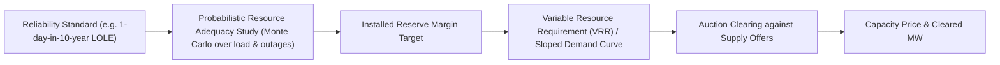

## Capacity Markets and Resource Adequacy Mechanisms

### Conceptual Foundation

#### The Resource Adequacy Problem

Electricity is a good that (in conventional grids) cannot be economically stored at scale, must be consumed the instant it is produced, and is delivered over a shared network subject to physical reliability constraints. This creates a distinctive economic problem: the market must ensure that enough generation capacity exists to meet peak demand plus a margin for unexpected outages and demand spikes, even though the events that require this reserve capacity (extreme heat waves, generator failures, cold snaps) may occur only a handful of hours per year.

**Resource adequacy (RA)** is the property of a power system having sufficient installed capacity, accounting for forced outages and demand uncertainty, to meet demand with an acceptably low probability of shortfall. It is distinct from *operational reliability* (day-to-day system security, frequency control, voltage support), which is typically governed by different rules and timeframes.

#### Why Energy-Only Markets Under-Procure Capacity

In a theoretically ideal energy-only market, the "missing money" problem is resolved because scarcity prices during shortage hours would spike high enough (in principle, up to the Value of Lost Load, VOLL) to compensate peaking and flexible capacity for their full annualized fixed costs, even though they run only a small number of hours. This is the basis of the **peak-load pricing** and **loss-of-load-based scarcity pricing** literature (Boiteux, 1949; Joskow, 2008).

In practice, several market failures and design frictions prevent this outcome:

- **Price caps.** Most wholesale markets impose administrative offer caps (e.g., historically $1,000-$2,000/MWh, with some markets like ERCOT allowing up to $5,000/MWh) far below theoretical VOLL (often estimated at $3,000-$50,000+/MWh depending on customer class). This truncates the revenue peaking units would otherwise earn during scarcity.
- **Demand-side unresponsiveness.** Retail rates are overwhelmingly flat or slow-changing, so end-use demand does not see or respond to real-time scarcity prices. This means the "demand curve" that should choke off consumption at high prices is largely absent, and the burden of balancing supply and demand falls entirely on the supply side and on administrative curtailment (rolling blackouts).
- **Risk aversion and revenue volatility.** Generator revenues under energy-only pricing depend on a small number of extreme-price hours. Financing new capacity (which requires lenders and equity holders to underwrite that revenue stream for 20+ years) becomes difficult when a large share of expected revenue is concentrated in low-probability tail events. This raises the cost of capital and can lead to underinvestment relative to the reliability target chosen by regulators/society. [Inference — the underinvestment result depends on assumed risk-aversion and financing frictions; some economists dispute the magnitude in well-designed scarcity-pricing markets.]
- **Market power mitigation.** Because scarcity conditions concentrate market power in the hands of whatever units are marginal, regulators impose mitigation measures (bid caps, must-offer requirements) that further suppress scarcity rents.
- **Free-rider / public-good aspects of reliability.** Reliability (avoiding blackouts) has public-good characteristics — an individual generator's decision to retire or not build capacity affects system-wide reliability that all consumers on the grid consume "jointly." This is often cited as a rationale for a centralized capacity obligation rather than relying purely on bilateral contracting.

The result is the classic **"missing money" problem**: the energy market alone does not deliver sufficient revenue to attract or retain the capacity level that reliability targets require, particularly for the marginal ("peaker") technology whose main value is availability during rare scarcity hours rather than energy production.

#### Two Broad Policy Responses

$$\text{Reliability Instruments} = \begin{cases} \text{Energy-only + Scarcity Pricing (ERCOT model)} \\ \text{Capacity Market / Resource Adequacy Construct (PJM, ISO-NE, NYISO, MISO, most of Europe)} \end{cases}$$

Capacity markets are the second category: an administratively designed, separate market (or mandated bilateral obligation) that pays generation and demand-response resources for being *available*, independent of whether and how much energy they actually produce.

---

### Core Design Elements of Capacity Markets

#### 1. Demand Curve Construction (Reliability Target Translation)

The central design choice is translating a probabilistic reliability standard into a demand curve for capacity.

**Reliability metrics:**

- **Loss of Load Expectation (LOLE):** expected number of days (or hours) per year that available capacity is insufficient to meet demand. The industry-standard target, originating from a 1970s NERC/utility consensus, is **1 day in 10 years (0.1 days/year LOLE)**.
- **Loss of Load Hours (LOLH):** expected hours per year of shortfall (a finer-grained variant of LOLE).
- **Expected Unserved Energy (EUE):** expected MWh of demand not served per year, increasingly favored because it captures the *magnitude*, not just the frequency, of shortfalls — important as flatter, longer-duration risk periods (e.g., from high renewable penetration and multi-hour storage-dependent evening peaks) become more common than the traditional single afternoon peak.

**Installed Reserve Margin (IRM):** The LOLE target is converted into a required reserve margin above forecast peak demand via probabilistic modeling (typically Monte Carlo simulation over thousands of weather years combined with generator outage draws). This becomes the total quantity of capacity procured.

$$\text{IRM} = \frac{\text{Installed Capacity} - \text{Forecast Peak Demand}}{\text{Forecast Peak Demand}}$$

**Sloped (downward-sloping) demand curves — the Variable Resource Requirement (VRR) curve, PJM's terminology:** Rather than a vertical demand curve at the target reserve margin (which would produce highly volatile clearing prices — either zero if even slightly over-procured, or price-cap-level if slightly under-procured), most modern capacity markets use a downward-sloping demand curve. This curve is calibrated so that:

- At the target reserve margin, the clearing price equals the estimated **Net Cost of New Entry (Net CONE)** — the annualized fixed cost of the reference new-build technology minus expected net energy/ancillary revenue.
- Below the target, prices rise (up to a cap, often 1.5×–2× CONE) to signal scarcity and attract entry.
- Above the target, prices fall gradually rather than dropping to zero, preserving some revenue for existing resources and smoothing price volatility.

#### 2. Supply-Side Qualification and Accreditation

Not all nameplate MW count equally toward the reliability target. **Capacity accreditation** determines each resource's contribution.

- **Unforced Capacity (UCAP):** Nameplate capacity de-rated by the resource's forced outage rate, historically the dominant method for thermal plants.

  $$UCAP = ICAP \times (1 - EFORd)$$

  where $ICAP$ is installed (nameplate) capacity and $EFORd$ is the Equivalent Forced Outage Rate (demand-period).
- **Effective Load Carrying Capability (ELCC):** A marginal, portfolio-dependent accreditation method increasingly used for variable and limited-duration resources (wind, solar, batteries). ELCC measures how much *additional* load a resource allows the system to serve reliably while holding LOLE constant, capturing diminishing marginal reliability value as more of a correlated resource type (e.g., solar) is added to the fleet. This is now standard or being phased in at PJM, MISO, CAISO (resource adequacy program), and ISO-NE for renewables and storage. [Note: ELCC methodology and specific accreditation percentages are actively evolving across ISOs and are frequently revised; treat any specific numeric ELCC value as time- and portfolio-specific rather than a fixed constant.]
- **Duration-limited resource accreditation:** Battery storage accreditation is particularly sensitive to duration (a 4-hour battery has materially lower ELCC than an 8-hour battery in most systems with evening net-load peaks) and to the marginal risk hours the system model identifies — a topic of ongoing methodological refinement as storage penetration grows.

#### 3. Auction Formats

- **Forward auctions:** Capacity is procured 1–3 years ahead of the delivery year (PJM's Base Residual Auction historically 3 years ahead, though PJM shortened this in recent reforms; ISO-NE's Forward Capacity Market is 3 years ahead) to give developers lead time to build, while allowing existing resource retirement decisions and demand forecasts to be reasonably firm.
- **Descending clock auctions:** Sellers submit offers; the auctioneer (or algorithm) iteratively lowers price, and sellers indicate willingness to remain in the auction, until supply equals the demand curve quantity at that price. PJM and ISO-NE use variants of this.
- **Sealed-bid, single round auctions with co-optimization:** Some designs solve a single optimization that co-clears capacity zones and transmission constraints.
- **Locational pricing / Locational Deliverability Areas (LDAs):** Because transmission constraints can isolate sub-regions during peak conditions, most capacity markets define sub-zones with separate demand curves and, sometimes, separate clearing prices (e.g., PJM's LDAs for constrained areas like the BGE or ComEd zones; NYISO's locational capacity zones for NYC and Long Island, which are chronically import-constrained and clear at a premium).

#### 4. Demand-Side and Multi-Year Obligation Mechanisms

- **Mandated bilateral / Reliability-Must-Run-style obligations:** Some jurisdictions (notably California's CAISO region prior to full centralized capacity market adoption, and much of the U.S. West) rely on a bilateral, load-serving-entity (LSE) self-supply obligation — each LSE must demonstrate to the regulator (CPUC) that it holds Resource Adequacy contracts covering its share of system + local + flexible capacity needs, rather than clearing a centralized auction.
- **Vertically integrated / cost-of-service regions:** In much of the U.S. Southeast and parts of the Mountain West, utilities plan and are compensated for capacity through rate base and Integrated Resource Planning (IRP), with no separate capacity market at all — resource adequacy is achieved through regulatory approval of generation investment.
- **Strategic reserves (a lighter-touch alternative):** Rather than a full capacity market, some systems (Germany's *Netzreserve*/*Kapazitätsreserve*, Sweden, Belgium's earlier strategic reserve before its 2021 capacity market) contract a small, out-of-market reserve of otherwise-retiring or standby plants activated only in extreme scarcity, keeping the main energy market otherwise energy-only.

---

### Comparative Institutional Design: Major Markets

| Market | Mechanism Name | Auction Horizon | Reliability Metric | Notable Feature |
| --- | --- | --- | --- | --- |
| PJM | Reliability Pricing Model (RPM) / Base Residual Auction | ~1–3 years forward (shortened in recent reform) | 1-day-in-10-year LOLE | VRR curve; ELCC accreditation transition; Capacity Performance penalty structure |
| ISO-NE | Forward Capacity Market (FCM) | 3 years forward | 1-day-in-10-year LOLE | Pay-for-performance during scarcity events; annual re-configuration auctions |
| NYISO | Installed Capacity (ICAP) Market | Monthly/seasonal (spot-like, shorter than PJM/ISO-NE) | 1-day-in-10-year LOLE | Locational capacity zones (NYC, LI); minimum ICAP requirement |
| MISO | Planning Resource Auction (PRA) | 1 year forward (annual, near-spot) | 1-day-in-10-year LOLE (moving toward EUE-based analysis, the "Reliability Based Modeling" work) | Zonal clearing; historically low clearing prices, prompting reform debates |
| CAISO / California | Resource Adequacy (RA) Program | Annual + monthly bilateral, not a centralized auction | State-set Planning Reserve Margin | System, local, and flexible RA categories; bilateral contracting, not auction-cleared |
| ERCOT | *No mandatory capacity market* — energy-only with operating reserve demand curve (ORDC) and, since 2024–25, a supplemental Performance Credit Mechanism (PCM/"dispatchable reliability reserve service") layered on top | N/A (ORDC is a real-time scarcity adder, not a capacity auction) | Loss of Load Probability inputs to ORDC | Widely studied as the alternative model; post-Winter Storm Uri reforms added credit-based dispatchable capacity incentives |
| GB (Great Britain) | Capacity Market (T-4 / T-1 auctions) | 4 years and 1 year ahead | De-rated capacity vs. peak demand forecast | Technology-neutral descending clock auction; explicit de-rating factors by technology |
| France | Mécanisme de capacité | Forward (year-ahead) with obligation on suppliers | Reliability standard set by RTE/regulator | Obligation-based: suppliers must hold certificates matching their customers' peak contribution |
| Italy, Belgium, Ireland (I-SEM) | Capacity Market / Capacity Remuneration Mechanism | Multi-year forward auctions (T-4/T-1 style, EU-harmonized under the Electricity Regulation state aid framework) | National Resource Adequacy Assessment via ENTSO-E's European Resource Adequacy Assessment (ERAA) | Must comply with EU cross-border participation rules for interconnected capacity |

**[Unverified]** Exact current clearing prices, auction parameters, and reform timelines (e.g., PJM's 2025–26 auction results, MISO's ongoing PRA reform docket, ERCOT PCM implementation details) change frequently through active regulatory dockets; figures above describe structural design, not current-year cleared values. Verify current parameters against the relevant ISO/RTO tariff filings or FERC dockets before use in any time-sensitive analysis.

---

### Economic Analysis

#### Efficiency Rationale and Critiques

**The case for capacity markets:**

1. They convert a volatile, thin-tailed revenue stream (energy-only scarcity rents) into a smoother, more financeable one, potentially lowering the systemwide cost of capital for new entry and thus the levelized cost of maintaining reliability. [Inference — this net-cost benefit is contested; see critiques below.]
2. They provide a transparent, forward-visible price signal for entry/exit decisions, in principle avoiding "boom-bust" cycles of under-building followed by price spikes and crash building.
3. They internalize the public-good/externality dimension of reliability by pooling the obligation across all load rather than relying on individual generator or retailer risk tolerance.

**Standard critiques:**

1. **Double-payment / "missing money is a design choice, not a law of physics" critique (Bidwell, Hogan and others):** If scarcity pricing were implemented properly (price caps near true VOLL, robust demand response, well-calibrated Operating Reserve Demand Curves as in ERCOT), the missing-money problem shrinks substantially, and a separate capacity payment risks *over-compensating* capacity (paying both energy scarcity rents and a capacity payment for the same reliability service).
2. **Administrative complexity and gaming:** Demand curve parameters (Net CONE, ELCC values, reserve margin targets) are contested, technical, and subject to stakeholder litigation; small changes in assumed Net CONE can shift the market-clearing price and quantity substantially, creating rent-seeking incentives around the parameter-setting process itself.
3. **Missing Money vs. Missing Markets for flexibility:** Traditional capacity market designs (built around single summer peak, thermal-dominant systems) have struggled to accredit and compensate the *flexibility* and *duration* attributes now needed as renewables and storage reshape the net-load shape (e.g., the "duck curve" evening ramp). This has driven the shift toward ELCC/EUE-based, multi-period accreditation.
4. **Interaction with state policy (Minimum Offer Price Rules, MOPR):** When states subsidize preferred resources (nuclear zero-emission credits, renewable portfolio standard contracts) outside the capacity market, but those same resources also bid into the centralized capacity auction, a tension arises between state policy autonomy and the capacity market's price-formation integrity. PJM's MOPR litigation (2018–2022) and eventual FERC-approved settlement narrowing MOPR's scope is the paradigm case. [Note: this is an active area of continued FERC/state jurisdictional dispute, not a fully settled question.]
5. **Cross-border and market power concerns:** In interconnected systems (European capacity mechanisms), allowing foreign capacity to participate raises questions of double-counting reliability contributions across borders and complicates the EU state-aid approval process (European Commission scrutiny of capacity mechanisms under Article 107 TFEU).

#### Deriving the CONE-Based Clearing Price (Illustrative Model)

A simplified representation of how Net CONE anchors the demand curve:

$$\text{Net CONE} = \text{Gross CONE} - E[\text{Net Energy \& AS Margin}]$$

where Gross CONE is the annualized capital + fixed O&M cost of the reference peaking technology (commonly a combustion turbine), and the subtracted term is the expected annual net revenue that unit earns from energy and ancillary services markets. If a resource's expected energy-market margin rises (e.g., due to higher natural gas price spreads or more frequent scarcity pricing), Net CONE — and hence the capacity price at the reserve-margin target — falls, since less capacity revenue is needed to make the reference plant financially whole.

**Illustrative numerical example** (stylized, not tied to a specific current market):

- Gross CONE (combustion turbine, per kW-year): $100/kW-year
- Expected net energy margin: $30/kW-year
- Net CONE: $70/kW-year → this becomes the capacity price target at the target reserve margin on the VRR curve.

If the auction clears above the target reserve margin (excess supply), the sloped demand curve implies a lower price, e.g., $45/kW-year at 2 percentage points above target reserve margin; if it clears below target (a shortfall), price could rise toward the cap, e.g., $130/kW-year (roughly 1.85× Net CONE, consistent with typical cap multipliers).

---

### Worked Example: Reserve Margin and LOLE Trade-off

Consider a simplified system with peak demand of 50,000 MW, and suppose planning studies show the following approximate relationship between installed reserve margin (IRM) and LOLE (illustrative, not derived from a specific system's actual probabilistic model):

| IRM | LOLE (days/year) |
| --- | --- |
| 10% | 0.6 |
| 13% | 0.3 |
| 15% | 0.1 |
| 17% | 0.04 |
| 20% | 0.01 |

Given the 1-day-in-10-year (0.1 days/year) target, the system's Installed Reserve Margin target would be set at 15%, i.e., **57,500 MW of installed (de-rated as applicable) capacity** required against 50,000 MW peak demand. The capacity market's demand curve is then centered on this 57,500 MW quantity point, sloped to allow prices to adjust smoothly for outcomes above or below it — for instance, clearing 56,000 MW (13% IRM, LOLE 0.3) would signal a real, though not extreme, adequacy shortfall and push price toward the curve's upper region, while clearing 60,000 MW (20% IRM) would push price toward its lower region without collapsing to zero.

---

### Interaction with the Energy Transition

#### Accreditation Challenges from Variable and Limited-Duration Resources

As systems add high shares of wind, solar, and batteries, several capacity-market-specific issues have emerged:

- **Correlated availability risk:** Solar's ELCC declines materially as solar penetration increases, because additional solar capacity is unavailable during the same hours (evening peak, cloudy days) as existing solar — a portfolio effect that UCAP-style de-rating (based on individual-unit forced outage rates) cannot capture, motivating the shift to ELCC.
- **Multi-hour and seasonal risk windows:** Traditional summer-peak-focused capacity markets have needed redesign as net-load peaks shift to evening hours (post-solar-sunset) and, in some systems (New England, parts of Europe), toward winter cold-snap risk driven by gas-supply and electrified-heating interactions. This has driven interest in **seasonal capacity markets** (procuring separate summer and winter capacity requirements) as implemented or being studied in ISO-NE and MISO.
- **Storage duration accreditation:** A 4-hour lithium-ion battery's ELCC contribution saturates faster than its nameplate MW would suggest once storage penetration is high enough that the risk period exceeds 4 hours; 8-hour and longer-duration storage/other technologies (pumped hydro, long-duration storage, thermal storage) retain higher marginal ELCC in high-penetration scenarios. [Inference — the specific saturation point is highly system-dependent and shifts with the composition of the net-load curve.]
- **Hybrid and co-located resources:** Solar-plus-storage hybrids raise accreditation questions about how to credit the combined resource versus its components separately, an active rulemaking topic at FERC and several ISOs.

#### Interconnection Queue and Capacity Market Timing Mismatch

A widely discussed practical friction: interconnection study queues in many U.S. ISOs have multi-year backlogs, while capacity auctions often require deliverability commitments on a much shorter (1–4 year) horizon. This mismatch has been cited as a contributor to thin capacity auctions and price spikes (e.g., PJM's 2025/26 Base Residual Auction result, which drew significant attention) even amid substantial generation interconnection requests in the queue. [Unverified — specific causal attribution is debated among stakeholders, ISOs, and academics; multiple contributing factors (retirements, load growth from data centers, MOPR history, ELCC transition) are typically cited together.]

---

### Key Points

- Capacity markets exist to solve the "missing money" problem in energy-only markets, arising from price caps, demand inelasticity, financing risk aversion, and market power mitigation, which together prevent scarcity pricing alone from reliably financing adequate capacity.
- The core design pipeline is: reliability standard (LOLE/LOLH/EUE) → probabilistic resource adequacy study → installed reserve margin target → sloped demand curve anchored on Net CONE → auction clearing.
- Capacity accreditation has shifted from simple outage-rate de-rating (UCAP) toward marginal, portfolio-dependent ELCC methods to properly value variable and duration-limited resources.
- Not all markets use centralized capacity auctions: alternatives include bilateral RA obligations (California), cost-of-service IRP (vertically integrated Southeast/West), strategic reserves (parts of Europe), and pure energy-only with scarcity pricing (ERCOT).
- Ongoing controversies center on double-payment risk relative to well-designed scarcity pricing, state-policy interactions (MOPR), and adapting accreditation to a renewables- and storage-heavy resource mix.

---

### Related Topics

- Scarcity pricing and Operating Reserve Demand Curves (ORDC) — the ERCOT alternative model
- Value of Lost Load (VOLL) estimation methodology
- Effective Load Carrying Capability (ELCC) calculation methods in depth
- Minimum Offer Price Rule (MOPR) litigation and FERC capacity market jurisdiction
- Demand response and distributed energy resource participation in capacity markets
- European Resource Adequacy Assessment (ERAA) and EU state-aid rules for capacity mechanisms
- Locational capacity markets and transmission-constrained reliability zones
- Seasonal capacity market redesign (winter risk, net-load shift)
- Interconnection queue reform (FERC Order 2023) and its interaction with capacity procurement timelines
- Integrated Resource Planning (IRP) as an alternative resource adequacy framework