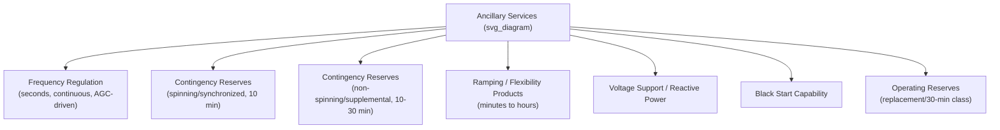

## Ancillary Services Markets

### Conceptual Foundation

#### What Ancillary Services Are

**Ancillary services** are the set of grid support functions — beyond the delivery of bulk energy itself — that maintain the instantaneous balance of supply and demand, frequency, voltage, and system stability on an electric power network. Where energy markets price the megawatt-hours delivered, ancillary services markets price the megawatts (or MW-equivalent capability) held in reserve or actively used to keep the system operating within secure limits.

The economic rationale mirrors that of capacity markets: many of these services have public-good and network-externality characteristics (a generator maintaining frequency response benefits the whole interconnection, not just its own customers), and unbundling them into explicit, separately priced products is what allows competitive procurement rather than utilities self-supplying them opaquely through cost-of-service ratemaking, as was standard before FERC Order 888 (1996) required functional unbundling of ancillary services from energy and transmission.

#### Categories of Ancillary Services

Ancillary services are typically grouped by the timescale and physical function they serve:

1. **Regulation (Frequency Regulation, Reg-Up/Reg-Down):** Continuous, automatic second-by-second adjustment of output to track the system's Automatic Generation Control (AGC) signal, correcting for the constant small mismatches between scheduled and actual load/generation. This is the fastest and most technically demanding service, and the one most transformed by battery storage participation.
2. **Spinning Reserve (Synchronized Reserve):** Capacity that is already online and synchronized to the grid, capable of ramping to full output within a short window (commonly 10 minutes), held to cover the loss of the single largest in-service generating unit or transmission element (the **N-1 contingency criterion**).
3. **Non-Spinning Reserve (Supplemental Reserve):** Capacity that can be brought online and synchronized within a similarly short window (typically 10–30 minutes) but is not currently running — e.g., a fast-start combustion turbine.
4. **Replacement/Operating Reserve (30-minute or longer class):** A slower reserve tier that replenishes the faster reserve categories after they have been deployed, giving operators time to restore the full reserve margin.
5. **Ramping products:** Newer market products (e.g., CAISO's Flexible Ramping Product, MISO's Ramp Capability Product) that explicitly price the *capability to change output quickly* over a 5–15 minute horizon, motivated by the steep net-load ramps created by solar generation dropping off in the evening.
6. **Voltage support / Reactive power (VAR support):** Injection or absorption of reactive power to maintain voltage within acceptable bounds; in most U.S. markets this is still compensated primarily through cost-based tariff rates (FERC-jurisdictional Schedule 2 payments) rather than a competitive market, because reactive power is largely a local, non-fungible service tied to specific grid locations.
7. **Black start service:** The capability of a generating unit to start from a shutdown condition without drawing power from the grid, used to bootstrap system restoration after a blackout; compensated via bilateral or cost-of-service contracts in nearly all markets due to its highly locational, infrequently-called nature.
8. **Inertia / Fast Frequency Response (emerging category):** As synchronous generation (coal, gas, nuclear) is displaced by inverter-based resources (wind, solar, batteries) that do not inherently provide rotational inertia, several markets and system operators (Australia's AEMO, Great Britain's National Grid ESO, and studies underway at ERCOT and MISO) have begun developing explicit markets or procurement mechanisms for inertia and sub-second Fast Frequency Response (FFR), historically a free byproduct of synchronous machines' physics rather than a purchased product.

---

### Economic Theory of Ancillary Services Pricing

#### Co-Optimization with the Energy Market

The defining technical and economic feature of modern U.S. ISO/RTO ancillary services markets is **co-optimization**: energy and reserve products are cleared *simultaneously* in the same security-constrained economic dispatch (SCED) and unit commitment (SCUC) optimization, rather than sequentially. This reflects the real **opportunity cost** relationship between energy and reserves — a MW held back as spinning reserve is a MW not sold as energy, so the two products compete for the same physical capability.

The co-optimization problem can be represented schematically as minimizing total cost across products:

$$\min \sum_{i} \left( C_i^{E}(q_i^{E}) + C_i^{R}(q_i^{R}) \right)$$

subject to:

$$\sum_i q_i^{E} = D \quad \text{(energy balance)}$$

$$\sum_i q_i^{R} \geq R_{\text{req}} \quad \text{(reserve requirement, e.g., largest contingency)}$$

$$q_i^{E} + q_i^{R} \leq P_i^{max} \quad \text{(unit capacity limit — the key coupling constraint)}$$

where $q_i^{E}$ and $q_i^{R}$ are unit $i$'s energy and reserve schedules, $C_i^{E}$ and $C_i^{R}$ its energy and reserve offer costs, $D$ is demand, and $R_{\text{req}}$ is the reserve requirement (often set by the single largest contingency under N-1 criteria, or a probabilistic reliability-based requirement in more advanced designs).

#### Shadow Prices and the Opportunity Cost of Reserves

Because of the shared capacity constraint, the **marginal clearing price for energy and for each reserve product are jointly determined**, and a binding reserve constraint raises the energy price paid to units that are held back from full output to provide reserves — they must be made economically indifferent between selling energy and holding reserve capacity. This is why energy prices sometimes rise sharply during periods of tight reserve margins even without a change in load: the shadow price of the reserve constraint is passed through into the energy price via the coupling constraint.

$$\lambda^{E} = \frac{\partial \text{TotalCost}}{\partial D}, \qquad \lambda^{R} = \frac{\partial \text{TotalCost}}{\partial R_{\text{req}}}$$

A unit providing reserve rather than energy earns (in a well-functioning co-optimized market) a payment reflecting $\lambda^{R}$ that at minimum compensates it for the foregone energy margin it could have earned instead — this is the formal expression of the "opportunity cost pricing" principle underlying FERC's ancillary services market design guidance (FERC Order 719, Order 831 on offer caps for reserves).

#### Demand Curves for Reserves

As with capacity markets, most ISOs use administratively defined, often price-capped or sloped demand curves for reserve products rather than a hard physical quantity requirement, to avoid extreme price volatility when the reserve requirement is nearly, but not quite, met. ERCOT's **Operating Reserve Demand Curve (ORDC)** is the most studied example: rather than treating reserves as a fixed quantity constraint, it adds a scarcity price adder to the real-time energy price as a continuous, probabilistically-derived function of how far available reserves are below target, explicitly modeled on the Loss of Load Probability associated with each reserve shortfall level.

$$\text{ORDC Adder} = \text{VOLL} \times \text{LOLP}(\text{Reserves})$$

This creates a smooth link between real-time reserve scarcity and the energy price, effectively functioning as ERCOT's substitute for both a capacity market and a discrete reserve demand curve.

---

### Market-by-Market Design Comparison

| Market | Regulation Product | Contingency Reserve Products | Ramping Product | Distinguishing Feature |
| --- | --- | --- | --- | --- |
| PJM | Regulation (RegA/RegD — mileage-based, performance-scored) | Synchronized Reserve, Non-Synchronized Reserve, Day-Ahead Scheduling Reserve | — (no explicit ramp product as of standard design) | Pay-for-performance regulation clearing incorporating speed/accuracy scores (FERC Order 755 compliance) |
| CAISO | Regulation Up/Down (with mileage payments) | Spinning Reserve, Non-Spinning Reserve | Flexible Ramping Product (FRP, 15-min and 5-min) | Explicit ramping product pioneered to address solar-driven net-load ramps ("duck curve") |
| ERCOT | Regulation Up/Down (RegUp/RegDown) | Responsive Reserve Service (RRS, incl. fast-frequency-response sub-product), Non-Spinning Reserve (Non-Spin), ERCOT Contingency Reserve Service (ECRS, added post-Winter Storm Uri) | Embedded in ORDC scarcity adder rather than a discrete product | ORDC scarcity-price approach rather than discrete demand curves for most reserve categories |
| MISO | Regulation | Spinning Reserve, Supplemental Reserve | Ramp Capability Product (introduced 2022–23) | Regional (zonal) reserve sharing groups |
| ISO-NE | Regulation | Ten-Minute Spinning Reserve, Ten-Minute Non-Spinning Reserve, Thirty-Minute Operating Reserve | — | Forward Reserve Market as a separate, seasonal forward procurement layered atop real-time reserves |
| NYISO | Regulation | 10-Minute Spinning Reserve, 10-Minute Non-Synchronous Reserve, 30-Minute Operating Reserve | — | Locational reserve requirements (NYC and Long Island sub-zones) |
| Great Britain (NESO) | Dynamic Containment, Dynamic Moderation, Dynamic Regulation (fast frequency response suite, post-2020 reform) | Firm Frequency Response (legacy), Balancing Mechanism reserve actions | — | Explicit sub-second Dynamic Containment product designed largely for battery storage participation |
| Australia (AEMO, NEM) | Regulation FCAS (Frequency Control Ancillary Services) — Raise/Lower Regulation | Contingency FCAS (6-second, 60-second, 5-minute Raise/Lower) | — | Eight-market co-optimized FCAS design; explicit "fast" (1-second) FCAS added post-2021 for inverter-based resources |

**[Unverified]** Specific current market rules, product names, and clearing prices are under continuous FERC/AEMC/Ofgem rulemaking revision (e.g., ERCOT's ECRS parameters, MISO's Ramp Product tariff details, GB's ongoing Balancing Mechanism reform under the Review of Electricity Market Arrangements). Treat the table as structural/comparative, not as current tariff data.

---

### Battery Storage and Inverter-Based Resources: A Structural Shift

#### Why Batteries Reshaped Ancillary Services Markets

Lithium-ion battery storage has disproportionately entered ancillary services markets (relative to its share of energy market volume) because:

- **Response speed:** Batteries can respond to AGC signals in seconds with high accuracy, vastly outperforming thermal generators' ramp rates for regulation — this is directly rewarded in **performance-based regulation pricing** (FERC Order 755, implemented via PJM's mileage-based RegD signal and similar mechanisms elsewhere), which pays for both capacity *and* the speed/accuracy of response ("mileage").
- **Zero marginal fuel cost for holding reserve:** A battery held in reserve does not burn fuel while idle, unlike a thermal unit operating in part-load spinning reserve mode, which incurs a real opportunity cost and heat-rate penalty.
- **Duration limits create a different economic trade-off:** A battery's state-of-charge is a scarce, cumulative resource — providing reserve capacity for hours draws down the same energy reservoir that would otherwise be arbitraged in the energy market, creating an inter-temporal optimization problem (energy arbitrage vs. ancillary services vs. capacity market participation) that does not exist for fuel-based generators.

#### The Battery Co-Optimization Problem (Illustrative)

A grid-scale battery operator effectively solves a stochastic dynamic program each operating day, choosing how to allocate its power and energy capacity across products:

$$\max_{q^{E}_t, q^{Reg}_t, q^{Res}_t} \sum_{t} \left( \pi^{E}_t q^{E}_t + \pi^{Reg}_t q^{Reg}_t + \pi^{Res}_t q^{Res}_t \right)$$

subject to state-of-charge dynamics:

$$SOC_{t+1} = SOC_t - \eta^{-1} q^{E}_t \Delta t - \phi \cdot q^{Reg}_t \Delta t$$

and power/energy capacity limits, where $\pi^{E}_t, \pi^{Reg}_t, \pi^{Res}_t$ are the realized energy, regulation, and reserve prices, $\eta$ is round-trip efficiency, and $\phi$ is an expected "mileage-drawn" state-of-charge depletion factor for regulation participation (regulation causes net energy throughput even though its scheduled net position may be zero, because the AGC signal moves in both directions asymmetrically over real dispatch intervals). [Inference — the exact SOC-depletion relationship for regulation is empirically estimated per market/product design, not a universal constant.]

---

### Worked Numerical Example: Opportunity Cost and Reserve Pricing

Consider a single gas peaker with $P^{max} = 100$ MW, a variable energy cost of $40/MWh, and a real-time energy price of $55/MWh.

- If the unit sells 100 MW of energy: revenue = $100 \times (55-40) = \$1{,}500$/hour margin.
- If instead the system operator requires 20 MW held as spinning reserve, the unit can sell only 80 MW of energy, foregoing $20 \times (55-40) = \$300$/hour of energy margin.
- Under opportunity-cost pricing, the unit's reserve offer floor should be at least $15/MW-hour ($300 \div 20$ MW) to be indifferent between the two dispositions — this is the **opportunity cost** component of a reserve offer, which FERC's reserve-pricing rules require market participants be permitted to reflect (rather than being limited to a cost-based reserve offer that ignores foregone energy margin).
- If the market-clearing reserve price is, say, $25/MW-hour (because reserves are scarce system-wide), the unit earns an additional $20 \times (25-15) = \$200$/hour of pure economic rent above its opportunity cost — illustrating why tight reserve conditions can be highly profitable for flexible, fast-responding capacity.

---

### Interconnection and Cross-Product Interactions

#### Ancillary Services and Capacity Market Revenue Netting

Recall from capacity market design that **Net CONE** (the anchor for the capacity demand curve) is calculated net of expected energy *and* ancillary services revenue. This creates a direct linkage: as ancillary services markets (especially fast-response products dominated by batteries) become more lucrative and liquid, the expected ancillary services margin subtracted in the Net CONE calculation rises, which — all else equal — *lowers* the capacity price needed to attract or retain the reference technology. This is one channel through which battery storage's disproportionate ancillary services participation feeds back into capacity market economics.

#### European Balancing Markets: A Related but Distinct Framework

The EU's **Electricity Balancing Guideline (EBGL)** establishes harmonized European platforms for balancing energy and reserve exchange across member states — MARI (manual Frequency Restoration Reserve), PICASSO (automatic Frequency Restoration Reserve), and TERRE (Replacement Reserve) — allowing cross-border procurement of balancing/ancillary-type products, conceptually parallel to but institutionally distinct from the U.S. ISO/RTO co-optimized model, since European balancing markets are typically cleared closer to real time and separately from day-ahead/intraday energy markets rather than fully co-optimized in a single SCED/SCUC run. [Note: EU balancing platform integration (e.g., which member states/TSOs participate in which platform) has expanded incrementally since initial go-live and should be verified against ENTSO-E's current platform status for any current-state claim.]

---

### Key Points

- Ancillary services (regulation, spinning/non-spinning reserve, ramping, voltage support, black start, and emerging inertia/FFR products) support grid frequency, voltage, and stability, distinct from the bulk energy product itself.
- Modern market design co-optimizes energy and reserves in a single SCED/SCUC run because they compete for the same physical unit capacity, producing shared shadow (opportunity-cost) pricing between the two products.
- FERC Order 755's performance-based regulation pricing and the broader opportunity-cost pricing principle are the key regulatory levers that opened these markets to fast, accurate responders — chiefly battery storage.
- ERCOT's ORDC represents a structurally different approach: a continuous scarcity-price adder derived from Loss of Load Probability rather than discrete demand curves for each reserve product.
- Battery storage's participation creates a genuinely new economic optimization problem (state-of-charge-constrained, multi-product allocation) that does not map onto the fuel-based generator framework the ancillary services market rules were originally designed around.
- Ancillary services revenue directly feeds back into capacity market economics through the Net CONE calculation, linking the two market layers.

---

### Related Topics

- Security-Constrained Economic Dispatch (SCED) and Unit Commitment (SCUC) optimization formulations
- FERC Order 755, Order 784, and Order 831 — regulatory history of ancillary services and reserve pricing reform
- ERCOT Operating Reserve Demand Curve (ORDC) methodology in depth
- Battery storage revenue stacking and multi-market participation strategy
- Inertia and Fast Frequency Response markets for high inverter-based-resource penetration systems
- European Electricity Balancing Guideline (EBGL) platforms: MARI, PICASSO, TERRE
- Locational marginal pricing (LMP) decomposition and its relationship to reserve zone pricing
- Demand response participation in ancillary services markets
- Virtual power plants (VPPs) and aggregated distributed energy resource bidding into ancillary services