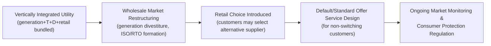

## Retail Competition and Default Service Design

### Conceptual Foundation

#### Why Retail Electricity Markets Are Structurally Different from Wholesale Markets

Wholesale electricity markets (energy, capacity, ancillary services) operate among sophisticated participants transacting large, homogeneous, real-time-metered quantities. Retail markets sit on the other side of the meter, serving millions of small, heterogeneous, generally inattentive customers whose consumption is (outside of advanced metering deployments) measured only periodically. This asymmetry — thin information, high customer search costs, low switching propensity, and material stakes for a small share of household budgets — means that simply "opening" the retail market to competition does not automatically replicate the efficiency gains observed in wholesale restructuring. **Retail competition policy is therefore as much about consumer protection and default-service design as it is about market structure.**

#### The Restructuring Sequence

Retail competition is one stage of a broader electricity restructuring sequence pursued (unevenly) since the 1990s:

Not all restructured jurisdictions proceeded to full retail choice — many wholesale-restructured regions (e.g., much of PJM's own footprint outside explicit retail-choice states) retain regulated, bundled retail service, illustrating that wholesale and retail restructuring are analytically and legally separable decisions.

---

### Market Structure Taxonomy

#### Full Bundled Regulation (No Retail Choice)

The traditional model: a vertically integrated or transmission/distribution-only utility is the sole supplier, its retail rates set through regulatory rate cases based on the utility's cost of service (fuel, purchased power, O&M, and a regulator-approved rate of return on rate base). Most of the U.S. Southeast, much of the Mountain West, and municipal/cooperative utilities nationally operate this way. There is no "default service" problem in the retail-choice sense because there is no competitive alternative to default from.

#### Full Retail Choice with Competitive Default Service

States like Texas (ERCOT, outside municipally-owned utility areas), and to varying degrees Illinois, Ohio, Pennsylvania, Maryland, and the U.K. and much of the EU under the Third Energy Package, allow customers to choose among competing Retail Electric Providers (REPs, also called Competitive Retailers, Load-Serving Entities, or "suppliers" in EU terminology) for the commodity/supply component of their bill, while the wires (transmission and distribution) remain a regulated monopoly, unbundled and separately billed or pass-through.

#### Hybrid / Partial Choice

Many restructured U.S. states (California, New York, Massachusetts, New Jersey) offer retail choice but with the incumbent utility continuing to provide **default/standard-offer service** at a regulated, cost-based or competitively-procured rate for customers who do not affirmatively choose a competitive supplier — which, empirically, is the large majority of small (particularly residential) customers in nearly every jurisdiction studied.

---

### Economics of Retail Competition

#### The Case for Retail Choice

1. **Product differentiation and consumer surplus:** Competitive suppliers can offer products regulated utilities typically cannot easily provide — green/renewable energy tariffs, fixed-price multi-year contracts (price certainty), time-of-use or demand-charge-optimized rate structures, bundled services (smart thermostats, EV charging plans).
2. **Innovation and service quality competition:** In principle, competition disciplines suppliers on customer service quality, billing accuracy, and value-added services in ways a monopoly franchise has weaker incentive to pursue.
3. **Allocative efficiency from price signals:** Competitive suppliers have stronger incentives than a regulated utility (facing regulatory lag and weak marginal-cost pass-through) to design and market retail rates that reflect true wholesale price variation (real-time or time-of-use pricing), improving demand-side efficiency.

#### The Critiques and Empirical Record

The empirical retail-choice literature (particularly extensive study of Texas, and the UK/Great Britain market) has identified persistent frictions:

1. **Search costs and switching frictions:** Residential customers face substantial time costs to compare heterogeneous contract terms (teaser rates, early termination fees, variable-rate "evergreen" contracts that customers roll onto after a fixed term expires at often much higher rates). Studies of Texas's residential retail market (e.g., work by Hortaçsu, Madanizadeh, and Puller, 2017, and subsequent literature) find substantial and persistent price dispersion for what is a homogeneous underlying commodity, consistent with search-cost models of retail markets rather than a frictionless competitive outcome. [Inference — the magnitude and persistence of dispersion is an active empirical research area with results that vary by study period and market; treat specific dispersion estimates as illustrative of the phenomenon rather than current figures.]
2. **Regressive distributional effects:** Multiple studies of Texas and other retail-choice states find that lower-income, less-educated, and non-English-speaking households are disproportionately likely to remain on default/regulated service or to be enrolled in worse-value competitive contracts, while more sophisticated customers capture the surplus from switching — a pattern consistent with the broader "sophistication gap" literature in behavioral industrial organization (cf. Grubb, 2015, on behavioral IO in retail markets generally).
3. **Deceptive marketing and door-to-door/telemarketing abuse:** Numerous state regulatory dockets (Ohio PUCO, Illinois ICC, Connecticut PURA, and UK Ofgem enforcement actions) have documented aggressive or misleading sales practices by competitive retailers, particularly variable-rate products marketed with low introductory rates that escalate sharply.
4. **Limited evidence of net welfare gains for residential customers overall:** Reviews of retail choice outcomes (e.g., academic and consumer-advocate assessments of Illinois's and Ohio's residential retail markets) have often found average residential switching outcomes roughly a wash or modestly negative relative to what utility default service would have cost, contrasted with generally more favorable outcomes for larger commercial and industrial customers, who have the sophistication and stakes to shop effectively. [Unverified — outcomes vary substantially by state, time period, and wholesale price environment during the comparison window; this is a generalization from a body of mixed studies, not a settled universal finding.]

---

### Default Service Design: The Central Policy Problem

Because a substantial share of customers do not or cannot effectively shop, **how default service is priced and procured is arguably the single most consequential retail market design choice** in a retail-choice jurisdiction — it must (a) not be so cheap that it undermines the competitive market by making switching irrational even when competitive offers would otherwise be genuinely better, and (b) not be so expensive or volatile that non-shopping customers (often the most vulnerable) are harmed relative to a well-run utility procurement.

#### Design Archetypes for Default/Standard Offer Service

**1. Utility Self-Supply / Cost-of-Service Default (older model, still used where distribution utilities retain generation):** The distribution utility procures or generates power and passes through cost via traditional rate-case regulation. Criticized for potentially cross-subsidizing or competing unfairly with entrants if procurement costs are opaque or bundled with other utility costs.

**2. Competitive Wholesale Auction / Standard Offer Service (SOS) Procurement:** The now-dominant model in most U.S. retail-choice states — the distribution utility runs a periodic, regulator-supervised competitive solicitation (often a descending-clock or sealed-bid auction) among wholesale suppliers to serve its default-service load for a defined term (commonly staggered tranches with 6-, 12-, or 24-month terms to smooth price volatility across cohorts). New Jersey's Basic Generation Service (BGS) auction and Maryland's Standard Offer Service (SOS) procurement are frequently cited reference models; Illinois's Ameren/ComEd procurement (administered in coordination with the Illinois Power Agency) is a similarly structured example.

$$\text{Default Service Rate} = \text{Wholesale Auction Clearing Price} + \text{Utility Administrative Adder} + \text{Applicable Riders/Reconciliation}$$

**Tranching/laddering rationale:** Procuring default-service supply in staggered tranches (e.g., splitting the annual default load requirement into thirds, each re-procured on a rolling 3-year ladder) smooths the exposure of default customers to any single auction's wholesale price level, avoiding the "cliff-edge" price shock that a single, infrequent full-requirements auction would create if wholesale prices happened to spike near the procurement date. This is directly analogous to the laddering rationale in fixed-income portfolio management.

**3. Regulator-Set Formulaic/Index-Based Rate:** Default price set by a published formula tracking a wholesale price index (e.g., a forward natural gas or power price index plus a fixed adder), used in some jurisdictions for simplicity and transparency, though it embeds basis risk if the index does not track the utility's actual procurement cost closely.

**4. Provider of Last Resort (POLR) vs. "true" default service — a distinction with real economic content:** Some jurisdictions frame default service explicitly as a *safety-net* product ("Provider of Last Resort") intentionally priced at a premium to the expected competitive market rate, precisely to preserve strong incentives to shop and to avoid crowding out the competitive market — a philosophy embedded in, e.g., certain UK and Texas policy debates. Others frame default/standard-offer service as a *genuinely competitive, cost-reflective* option intended to be a fair baseline regardless of whether a customer shops — the philosophy generally underlying New Jersey's and Maryland's BGS/SOS design. **This POLR-vs.-baseline framing choice has first-order effects on both consumer welfare and the health of the competitive retail market**, and is one of the most consequential and under-appreciated design parameters in retail market policy.

#### Great Britain's Price Cap: A Contrasting Model

Following widespread supplier insolvencies during the 2021–2022 European gas price crisis (dozens of small UK suppliers with fixed-price customer books collapsed when wholesale gas prices spiked far above their locked-in retail prices), the UK regulator Ofgem's pre-existing **default tariff price cap** (introduced 2019, administered by Ofgem, updated quarterly based on a wholesale-cost-plus-margin methodology) became the central mechanism protecting customers on default/"standard variable tariff" contracts — effectively a regulator-set ceiling rather than a competitively auctioned default rate. The 2021–22 crisis is widely studied as a case study in the risk of fixed-price retail competition without adequate supplier capital-adequacy and hedging requirements. [Note: Ofgem's price cap methodology and level are updated on a recurring quarterly cycle; treat any specific cap figure as a point-in-time value requiring verification against Ofgem's current publication.]

---

### Comparative Snapshot: Default Service Design by Jurisdiction

| Jurisdiction | Retail Choice Status | Default Service Mechanism | Notable Design Feature |
| --- | --- | --- | --- |
| Texas (ERCOT area) | Full choice (mandatory for most investor-owned utility territories) | Price to Compare / affiliate "Provider of Last Resort" at a premium rate | No cost-of-service utility default; POLR philosophy explicit |
| New Jersey | Full choice | Basic Generation Service (BGS) — laddered competitive wholesale auction | Tranched, multi-year laddered procurement structure |
| Maryland | Full choice | Standard Offer Service (SOS) — competitive auction | Residential/commercial SOS procured in separate auction tranches |
| Illinois | Full choice | Utility procurement coordinated with Illinois Power Agency | State agency (IPA) plans and directs the procurement process |
| Ohio | Full choice | Standard Service Offer (SSO) — competitive auction | Historic aggressive marketing/consumer-protection enforcement history |
| California | Choice via Community Choice Aggregation (CCA) + Direct Access (limited/capped) | Investor-owned utility bundled service remains the default | CCA model: local governments, not private REPs, are the primary "competitive" alternative |
| New York | Full choice (Energy Service Companies, ESCOs) | Utility bundled/"full service" default | Strong post-2014 consumer-protection reforms (PSC ESCO rules) after documented ESCO overcharging |
| Great Britain | Full choice | Ofgem default tariff price cap (post-2019) | Regulator-set ceiling rather than an auctioned rate; central to 2021–22 crisis response |
| Most EU member states (Third Energy Package baseline) | Full choice (EU-mandated since 2007/2009 directives) | Varies — France retains regulated tariffs (*tarifs réglementés*) alongside competition; Germany relies on competitive suppliers with a "basic supplier of last resort" (*Grundversorger*) obligation at regulated rates | Wide heterogeneity in how "last resort" obligations are structured across member states |

**[Unverified]** Specific current auction results, price-cap levels, and state-by-state procurement calendars change on regulatory cycles measured in months; the table describes structural mechanism types, not current tariff levels.

---

### Consumer Protection Regulatory Toolkit

Given the empirical concerns above, retail-choice jurisdictions have converged on a broadly similar (though unevenly enforced) consumer-protection toolkit:

- **Standardized disclosure ("Electricity Facts Label" in Texas, "Uniform Disclosure Statement" in various states):** Mandated, standardized-format contract summaries intended to reduce search costs and enable apples-to-apples comparison across suppliers.
- **Cooling-off / rescission periods:** A window (commonly 3 business days) during which a newly-enrolled customer may cancel a contract without penalty.
- **Restrictions on door-to-door and outbound telemarketing practices,** including "Do Not Knock"/"Do Not Call" registries some states allow customers to join specifically for energy marketing.
- **Caps or bans on variable-rate "evergreen" renewal practices,** particularly restrictions on automatic rollover onto undisclosed variable rates after a fixed-term contract expires — a leading driver of the price-dispersion and "sophistication gap" findings discussed above.
- **Slamming and cramming prohibitions:** Rules against switching a customer's supplier without proper authorization (slamming) or adding unauthorized charges to a bill (cramming), carried over from analogous telecom consumer-protection frameworks.
- **Low-income and vulnerable-customer protections:** Percentage-of-income payment plans, winter/summer disconnection moratoria, and (in some states) exclusion of low-income customers from certain competitive marketing channels given their disproportionate exposure to switching harms documented in the literature above.
- **Supplier financial adequacy / hedging requirements:** Post-2021-UK-crisis and post-2021-Texas-Winter-Storm-Uri reforms in multiple jurisdictions have strengthened requirements that retail suppliers demonstrate adequate collateral, hedging, or capital reserves relative to their customer load exposure, directly addressing the supplier-insolvency externality (unhedged suppliers' failures ultimately socialized onto remaining ratepayers or the default-service backstop).

---

### Worked Example: Evaluating a Switching Decision

A residential customer on default/standard-offer service paying an all-in rate of $0.14/kWh is offered a competitive fixed-rate contract at $0.12/kWh for 12 months, with a $150 early termination fee (ETF) and a $50 one-time "welcome" bill credit.

Assume the household consumes 900 kWh/month (annual consumption 10,800 kWh) and is evaluating whether to switch:

- **Default service annual cost:** $10{,}800 \times 0.14 = \$1{,}512$
- **Competitive contract annual cost (ignoring credit/ETF):** $10{,}800 \times 0.12 = \$1{,}296$, a nominal savings of $216/year
- **Net first-year savings including the welcome credit:** $216 + 50 = \$266$
- **Break-even consideration:** If the household is uncertain about staying in the home/service territory for the full 12 months (e.g., a planned move in month 8), the $150 ETF must be weighed against the pro-rated savings already banked by that point: at month 8, accrued savings would be roughly $216 \times \frac{8}{12} + 50 = \$194$, which exceeds the $150 ETF — so switching remains net-favorable even with an 8-month horizon in this specific numeric case, but the calculation is sensitive to the exact ETF, contract length, and expected tenure, illustrating precisely the kind of comparison search-cost frictions make difficult for a typical household to perform reliably at scale. [Inference — this is an illustrative arithmetic example, not a recommendation about any specific real offer; actual contract terms and default rates must be evaluated case by case.]

---

### Key Points

- Retail competition is not a simple extension of wholesale market efficiency gains to end customers; low-stakes, high-search-cost residential decision-making creates persistent frictions (price dispersion, regressive switching patterns, deceptive marketing exposure) documented across multiple retail-choice jurisdictions.
- Default/standard-offer service design is the central policy lever in any retail-choice market, because most residential customers do not switch; the choice between competitive wholesale auction procurement (NJ/MD/IL model), regulator-set price caps (GB model), and "Provider of Last Resort" premium pricing (TX philosophy) has first-order distributional and market-health consequences.
- Laddered/tranched procurement of default supply smooths price-shock exposure for non-shopping customers relative to a single infrequent full-requirements auction.
- The 2021–22 UK/European energy crisis and 2021 Texas Winter Storm Uri both exposed under-hedged retail supplier balance sheets as a systemic risk requiring stronger financial-adequacy regulation, distinct from the pricing-design question itself.
- Consumer protection regulation (standardized disclosure, cooling-off periods, evergreen-rate restrictions, marketing practice rules) is a necessary complement to, not a substitute for, retail market structure design.

---

### Related Topics

- Behavioral industrial organization of retail markets and search-cost models (Grubb, Hortaçsu-Madanizadeh-Puller literature)
- Community Choice Aggregation (CCA) as an alternative competitive model to private REP/ESCO competition
- Advanced Metering Infrastructure (AMI) and its role in enabling (or failing to enable) effective retail rate differentiation
- Time-of-use, critical peak pricing, and real-time retail rate design
- Retail supplier financial adequacy, hedging requirements, and insolvency risk (post-Uri, post-UK-crisis reforms)
- Universal service obligations and low-income energy affordability program design
- Provider of Last Resort (POLR) philosophy versus cost-reflective default service — comparative policy analysis
- EU Third Energy Package retail unbundling requirements and member-state implementation heterogeneity