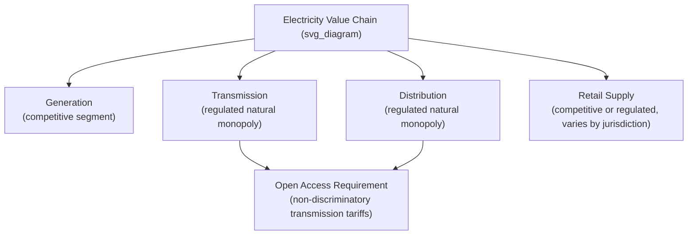

## Transmission and Distribution Economics as Natural Monopolies

### Conceptual Foundation

#### Defining Natural Monopoly

A **natural monopoly** exists when a single firm can supply the entire relevant market at lower total cost than any combination of two or more firms — formally, when the cost function $C(q)$ is **subadditive** over the relevant range of output:

$$C(q_1 + q_2 + \dots + q_n) < C(q_1) + C(q_2) + \dots + C(q_n) \quad \text{for any split of total output } q_1, \dots, q_n$$

Subadditivity is frequently, though not exclusively, associated with **economies of scale** (declining average cost as output rises) and, in network industries, **economies of scale in network density** — the property that laying and operating a second, parallel wire network alongside an existing one is enormously wasteful relative to expanding capacity on the existing network. Transmission and distribution (T&D) wires businesses are the textbook contemporary example, alongside water pipes, natural gas pipelines, and (historically) fixed-line telephony local loops.

#### Why Generation Is Different from Wires

The economic case for restructuring electricity into competitive and monopoly segments rests on this distinction: **generation** (and, more recently, retail supply) exhibits cost structures where multiple competing firms can coexist efficiently — plants of efficient scale can be built by multiple independent owners, and dispatch competition among them is welfare-improving. **Transmission and distribution wires**, by contrast, retain the subadditive cost structure that justifies continued monopoly franchise and rate regulation even after the rest of the industry is restructured. This generation/wires distinction, formalized in the U.S. through FERC Order 888 (1996, requiring open-access transmission and functional unbundling) and analogous unbundling requirements under the EU's Electricity Directives, is the structural foundation of essentially every modern electricity market design.

---

### Cost Structure Analysis

#### Sources of Subadditivity in Wires Businesses

1. **High fixed, sunk capital costs relative to marginal cost of throughput:** Building a transmission line or distribution feeder requires large upfront capital investment (right-of-way acquisition, poles/towers, conductors, transformers, substations) that is overwhelmingly sunk once installed, while the marginal cost of transmitting an additional MWh over existing capacity is very low (limited to incremental line losses) until the line approaches its thermal or stability limit.
2. **Economies of scale in conductor capacity:** The cost of a transmission line does not scale linearly with its power-carrying capacity — a higher-voltage line carries dramatically more power per unit of right-of-way, tower, and (per-MW) conductor cost than two lower-voltage lines carrying the same aggregate power, since transmittable power scales roughly with the square of voltage for a given current-carrying (thermal) limit, while structural/right-of-way costs scale much less than proportionally with voltage.

$$P \approx \sqrt{3} \, V \, I \cos\phi$$

for three-phase AC transmission, where $P$ is real power, $V$ is line voltage, $I$ is current, and $\cos\phi$ is the power factor — illustrating that doubling voltage roughly doubles power-carrying capacity for the same current (and hence similar conductor thermal/current-carrying cost), producing strong scale economies in higher-voltage, higher-capacity corridors.

3. **Economies of density in distribution networks:** Distribution cost per customer served falls sharply as customer density rises within a service territory (a phenomenon sometimes called *economies of scale in the number of customers per unit of network*), which is why rural distribution costs per customer are structurally higher than urban costs per customer — a fact with direct implications for rural electrification subsidy policy and rate design (discussed below).
4. **Redundancy/reliability trade-off vs. duplication:** While a single network avoids the waste of duplicate parallel infrastructure, well-designed transmission and distribution networks still require engineered redundancy (N-1 contingency planning, looped rather than purely radial distribution feeders in higher-reliability applications) — this is *planned* redundancy within a single, coordinately-operated network, economically distinct from the wasteful duplication that would result from two independently-owned, uncoordinated competing wires networks serving the same customers.

#### Empirical Evidence and the Limits of the Natural Monopoly Argument

The natural monopoly characterization of T&D is well-established but not unconditional:

- **Contestability at the margin:** Some transmission investment, particularly large new interregional lines or merchant transmission projects built to connect specific generation to specific load (e.g., some HVDC interconnectors), has been opened to competitive development and ownership in several jurisdictions (FERC Order 1000's competitive transmission developer provisions in some regions; merchant HVDC lines in Europe and the U.S.), suggesting the natural monopoly argument applies most cleanly to the *existing, already-built local and backbone network*, less unambiguously to *all prospective new transmission investment*, where competitive solicitation of transmission developers can sometimes substitute for automatic incumbent-utility cost-of-service construction. [Inference — the degree to which competitive transmission development actually achieves cost savings versus incumbent build is empirically debated and highly project- and jurisdiction-specific.]
- **Distributed energy resources (DERs) and the "death of natural monopoly" debate:** The proliferation of behind-the-meter solar, storage, and demand flexibility has prompted a live academic and regulatory debate over whether sufficiently cheap DERs could, at the margin, substitute for distribution network capacity expansion (a customer investing in storage instead of the utility upgrading a constrained feeder) — sometimes framed as "non-wires alternatives" (NWAs) — without actually eliminating the underlying natural monopoly character of the *core* distribution network itself. [Note: this is an active, unsettled area of regulatory economics research and policy experimentation (e.g., New York's REV proceeding, various state NWA pilot programs), not a resolved question.]

---

### Regulatory Frameworks for Natural Monopoly Wires Businesses

Because the natural monopoly cost structure means the profit-maximizing unregulated monopolist would restrict output and charge a price well above marginal cost (the classic monopoly deadweight-loss result), some form of rate regulation is nearly universal for T&D. The primary frameworks are:

#### 1. Cost-of-Service / Rate-of-Return Regulation (Traditional Model)

The utility's allowed revenue is set to recover prudently incurred operating costs plus a regulator-approved return on its rate base (net invested capital):

$$\text{Revenue Requirement} = \text{Operating Expenses} + \text{Depreciation} + (\text{Rate Base} \times \text{Allowed Rate of Return})$$

where Rate Base is typically the original cost of utility plant in service, less accumulated depreciation, plus working capital allowances. This is the **Averch-Johnson (1962)** framework's subject: because the allowed return is applied to the capital rate base, cost-of-service regulation as classically structured creates an incentive to over-capitalize (substitute capital for other inputs beyond the cost-minimizing mix) if the allowed rate of return exceeds the utility's true cost of capital — the so-called **Averch-Johnson effect**, a foundational result in regulatory economics predicting a systematic capital bias under naive rate-of-return regulation.

**Regulatory lag** (the multi-year gap between when costs are incurred and when a rate case adjusts rates to reflect them) partially offsets the pure Averch-Johnson prediction by reintroducing some cost-minimization incentive between rate cases, which is part of why regulatory economists have historically viewed lag as a (crude, second-best) efficiency-inducing feature rather than purely an administrative inconvenience.

#### 2. Incentive Regulation: Price Caps and Revenue Caps

Developed substantially in response to Averch-Johnson-type inefficiency concerns and pioneered in UK utility privatization (Littlechild's 1983 report recommending RPI-X regulation for British Telecom, subsequently applied to UK energy networks), **incentive regulation** decouples the regulated firm's allowed prices or revenues from its realized costs over a multi-year period, giving the firm a stronger incentive to cut costs (since it retains the savings) while regulators periodically reset the cap based on updated cost and productivity benchmarks.

**Price cap (RPI-X) regulation:**

$$P_t = P_{t-1} \times (1 + RPI_t - X)$$

where $RPI_t$ is a general inflation index and $X$ is a regulator-determined productivity offset (the expected rate of efficiency improvement the firm should achieve relative to general inflation), set based on historical productivity trends, benchmarking against comparable utilities, or engineering cost studies.

**Revenue cap regulation:** Similar in spirit but caps total allowed revenue rather than per-unit price, which — unlike a pure price cap — removes the utility's incentive to inflate sales volume to increase revenue, an important distinction in an era where regulators want utilities to support (not resist) energy efficiency and demand-side management, since a pure price-cap utility earning revenue per kWh sold has a built-in disincentive to promote conservation. Most U.S. distribution utilities under modern performance-based ratemaking use revenue-cap or "decoupling" mechanisms for exactly this reason (see below).

#### 3. Revenue Decoupling

A specific mechanism, now adopted by a majority of U.S. states in some form, that breaks the link between a utility's *sales volume* and its *revenue* by true-ing up actual revenue collected against the regulator-approved revenue requirement through a periodic (often annual) reconciliation rider, regardless of whether actual kWh sales were higher or lower than forecast. This removes the "throughput incentive" — the utility's inherent financial interest in selling more electricity — which is particularly important where regulators simultaneously want utilities to actively promote demand-side energy efficiency programs that reduce their own sales.

#### 4. Total Expenditure (Totex) and Multi-Year Performance-Based Regulation

The UK's **RIIO** framework (Revenue = Incentives + Innovation + Outputs, administered by Ofgem for GB electricity and gas transmission/distribution networks since 2013, now in its RIIO-2/RIIO-ED2 iterations) represents a more sophisticated evolution: rather than separately regulating capital expenditure (capex, traditionally rate-based) and operating expenditure (opex, traditionally expensed), **totex regulation** treats total expenditure as a single pool, removing the capex-bias incentive structurally embedded in the Averch-Johnson framework, combined with explicit output-based performance incentives (reliability, customer satisfaction, environmental outputs) and an "uncertainty mechanism" allowing defined cost categories to be trued up for genuinely uncertain items (e.g., load growth from electrification). [Note: RIIO's specific parameters and price-control periods are periodically revised by Ofgem; current RIIO-3 electricity distribution parameters should be verified against Ofgem's current publications for any time-sensitive analysis.]

---

### Comparative Regulatory Model Summary

| Framework | Primary Jurisdictions | Core Mechanism | Key Efficiency Property |
| --- | --- | --- | --- |
| Cost-of-service / rate-of-return | Most U.S. states (traditional base) | Revenue tied to prudent cost + return on rate base | Simple, cost-recovery-certain; prone to Averch-Johnson capital bias absent offsetting incentive mechanisms |
| Price cap (RPI-X) | UK (historical, pre-RIIO), various privatized European utilities | $P_t = P_{t-1}(1+RPI-X)$ | Strong cost-cutting incentive; can under-incentivize quality/reliability investment if not paired with output metrics |
| Revenue cap / decoupling | Most modern U.S. state distribution utilities | Revenue trued up independent of sales volume | Removes utility disincentive to support energy efficiency/DER growth |
| Totex / RIIO (output-based) | Great Britain (Ofgem-regulated networks) | Single expenditure pool + output/incentive scores | Removes capex/opex regulatory distortion; explicit multi-dimensional output incentives |
| Formula/forward-test-year ratemaking | Various U.S. states (e.g., NY's "multi-year rate plans") | Multi-year pre-set rate path with limited reopeners | Reduces regulatory lag transaction costs while retaining some incentive properties |

---

### Access Pricing: Setting Transmission and Distribution Tariffs

Given the monopoly wires segment must be *open* to all generators, suppliers, and (increasingly) DERs on non-discriminatory terms, a central applied question is how to price access to the network.

#### Postage-Stamp vs. Locational (Distance/Congestion-Based) Pricing

- **Postage-stamp pricing:** A single, uniform per-kW or per-kWh transmission access charge regardless of the actual electrical distance or path used — administratively simple, widely used for U.S. transmission network (non-locational) service charges, but does not send efficient locational signals for generation siting.
- **Locational pricing (embedded in LMP):** As discussed in wholesale market design, Locational Marginal Pricing embeds transmission congestion and loss costs directly into the energy price at each node, which functions as an implicit, efficient transmission access/usage charge for the congestion component, distinct from postage-stamp charges for the "embedded cost" (sunk, historical investment) component of the network, which most U.S. transmission tariffs still recover via a separate, non-locational charge.
- **Distribution network tariffs and the "cost-causation" principle:** Distribution rate design (fixed customer charges, volumetric per-kWh charges, and increasingly, demand or capacity-based charges reflecting a customer's contribution to peak network loading) is subject to extensive, jurisdiction-specific ratemaking litigation over how to allocate the fundamentally joint and common costs of a shared network across heterogeneous customer classes — a cost-allocation problem economically related to, but methodologically distinct from, the wholesale/transmission pricing problem, since most distribution cost is driven by the network's design capacity (a function of peak, coincident demand) rather than by energy throughput.

#### Rate Design Tension from Distributed Generation

Net energy metering (NEM) for behind-the-meter solar, compensating exported solar generation at or near the volumetric retail rate, has become a major applied controversy precisely because of the fixed-cost-recovery structure of distribution rates: if a large share of a distribution utility's genuinely fixed network costs are recovered through a *volumetric* (per-kWh) charge (as is traditional), a customer who installs solar and reduces net kWh purchases reduces their contribution to fixed network cost recovery without proportionally reducing their reliance on the network (they still need full network capacity available for nighttime and cloudy-day consumption) — creating a **cost-shift** debate over whether non-solar customers subsidize solar customers' fixed-cost avoidance. This has driven a wave of state proceedings (California's NEM 3.0/"net billing" reform, and numerous other state dockets) moving toward compensation mechanisms and fixed/demand-charge rate redesigns intended to better align distribution rate design with the underlying joint-and-common-cost structure of the network. [Note: NEM reform is one of the most actively and contentiously litigated topics in current U.S. utility regulation; specific state outcomes should be verified against current dockets.]

---

### Worked Example: Rate Base and Revenue Requirement Calculation

A distribution utility has the following (illustrative, stylized) financial parameters for a test year:

- Gross plant in service: $2,000 million
- Accumulated depreciation: $600 million
- Working capital allowance: $40 million
- Operating expenses (O&M, taxes excluding income tax): $180 million
- Depreciation expense: $70 million
- Regulator-approved rate of return (weighted average cost of capital): 7.5%

$$\text{Rate Base} = 2{,}000 - 600 + 40 = \$1{,}440 \text{ million}$$

$$\text{Return Component} = 1{,}440 \times 0.075 = \$108 \text{ million}$$

$$\text{Revenue Requirement} = 180 + 70 + 108 = \$358 \text{ million}$$

If the utility serves 500,000 customers with average annual consumption of 8,000 kWh (4,000 GWh total), the resulting average distribution rate component would be:

$$\frac{358{,}000{,}000}{4{,}000{,}000{,}000} \approx \$0.0895/\text{kWh}$$

This illustrates the mechanical link between rate base growth (driven by capital investment — grid modernization, resilience hardening, electrification-driven capacity additions) and retail distribution rates, which is the underlying reason rapidly rising utility capital expenditure programs (increasingly common amid grid modernization and electrification load growth) translate relatively directly into rising delivery-charge components of customer bills, independent of any change in commodity/generation costs.

---

### Key Points

- Transmission and distribution retain a subadditive cost structure (high sunk fixed costs, scale economies in conductor capacity and network density) that justifies continued rate regulation even where generation and retail supply have been restructured into competitive segments.
- Traditional cost-of-service/rate-of-return regulation is subject to the Averch-Johnson capital-bias prediction; incentive regulation (price caps, revenue caps, totex/RIIO-style output-based frameworks) was developed substantially to address this and related inefficiencies.
- Revenue decoupling is now widespread in U.S. distribution regulation specifically to remove the utility's financial disincentive to support energy efficiency and DER adoption.
- Access pricing splits into an efficient, locational congestion/loss component (embedded in LMP) and a non-locational embedded-cost recovery component (typically postage-stamp), a distinction that recurs across transmission and, in modified form, distribution rate design.
- The net metering/cost-shift controversy is fundamentally a consequence of recovering largely fixed, capacity-driven distribution costs through volumetric per-kWh rates, and is driving an active wave of distribution rate redesign.
- The natural monopoly characterization is robust for the core, already-built wires network but is increasingly contested at the margin for new transmission investment (competitive transmission development) and, more speculatively and controversially, for portions of future distribution capacity (non-wires alternatives).

---

### Related Topics

- Averch-Johnson effect and capital-bias models of rate-of-return regulation in depth
- Locational Marginal Pricing (LMP) decomposition: energy, congestion, and loss components
- Performance-Based Ratemaking (PBR) and multi-year rate plan design
- UK RIIO framework (RIIO-2, RIIO-ED2/RIIO-3) — totex and output-based incentive mechanics
- Net Energy Metering (NEM) reform and cost-shift analysis (California NEM 3.0 case study)
- Non-Wires Alternatives (NWAs) and distributed energy resources as substitutes for network investment
- FERC Order 1000 and competitive transmission development
- Cost allocation and rate design across customer classes (embedded cost of service studies, marginal cost pricing in distribution)
- Regulatory lag and its efficiency-incentive implications in traditional ratemaking