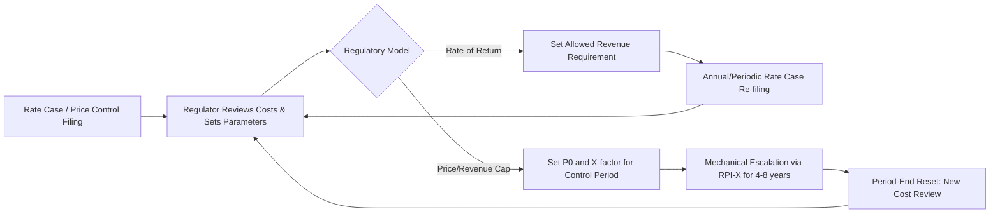

## Rate-of-Return vs Incentive/Price-Cap Regulation

### Overview

Electricity networks (transmission and distribution) are natural monopolies: duplicating wires is wasteful, so a single firm typically serves a given territory. Absent competition, regulators must set prices or revenues to prevent monopoly rents while still allowing the utility to recover costs and earn a fair return on capital. Two dominant regulatory paradigms address this: **rate-of-return (cost-of-service) regulation** and **incentive regulation**, of which **price-cap** (and the closely related revenue-cap) regulation is the most common variant. Some jurisdictions use hybrids that blend elements of both.

### Rate-of-Return (Cost-of-Service) Regulation

#### Core Mechanism

Under rate-of-return (RoR) regulation, the regulator sets prices so that the utility's allowed revenue equals its cost of service, including a specified return on invested capital. The canonical formula for the **revenue requirement** is:

$$RR = O + D + T + (RB \times r)$$

Where:

- $RR$ = total allowed revenue requirement
- $O$ = operating and maintenance expenses
- $D$ = depreciation expense
- $T$ = taxes
- $RB$ = rate base (the value of invested capital, typically net of accumulated depreciation)
- $r$ = the allowed rate of return (weighted average cost of capital, or WACC)

The allowed rate of return itself is usually a weighted average of the cost of debt and the regulator-determined cost of equity:

$$r = \left(\frac{D_{cap}}{V}\right) r_d (1-\tau) + \left(\frac{E}{V}\right) r_e$$

Where $D_{cap}$ and $E$ are the debt and equity components of the capital structure, $V$ is total firm value, $r_d$ is the cost of debt, $\tau$ is the corporate tax rate, and $r_e$ is the cost of equity (often estimated via CAPM or discounted cash flow models).

#### Regulatory Process

1. **Rate case filing**: the utility submits a request detailing its test-year costs, capital expenditures, and proposed rate base.
2. **Prudency review**: the regulator (or intervenors) scrutinizes whether costs were prudently incurred — i.e., reasonable given information available at the time.
3. **Rate base determination**: assets are valued (original cost less depreciation is standard in the US; some jurisdictions use replacement cost).
4. **Cost of capital determination**: the regulator sets the allowed $r_e$ and verifies $r_d$.
5. **Rate design**: the approved revenue requirement is translated into per-unit tariffs across customer classes.

#### Incentive Properties

- **Averch–Johnson effect**: because allowed profit is proportional to rate base, RoR regulation creates an incentive to over-capitalize (the "gold-plating" problem) whenever the allowed return exceeds the true cost of capital. This is the most cited theoretical critique of RoR regulation.
- **Weak cost-control incentive**: because costs are passed through into the revenue requirement, the utility bears little residual risk from cost overruns between rate cases; there is limited incentive to minimize $O$.
- **Regulatory lag** as a partial offset: between rate cases, a utility that reduces costs keeps the resulting profit (or absorbs the loss), which provides some efficiency incentive. Longer lag increases incentive intensity but also increases the utility's earnings risk.
- **Low investment risk for the utility**, which supports low costs of capital and is well suited to capital-intensive, long-lived network assets.

### Incentive Regulation

Incentive regulation was developed largely in response to the weak cost-efficiency incentives of RoR regulation, drawing on regulatory economics work from the 1980s (notably associated with Stephen Littlechild's design of the UK's RPI−X framework for British Telecom, later extended to energy networks).

#### Price-Cap (RPI−X) Regulation

**Mechanism**: the regulator sets an initial price level and then allows it to escalate with inflation minus an efficiency offset $X$:

$$P_t = P_{t-1} \times (1 + RPI - X)$$

Where:

- $P_t$ = allowed price (or price index) in year $t$
- $RPI$ = the relevant inflation index (Retail Price Index, CPI, or a sector-specific input price index)
- $X$ = the efficiency factor, reflecting expected productivity growth the regulator requires the firm to pass through to customers

The price cap is typically applied to a **basket of services** weighted by output, allowing the utility flexibility in how it prices individual components as long as the weighted average respects the cap.

**Multi-year determinations**: price caps are set for a fixed regulatory period (commonly 4–8 years). Within the period, prices move mechanically with the formula; costs are not re-examined. At the end of the period, the regulator resets $P_0$ and $X$ based on updated cost and demand information — this reset process is where most of the regulatory scrutiny (and gaming) occurs.

#### Revenue-Cap Regulation

A close variant, common in electricity transmission and distribution (since network revenues have large fixed-cost components and volume can be weather- or economy-driven), caps total allowed revenue rather than the per-unit price:

$$R_t = R_{t-1} \times (1 + RPI - X) \pm \text{adjustments}$$

This removes the utility's incentive to inflate sales volumes to raise revenue under a price cap, but can weaken incentives to serve additional demand efficiently. Adjustments often include:

- **Cost pass-throughs** for uncontrollable expenses (e.g., certain fuel or purchased-power costs)
- **Capex/opex trackers** for major, lumpy investments
- **Reliability and service-quality adjustments** (bonuses/penalties tied to performance metrics such as SAIDI/SAIFI)

#### Sliding-Scale and Hybrid Mechanisms

- **Sliding-scale (or partial) regulation**: profits above/below a benchmark are shared between shareholders and customers according to a sharing ratio, blending RoR's cost pass-through with price-cap's efficiency incentive.
- **Yardstick competition**: prices or allowed revenues for one utility are benchmarked against the costs of comparable utilities (often using econometric or DEA-based efficiency frontiers), so no single firm's own costs directly determine its own prices — this sharpens cost-reduction incentives, since gold-plating one's own rate base no longer raises one's own allowed revenue.
- **Total Expenditure (Totex) frameworks**: used in UK RIIO-style regulation, blending capex and opex into a single allowance to remove the capex bias inherent in RoR-style regulation (since under RoR, only capex enters rate base and earns a return, biasing utilities toward capital solutions over cheaper operational ones).

### Comparative Analysis

| Dimension | Rate-of-Return | Price-Cap / Incentive |
| --- | --- | --- |
| **Cost-efficiency incentive** | Weak between rate cases; regulatory lag is the main lever | Strong: cost savings within the price-control period accrue to the firm |
| **Investment incentive** | Averch–Johnson over-capitalization risk | Risk of under-investment or under-maintenance if $X$ is set too aggressively |
| **Risk allocation** | Cost risk mostly borne by customers (via pass-through); utility risk is low | Cost risk mostly borne by the utility during the price-control period |
| **Cost of capital** | Lower (low risk to utility) | Higher (utility bears more risk), all else equal |
| **Information requirements** | High and recurring (each rate case) | High at reset, minimal during the interim period |
| **Administrative cost** | High — frequent, detailed rate cases | Lower during the control period, high at periodic resets |
| **Gaming behavior** | Padding the rate base and test-year costs | Strategic cost/investment reporting ahead of the reset ("ratchet effect") |
| **Best suited to** | Environments needing tight cost oversight, high political sensitivity to windfall profits | Environments where regulators want to induce productivity gains and can tolerate temporary profit variance |

### The Ratchet Effect and Regulatory Reset Problem

A central weakness of pure incentive regulation is the **ratchet effect**: if the regulator uses a firm's realized costs to set the next period's $X$ or revenue cap, a rational firm anticipates this and moderates its cost-cutting effort near the end of a control period, since large efficiency gains today invite a tighter cap tomorrow. This creates a dynamic tension: incentive regulation is most powerful the longer the "commitment" to not revise the formula, but regulators cannot credibly commit not to use new cost information at the next reset. Mechanisms used to mitigate this include:

- Fixed, pre-announced reset dates and multi-year (rather than annual) rebasing
- Yardstick/benchmarking approaches, which weaken the link between a firm's own reported costs and its own future allowance
- Efficiency-sharing mechanisms that split gains between the firm and customers rather than clawing back 100%

### Real-World Implementation Examples

- **United States**: electric utilities are predominantly regulated under RoR/cost-of-service frameworks by state public utility commissions (PUCs), historically justified by the *Hope Natural Gas* (1944) and *Bluefield* (1923) US Supreme Court standards, which require that allowed returns be sufficient to maintain credit and attract capital, without mandating any specific methodology.
- **United Kingdom**: Ofgem's electricity and gas network regulation evolved from RPI−X price caps (1990s) to the **RIIO** framework (Revenue = Incentives + Innovation + Outputs), a totex-based, output-focused incentive model with explicit innovation funding and multi-year price controls (typically 5–8 years).
- **Australia**: the Australian Energy Regulator (AER) uses a **building-block revenue-cap** approach for transmission and distribution networks, combining elements of both paradigms — a cost-of-service "building block" revenue requirement is set for a regulatory period, then converted into a multi-year revenue path with CPI−X-style escalation and incentive schemes (e.g., the Efficiency Benefit Sharing Scheme) layered on top.
- **European Union**: most member states use variants of revenue-cap or hybrid regulation for transmission system operators (TSOs) and distribution system operators (DSOs), often incorporating output-based incentives for renewable integration and reliability.

### Diagram: Regulatory Mechanism Comparison (svg_diagram)

<svg xmlns="http://www.w3.org/2000/svg" viewBox="0 0 900 480">
<text x="450" y="30" font-size="20" font-weight="bold" text-anchor="middle" fill="#1a1a1a">Rate-of-Return vs Incentive Regulation (svg_diagram)</text>

<rect x="40" y="70" width="380" height="360" rx="10" fill="#eef3fb" stroke="#2f5fa3" stroke-width="2" />
<text x="230" y="100" font-size="16" font-weight="bold" text-anchor="middle" fill="#2f5fa3">Rate-of-Return Regulation</text>
<rect x="70" y="120" width="320" height="50" rx="6" fill="#ffffff" stroke="#2f5fa3" />
<text x="230" y="140" font-size="12" text-anchor="middle">Revenue Requirement =</text>
<text x="230" y="158" font-size="12" text-anchor="middle">O + D + T + (Rate Base × r)</text>
<line x1="230" y1="170" x2="230" y2="195" stroke="#2f5fa3" stroke-width="2" marker-end="url(#arrow1)" />
<rect x="70" y="195" width="320" height="55" rx="6" fill="#ffffff" stroke="#2f5fa3" />
<text x="230" y="215" font-size="12" text-anchor="middle" font-weight="bold">Costs pass through to price</text>
<text x="230" y="232" font-size="11" text-anchor="middle">Utility risk: low</text>
<line x1="230" y1="250" x2="230" y2="275" stroke="#2f5fa3" stroke-width="2" marker-end="url(#arrow1)" />
<rect x="70" y="275" width="320" height="55" rx="6" fill="#fff4f0" stroke="#c0503a" />
<text x="230" y="295" font-size="12" text-anchor="middle" font-weight="bold">Averch–Johnson effect</text>
<text x="230" y="312" font-size="11" text-anchor="middle">Incentive to over-capitalize rate base</text>
<line x1="230" y1="330" x2="230" y2="355" stroke="#2f5fa3" stroke-width="2" marker-end="url(#arrow1)" />
<rect x="70" y="355" width="320" height="55" rx="6" fill="#fff4f0" stroke="#c0503a" />
<text x="230" y="375" font-size="12" text-anchor="middle" font-weight="bold">Weak cost-efficiency incentive</text>
<text x="230" y="392" font-size="11" text-anchor="middle">Offset only by regulatory lag</text>

<rect x="480" y="70" width="380" height="360" rx="10" fill="#eefaf0" stroke="#2f8f4e" stroke-width="2" />
<text x="670" y="100" font-size="16" font-weight="bold" text-anchor="middle" fill="#2f8f4e">Price-Cap / Incentive Regulation</text>
<rect x="510" y="120" width="320" height="50" rx="6" fill="#ffffff" stroke="#2f8f4e" />
<text x="670" y="140" font-size="12" text-anchor="middle">Price(t) = Price(t-1) × (1 + RPI − X)</text>
<text x="670" y="158" font-size="11" text-anchor="middle">Fixed multi-year control period</text>
<line x1="670" y1="170" x2="670" y2="195" stroke="#2f8f4e" stroke-width="2" marker-end="url(#arrow2)" />
<rect x="510" y="195" width="320" height="55" rx="6" fill="#ffffff" stroke="#2f8f4e" />
<text x="670" y="215" font-size="12" text-anchor="middle" font-weight="bold">Cost risk shifted to utility</text>
<text x="670" y="232" font-size="11" text-anchor="middle">Savings kept by firm during period</text>
<line x1="670" y1="250" x2="670" y2="275" stroke="#2f8f4e" stroke-width="2" marker-end="url(#arrow2)" />
<rect x="510" y="275" width="320" height="55" rx="6" fill="#f0f8ff" stroke="#2f5fa3" />
<text x="670" y="295" font-size="12" text-anchor="middle" font-weight="bold">Strong efficiency incentive</text>
<text x="670" y="312" font-size="11" text-anchor="middle">Drives productivity gains</text>
<line x1="670" y1="330" x2="670" y2="355" stroke="#2f8f4e" stroke-width="2" marker-end="url(#arrow2)" />
<rect x="510" y="355" width="320" height="55" rx="6" fill="#fff4f0" stroke="#c0503a" />
<text x="670" y="375" font-size="12" text-anchor="middle" font-weight="bold">Ratchet effect at reset</text>
<text x="670" y="392" font-size="11" text-anchor="middle">Firms moderate effort pre-reset</text>
</svg>

### Regulatory Period Timeline

### Worked Example: Price-Cap Calculation

A distribution utility has an initial average tariff $P_0 = \$0.12$/kWh. The regulator sets $X = 1.5\%$ and inflation (RPI) is forecast at $3.0\%$ annually.

$$P_1 = 0.12 \times (1 + 0.030 - 0.015) = 0.12 \times 1.015 = \$0.1218/\text{kWh}$$

$$P_2 = 0.1218 \times 1.015 \approx \$0.1236/\text{kWh}$$

If the utility manages to cut real operating costs by 3% per year (outperforming the 1.5% $X$-factor built into the cap), it retains the extra 1.5 percentage points of margin as profit for the remainder of the control period — this captured margin is the mechanism's core efficiency incentive. At the next periodic reset, the regulator will observe the utility's realized (lower) cost base and likely tighten $X$ accordingly, illustrating the ratchet effect discussed above.

### Choosing Between Frameworks: Key Trade-offs

- **Political and legal context**: US-style due-process requirements around "just and reasonable rates" have historically favored the transparency and case-by-case scrutiny of RoR regulation.
- **Regulatory capacity**: incentive regulation demands strong econometric/benchmarking capability at reset; RoR demands strong accounting and prudency-review capability continuously.
- **Investment cycle**: RoR's built-in return on rate base can better support very large, lumpy capital programs (e.g., grid modernization, transmission expansion), which is part of why many transmission systems retain RoR or hybrid revenue-cap-with-capex-tracker designs even where retail incentive regulation has been adopted elsewhere.
- **Maturity of the network**: newly privatized or newly regulated utilities (e.g., post-liberalization UK, Latin American privatizations of the 1990s) often started with price caps to force rapid efficiency catch-up relative to inherited cost bases.

[Inference] The specific choice of $X$-factor and control-period length in any given jurisdiction reflects a case-by-case political and technical negotiation; the stylized comparisons above describe general tendencies documented in the regulatory economics literature rather than universal outcomes, and actual utility behavior may vary based on capital market conditions, statutory constraints, and regulator credibility.

### Related Topics

- Averch–Johnson effect and capital-bias distortions in depth
- Cost of capital estimation for regulated utilities (CAPM, DCF approaches)
- RIIO framework and totex-based regulation in detail
- Yardstick competition and DEA/stochastic frontier benchmarking
- Regulatory asset base (RAB) valuation methods
- Performance-based ratemaking (PBR) in US electric utilities
- Stranded cost recovery in transitions between regulatory regimes
- Multi-year rate plans (MYRPs) as a US hybrid approach
- Reliability-based incentive mechanisms (SAIDI/SAIFI performance payments)
- Regulatory lag and its role as an implicit incentive device