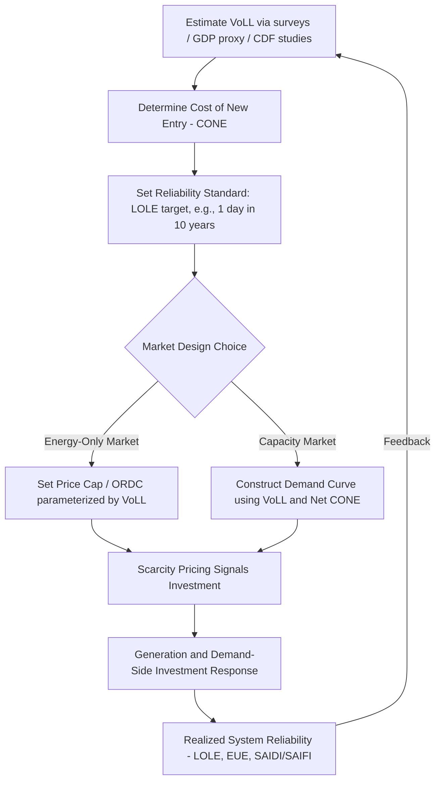

## Grid Reliability Economics and Value of Lost Load

### Conceptual Foundations

**Key Points**

- Electricity reliability is an economic good with quantifiable costs and benefits, not merely an engineering constraint
- Reliability economics balances the cost of preventing outages against the cost of experiencing them
- The core trade-off is between investment in generation/transmission capacity (or demand-side flexibility) and the economic damage caused by supply interruptions
- Unlike most commodities, electricity cannot be economically stored in bulk at scale (though this is changing with batteries), so supply and demand must balance instantaneously

Electricity systems are designed to a reliability standard rather than 100% reliability, because achieving zero outages would require infinite capacity and infinite cost. The optimal level of reliability is where the marginal cost of additional capacity equals the marginal benefit of avoided outages.

### Value of Lost Load (VoLL): Definition

**Key Points**

- VoLL represents the economic value that consumers place on electricity supply, measured as the cost incurred per unit of unserved energy
- Typically expressed in $/MWh (or local currency per MWh)
- VoLL is a demand-side concept: it reflects what consumers would be willing to pay to avoid an outage, or equivalently, the loss they suffer when supply is interrupted
- It underpins the economically efficient level of reliability, generation adequacy standards, and the setting of price caps in wholesale electricity markets

Formally, VoLL is often defined as:

$$VoLL = \frac{\text{Total economic loss from an outage}}{\text{Energy not served (MWh)}}$$

VoLL varies significantly by:

- Customer class (residential, commercial, industrial)
- Duration of interruption (short vs. prolonged outages)
- Time of day, season, and weather conditions
- Sector-specific dependency on continuous power (e.g., hospitals, data centers, aluminum smelters vs. residential lighting loads)

### Why VoLL Matters: The Reliability-Cost Trade-off

The socially optimal level of reliability minimizes the sum of:

1. **Cost of reliability investment (CRI):** capacity, transmission, reserves, ancillary services
2. **Expected cost of unserved energy (ECOUE):** VoLL × expected energy not served

$$\text{Total Social Cost} = CRI(Q) + VoLL \times EENS(Q)$$

where $Q$ is the level of reliability-enhancing investment and $EENS$ is expected energy not served, which decreases as $Q$ increases.

The optimum occurs where:

$$\frac{dCRI}{dQ} = -VoLL \times \frac{dEENS}{dQ}$$

This is the standard economic efficiency condition: invest in reliability up to the point where the marginal cost of an additional unit of reliability equals the marginal benefit (avoided expected outage cost).

**(svg_diagram) Reliability-Cost Trade-off**

<svg xmlns="http://www.w3.org/2000/svg" viewBox="0 0 640 420" font-family="Helvetica, Arial, sans-serif">
<text x="320" y="24" text-anchor="middle" font-size="16" font-weight="bold" fill="#1a1a1a">Reliability Investment vs. Outage Cost Trade-off (svg_diagram)</text>
<line x1="70" y1="360" x2="600" y2="360" stroke="#333" stroke-width="2" />
<line x1="70" y1="360" x2="70" y2="50" stroke="#333" stroke-width="2" />
<text x="335" y="395" text-anchor="middle" font-size="13" fill="#333">Reliability Investment Level (Q)</text>
<text x="30" y="205" text-anchor="middle" font-size="13" fill="#333" transform="rotate(-90 30 205)">Cost (\$)</text>
<path d="M 90 90 C 200 100, 350 160, 580 340" stroke="#2563eb" stroke-width="2.5" fill="none" />
<text x="500" y="330" font-size="12" fill="#2563eb">Cost of Reliability Investment</text>
<path d="M 90 340 C 200 300, 350 160, 580 90" stroke="#dc2626" stroke-width="2.5" fill="none" />
<text x="360" y="120" font-size="12" fill="#dc2626">VoLL × Expected Unserved Energy</text>
<path d="M 90 190 C 200 155, 350 165, 580 260" stroke="#16a34a" stroke-width="3" fill="none" stroke-dasharray="6,3" />
<text x="420" y="200" font-size="12" fill="#16a34a" font-weight="bold">Total Social Cost</text>
<circle cx="300" cy="163" r="5" fill="#16a34a" />
<line x1="300" y1="163" x2="300" y2="360" stroke="#16a34a" stroke-width="1" stroke-dasharray="3,3" />
<text x="300" y="378" text-anchor="middle" font-size="12" fill="#16a34a" font-weight="bold">Q* (Optimal Reliability)</text>
</svg>

### Loss of Load Expectation (LOLE) and Reliability Standards

**Key Points**

- LOLE (Loss of Load Expectation) measures the expected number of hours (or days) per year that demand may exceed available supply
- A common industry standard is "1 event in 10 years" (LOLE of 0.1 days/year), used by many system operators (e.g., PJM, NGESO in Great Britain)
- LOLE is derived implicitly from VoLL and the Cost of New Entry (CONE) — the annualized cost of building new generation capacity

The relationship between LOLE-based reliability standards and VoLL is captured by the **economically optimal reliability standard**:

$$LOLE^* \text{ is set such that } VoLL \times LOLP = CONE$$

where $LOLP$ is the Loss of Load Probability in the relevant period. This equation says: build capacity up to the point where the expected value of an additional MW of capacity (its contribution to reducing expected outage cost) equals its annualized cost.

Rearranging, this gives the **Net CONE / VoLL ratio**, which underlies capacity market demand curve construction:

$$\text{Reliability Target} \propto \frac{CONE}{VoLL}$$

A higher VoLL implies society should tolerate less unserved energy and invest more in capacity; a lower VoLL implies the opposite.

### Measuring VoLL: Methodologies

**Key Points**

- VoLL is not directly observable in most markets (it is a non-market, often non-marginal cost), so it must be estimated via surveys, market behavior, or macroeconomic proxies
- No single "correct" VoLL exists; regulators typically publish VoLL estimates that vary by customer class and country

#### 1. Customer Damage Function / Willingness-to-Pay (WTP) Surveys

Directly survey consumers on WTP to avoid outages of varying duration, or willingness-to-accept (WTA) compensation for an outage. Widely used by regulators (e.g., AEMO in Australia, Ofgem in the UK).

- Strengths: directly captures consumer valuation, can be disaggregated by sector/duration
- Weaknesses: hypothetical bias, survey design sensitivity, difficulty capturing rare/extreme events [Inference: survey-based WTP estimates are generally considered a lower bound because respondents may undervalue rare catastrophic outages]

#### 2. Macroeconomic (GDP) Proxy Method

Approximates VoLL using the ratio of GDP to total electricity consumption:

$$VoLL_{proxy} = \frac{GDP}{\text{Total Electricity Consumption (MWh)}}$$

- Strengths: simple, uses readily available macro data
- Weaknesses: crude; assumes all electricity consumption contributes equally to GDP, ignores short-run substitution/backup capacity, and can produce values that diverge significantly from survey-based estimates [Unverified: magnitude of divergence depends heavily on the country/sector composition]

#### 3. Production Function / Engineering Approach

Estimates the direct economic loss from lost output in industrial/commercial processes (e.g., spoiled inventory, idle labor, restart costs) combined with residential inconvenience costs. Often used in customer interruption cost studies (e.g., LBNL's Interruption Cost Estimate (ICE) Calculator in the US).

#### 4. Revealed Preference from Backup Investment

Infers VoLL from observed spending on backup generators, uninterruptible power supplies (UPS), or insurance against outages — the amount spent reveals a lower bound on the value placed on avoiding outages.

**Example**

A hospital installs a $2 million backup generator system rated to cover 500 MWh of potential annual outage risk over its lifetime. This implies a revealed-preference VoLL floor of at least $4,000/MWh for that facility, since spending would not be rational unless the expected value of avoided outages exceeds the investment cost. [Inference: this is a floor estimate, not the true VoLL, since risk aversion and non-monetary factors like patient safety may inflate willingness to pay beyond a risk-neutral calculation]

### Typical VoLL Estimates by Sector

| Customer Class | Typical VoLL Range ($/MWh, illustrative) | Notes |
| --- | --- | --- |
| Residential | 2,000 – 30,000 | Highly variable by survey methodology and duration assumed |
| Commercial | 10,000 – 100,000 | Sensitive to business type (retail vs. server-dependent) |
| Industrial (continuous process) | 50,000 – 200,000+ | Steel, chemicals, semiconductor fabs; short outages can ruin batches |
| Critical infrastructure (hospitals, data centers) | Often treated as near-infinite or capped at a policy ceiling | Reflects safety-critical or catastrophic failure risk |
| System-wide average (used in capacity markets) | 5,000 – 20,000 (US, EU, Australia ranges vary) | Country-specific regulatory determinations |

[Unverified: exact figures vary substantially by jurisdiction, year, and study methodology — these ranges are illustrative and should be checked against the specific regulator's most recent VoLL determination, e.g., AEMO, PJM, ENTSO-E, or NERC publications]

### VoLL in Market Design: Price Caps and Scarcity Pricing

**Key Points**

- In energy-only markets (no separate capacity market), VoLL is used to set the wholesale price cap, since prices should be allowed to rise up to VoLL during scarcity to signal the true cost of unserved energy and incentivize both demand response and investment
- This is the theoretical basis for "scarcity pricing" mechanisms

The energy-only market efficient investment argument states that if prices are allowed to reach VoLL during shortage events, then the market itself provides the correct long-run investment signal, without a separate capacity mechanism, because:

$$E[\text{Scarcity Rents}] = VoLL \times LOLE \times \text{(duration factor)}$$

should, in equilibrium, equal the annualized fixed cost of the marginal (peaking) generation unit — the "missing money" problem is resolved if scarcity pricing is credible and sufficiently frequent.

**Example**

ERCOT (Texas) uses an administratively set price cap called VoLL (formally the "System-Wide Offer Cap") in its energy-only market design, historically set around $9,000/MWh, intended to proxy the value of lost load and allow scarcity pricing to reward capacity investment without a capacity market. [Inference: the specific cap level has been adjusted over time by regulators/legislators in response to events like Winter Storm Uri in February 2021; verify current cap value against ERCOT/PUCT current filings]

Operating reserve demand curves (ORDCs), such as those used in ERCOT, translate the probability of loss of load at a given reserve margin into an adder on real-time prices, explicitly parameterized by VoLL:

$$ORDC(Reserves) = VoLL \times LOLP(Reserves)$$

As reserves fall, LOLP rises, and the ORDC adds a scarcity premium to the real-time price, approaching VoLL as reserves approach zero.

### Capacity Markets vs. Energy-Only Markets: Role of VoLL

| Design | Reliability Mechanism | Role of VoLL |
| --- | --- | --- |
| Energy-only (e.g., ERCOT, historically Australia's NEM) | Scarcity pricing up to VoLL-based cap | VoLL directly caps prices and drives the ORDC/scarcity adder |
| Capacity market (e.g., PJM, ISO-NE, UK Capacity Market) | Administrative capacity procurement to meet LOLE target | VoLL used to derive the demand curve intercept (price at zero capacity) and the reliability target itself |

In capacity markets, the **Variable Resource Requirement (VRR) curve** or equivalent demand curve for capacity is anchored using VoLL and CONE:

$$P_{max} = Net\ CONE \times \left(\frac{VoLL}{Net\ CONE}\right)^{k}$$

(illustrative functional form; actual curve shapes vary by ISO and are calibrated to hit the target LOLE at the point where quantity equals the reliability requirement) [Inference: exact curve construction methodology differs by market operator and should be verified against the specific ISO/RTO tariff filings]

**(svg_diagram) Scarcity Pricing Mechanism (ORDC)**

<svg xmlns="http://www.w3.org/2000/svg" viewBox="0 0 640 380" font-family="Helvetica, Arial, sans-serif">
<text x="320" y="24" text-anchor="middle" font-size="16" font-weight="bold" fill="#1a1a1a">Operating Reserve Demand Curve (ORDC) (svg_diagram)</text>
<line x1="70" y1="330" x2="600" y2="330" stroke="#333" stroke-width="2" />
<line x1="70" y1="330" x2="70" y2="50" stroke="#333" stroke-width="2" />
<text x="335" y="360" text-anchor="middle" font-size="13" fill="#333">Available Operating Reserves (MW)</text>
<text x="30" y="190" text-anchor="middle" font-size="13" fill="#333" transform="rotate(-90 30 190)">Price (\$/MWh)</text>
<path d="M 100 70 C 200 90, 280 150, 350 250 C 420 310, 500 325, 580 328" stroke="#dc2626" stroke-width="3" fill="none" />
<line x1="100" y1="60" x2="600" y2="60" stroke="#7c3aed" stroke-width="1.5" stroke-dasharray="5,3" />
<text x="580" y="52" text-anchor="end" font-size="12" fill="#7c3aed" font-weight="bold">VoLL (price ceiling)</text>
<line x1="100" y1="330" x2="100" y2="60" stroke="#999" stroke-width="1" stroke-dasharray="3,3" />
<text x="100" y="345" text-anchor="middle" font-size="11" fill="#333">Zero Reserves</text>

<text x="250" y="140" font-size="12" fill="`#dc2626`">Price rises as LOLP increases</text>

<text x="450" y="300" font-size="12" fill="`#dc2626`">Price → normal energy cost as reserves are ample</text>

</svg>

### Demand-Side Response and VoLL Heterogeneity

**Key Points**

- Because VoLL varies enormously across customers (a hospital's VoLL for critical care circuits vastly exceeds a residential customer's VoLL for non-essential loads), efficient reliability is not "one size fits all"
- Demand response (DR) programs and differentiated reliability tariffs allow the system to exploit this heterogeneity
- Customers with low VoLL can be curtailed first (interruptible tariffs, direct load control) in exchange for lower rates, while customers with high VoLL pay a premium for guaranteed supply or invest in on-site backup

This underlies the economic logic of:

- **Interruptible/curtailable tariffs**: large industrial customers accept curtailment risk for a discount, effectively selling reliability back to the system at a price below their own VoLL but above the marginal cost of new capacity
- **Reliability differentiation / multi-tier reliability**: some jurisdictions and utilities are exploring tiered reliability products, allowing customers to select their own reliability level and pay accordingly — a form of Coasian bargaining over reliability that would not exist under a single system-wide standard [Inference: full implementation remains rare due to metering, cost-allocation, and regulatory complexity; treat as an emerging/aspirational policy direction rather than widespread current practice]

### Outage Cost Components (Customer Damage Functions)

When estimating VoLL for a customer class, cost studies typically decompose losses into:

1. **Direct costs**: lost production, spoiled materials, idle labor, equipment damage
2. **Indirect/downstream costs**: supply chain disruption, lost sales, reputational damage
3. **Restart costs**: costs to resume normal operations after power is restored (e.g., re-starting a blast furnace or chemical process)
4. **Inconvenience costs (residential)**: value of lost leisure time, discomfort, food spoilage, safety risk
5. **Safety and health costs**: elevated risk during medical equipment failure, traffic signal outages, etc. — often the most difficult to monetize and most contested in VoLL studies

Customer damage functions (CDFs) typically show VoLL declining with outage duration in $/MWh terms (i.e., the marginal cost of the first minute of an outage is very high, but cost per MWh falls somewhat as the outage extends, though total cumulative cost keeps rising) — reflecting fixed disruption costs versus variable costs of extended duration. [Inference: this declining-marginal-cost-per-MWh pattern is a commonly observed empirical regularity across CDF studies, though the specific shape and inflection points vary by customer type and study]

### Reliability Metrics Used by System Operators

**Key Points**

- LOLE (Loss of Load Expectation): expected hours/days per year with insufficient supply
- LOLP (Loss of Load Probability): probability of loss of load in a given period
- EUE / EENS (Expected Unserved Energy / Expected Energy Not Served): expected MWh of demand not served annually
- SAIDI (System Average Interruption Duration Index): average outage duration per customer per year (distribution-level reliability)
- SAIFI (System Average Interruption Frequency Index): average number of interruptions per customer per year
- CAIDI (Customer Average Interruption Duration Index): average duration per interruption event = SAIDI / SAIFI

$$SAIDI = \frac{\sum (\text{Customers Interrupted} \times \text{Interruption Duration})}{\text{Total Number of Customers Served}}$$

$$SAIFI = \frac{\sum \text{Customers Interrupted}}{\text{Total Number of Customers Served}}$$

These distribution-level indices (SAIDI/SAIFI/CAIDI) are typically used for reliability regulation and performance-based ratemaking at the utility/distribution level, while LOLE/EUE are used for generation adequacy planning at the bulk system level.

### Applying VoLL: Cost-Benefit Analysis of Reliability Investment

**Example**

Suppose a transmission upgrade costing $50 million annually (annualized capital + O&M) is projected to reduce expected unserved energy by 8,000 MWh/year in a region with an estimated VoLL of $10,000/MWh.

Expected annual benefit:

$$\text{Benefit} = VoLL \times \Delta EENS = \$10{,}000/MWh \times 8{,}000\ MWh = \$80{,}000{,}000$$

Since benefit ($80M) exceeds cost ($50M), the investment passes a basic cost-benefit test, yielding a net benefit of $30 million annually. [Inference: this is a simplified single-period illustration; real transmission planning cost-benefit analysis incorporates multi-year discounting, uncertainty/probabilistic weighting across weather and demand scenarios, and additional benefits like congestion relief and reduced losses]

### Blackout Case Studies and VoLL in Practice

**Example**

The February 2021 Texas power crisis (Winter Storm Uri) resulted in widespread multi-day outages affecting millions of customers. Post-event economic damage estimates ranged widely into the tens of billions of dollars, illustrating how realized outage costs during extreme, prolonged events can far exceed VoLL estimates calibrated from typical short-duration outage studies — highlighting a key limitation of standard VoLL methodologies for tail-risk events. [Unverified: precise aggregate damage figures vary substantially across different post-event studies and estimation methodologies; treat specific dollar totals as approximate and consult official post-event reports such as the FERC/NERC joint inquiry for authoritative figures]

This event also prompted debate over whether ERCOT's administratively set price cap accurately reflected true VoLL during a multi-day, life-threatening event, versus a routine short-duration shortage — reinforcing that VoLL is not a single fixed number but context- and duration-dependent. [Inference]

### Reliability Economics and Renewable Integration

**Key Points**

- Rising penetration of variable renewable energy (VRE) — wind and solar — changes the shape of reliability risk from "energy adequacy" (enough total generation) toward "capacity/flexibility adequacy" at specific hours (e.g., evening net-load peaks after solar output falls)
- This has led system operators to develop **Effective Load Carrying Capability (ELCC)** metrics, which measure how much a given resource (e.g., a battery or wind farm) contributes to reducing LOLE, relative to a fully firm/dispatchable unit
- VoLL remains the anchor for translating physical reliability risk (LOLE, EUE) into economic terms even as the risk profile shifts (e.g., "duck curve" ramping risk, multi-day wind droughts)

$$ELCC_i = \frac{\Delta \text{Firm Capacity Equivalent}}{\text{Nameplate Capacity of Resource } i}$$

Storage and demand response are increasingly valued via their marginal contribution to reducing EUE, priced at VoLL, rather than simple nameplate capacity credit — a more granular application of the same underlying reliability economics.

### Process Flow: From VoLL to Reliability Standard to Market Outcome

### Common Pitfalls and Debates in VoLL/Reliability Economics

**Key Points**

- **Single-value fallacy**: treating VoLL as one universal number ignores substantial heterogeneity across customers, durations, and circumstances — a system-wide average VoLL can misallocate investment
- **Static vs. dynamic VoLL**: VoLL used for long-run planning (capacity adequacy) may differ from VoLL relevant for real-time operational scarcity pricing decisions
- **Political economy of price caps**: setting the wholesale price cap at or near VoLL can generate extreme price spikes (as seen in Texas 2021) that raise consumer protection and market power concerns, creating tension between "economically efficient" scarcity pricing and political/social acceptability
- **Missing money problem**: critics argue pure energy-only markets rarely deliver sufficiently frequent or credible scarcity pricing episodes to attract adequate investment, motivating capacity markets as a supplementary mechanism, though capacity markets introduce their own inefficiencies (e.g., administrative demand curve mis-specification) [Inference: this remains an active and unresolved debate in market design literature]
- **Climate change and tail risk**: increasing frequency of extreme weather events raises questions about whether historical VoLL studies adequately capture the economic cost of low-probability, high-impact, multi-day outage events

### Related Topics

- Capacity markets and resource adequacy mechanisms (PJM, ISO-NE, UK Capacity Market design)
- Effective Load Carrying Capability (ELCC) and capacity accreditation for renewables and storage
- Operating Reserve Demand Curves (ORDC) and scarcity pricing in ERCOT
- Missing money problem and investment incentives in energy-only markets
- Demand response economics and interruptible tariffs
- Locational marginal pricing (LMP) and transmission congestion economics
- Customer Interruption Cost (ICE Calculator) methodologies
- Climate risk, extreme weather, and multi-day resource adequacy (wind/solar droughts)
- Battery storage economics and its role in reliability provision
- Regulatory economics of performance-based ratemaking (SAIDI/SAIFI incentive mechanisms)