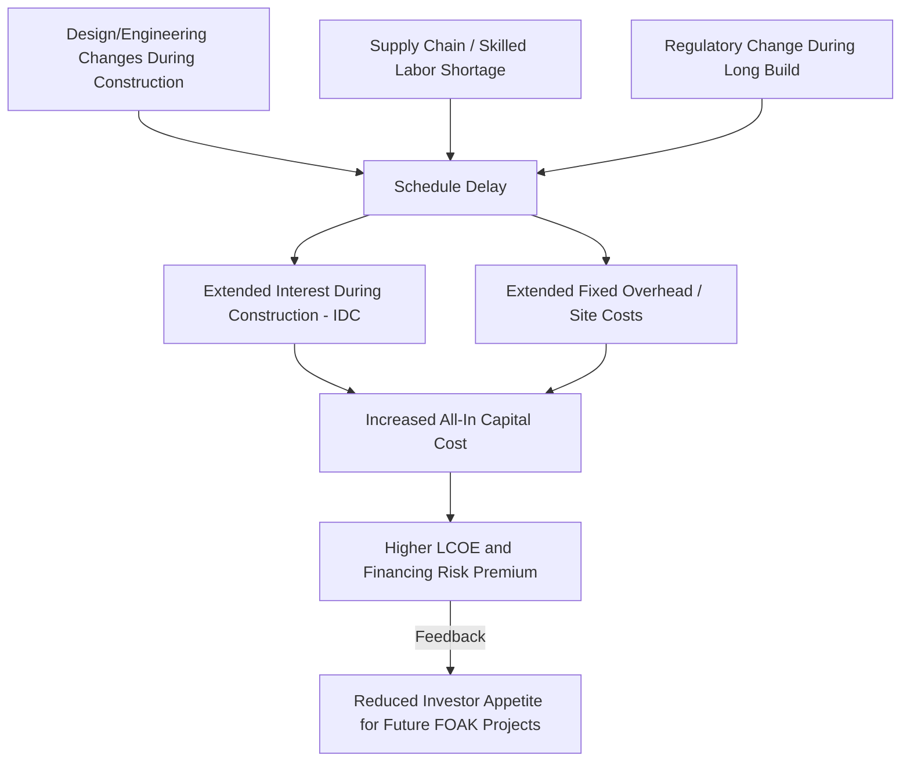

## Nuclear Power Plant Cost Structure and Capital Intensity

### Overview of Cost Categories

**Key Points**

- Nuclear power plants have a fundamentally different cost structure from fossil-fuel generation: extremely high upfront capital costs paired with very low, stable fuel and marginal operating costs
- The lifecycle cost of a nuclear plant is typically decomposed into: overnight capital cost, financing (interest during construction), operations and maintenance (O&M), fuel cost, and decommissioning/waste management cost
- Nuclear economics are dominated by capital cost and the cost of capital, not fuel cost — the inverse of the cost structure of gas-fired generation

This cost structure has major implications for market design, financing, and policy: nuclear plants require long asset lives (40–80 years) and high utilization (high capacity factor) to amortize capital costs, making them best suited to baseload operation and highly sensitive to discount rate assumptions.

### Overnight Capital Cost (OCC)

**Key Points**

- Overnight Capital Cost (OCC) is the hypothetical cost of constructing a plant "overnight" — i.e., excluding financing costs and interest during construction — expressed typically in $/kW of installed capacity
- OCC is used as the standard basis for cross-technology and cross-country cost comparisons because it strips out financing assumptions that vary by project and jurisdiction
- Historical and recent OCC estimates for nuclear vary enormously by country, reactor design (Gen II vs. Gen III/III+), and project execution quality

$$OCC\ (\$/kW) = \frac{\text{Total Construction Cost (excluding IDC)}}{\text{Net Installed Capacity (kW)}}$$

where IDC is Interest During Construction (discussed below).

Illustrative OCC ranges (from various international studies, e.g., IEA/NEA "Projected Costs of Generating Electricity"):

| Reactor Class | Illustrative OCC Range ($/kW, overnight) | Notes |
| --- | --- | --- |
| Gen III/III+ (e.g., AP1000, EPR) — well-executed programs (South Korea, China) | 2,000 – 3,500 | Benefits from fleet learning and standardization |
| Gen III/III+ — first-of-a-kind in liberalized markets (US, France, UK) | 6,000 – 13,000+ | Vogtle (US), Hinkley Point C (UK), Flamanville (France) experienced major cost escalation |
| Small Modular Reactors (SMR) — projected/early estimates | 3,000 – 8,000+ (highly uncertain) | [Speculation: SMR cost figures remain largely pre-commercial estimates, subject to significant downward revision if modular/factory learning materializes, or upward revision if first-of-a-kind risk dominates] |

[Unverified: exact figures fluctuate with currency, year of estimate, and site-specific conditions; consult the latest IEA/NEA "Projected Costs of Generating Electricity" report or national cost studies for current authoritative figures]

### Interest During Construction (IDC) and Financing Cost

**Key Points**

- Because nuclear construction periods are long (historically 6–15+ years for large reactors, including first-of-a-kind projects), Interest During Construction (IDC) can add substantially to total project cost — often 30–100%+ on top of OCC
- IDC accrues because capital is deployed years before the plant generates any revenue, and the developer must service debt/equity returns throughout construction
- This makes nuclear project economics extraordinarily sensitive to the discount rate (Weighted Average Cost of Capital, WACC) and to construction schedule risk

The "all-in" capital cost is:

$$\text{All-In Capital Cost} = OCC \times \text{Capacity} + IDC$$

IDC can be approximated using a compounding formula over the construction period:

$$IDC = \sum_{t=1}^{T} C_t \times \left[(1+r)^{T-t} - 1\right]$$

where $C_t$ is capital expenditure in year $t$, $T$ is the total construction period, and $r$ is the cost of capital (interest/discount rate).

**Example**

A reactor with an OCC of $6,000/kW for a 1,200 MW unit has a base construction cost of $7.2 billion. If construction takes 10 years and the effective cost of capital is 8%, IDC can add several billion dollars more, potentially pushing all-in capital cost to $10–12 billion or more, depending on the expenditure profile (front-loaded vs. even spending) and any schedule delays. [Inference: exact IDC magnitude depends heavily on the specific spending curve and any cost/schedule overruns during construction; treat this as an illustrative order-of-magnitude calculation, not a precise forecast]

This sensitivity explains why:

- Regulated utility environments with rate-base recovery (allowing cost recovery during construction, e.g., Construction Work in Progress / CWIP mechanisms) can substantially lower effective financing costs compared to merchant/liberalized market financing
- Government-backed or state-owned nuclear programs (e.g., South Korea, China, UAE) often achieve lower effective costs partly because sovereign or quasi-sovereign financing carries a lower cost of capital than private merchant financing

### Levelized Cost of Electricity (LCOE) for Nuclear

**Key Points**

- LCOE aggregates capital cost, financing, fuel, O&M, and decommissioning costs over plant life into a single $/MWh metric for cross-technology comparison
- For nuclear, LCOE is dominated by the capital cost/financing term, making it highly sensitive to discount rate and capacity factor assumptions

$$LCOE = \frac{\sum_{t=0}^{n} \frac{CapEx_t + OpEx_t + Fuel_t + Decomm_t}{(1+r)^t}}{\sum_{t=0}^{n} \frac{E_t}{(1+r)^t}}$$

where $E_t$ is electricity generated in year $t$, and $r$ is the discount rate.

**Example**

Holding all else constant, raising the discount rate assumption from 3% to 10% can more than double the LCOE of a nuclear plant, because the large upfront capital cost is discounted much less heavily at low rates relative to fossil-fuel plants where costs are more evenly spread over time via fuel purchases. This discount-rate sensitivity is a defining feature distinguishing nuclear (and other capital-intensive, low-fuel-cost technologies like renewables) from gas-fired generation. [Inference: the specific multiplier depends on the plant's cost/expenditure profile and assumed life; the qualitative direction — high sensitivity to discount rate — is a well-established feature of nuclear cost modeling]

### Capacity Factor and Capital Cost Amortization

**Key Points**

- Because nuclear has near-zero fuel cost sensitivity to output level, its economic competitiveness depends heavily on running at very high capacity factors to spread fixed capital costs over as much output as possible
- Modern nuclear fleets in mature operating programs commonly achieve capacity factors in the 85–93%+ range, among the highest of any generation technology
- Capacity factor directly divides into the capital cost recovery calculation:

$$\text{Capital Cost per MWh} = \frac{\text{Annualized Capital Cost (\$/year)}}{\text{Capacity (MW)} \times 8{,}760\ \text{hours} \times \text{Capacity Factor}}$$

A drop in capacity factor from 90% to 60% (e.g., due to unplanned outages, load-following operation, or grid curtailment) can increase the capital cost component of LCOE by 50%, since the same fixed annualized cost is spread over far less output. This is why nuclear plants are economically structured as baseload/must-run assets, and why using nuclear for load-following (ramping output up/down to match variable renewable output) imposes a significant economic penalty relative to its designed baseload role. [Inference: exact percentage impact depends on capacity factor assumptions and fixed/variable cost split, but the direction and general magnitude are consistent with standard LCOE mechanics]

### Operations and Maintenance (O&M) Costs

**Key Points**

- O&M is typically split into **Fixed O&M** (staffing, licensing, security, insurance, routine maintenance — largely independent of output) and **Variable O&M** (consumables, waste handling scaled with generation)
- Nuclear fixed O&M costs are relatively high compared to fossil generation due to stringent regulatory, safety, and security staffing requirements (large plant workforces, NRC/regulator compliance, physical security)
- Refueling outages (every 12–24 months depending on fuel cycle design) represent a major recurring cost and lost-generation event, requiring careful scheduling to minimize capacity factor impact

Illustrative O&M cost range: $15–30/MWh for mature, well-operated fleets, though this varies by country, plant age, and regulatory regime. [Unverified: figures vary by source and year; consult national nuclear cost studies such as those from EIA, NEA, or utility regulatory filings for current figures]

### Fuel Cost Structure

**Key Points**

- Nuclear fuel cost is a small and stable fraction of total generation cost — typically only 5–15% of LCOE, compared to 60–80%+ for gas-fired generation
- Fuel cost components: uranium ore (U₃O₈), conversion, enrichment, and fuel fabrication — collectively the "front end" of the fuel cycle
- Because uranium ore cost itself is a small share of the final fuel assembly cost (enrichment and fabrication dominate), nuclear generation cost is relatively insulated from commodity price volatility compared to gas or coal generation

$$\text{Fuel Cost} (\$/MWh) \approx \frac{\text{Ore} + \text{Conversion} + \text{Enrichment} + \text{Fabrication}}{\text{Energy Output per Fuel Load}}$$

This insulation from fuel price volatility is a key economic argument for nuclear in energy security and price stability discussions — a doubling of uranium ore prices has a much smaller effect on nuclear generation cost than a doubling of natural gas prices has on gas generation cost. [Inference: this is a well-established structural feature of nuclear fuel economics; the exact pass-through magnitude depends on current enrichment/fabrication cost shares, which shift over time]

### Decommissioning and Waste Management Costs

**Key Points**

- Decommissioning costs are incurred decades after construction, requiring long-term cost provisioning during operation (decommissioning trust funds or reserve accounts)
- Waste management costs include interim spent fuel storage (dry cask storage) and, where applicable, contributions to long-term geological repository programs
- Decommissioning is typically funded through a per-MWh levy collected during operation and invested in a dedicated trust fund, discounted back using assumptions about the eventual decommissioning cost decades in the future

$$\text{Decommissioning Levy} (\$/MWh) = \frac{\text{Estimated Future Decommissioning Cost}}{(1+r)^{n}} \Big/ \text{Total Lifetime Generation (discounted)}$$

Decommissioning cost estimation carries significant uncertainty because it is based on projections many decades into the future, with limited historical precedent (relatively few large commercial reactors have been fully decommissioned to date). [Inference: cost estimates for decommissioning are subject to considerable revision as more real-world decommissioning projects are completed and provide better empirical cost data]

### Cost Structure Comparison: Nuclear vs. Gas vs. Renewables

| Cost Component | Nuclear | Combined-Cycle Gas (CCGT) | Wind/Solar |
| --- | --- | --- | --- |
| Capital cost share of LCOE | Very high (60–80%+) | Low (10–20%) | Very high (70–90%+) |
| Fuel cost share of LCOE | Low (5–15%) | High (60–80%) | None (zero marginal fuel cost) |
| Construction lead time | Long (6–15+ years) | Short (2–4 years) | Short (1–3 years) |
| Capacity factor (typical) | 85–93%+ | 50–60% (varies with dispatch) | 20–50% (resource-dependent) |
| Sensitivity to discount rate | Very high | Low–moderate | Very high |
| Fuel price volatility exposure | Low | High | None |

**(svg_diagram) LCOE Cost Component Comparison**

<svg viewBox="0 0 640 400" xmlns="http://www.w3.org/2000/svg" font-family="Helvetica, Arial, sans-serif">
<text x="320" y="24" text-anchor="middle" font-size="16" font-weight="bold" fill="#1a1a1a">LCOE Cost Component Shares by Technology (svg_diagram)</text>

<text x="60" y="60" font-size="13" font-weight="bold" fill="#333">Nuclear</text>

<rect x="150" y="45" width="280" height="24" fill="`#2563eb`"/>

<rect x="430" y="45" width="70" height="24" fill="`#f59e0b`"/>

<rect x="500" y="45" width="60" height="24" fill="`#16a34a`"/>

<text x="290" y="61" text-anchor="middle" font-size="11" fill="white">Capital ~70%</text>

<text x="465" y="61" text-anchor="middle" font-size="10" fill="white">O&M</text>

<text x="530" y="61" text-anchor="middle" font-size="10" fill="white">Fuel</text>

<text x="60" y="120" font-size="13" font-weight="bold" fill="#333">CCGT Gas</text>

<rect x="150" y="105" width="60" height="24" fill="`#2563eb`"/>

<rect x="210" y="105" width="60" height="24" fill="`#f59e0b`"/>

<rect x="270" y="105" width="290" height="24" fill="`#16a34a`"/>

<text x="180" y="121" text-anchor="middle" font-size="10" fill="white">Cap.</text>

<text x="240" y="121" text-anchor="middle" font-size="10" fill="white">O&M</text>

<text x="415" y="121" text-anchor="middle" font-size="11" fill="white">Fuel ~70%</text>

<text x="60" y="180" font-size="13" font-weight="bold" fill="#333">Wind/Solar</text>

<rect x="150" y="165" width="340" height="24" fill="`#2563eb`"/>

<rect x="490" y="165" width="70" height="24" fill="`#f59e0b`"/>

<text x="320" y="181" text-anchor="middle" font-size="11" fill="white">Capital ~85%</text>

<text x="525" y="181" text-anchor="middle" font-size="10" fill="white">O&M</text>

<rect x="150" y="230" width="20" height="16" fill="#2563eb"/>
<text x="180" y="243" font-size="12" fill="#333">Capital &amp; Financing</text>
<rect x="150" y="255" width="20" height="16" fill="#f59e0b"/>
<text x="180" y="268" font-size="12" fill="#333">O&amp;M</text>
<rect x="150" y="280" width="20" height="16" fill="#16a34a"/>
<text x="180" y="293" font-size="12" fill="#333">Fuel</text>

<text x="320" y="340" text-anchor="middle" font-size="12" fill="#555" font-style="italic">Illustrative proportions; actual shares vary by project, region, and cost-of-capital assumptions</text>

</svg>

### First-of-a-Kind (FOAK) vs. Nth-of-a-Kind (NOAK) Cost Dynamics

**Key Points**

- First-of-a-kind (FOAK) projects for a new reactor design carry substantial cost premiums due to design finalization changes, supply chain immaturity, workforce inexperience, and regulatory learning curve effects
- Nth-of-a-kind (NOAK) projects benefit from learning-by-doing, standardized supply chains, and experienced construction workforces — cost reduction of 20–30%+ is commonly cited as achievable between FOAK and mature fleet builds [Unverified: magnitude varies significantly by program and country; South Korea's APR1400 fleet and historical French PWR fleet are often cited as successful learning-curve examples, while several Western FOAK Gen III+ projects have instead experienced cost escalation rather than the expected learning-curve decline]
- This creates a policy tension: achieving NOAK cost benefits requires sustained fleet-scale ordering and standardization, but liberalized electricity markets rarely provide the demand certainty needed to justify fleet-scale commitments without government support (contracts-for-difference, regulated asset base models, sovereign guarantees)

### Financing Models and Their Cost Impact

**Key Points**

- **Regulated Asset Base (RAB) model**: allows the developer to recover financing costs from consumers during construction (reducing the developer's cost of capital, since revenue begins before commissioning), used for projects like Hinkley Point C's successor Sizewell C in the UK
- **Contracts for Difference (CfD)**: guarantees a fixed strike price for output post-commissioning, reducing revenue risk but not construction-phase financing risk
- **Sovereign/state-backed financing**: state-owned utilities or sovereign-guaranteed debt can access much lower costs of capital than merchant private financing, a major factor in the lower realized costs of nuclear programs in South Korea, China, and the UAE compared to fully merchant Western projects
- **Merchant/market-based financing**: developer bears full construction and market price risk, resulting in the highest cost of capital and historically the projects most prone to cost overruns and cancellations in liberalized markets

The choice of financing model can change effective project cost by a large margin because it directly changes $r$ in the discounting formulas above — this is arguably as significant a determinant of final nuclear project cost as the underlying engineering/construction cost itself. [Inference: this is a widely supported conclusion across nuclear economics literature comparing RAB/sovereign-backed vs. merchant-financed projects, though the exact magnitude is project- and country-specific]

### Cost Overrun Risk: Structural Causes

**Key Points**

- Historically, large nuclear construction projects — particularly FOAK builds in liberalized markets — have experienced frequent and substantial cost and schedule overruns (e.g., Vogtle Units 3–4 in the US, Hinkley Point C and Flamanville in Europe)
- Structural causes commonly cited in the literature include: design changes during construction (building before design is fully finalized), supply chain and skilled labor shortages after years of reduced nuclear construction activity, regulatory changes during long construction periods, and the sheer complexity/interdependency of nuclear construction schedules (a delay in one system can cascade)
- Cost overruns compound through the IDC mechanism: schedule delays increase financing costs on top of direct cost increases, creating a feedback loop where delays become disproportionately expensive

### Small Modular Reactors (SMR): Emerging Cost Model

**Key Points**

- SMRs (typically defined as reactors below ~300 MWe) are designed around a different capital cost logic: smaller unit size reduces absolute capital-at-risk per project and construction period, while factory-based modular fabrication aims to substitute on-site construction (subject to weather delays, skilled labor bottlenecks) with controlled factory manufacturing and series production learning
- The economic thesis is that per-kW OCC may initially be higher than large reactors (losing economies of scale) but total project cost, financing risk, and schedule risk are lower, potentially improving overall project bankability even if $/kW is less favorable
- As of current publicly available data, SMR designs remain largely pre-commercial or early-deployment stage, with cost estimates carrying substantial uncertainty pending first-of-a-kind builds (e.g., NuScale, various programs in the US, Canada, UK, and China) [Unverified: recommend verifying current program status via web search, as SMR licensing and deployment timelines have been subject to frequent revision, including notable project cancellations]

Given the fast-moving nature of SMR project status, cost estimates, and licensing progress, current reporting should be consulted directly for up-to-date figures rather than relying solely on earlier program announcements. [Inference: SMR cost economics is an area of active, evolving development where publicly available figures can become outdated quickly]

### Economies of Scale vs. Diseconomies of Complexity

**Key Points**

- Historically, nuclear cost analysis assumed economies of scale (larger reactors have lower $/kW due to spreading fixed costs like containment structures over more capacity)
- However, empirical experience with large Gen III+ reactors has shown that "diseconomies of complexity" can dominate: larger, more complex plants with more advanced safety systems have proven harder to construct on schedule and budget, partially offsetting theoretical scale economies
- This tension is central to the current debate between continuing to pursue large reactor designs (seeking economies of scale) versus SMRs (seeking economies of mass manufacturing and reduced complexity/risk per unit) [Inference: this framing reflects a widely discussed tension in current nuclear economics literature, not a settled resolution]

### Related Topics

- Small Modular Reactor (SMR) economics and factory-based construction learning curves
- Regulated Asset Base (RAB) financing model for nuclear (Sizewell C case study)
- Nuclear fuel cycle economics: enrichment, fabrication, and back-end waste management
- Capacity factor optimization and refueling outage scheduling economics
- Contracts for Difference (CfD) and long-term power purchase agreements for nuclear
- Comparative LCOE analysis across generation technologies (IEA/NEA methodology)
- Cost overrun case studies: Vogtle, Hinkley Point C, Flamanville, VC Summer
- Discount rate and cost-of-capital sensitivity analysis in capital-intensive generation
- Decommissioning trust fund design and long-term cost provisioning
- Nuclear's role in capacity markets and reliability/baseload economics