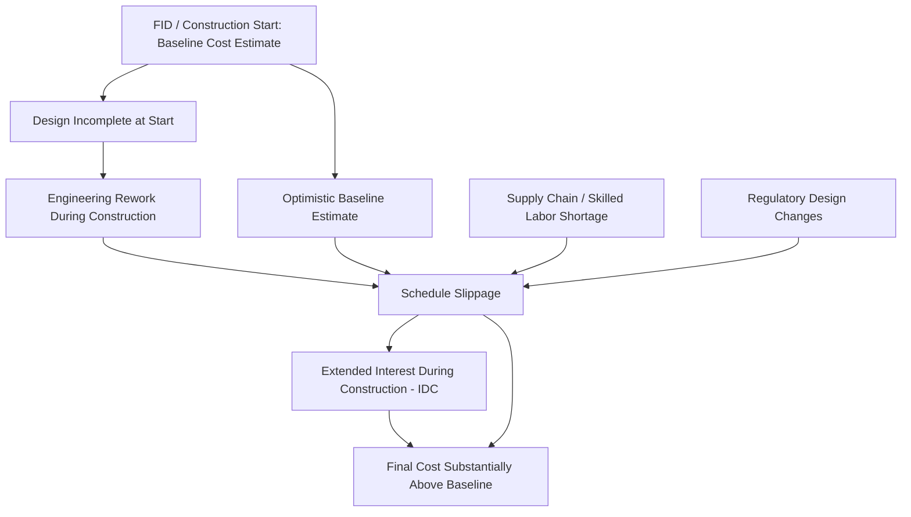

## Construction Risk and Cost Overrun History

### Overview

Nuclear power plant construction is characterized by some of the largest and most persistent cost overruns and schedule delays observed in energy infrastructure. Understanding the sources of this risk — and the historical record of overruns across construction eras and countries — is central to nuclear economics, since financing costs and risk premia are dominated by construction-phase uncertainty rather than by operating costs.

### Why Nuclear Construction Risk Is Distinctive

#### Structural Cost Drivers

- **Long construction duration**: typical builds span 6–12+ years from first concrete to commercial operation, exposing the project to years of compounding interest during construction (IDC) and to macroeconomic, regulatory, and political shifts.
- **First-of-a-kind (FOAK) vs Nth-of-a-kind (NOAK) effects**: unlike modular technologies that move down a learning curve, nuclear projects — especially after long gaps in construction — often behave as FOAK builds even for "established" reactor designs, because supply chains, skilled labor, and site-specific engineering knowledge atrophy between projects.
- **Site-specific engineering**: much of nuclear construction historically has been "built to order" rather than standardized/modular, unlike many other large infrastructure classes, increasing exposure to design iteration during construction.
- **Regulatory design evolution**: designs are frequently modified *during* construction in response to evolving safety requirements (especially following major incidents), producing costly rework rather than costs being fixed at the design stage.
- **Capital intensity and financing structure**: overnight capital costs constitute a very large share of levelized cost, so delays translate directly into large increases in interest during construction (IDC), which itself is highly sensitive to project duration.

### Formal Framework for Cost Overrun

Cost overrun is typically defined relative to a baseline estimate at final investment decision (FID) or at construction start:

$$\text{Overrun Ratio} = \frac{C_{actual}}{C_{estimated}}$$

Where $C_{actual}$ is realized final construction cost and $C_{estimated}$ is the cost estimated at the reference point (often FID, sometimes an earlier planning estimate). Because IDC compounds with schedule delay, total realized cost can be decomposed as:

$$C_{actual} = C_{direct} + C_{indirect} + IDC$$

$$IDC \approx \sum_{t} C_t \times \left[(1+r)^{(T-t)} - 1\right]$$

Where $C_t$ is capital spent in period $t$, $r$ is the (often project-specific, risk-adjusted) cost of capital, and $T$ is total construction duration. This formula illustrates why schedule delay disproportionately amplifies overall cost overrun relative to direct cost increases alone: a delay does not just add cost linearly, it extends the period over which *all* prior capital accrues financing charges.

### Historical Overrun Record

#### Landmark Academic Studies

- **Sovacool, Gilbert, and Nugent (2014)**, analyzing a global sample of nuclear plants, found average cost overruns substantially above budget across the dataset, with wide variance by country and era; the study is widely cited as establishing that overruns were the norm rather than the exception across most of the historical fleet, though methodology and sample selection have been debated by subsequent researchers.
- Studies from Berkeley/MIT-affiliated researchers on US plants built in the 1970s–1980s similarly find average real cost escalation multiples in the range of roughly 2–4x initial estimates for the bulk of that construction wave, with especially severe outliers.
- Grubler (2010), analyzing the French nuclear program (often cited as the most cost-efficient nuclear buildout historically), found that even France's fleet — despite standardization — experienced real cost *increases* over successive plant generations rather than the cost declines typically expected from a learning curve, attributed to increasing regulatory stringency and design changes over time (a partial exception exists in the earliest, most standardized tranches).

#### Notable Case Studies (Illustrative, Non-Exhaustive)

| Project | Country | Approx. Timeline | Overrun Character |
| --- | --- | --- | --- |
| Vogtle Units 3 & 4 | United States | FID ~2009, COD 2023–2024 | Cost roughly doubled from initial estimate; schedule delay of roughly 6–7 years relative to original target |
| V.C. Summer Units 2 & 3 | United States | Started 2013, cancelled 2017 | Project abandoned after billions spent; contributed to Westinghouse's 2017 bankruptcy filing |
| Olkiluoto 3 (EPR) | Finland | Started 2005, COD 2023 | Roughly a decade of delay; cost overrun estimated at several multiples of original contract price |
| Flamanville 3 (EPR) | France | Started 2007, COD 2024 | Overrun on the order of several multiples of original budget; more than a decade of delay |
| Hinkley Point C | United Kingdom | Started 2017, ongoing | Multiple cost revisions upward since FID; EDF has repeatedly announced schedule slippage |
| Shin-Kori / Barakah programs | South Korea / UAE | 2010s | Frequently cited as comparatively on-budget/on-schedule relative to Western projects, attributed to standardized design and program-based (multi-unit) execution |

[Unverified] Precise overrun percentages and final costs for ongoing or recently completed projects (e.g., Hinkley Point C) are subject to continued revision by the utilities and regulators involved; figures cited in secondary sources vary and should be checked against the latest official disclosures for any application requiring precision.

### Root Cause Taxonomy

#### 1. Estimation and Planning Risk

- Early cost estimates are frequently prepared before detailed engineering is complete, systematically understating cost (a documented pattern across large infrastructure generally, sometimes termed "optimism bias" or, in more adversarial framings, "strategic misrepresentation" in the megaproject literature associated with Bent Flyvbjerg).
- Reference-class forecasting (using the actual outturn distribution of comparable past projects, rather than bottom-up engineering estimates alone) is a recommended corrective, though rarely used in practice for early nuclear cost estimates historically.

#### 2. Design and Engineering Risk

- Incomplete design at construction start ("build while designing") — notably an issue at Vogtle 3&4 and the two EPR projects (Flamanville, Olkiluoto), where construction began before design finalization, leading to substantial rework.
- Design changes mandated by evolving regulatory requirements during construction (particularly post-Fukushima, 2011, and post-Three Mile Island, 1979, in the US context).

#### 3. Supply Chain and Labor Risk

- Loss of specialized nuclear-grade fabrication capacity (e.g., large forgings, qualified welders) during multi-decade construction lulls, particularly acute in the US and much of Western Europe after the 1980s–1990s slowdown in new nuclear starts.
- Quality control failures in critical components (e.g., documented issues with reactor vessel forgings, weld quality, and concrete work at various EPR and AP1000 projects) triggering inspection delays and rework.

#### 4. Project Management and Contracting Risk

- Contract structure matters significantly: fixed-price EPC (engineering-procurement-construction) contracts shift overrun risk to the contractor but have historically proven difficult to sustain without contractor financial distress (Westinghouse's Chapter 11 filing in 2017 is frequently attributed in part to fixed-price EPC losses on Vogtle and V.C. Summer).
- Owner's engineering capability and experience strongly affect outcomes; utilities without recent nuclear construction experience have generally underperformed relative to experienced, repeat builders.

#### 5. Regulatory and Political Risk

- Licensing delays, intervenor litigation, and changes in safety standards (especially following Three Mile Island, Chernobyl, and Fukushima) have historically triggered substantial schedule and cost impacts across multiple countries' fleets.
- Political risk: financing withdrawal, policy reversals, or public opposition can halt projects mid-construction (e.g., numerous US plants cancelled in the late 1970s–1980s after having incurred substantial sunk costs).

#### 6. Financing Structure Risk

- Traditional project or corporate-balance-sheet financing exposes ratepayers/shareholders fully to overrun risk.
- **Regulated Asset Base (RAB) models** (used for Hinkley Point C's successor projects, e.g., Sizewell C in the UK) and construction-work-in-progress (CWIP) cost recovery mechanisms (used in some US states, including for Vogtle) are explicitly designed to reduce the cost of capital by allowing cost recovery *during* construction, thereby lowering the effective $r$ in the IDC formula above — but they also shift construction risk toward ratepayers, which is a significant distributional and regulatory-design question in its own right.

### Cost Overrun Timeline Diagram

### Learning Curves vs Negative Learning

Standard technology learning-curve theory predicts declining unit costs with cumulative deployment:

$$C_n = C_1 \times n^{-b}$$

Where $C_n$ is the cost of the $n$-th unit, $C_1$ is the cost of the first unit, and $b$ relates to the learning rate. However, multiple empirical studies of nuclear construction (notably in France and the US) have found evidence of **negative learning** — real costs per unit *increasing* with cumulative experience over some periods — attributed primarily to escalating regulatory requirements and increasing design complexity outweighing genuine construction-process learning. [Inference] The extent to which this reflects an inherent property of nuclear technology versus a consequence of stop-start deployment patterns (which prevent the retention of skilled workforces and standardized supply chains) remains actively debated in the energy economics literature; South Korea's comparatively favorable cost trajectory is often cited by proponents of the latter explanation.

### Risk Mitigation Approaches (Historical and Proposed)

- **Standardized, replicable designs** built in series (the French and South Korean models) to preserve learning and supply-chain continuity.
- **Small Modular Reactors (SMRs)**: proposed to reduce construction risk via factory fabrication and modular assembly, reducing on-site, weather-dependent, and schedule-variable construction work; [Speculation] as of this writing, this claim remains largely unproven at commercial scale, since very few SMR designs have completed construction, and the historical record for cost/schedule performance is correspondingly thin.
- **Phased/modular construction techniques** applied to large reactors (e.g., open-top/modular construction methods used at some AP1000 projects) intended to allow parallel work streams and reduce critical-path duration.
- **Government cost-sharing and loan guarantees** (e.g., US DOE loan guarantee program used for Vogtle) to reduce the cost of capital and share downside risk.
- **RAB and CfD (Contracts for Difference) financing models** in the UK, intended to lower financing costs by de-risking revenue streams and allowing construction-period cost recovery.

### Related Topics

- Levelized Cost of Electricity (LCOE) methodology and sensitivity to construction risk assumptions
- Regulated Asset Base (RAB) model for nuclear financing
- Small Modular Reactors (SMRs) and factory-fabrication economics
- Interest during construction (IDC) and capital structure for capital-intensive generation
- Megaproject theory and reference-class forecasting (Flyvbjerg)
- Nuclear decommissioning cost estimation and funding mechanisms
- Comparative nuclear program economics: France, South Korea, United States
- Contracts for Difference (CfD) as a nuclear/renewable financing mechanism
- Fixed-price vs cost-plus EPC contracting in large energy infrastructure
- Post-Fukushima regulatory changes and their economic impact on existing and new-build reactors