## Fuel Cycle Economics and Enrichment Costs

### Overview

Unlike fossil generation, where fuel cost dominates the levelized cost of electricity (LCOE), nuclear power's economics are dominated by capital costs, with fuel cycle costs typically representing a small fraction of total generation cost — commonly cited in the range of roughly 10–20% of total LCOE for light water reactors, though this share varies by uranium and enrichment price conditions. Understanding the fuel cycle's cost structure nonetheless matters for operating cost forecasting, fuel-supply contracting strategy, and comparative reactor economics.

### The Front-End Fuel Cycle

The front end comprises all stages required to convert natural uranium into usable reactor fuel: mining and milling, conversion, enrichment, and fuel fabrication.

```mermaid
flowchart LR
    A[Uranium Mining and Milling] --> B[U3O8 - Yellowcake]
    B --> C[Conversion to UF6]
    C --> D[Enrichment - SWU]
    D --> E[Fuel Fabrication]
    E --> F[Fresh Fuel Assemblies to Reactor]
    F --> G[Reactor Operation - Burnup]
    G --> H[Spent Fuel]
    H --> I[Interim Storage]
    I --> J[Reprocessing or Direct Disposal]
```

#### Stage 1: Mining and Milling

Natural uranium is mined (via conventional open-pit/underground mining or in-situ leaching, ISL/ISR) and milled into **uranium oxide concentrate (U₃O₈)**, commonly called "yellowcake." Costs here are driven by ore grade, extraction method, and prevailing uranium spot/term market prices. ISR/ISL methods have generally lower capital and operating costs than conventional mining where geology permits, and now account for a substantial share of global primary production.

#### Stage 2: Conversion

U₃O₈ is converted to **uranium hexafluoride (UF₆)**, the gaseous form required for enrichment. Conversion cost is typically quoted in $/kgU and represents a comparatively small cost component relative to enrichment and mining.

#### Stage 3: Enrichment

Natural uranium contains approximately 0.711% of the fissile isotope U-235, with the remainder being U-238. Most commercial reactors (light water reactors — PWRs and BWRs) require **low-enriched uranium (LEU)** at roughly 3–5% U-235 (some advanced fuel designs and small modular reactors target High-Assay LEU, HALEU, at up to 20% U-235).

**Separative Work Unit (SWU)** is the standard unit measuring the effort required to separate a given quantity of uranium into enriched and depleted (tails) streams. It is a function of feed, product, and tails quantities and assays, not simply of mass processed.

The SWU requirement is calculated using the **value function**:

$$V(x) = (1 - 2x)\ln\left(\frac{1-x}{x}\right)$$

Where $x$ is the assay (weight fraction of U-235) of a given stream. Total SWU required is:

$$SWU = P \cdot V(x_p) + T \cdot V(x_t) - F \cdot V(x_f)$$

Where $P$, $T$, $F$ are the masses of product, tails, and feed respectively, and $x_p$, $x_t$, $x_f$ are their respective U-235 assays. Mass balance requires:

$$F = P + T$$

$$F \cdot x_f = P \cdot x_p + T \cdot x_t$$

**Feed requirement per unit of product** depends critically on the **tails assay** ($x_t$) chosen — a key economic optimization variable. Lower tails assay (more thorough extraction of U-235 from the depleted stream) reduces natural uranium feed requirements but increases SWU requirements, since more separative work is needed to strip additional U-235 out of the tails. The economically optimal tails assay is a function of the relative prices of natural uranium and SWU:

$$\frac{\partial(\text{Total Cost})}{\partial x_t} = 0 \implies x_t^* = f\left(\frac{P_{U_3O_8}}{P_{SWU}}\right)$$

[Inference] When uranium prices are high relative to SWU prices, enrichers have an economic incentive to operate at lower tails assays (extracting more U-235 from a given feed), and vice versa; this is a standard result in enrichment economics but the precise optimal value in any period depends on the actual market prices prevailing, which fluctuate.

#### Enrichment Technology and Cost Structure

- **Gaseous diffusion**: the original commercial enrichment technology, now essentially retired worldwide due to very high electricity consumption per SWU (historically requiring roughly 2,000–2,500 kWh/SWU).
- **Gas centrifuge**: the dominant modern technology, dramatically more energy-efficient (historically cited figures are on the order of 50–60 kWh/SWU, roughly two orders of magnitude lower than diffusion), which has substantially reduced the electricity cost component of enrichment.
- **Laser enrichment (e.g., SILEX-derived processes)**: under commercial development by some firms; [Unverified] claimed efficiency and cost advantages over centrifuge technology have not, to date, been demonstrated at full commercial scale in a manner independently verified in the public record, so comparative cost claims should be treated cautiously pending commercial-scale operating data.

Because centrifuge technology has driven the electricity input cost of enrichment down substantially, capital cost of the enrichment plant and its amortization, rather than power consumption, now represents a larger relative share of SWU cost than in the diffusion era.

#### Stage 4: Fuel Fabrication

Enriched UF₆ is converted to uranium dioxide (UO₂) powder, pressed into fuel pellets, and assembled into fuel rods and assemblies with zirconium-alloy cladding. Fabrication costs are a relatively minor share of total front-end cost but are sensitive to fuel assembly design specifications (assembly geometry varies by reactor vendor and cannot generally be substituted across reactor types without redesign, creating a degree of vendor lock-in for fuel supply).

### Front-End Cost Formula (Illustrative Structure)

The total front-end fuel cost per unit of enriched product can be represented as:

$$C_{fuel} = (F \times P_{U_3O_8}) + (F \times P_{conv}) + (SWU \times P_{SWU}) + C_{fab}$$

Where $P_{U_3O_8}$ is the natural uranium price, $P_{conv}$ is the conversion price per kgU, $P_{SWU}$ is the price per separative work unit, and $C_{fab}$ is fabrication cost. This cost is then normalized per unit of electricity generated based on the fuel's achieved **burnup** (energy extracted per unit mass of fuel, typically expressed in GWd/tU — gigawatt-days thermal per metric ton of uranium). Higher burnup fuel designs extract more energy per unit of fuel loaded, reducing the frequency of refueling and the fuel cost per MWh generated, though at the cost of more demanding fuel and cladding material performance requirements.

### Market Structure and Price Volatility

- **Uranium spot and term markets**: uranium is traded both on a spot market (immediate delivery) and via long-term contracts (multi-year supply agreements, often with price floors/ceilings or formula-based pricing referencing spot indices). Utilities typically procure the bulk of their uranium via term contracts to manage price risk, given the sensitivity of long lead-time reactor operations to fuel security.
- **Historical price volatility**: uranium spot prices have experienced substantial multi-year cycles — a sharp price spike around 2007 (driven partly by supply disruptions, including flooding at Cameco's Cigar Lake mine), a prolonged post-Fukushima (2011) price depression as Japanese reactors were idled and global demand growth expectations fell, and a renewed upward trend beginning in the early-to-mid 2020s associated with reactor life extensions, new-build announcements, supply concentration concerns, and financial investor activity in physical uranium holding vehicles.
- **Enrichment (SWU) market concentration**: global commercial enrichment capacity is concentrated among a small number of major suppliers (historically including Urenco, Rosatom/Tenex, Orano, and China National Nuclear Corporation), raising geopolitical supply-security considerations — particularly acute following Russia's 2022 invasion of Ukraine, given Rosatom's historically significant share of global enrichment and conversion services and subsequent Western sanctions and diversification efforts. [Unverified] Current market shares and the pace of Western enrichment capacity expansion are subject to ongoing change; figures should be checked against current industry sources (e.g., World Nuclear Association) for time-sensitive analysis.

### The Back End: Spent Fuel and Waste Costs

#### Once-Through (Open) Fuel Cycle

Most commercial reactors, including the entire US fleet, operate on a once-through cycle: spent fuel is stored (initially in cooling pools, then often in dry cask storage) pending eventual permanent geological disposal. In the US, utilities pay into the **Nuclear Waste Fund** (historically a fee per kWh generated, established under the Nuclear Waste Policy Act of 1982) intended to fund a federal repository; the fee was suspended in 2014 amid ongoing federal failure to establish a permanent repository (the Yucca Mountain project remaining unresolved), and long-term back-end liability treatment remains a live regulatory and legal issue. [Unverified] The precise current legal and fiscal status of US nuclear waste fee collection and federal repository policy should be verified against current DOE and NRC sources given the protracted and evolving nature of this issue.

#### Closed (Reprocessing) Fuel Cycle

Some countries (notably France, with its La Hague facility, and historically the UK and Japan) reprocess spent fuel to recover unused fissile material (uranium and plutonium) for reuse as **mixed-oxide (MOX) fuel**. Reprocessing economics have historically been debated:

- Proponents cite reduced high-level waste volume and resource extension.
- Critics cite the substantial additional capital and operating cost of reprocessing facilities relative to the value of recovered fissile material, particularly at historically low uranium prices, along with proliferation-risk concerns associated with separated plutonium.
- [Inference] Under most historical uranium price regimes, reprocessing has generally been assessed by independent economic analyses as more costly per unit of energy than the once-through cycle using freshly mined uranium; this conclusion is sensitive to uranium price assumptions and to how waste-disposal and proliferation-risk costs are valued, which vary substantially by study and by country-specific policy context.

### Total Fuel Cycle Cost Components (Summary Table)

| Stage | Typical Cost Driver | Relative Cost Share (Illustrative) |
| --- | --- | --- |
| Uranium (U₃O₈) | Spot/term market price, ore grade | Significant, historically variable with uranium price cycles |
| Conversion | UF₆ conversion capacity/price | Small |
| Enrichment (SWU) | Centrifuge capacity, electricity cost, tails assay choice | Significant, historically variable with SWU price cycles |
| Fabrication | Assembly design complexity | Small to moderate |
| Waste fee / back-end provision | Regulatory fee structure, reprocessing vs disposal choice | Moderate, jurisdiction-dependent |

[Inference] Exact relative cost shares fluctuate substantially with uranium and SWU market prices over time; the qualitative ranking (enrichment and uranium being the largest front-end components, with capital cost still dominating total LCOE) is well-established in the literature, but any specific percentage breakdown should be sourced from current utility or industry-association data (e.g., World Nuclear Association, NEA/IEA) rather than treated as a fixed constant.

### Fuel Cycle Cost Flow Diagram (svg_diagram)

<svg xmlns="http://www.w3.org/2000/svg" viewBox="0 0 900 380">
<text x="450" y="30" font-size="20" font-weight="bold" text-anchor="middle" fill="#1a1a1a">Nuclear Fuel Cycle Cost Structure (svg_diagram)</text>
<rect x="30" y="70" width="150" height="70" rx="8" fill="#eef3fb" stroke="#2f5fa3" stroke-width="2" />
<text x="105" y="98" font-size="13" text-anchor="middle" font-weight="bold">Mining/Milling</text>
<text x="105" y="116" font-size="11" text-anchor="middle">U3O8 price</text>
<rect x="215" y="70" width="150" height="70" rx="8" fill="#eef3fb" stroke="#2f5fa3" stroke-width="2" />
<text x="290" y="98" font-size="13" text-anchor="middle" font-weight="bold">Conversion</text>
<text x="290" y="116" font-size="11" text-anchor="middle">UF6 conversion fee</text>
<rect x="400" y="70" width="150" height="70" rx="8" fill="#eefaf0" stroke="#2f8f4e" stroke-width="2" />
<text x="475" y="92" font-size="13" text-anchor="middle" font-weight="bold">Enrichment</text>
<text x="475" y="108" font-size="11" text-anchor="middle">SWU price ×</text>
<text x="475" y="122" font-size="11" text-anchor="middle">tails assay choice</text>
<rect x="585" y="70" width="150" height="70" rx="8" fill="#eef3fb" stroke="#2f5fa3" stroke-width="2" />
<text x="660" y="98" font-size="13" text-anchor="middle" font-weight="bold">Fabrication</text>
<text x="660" y="116" font-size="11" text-anchor="middle">Assembly design</text>
<rect x="770" y="70" width="110" height="70" rx="8" fill="#fdf3e6" stroke="#c08a2f" stroke-width="2" />
<text x="825" y="98" font-size="13" text-anchor="middle" font-weight="bold">Reactor</text>
<text x="825" y="116" font-size="11" text-anchor="middle">Burnup</text>
<line x1="180" y1="105" x2="210" y2="105" stroke="#333" stroke-width="2" marker-end="url(#a3)" />
<line x1="365" y1="105" x2="395" y2="105" stroke="#333" stroke-width="2" marker-end="url(#a3)" />
<line x1="550" y1="105" x2="580" y2="105" stroke="#333" stroke-width="2" marker-end="url(#a3)" />
<line x1="735" y1="105" x2="765" y2="105" stroke="#333" stroke-width="2" marker-end="url(#a3)" />
<rect x="150" y="200" width="600" height="90" rx="8" fill="#fff4f0" stroke="#c0503a" stroke-width="2" />
<text x="450" y="225" font-size="14" text-anchor="middle" font-weight="bold">Total Fuel Cost per MWh</text>
<text x="450" y="248" font-size="12" text-anchor="middle">= (Front-end cost / Burnup) + Back-end provision (waste fee / reprocessing)</text>
<text x="450" y="268" font-size="12" text-anchor="middle">Typically ~10-20% of total LCOE (capital cost dominates)</text>
<line x1="475" y1="140" x2="450" y2="195" stroke="#333" stroke-width="2" marker-end="url(#a3)" />
</svg>

### Related Topics

- Levelized Cost of Electricity (LCOE) methodology for nuclear generation
- Small Modular Reactors (SMRs) and HALEU fuel supply chain development
- Uranium spot and term market dynamics and price cycles
- Geopolitical concentration risk in enrichment supply (Rosatom/Tenex sanctions context)
- Spent fuel storage economics: dry cask vs pool storage
- Reprocessing and MOX fuel economics (France's closed fuel cycle in depth)
- US Nuclear Waste Fund history and Yucca Mountain policy status
- Burnup optimization and advanced fuel/cladding material economics
- Construction risk and cost overrun history (capital cost dominance context)
- Comparative fuel cycle cost benchmarking across reactor types (PWR, BWR, CANDU, SMR)