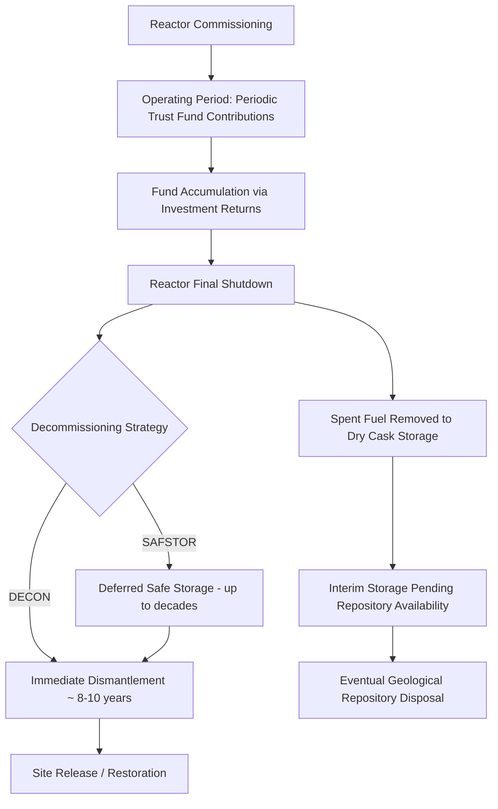

## Decommissioning and Waste Management Cost Provisions

### Overview

Decommissioning and waste management represent long-tail, back-end costs of nuclear power generation, often deferred by decades relative to the revenue-generating operating period. Because these costs are incurred long after — and sometimes independently of — plant revenue generation, robust financial provisioning mechanisms are a central concern of nuclear economics and regulatory policy: without credible advance funding, decommissioning liabilities risk becoming stranded costs borne by taxpayers or future generations rather than by the generation that consumed the electricity.

### Why Advance Provisioning Matters

- **Temporal mismatch**: a reactor may operate for 40–80 years, but decommissioning and final waste disposition can extend for decades to centuries afterward (particularly for high-level waste requiring geological isolation on the order of hundreds of thousands of years for some radionuclides).
- **Utility solvency risk**: if funds are not accumulated during the operating period, a utility (or its successor) may lack the capital to fund decommissioning at end-of-life, especially if the company becomes financially distressed, is sold, or exits the market.
- **Intergenerational equity**: economic principles generally hold that the generation benefiting from the electricity should bear the cost of managing its full lifecycle impacts, including decommissioning and waste, rather than shifting costs onto future ratepayers or taxpayers who received no corresponding benefit.
- **Sunk vs recoverable cost treatment**: regulators must decide whether decommissioning provisions are treated as a pass-through cost recovered via current electricity rates (common in regulated markets) or must be internalized by the operator through other financial mechanisms (more typical in liberalized/merchant markets).

### Decommissioning Cost Components

#### Technical Scope

Decommissioning encompasses:

1. **Defueling**: removal of spent fuel from the reactor core and, eventually, from on-site spent fuel pools.
2. **Decontamination**: removal or treatment of radioactively contaminated systems, structures, and components (SSCs).
3. **Dismantlement**: physical demolition of reactor buildings and associated infrastructure.
4. **Waste packaging and disposal**: characterization, packaging, and shipment of low-level and intermediate-level waste to licensed disposal facilities.
5. **Site restoration**: remediation of the site to a condition suitable for restricted or unrestricted future use, per regulatory requirements.
6. **Long-term spent fuel management**: continued storage (dry cask or equivalent) of spent fuel pending availability of a permanent repository, which in many countries (including the US) remains unresolved and can extend well beyond reactor decommissioning itself.

#### Decommissioning Strategies

- **Immediate dismantlement (DECON)**: decommissioning begins promptly after final shutdown, typically completing within roughly a decade. Reduces the duration of ongoing security, monitoring, and administrative costs, but requires the full cost estimate to be funded and available immediately.
- **Deferred dismantlement (SAFSTOR)**: the facility is placed in a safe storage configuration for an extended period (commonly up to several decades, subject to regulatory limits such as the US NRC's general 60-year post-shutdown completion requirement) to allow radioactive decay of shorter-lived isotopes, reducing occupational radiation exposure during eventual dismantlement and potentially allowing continued fund accumulation. Trades off lower technical/dose risk against extended site-holding costs and prolonged institutional oversight.
- **Entombment (ENTOMB)**: contaminated structures are permanently encased on-site; rarely used for large commercial power reactors under normal circumstances (more associated with damaged-reactor scenarios) due to the indefinite institutional control burden it imposes.

### Cost Estimation Methodology

Decommissioning cost estimates are typically built bottom-up from unit costs applied to inventories of contaminated materials, structures, and systems, informed by studies such as those periodically issued by industry bodies (e.g., in the US, cost studies referenced in NRC decommissioning funding assurance regulations). A simplified representation of the total decommissioning liability is:

$$DC = \sum_i (Q_i \times UC_i) + PM + CM$$

Where:

- $Q_i$ = quantity of waste/material category $i$ (e.g., cubic meters of contaminated concrete, tons of activated steel)
- $UC_i$ = unit cost for handling/disposal of category $i$
- $PM$ = project management, engineering, and licensing overhead
- $CM$ = contingency margin, reflecting estimation uncertainty

[Inference] As with construction cost estimation generally, decommissioning cost estimates prepared many years before actual decommissioning are subject to significant uncertainty and have in various documented cases required upward revision as actual costs, waste disposal capacity, and regulatory requirements became clearer closer to the decommissioning date; the direction and magnitude of any such revision is plant- and jurisdiction-specific and should not be assumed uniform across the fleet.

### Funding Mechanisms

#### 1. Sinking Fund / Trust Fund Accumulation (Most Common — US Model)

Utilities are required (in the US, under NRC regulations at 10 CFR 50.75) to demonstrate "reasonable assurance" of decommissioning funding, typically via an external, segregated **Nuclear Decommissioning Trust (NDT)**. Contributions accumulate over the operating life and are invested (subject to regulatory restrictions on investment risk), with the fund intended to reach the estimated decommissioning cost by end of operating life. The required trust balance can be modeled as a sinking-fund accumulation:

$$FV = C \times \frac{(1+g)^n - 1}{g}$$

Where $FV$ is the target fund value at decommissioning, $C$ is the periodic (e.g., annual) contribution, $g$ is the assumed fund growth rate net of relevant costs, and $n$ is the number of accumulation periods (years of operation remaining). A critical risk in this model is that **realized investment returns may fall short of assumptions used when contribution schedules were set**, producing a funding shortfall discovered only near end-of-life — a documented issue for various plants where trust fund performance during market downturns (e.g., the 2008 financial crisis) reduced fund balances relative to projections.

#### 2. Rate-Based Cost Recovery (Regulated Markets)

In cost-of-service regulated jurisdictions, a decommissioning charge is embedded directly in the revenue requirement (see rate-of-return regulation) and collected from ratepayers over the plant's operating life, functioning similarly to a dedicated tax collected via the electricity bill and typically directed into the segregated trust described above.

#### 3. Merchant/Deregulated Market Mechanisms

In liberalized markets where a plant's revenue is exposed to wholesale price risk rather than guaranteed cost recovery, decommissioning funding relies more heavily on the standalone trust fund's accumulated balance and the parent company's balance sheet, creating greater exposure to the risk that an early or unplanned shutdown (e.g., due to poor wholesale market economics) leaves the trust under-funded relative to the accelerated need for decommissioning capital.

#### 4. Government-Backed or State-Owned Provisions

In some countries, decommissioning liabilities for state-owned utilities are provisioned on the national balance sheet or through dedicated public funds (e.g., historically discussed arrangements in France for EDF's fleet, and the UK's Nuclear Decommissioning Authority, NDA, which took on liability for the UK's legacy Magnox and other early reactor fleet under public ownership). [Unverified] The specific current funding adequacy and accounting treatment of these arrangements is subject to periodic government and National Audit Office review and should be verified against current official reporting for any time-sensitive analysis.

### Waste Management Cost Provisions

#### Low-Level and Intermediate-Level Waste (LLW/ILW)

Disposal costs for LLW/ILW are generally better characterized than high-level waste costs, since licensed disposal facilities exist and operate commercially or under established public programs in multiple countries, allowing per-unit-volume disposal pricing to inform decommissioning cost estimates with comparatively less uncertainty than high-level waste, where permanent disposal capacity in most countries does not yet exist.

#### High-Level Waste (HLW) and Spent Fuel

- **Once-through cycle countries (e.g., United States)**: spent fuel is treated as waste requiring eventual permanent geological disposal. In the US, a per-kWh fee was collected into the federal **Nuclear Waste Fund** under the Nuclear Waste Policy Act of 1982 to fund development of a repository (originally intended to be Yucca Mountain); collection was suspended in 2014 following a federal court ruling related to the Department of Energy's failure to make progress toward a repository, and this issue remains legally and politically unresolved. Utilities continue to bear the interim cost of on-site dry cask storage, and multiple utilities have pursued litigation against the federal government for damages related to its failure to accept spent fuel as originally contracted.
- **Closed cycle countries (e.g., France)**: reprocessing reduces the volume of ultimate high-level waste requiring disposal but does not eliminate the need for eventual geological disposal of vitrified high-level waste residues.
- **Geological repository programs**: Finland's Onkalo repository is the most frequently cited example of an operational, licensed deep geological repository program for spent fuel; most other countries' repository programs remain in planning, siting, or licensing stages, and cost estimates for eventual repositories carry substantial uncertainty given the century-plus planning horizons involved.

### Provisioning Timeline (Illustrative)

### Regulatory Oversight Examples

| Jurisdiction | Key Mechanism | Oversight Body |
| --- | --- | --- |
| United States | External decommissioning trust funds; NRC funding assurance rules | Nuclear Regulatory Commission (NRC) |
| United Kingdom | Nuclear Decommissioning Authority manages legacy public liabilities; newer plants require Funded Decommissioning Programmes | Office for Nuclear Regulation (ONR); NDA |
| France | Provisions held on EDF's balance sheet, subject to periodic state audit | Autorité de Sûreté Nucléaire (ASN); Cour des Comptes reviews |
| Finland | Statutory Nuclear Waste Management Fund | STUK (radiation and nuclear safety authority) |

[Unverified] The details of national funding requirements, coverage ratios, and recent audit findings evolve over time and vary by country; the table above describes general institutional structures and should be supplemented with current official sources for jurisdiction-specific compliance or financial analysis.

### Common Financial Risks in Provisioning

- **Underestimation risk**: early-life cost estimates prepared before detailed decommissioning experience existed have in various cases proven to understate actual costs, particularly regarding waste disposal capacity and unit disposal costs, though the degree of underestimation is plant- and program-specific rather than universal.
- **Investment return risk**: trust fund accumulation models depend on assumed real investment returns; shortfalls in realized returns relative to assumptions (e.g., during major market downturns) can create funding gaps discovered only near end-of-life, when there is little remaining time to correct via increased contributions.
- **Premature/early shutdown risk**: plants retired earlier than their originally licensed operating life (for economic, political, or safety reasons) may have accumulated insufficient trust fund balances relative to a schedule that assumed a full operating life of contributions, creating a funding shortfall that must be addressed via other utility or ratepayer mechanisms.
- **Inflation and unit-cost escalation risk**: waste disposal and specialized decommissioning labor/service costs may escalate faster than general inflation indices used in fund growth assumptions, eroding real fund adequacy over time.
- **Repository non-availability risk**: in once-through cycle countries without an operating permanent repository, utilities bear open-ended interim storage costs and liability exposure of indeterminate duration, a risk not fully captured in standard decommissioning cost models that implicitly assume repository access at a projected date.

### Related Topics

- Fuel cycle economics and enrichment costs (spent fuel volume and back-end linkage)
- Construction risk and cost overrun history (parallel estimation-uncertainty dynamics)
- Regulated Asset Base (RAB) and rate-of-return cost recovery mechanisms
- US Nuclear Waste Policy Act, Yucca Mountain litigation, and Nuclear Waste Fund status
- UK Nuclear Decommissioning Authority (NDA) legacy liability management
- Geological repository siting and licensing (Finland's Onkalo as case study)
- Reactor life extension economics and relicensing (interaction with funding schedules)
- Trust fund investment policy and regulatory investment restrictions
- Intergenerational equity in long-lived infrastructure cost allocation
- Merchant vs regulated market exposure to stranded decommissioning liabilities