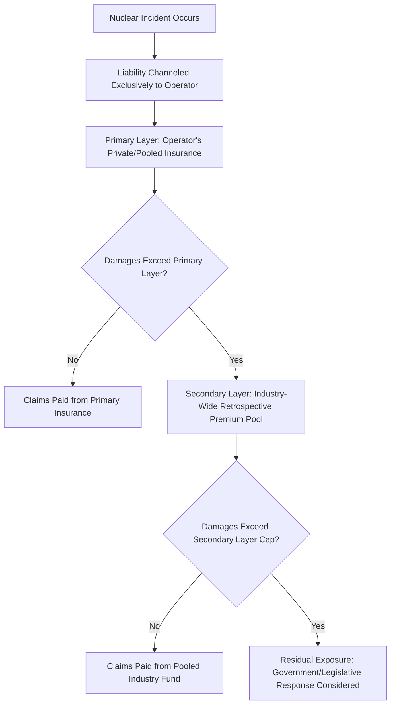

## Nuclear Liability Regimes and Insurance Economics

### Overview

Nuclear liability regimes address a distinctive economic problem: the potential severity of a nuclear accident's off-site damages can vastly exceed what conventional private insurance markets are willing or able to underwrite, given the low-probability, high-consequence, and highly correlated nature of the risk. Nearly every country with commercial nuclear power has therefore established a specialized legal framework — generally combining channeled operator liability, mandatory financial security, liability caps, and government backstops — rather than relying on ordinary tort law and conventional insurance markets alone.

### The Core Economic Problem

#### Why Conventional Insurance Markets Fail Here

- **Tail risk and correlated losses**: a severe nuclear accident can generate damages across a very large geographic area and across many claimants simultaneously, violating the risk-pooling assumptions (independence of losses across policyholders) that make conventional insurance markets function efficiently.
- **Estimation difficulty**: the probability of severe accidents is low enough that actuarial estimation from historical frequency data is highly uncertain, complicating premium-setting via standard actuarial methods.
- **Capital constraints of private insurers**: the potential scale of damages from a worst-case accident can exceed the capital that private insurance and reinsurance markets are willing to commit to a single peril class, particularly given the difficulty of diversifying nuclear liability risk against uncorrelated risks elsewhere in an insurer's portfolio.
- **Moral hazard and information asymmetry**: insurers have historically had limited independent visibility into a given plant's operational safety practices relative to the operator itself, complicating risk-based premium differentiation.

#### The Standard Policy Response: Channeling and Capping

Given these market failures, the near-universal policy response (originating primarily with the US Price-Anderson Act of 1957) rests on several common design principles:

1. **Legal channeling of liability**: liability for a nuclear incident is channeled exclusively to the reactor operator (licensee), regardless of fault, rather than being distributed across the many suppliers, contractors, and component manufacturers involved in construction and operation. This simplifies claims processing (no need to litigate fault across a complex supply chain) and allows insurance to be concentrated efficiently at the operator level rather than requiring every supplier in the nuclear value chain to separately carry nuclear liability insurance.
2. **Strict liability**: operators are typically liable regardless of negligence — claimants need only demonstrate that a qualifying nuclear incident caused their damages, not that the operator was at fault.
3. **Liability caps (limitation of liability)**: operator liability is capped at a legally defined maximum amount per incident, with government or industry-pooled mechanisms covering damages beyond the operator's primary insurance layer up to the cap, and the government (or, in some designs, no one) bearing responsibility for damages beyond the cap.
4. **Mandatory financial security**: operators are required to demonstrate financial capacity (typically private insurance plus mutual/pooled industry mechanisms) up to a specified minimum coverage level as a condition of licensing.

### The US Model: Price-Anderson Act

#### Structure

The Price-Anderson Nuclear Industries Indemnity Act (1957, periodically renewed and amended, most recently extended through 2025 and subsequently further extended by Congress) establishes a two-tier system:

- **Primary layer**: each licensed reactor operator must maintain the maximum amount of private liability insurance available commercially (historically provided primarily through American Nuclear Insurers, a pooling facility of private insurers).
- **Secondary layer (retrospective premium pool)**: if damages from an incident exceed the primary layer, all US reactor operators are assessed a **retrospective premium** — a pro-rata contribution per licensed reactor — up to a statutorily defined per-reactor maximum, creating an industry-wide mutual pooling mechanism that spreads the cost of a severe accident across the entire operating fleet rather than concentrating it solely on the operator at fault.
- **Government role**: historically, the Price-Anderson framework has included provision for Congress to consider additional compensation measures if aggregate industry funds under the statutory cap prove insufficient to cover actual damages, though the precise scope of any such further governmental commitment is a matter of statutory and political interpretation rather than an automatic, open-ended guarantee.

The total liability pool can be represented conceptually as:

$$L_{total} = L_{primary} + (n \times RP_{max})$$

Where $L_{primary}$ is the primary private insurance layer for the responsible operator, $n$ is the number of licensed reactors subject to retrospective assessment, and $RP_{max}$ is the maximum retrospective premium assessable per reactor per incident.

[Unverified] The current statutory dollar values for primary insurance limits and per-reactor retrospective premium maximums are periodically adjusted by Congress and by NRC regulation; specific current figures should be verified against the current text of the Price-Anderson Act and NRC regulations (10 CFR Part 140) rather than assumed static, given the periodic renewal and amendment history of the Act.

#### Economic Rationale and Critique

- **Proponents** argue Price-Anderson solved a genuine market-failure problem, enabling the US commercial nuclear industry to obtain liability coverage that would otherwise have been commercially unavailable or prohibitively expensive, while still ensuring a substantial, industry-funded compensation pool for victims without requiring open-ended taxpayer exposure.
- **Critics** argue the framework constitutes an implicit subsidy to nuclear power, since the cap on liability means the industry does not bear the full expected cost of tail-risk accident scenarios, understating the true social cost of nuclear generation relative to alternatives that do not receive comparable liability limitation; this remains a genuinely contested question in the energy economics and law-and-economics literature, with published estimates of the subsidy's implicit value varying considerably depending on the assumed accident probability and damage distribution used. [Speculation] Given the strong dependence of such subsidy estimates on assumptions about tail-risk probabilities that are inherently difficult to estimate empirically, published quantitative estimates of this implicit subsidy value should be treated as illustrative of methodology rather than as settled figures.

### International Liability Conventions

Because nuclear installations can cause transboundary harm, several international conventions establish harmonized minimum liability principles, generally following the same channeling/capping structure as the US model but coordinating cross-border compensation and jurisdiction:

- **Paris Convention (1960)** and its supplementary **Brussels Convention (1963)**: the primary framework among many Western European countries, administered under the OECD Nuclear Energy Agency (NEA), establishing operator liability caps and supplementary state/international funding tiers.
- **Vienna Convention (1963)**, administered under the IAEA, with broader international membership, similarly establishing channeled, capped operator liability.
- **Joint Protocol (1988)**: links the Paris and Vienna Conventions to allow mutual recognition between their respective member states.
- **Convention on Supplementary Compensation for Nuclear Damage (CSC, 1997)**: intended to create a broader, more globally unified compensation framework with an international supplementary fund, though [Unverified] its entry into force and current ratification status among major nuclear-generating countries should be verified against current IAEA treaty status records, as ratification has proceeded unevenly since adoption.

Liability caps and coverage structures vary meaningfully by country and convention; some jurisdictions (e.g., Germany, historically) have required unlimited operator liability rather than a capped amount, representing a notable departure from the capped-liability norm and correspondingly different insurance market dynamics.

### Nuclear Insurance Pooling Mechanisms

Given the concentration and correlation problems described above, nuclear liability and property insurance is typically provided not by individual insurers acting alone but through **national nuclear insurance pools** — mutual arrangements in which many domestic (and sometimes international) insurers jointly underwrite nuclear risk, sharing both premiums and potential losses according to agreed participation shares. Examples include:

- American Nuclear Insurers (United States)
- Nuclear Risk Insurers (United Kingdom)
- Assuratome (France)
- Deutsche Kernreaktor-Versicherungsgemeinschaft (Germany)

Pooling allows individual insurers to participate in nuclear risk with exposure limited to their agreed share, diversifying the risk across a broader base of capital than any single insurer could or would commit unilaterally, while still allowing specialized underwriting expertise (particularly around plant-specific safety and engineering risk assessment) to be concentrated within pool members experienced in the sector.

### Distinguishing Liability Insurance from Property/Business Interruption Insurance

Nuclear liability regimes as discussed above address **third-party (off-site) liability** — compensation to members of the public and property owners for accident-related damages. This is analytically and institutionally distinct from:

- **Nuclear property insurance**: covering physical damage to the plant itself (a substantial capital asset), typically also provided through specialized nuclear insurance pools given the concentration of value and specialized risk assessment required.
- **Business interruption / replacement power insurance**: covering a utility's financial losses from lost generation during an extended outage (e.g., following an accident or major unplanned equipment failure), which is a separate commercial insurance product from either liability or property coverage.

### Liability Regime Structure Diagram

### Comparative Liability Cap Design Choices

| Design Element | US (Price-Anderson) | Paris/Brussels Convention (Typical) | Germany (Historical Approach) |
| --- | --- | --- | --- |
| Liability basis | Strict, channeled to operator | Strict, channeled to operator | Strict, channeled to operator |
| Liability cap | Capped, industry-pooled secondary layer | Capped, with state supplementary tiers | Historically unlimited operator liability |
| Funding mechanism | Private insurance + retrospective industry premiums | Private insurance + state/international supplementary funds | Private insurance + mandatory operator financial security (given unlimited liability exposure) |
| Renewal structure | Periodic congressional reauthorization | Periodic treaty revision (protocols) | National legislation, subject to EU and international coordination |

[Unverified] Liability cap amounts, financial security requirements, and specific national implementations change periodically via legislative and treaty amendment; the qualitative structural comparison above should be supplemented with current statutory text for any application requiring precise figures.

### Economic Implications for Project Financing

- **Financing cost impact**: the existence of a liability cap and mandatory pooled insurance framework is generally considered a precondition for nuclear project financeability in most jurisdictions, since without a capped, well-defined maximum liability exposure, both equity investors and lenders would face effectively unquantifiable tail-risk exposure, likely rendering conventional project finance structures unworkable.
- **Interaction with government-backed financing**: liability regimes function as a complement to other government support mechanisms discussed elsewhere in nuclear economics (e.g., loan guarantees, RAB models), collectively addressing the range of market failures — construction risk, tail-risk liability, and long operating-life revenue uncertainty — that differentiate nuclear financing from most other generation technologies.
- **Cross-border project considerations**: multinational nuclear projects or reactor vendors operating across jurisdictions with differing liability regimes (capped vs uncapped, differing convention membership) must account for materially different liability exposure profiles by country, which can influence vendor risk pricing and contract structuring.

### Related Topics

- Construction risk and cost overrun history (parallel market-failure and government-backing rationale)
- Regulated Asset Base (RAB) and government loan guarantee financing mechanisms
- Decommissioning and waste management cost provisions (distinct back-end liability category)
- Chernobyl and Fukushima accident cost accounting as empirical case studies
- OECD Nuclear Energy Agency (NEA) liability convention administration
- Comparative international nuclear liability regimes (Vienna vs Paris Convention detail)
- Nuclear insurance pool underwriting and risk-sharing mechanics
- Externality theory and implicit subsidy quantification in energy economics
- Project finance structuring for capital-intensive, tail-risk-exposed infrastructure
- Government indemnification and public risk-bearing in large infrastructure projects