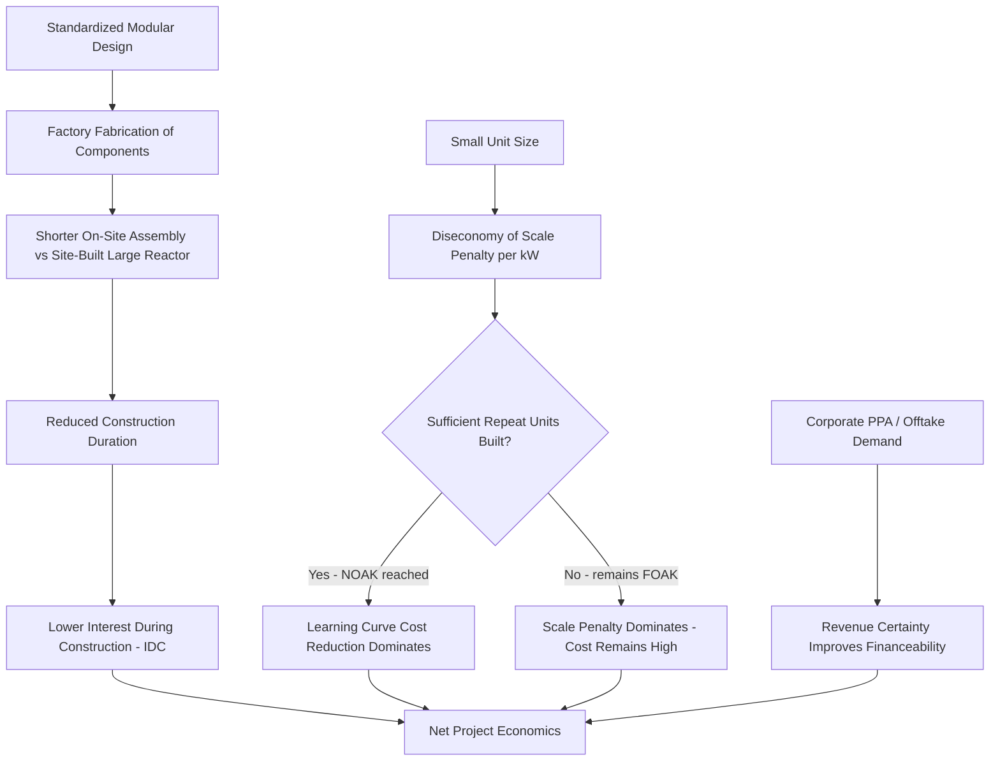

## Small Modular Reactor Economics and Prospects

### Overview

Small Modular Reactors (SMRs) — generally defined as nuclear reactors with output below roughly 300 MWe, designed for significant factory fabrication and modular assembly — are positioned by their proponents as a solution to the construction risk and capital-intensity problems that have historically plagued large "gigawatt-scale" nuclear projects. As of 2026, the sector sits at an inflection point: a small number of first-of-a-kind (FOAK) projects have reached or are approaching construction, while economic viability at scale remains empirically unproven and dependent on achieving genuine nth-of-a-kind (NOAK) manufacturing learning.

### Core Economic Thesis

#### The Modularity Argument

The central economic case for SMRs rests on shifting cost drivers away from those that have historically caused large-reactor overruns (see Construction risk and cost overrun history):

- **Factory fabrication vs. site construction**: standardized modules are intended to be built in controlled factory environments rather than on weather-exposed, schedule-variable construction sites, reducing exposure to on-site labor productivity variance and weather delays.
- **Shorter construction duration**: smaller, more standardized units are expected to have substantially shorter construction schedules than gigawatt-scale plants, reducing interest-during-construction (IDC) exposure.
- **Learning-curve/manufacturing economics**: repeated, standardized production of identical modules is intended to allow genuine unit-cost learning (in principle following a curve similar to the general learning-curve formula discussed in Fuel cycle economics and elsewhere), analogous to manufacturing industries rather than bespoke heavy construction.
- **Lower absolute capital exposure per unit**: a single SMR module requires a smaller upfront capital commitment than a large reactor, potentially widening the pool of utilities and investors capable of financing a project and allowing phased, incremental capacity additions rather than a single large lump investment.

#### The Diseconomy-of-Scale Trade-off

Nuclear economics has historically benefited from economies of scale — larger reactors have generally achieved lower cost per kW than smaller ones, all else equal, because many major cost components (containment structure, control systems, licensing/engineering overhead) do not scale linearly with output. This creates a formal tension captured in scaling-cost models:

$$C_{SMR} = C_{ref} \times \left(\frac{P_{SMR}}{P_{ref}}\right)^{\alpha}$$

Where $C_{ref}$ and $P_{ref}$ are a reference (large) reactor's cost and power output, $P_{SMR}$ is the SMR's power output, and $\alpha$ is a scaling exponent (typically estimated between roughly 0.4 and 0.7 in the nuclear engineering cost-estimation literature, i.e., cost scales sub-linearly but not proportionally with size — smaller reactors cost less in absolute terms but *more* per unit of capacity than larger ones based on the scaling relationship alone). Academic cost-projection modeling has found that a general 300 MW SMR's overnight construction cost per kW can be 13% to 83% higher than a large 1,000 MW reactor depending on the assumed scaling coefficient, meaning the learning/modularity benefit described above must be large enough to more than offset this inherent scale penalty for SMRs to become cost-competitive. [Iaea](https://conferences.iaea.org/event/374/papers/31012/files/12710-IAEA_Paper-57_SMR_final_V3.pdf)

$$C_{net} = C_{SMR}(\text{scale penalty}) \times L(n)(\text{learning benefit from } n \text{ units built})$$

Whether $C_{net}$ ends up below the equivalent large-reactor cost per kW is the central open empirical question in SMR economics, and the answer is highly sensitive to how many units are actually built in series — a dynamic explicitly modeled in recent IAEA-presented cost-projection work, which frames per-unit cost as a function of cumulative installed capacity across a deployed fleet rather than a fixed number.

### Current Cost and LCOE Estimates (2026)

#### First-of-a-Kind vs Nth-of-a-Kind Gap

Industry cost tracking as of 2026 indicates first-of-a-kind SMR projects are currently costing $8,500 to $10,500 per kilowatt, against a nth-of-a-kind target of $4,000 to $7,000 per kW that depends on building enough identical units to actually reach factory-scale economics — a threshold that critics argue requires dozens of repeat units before an SMR fleet beats a large reactor on cost. [iGrow News](https://igrownews.com/small-modular-reactors-2026-cost/)[iGrow News](https://igrownews.com/small-modular-reactors-2026-cost/)

Levelized cost estimates vary substantially by source and methodology:

- Current LCOE for SMRs is projected in the range of roughly $60–$120 per megawatt-hour in some 2026 industry tracking. [iGrow News](https://igrownews.com/small-modular-reactors-2026-cost/)
- A separate academic analysis estimated a median LCOE of over $200/MWh for general PWR-type SMR designs, substantially higher than gas combined cycle (roughly $45–74/MWh) or wind (roughly $26–50/MWh). [ScienceDirect](https://www.sciencedirect.com/science/article/abs/pii/S0149197025003877)
- Wood Mackenzie's published projections, per academic secondary reporting, expect LCOE of around $180/MWh for first-of-a-kind SMRs, declining by roughly 40% to about $100/MWh by 2030 as scaling and innovation effects take hold. [Iaea](https://conferences.iaea.org/event/374/papers/31012/files/12710-IAEA_Paper-57_SMR_final_V3.pdf)

[Unverified] These estimates differ by a wide margin depending on source, methodology, assumed cost of capital, and which specific reactor design and site is modeled; no single figure should be treated as a consensus industry LCOE, and all of these projections predate actual NOAK-scale operating cost data, since no Western SMR fleet has yet reached that stage.

#### Real-World Cost Anchor: NuScale VOYGR

One of the more concrete cost data points available is a 12-module VOYGR plant (684 MWe total) estimated at roughly $3 billion, or about $4,385 per kW — useful as a real-world cost anchor against the sector's more optimistic NOAK cost projections, though this remains a developer-supplied estimate rather than a realized construction outcome, since no VOYGR plant has yet been built to completion. [Core Insights Review](https://www.coradvisors.net/2026/08/small-modular-reactor-nuclear-power-data-centers-2026.html?m=1)[Core Insights Review](https://www.coradvisors.net/2026/08/small-modular-reactor-nuclear-power-data-centers-2026.html?m=1)

### The NuScale/UAMPS Cancellation as a Cautionary Case Study

The most cited negative data point in SMR economics is the 2023 termination of NuScale's planned project with Utah Associated Municipal Power Systems (UAMPS) in Idaho. NuScale had engaged with UAMPS to construct 12 NuScale reactors in Idaho, but rather than proceeding with the already-certified 50 MWe design, NuScale sought NRC certification for a larger, more cost-effective 77 MWe reactor model, and construction plans subsequently encountered upheaval before the project was ultimately cancelled amid sharply rising cost estimates. NuScale's own history is frequently cited in the industry as its clearest cautionary data point, with the UAMPS project's cost estimates rising sharply before cancellation. This case illustrates a recurring theme from large-reactor construction risk (design changes during development, escalating cost estimates before financial close) reappearing in the SMR context despite the modularity thesis. [ScienceDirect](https://www.sciencedirect.com/science/article/abs/pii/S0149197025003877)[iGrow News](https://igrownews.com/small-modular-reactors-2026-cost/)

### Technology Diversity Within the SMR Category

Unlike the large-reactor fleet, which is dominated by pressurized water reactor (PWR) designs, the SMR/advanced reactor space spans genuinely distinct technologies, each with different fuel, coolant, and cost/risk profiles:

| Design Type | Example Vendors/Projects | Coolant/Fuel Approach |
| --- | --- | --- |
| Light-water SMR (evolutionary) | NuScale VOYGR, GE Vernova Hitachi BWRX-300 | Water-cooled, standard LEU fuel — closest to proven LWR experience |
| High-temperature gas-cooled | X-energy Xe-100 | Helium-cooled, pebble-bed fuel, requires HALEU |
| Sodium-cooled fast reactor | TerraPower Natrium | Sodium coolant paired with molten-salt thermal storage, requires HALEU |
| Fluoride-salt-cooled | Kairos Power Hermes/KP-FHR | Molten fluoride salt coolant, requires HALEU |
| Microreactor | Oklo Aurora, Westinghouse eVinci | Very small output (commonly under 20 MWe), designed for remote/niche applications |

Most of these "advanced" designs require HALEU — uranium enriched above 5% and below 20% — which represents a genuine supply-chain constraint rather than a minor issue, since current US enrichment capacity for HALEU remains limited (see Fuel cycle economics and enrichment costs for the general enrichment framework this builds on). [iGrow News](https://igrownews.com/small-modular-reactors-2026-cost/)

### Currently Operating and Near-Term Projects

#### Operating Plants

Two plants currently answer whether any SMRs are actually operating in the affirmative: Russia's Akademik Lomonosov, a floating plant docked at Pevek in the Arctic, runs two KLT-40S reactors of roughly 35 MWe each and has been commercial since May 2020. China has also brought its HTR-PM high-temperature gas-cooled SMR design into commercial operation, per industry reporting. [iGrow News](https://igrownews.com/small-modular-reactors-2026-cost/)

#### Darlington BWRX-300 (Ontario, Canada) — The Leading Western First-Mover

Ontario Power Generation's Darlington New Nuclear Project is the furthest-advanced Western SMR construction effort:

- OPG received its power reactor construction license from the Canadian Nuclear Safety Commission (CNSC) to build a GE Hitachi BWRX-300 reactor at the Darlington New Nuclear Project site in April 2025, with the license valid until March 31, 2035.
- The Province of Ontario and OPG approved construction of the first BWRX-300, with GE Vernova Hitachi Nuclear Energy noting the design builds on decades of real-world boiling water reactor operating experience, using a standardized design and a proven delivery model, with the CNSC and US NRC collaborating on joint regulatory review. [neutronbytes](https://neutronbytes.com/?p=25641)
- Cost figures have been reported with some variation across sources: one report indicated OPG can spend C$6.1 billion on the first reactor plus C$1.6 billion on shared common infrastructure for three additional planned units, with the Globe & Mail reporting total first-unit cost at C$7.7 billion, scheduled for completion in 2029, while a separate industry summary cited an individual first-unit cost of C$6.1 billion (US$4.3 billion), with three more units planned for a combined 1.2 GW and a total overnight construction cost of C$20.9 billion. Per Wikipedia's tracking, the final investment decision in May 2025 to proceed was based on a forecast cost of C$7.7 billion (US$5.6 billion) for the first unit, with an estimated C$13.2 billion (US$9.6 billion) for the three further units at the same site. [GEH BWRX-300 SMR Approved for Construction at OPG’s Darlington Site +2](https://neutronbytes.com/?p=25641)

[Unverified] The cost figures reported across sources for the Darlington project vary somewhat depending on what scope (single unit vs. shared infrastructure vs. full four-unit program) and currency conversion date each figure reflects; readers requiring precise figures for financial analysis should consult OPG's own investor/regulatory disclosures directly rather than secondary press aggregation.

#### US Developments

Multiple converging factors — surging AI-driven electricity demand, over 10 GW in Big Tech nuclear commitments, $800 million in new federal cost-shared funding for TVA and Holtec, NRC regulatory progress toward the first commercial SMR construction permits, and a completed experimental reactor at Idaho National Laboratory — have created conditions described by industry analysts as without precedent in the history of civil nuclear power. Corporate offtake commitments have become a defining feature of the current cycle: NuScale's TVA agreement, TerraPower's NRC progress, Kairos Power's Google partnership, Amazon's X-energy investment, and DOE awards to TVA and Holtec collectively represent an evolved public-private partnership model encompassing demand-side anchoring by corporate offtakers, streamlined testing frameworks on federal land, and co-located demonstration projects serving AI infrastructure directly. [Clean Energy Forum](https://cleanenergyforum.yale.edu/2026/04/26/an-analysis-of-small-modular-reactors-smrs-for-commercial-electricity-generation-in-the)[Clean Energy Forum](https://cleanenergyforum.yale.edu/2026/04/26/an-analysis-of-small-modular-reactors-smrs-for-commercial-electricity-generation-in-the)

Specific corporate and regulatory milestones reported for the 2025–2026 period include:

- X-energy filed its NRC construction permit application for the SMR-300 in December 2025, alongside a $400 million DOE award supporting the project. [Core Insights Review](https://www.coradvisors.net/2026/08/small-modular-reactor-nuclear-power-data-centers-2026.html?m=1)
- Amazon led a $500 million financing round for X-energy and separately invested $700 million for rights to up to 12 Xe-100 units, while Google signed the first US corporate SMR fleet deal with Kairos Power, targeting 500 MW total capacity. [Core Insights Review](https://www.coradvisors.net/2026/08/small-modular-reactor-nuclear-power-data-centers-2026.html?m=1)[Core Insights Review](https://www.coradvisors.net/2026/08/small-modular-reactor-nuclear-power-data-centers-2026.html?m=1)
- The NRC finalized its Part 53 licensing framework (intended to streamline advanced reactor licensing) in March 2026, and X-energy filed a draft S-1 with the SEC in March 2026 for a Nasdaq IPO under ticker XE, targeting a $300 million raise, backed by over $1.4 billion in total funding including Amazon's $700 million strategic investment, while Holtec International confidentially filed for an IPO in February 2026 targeting a valuation above $10 billion. [State of Small Modular Reactors 2026 — Annual Intelligence Report | smrintel.com +2](https://smrintel.com/state-of-smr-2026/)

[Unverified] Corporate financing rounds, IPO filings, and DOE award figures are evolving rapidly as of this writing and should be verified against current SEC filings, DOE announcements, and company disclosures rather than treated as fixed, since the SMR financing landscape has been changing on a monthly basis through 2026.

### Data Center / AI Demand as a Distinct Economic Driver

A structurally new feature of the current SMR cycle (relative to prior nuclear cost-reduction pushes) is direct corporate offtake demand from hyperscale data center operators seeking dedicated, carbon-free, firm power for AI compute infrastructure. This differs economically from traditional utility procurement in several respects:

- **Corporate power purchase agreements (PPAs) and equity investment** (e.g., Amazon's direct investment in X-energy, Google's Kairos Power agreement) provide project developers with revenue certainty and/or capital that traditional utility-only financing structures have historically struggled to secure for FOAK nuclear projects.
- **Co-location and dedicated-load models**: some proposed SMR projects are designed to serve a single large corporate customer's load directly rather than being dispatched into a wholesale market, changing the risk profile from merchant/wholesale price exposure toward more bond-like, contracted revenue — conceptually similar in effect (though not in legal structure) to the RAB and CfD financing mechanisms discussed for large reactors.
- [Inference] This demand-side anchoring is widely credited in industry commentary with accelerating SMR project timelines and financing availability relative to the 2010s SMR cycle, though whether it will prove sufficient to drive the volume of repeat unit orders needed to reach genuine NOAK cost levels remains an open empirical question, since large-scale hyperscaler commitments to date remain a mix of binding contracts, options, and non-binding letters of intent whose ultimate conversion to built capacity is not yet established.

### Market Structure and Competitive Landscape

The SMR industry is fragmenting across roughly six major reactor types, each with different coolants, fuels, safety profiles, and deployment timelines, in contrast to conventional nuclear where PWR designs have historically dominated, and the global race to deploy commercial SMRs remains a competition in which China holds a lead position given its earlier HTR-PM commercial operation. Publicly traded pure-play and adjacent exposure as of the cited 2026 tracking includes Oklo (~$12.9B market cap, sodium-cooled fast reactor), NuScale Power (~$5.3B, the only NRC-certified SMR design), Nano Nuclear Energy (~$1.2B, microreactor developer), Lightbridge (~$500M, advanced fuel technology), and Centrus Energy (~$3B, the only US HALEU producer), alongside nuclear-exposed utilities such as Constellation Energy and GE Vernova. [Unverified] Market capitalization figures fluctuate continuously with equity markets and should not be treated as current beyond the date of the cited reporting. [State of Small Modular Reactors 2026 — Annual Intelligence Report | smrintel.com +2](https://smrintel.com/state-of-smr-2026/)

### Economics and Deployment Flow

### Key Uncertainties and Risk Factors

- **Unproven NOAK economics**: [Speculation] no Western SMR program has yet built enough identical units to empirically validate the learning-curve cost reductions central to the modularity thesis; all NOAK cost figures currently cited in the industry remain vendor or analyst projections rather than realized outcomes, and given the historical pattern of nuclear cost estimates (see Construction risk and cost overrun history), such projections warrant caution until FOAK projects are actually completed at or near budget.
- **HALEU supply chain risk**: as noted above, several leading advanced designs require HALEU fuel, and current US enrichment capacity for HALEU remains limited, creating a potential bottleneck independent of reactor construction economics themselves. [iGrow News](https://igrownews.com/small-modular-reactors-2026-cost/)
- **Regulatory framework maturity**: the NRC's Part 53 licensing framework, intended to streamline advanced reactor licensing, was only finalized in March 2026, meaning the regulatory pathway for many designs remains comparatively recent and untested at full commercial scale relative to the decades-long, well-precedented licensing history for conventional large LWRs. [SMR.INTEL](https://smrintel.com/state-of-smr-2026/)
- **Repeat-order risk**: the NOAK cost case depends on the same vendor/design securing dozens of orders; given the currently fragmented technology landscape described above, it is not guaranteed that any single design will reach the order volume needed to realize its projected learning curve, since demand may instead disperse across the six-plus competing reactor types.
- **FOAK cost escalation precedent**: the NuScale/UAMPS cancellation demonstrates that SMR projects remain exposed to the same design-change and cost-escalation dynamics documented for large reactors, and are not automatically immune to construction risk simply by virtue of smaller unit size or modular design intent.

### Related Topics

- Construction risk and cost overrun history (shared risk dynamics and contrast with SMR modularity thesis)
- Fuel cycle economics and enrichment costs (HALEU supply chain constraint in depth)
- Nuclear liability regimes and insurance economics (application to novel reactor designs and siting)
- Decommissioning and waste management cost provisions (SMR-specific waste volume and repository implications)
- Corporate power purchase agreements (PPAs) as a financing structure for capital-intensive generation
- NRC Part 53 licensing framework for advanced reactors
- HALEU enrichment capacity expansion (Centrus Energy and DOE programs)
- Learning curves and cost-reduction modeling in energy technology deployment
- Comparative international SMR programs (China's HTR-PM, Russia's floating plant model)
- Data center and AI-driven electricity demand as a driver of generation investment