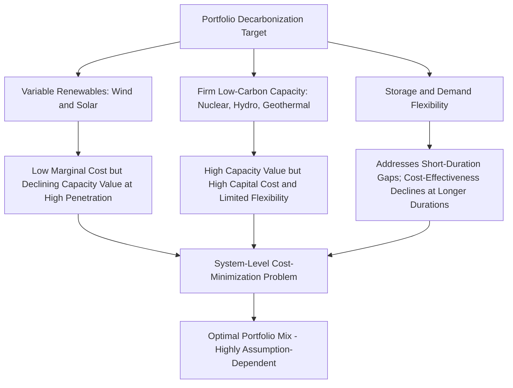

## Nuclear's Role in Low-Carbon Electricity Portfolios

### Overview

Nuclear power occupies a distinctive position in decarbonization strategy: it is one of very few dispatchable, low-carbon generation technologies capable of providing firm capacity at scale, but its economic characteristics — high capital intensity, long construction lead times, and construction risk (see Construction risk and cost overrun history) — create tensions with the increasingly variable-renewable-dominated electricity systems it is meant to complement. This item addresses the economic and system-level analysis of *where* nuclear fits within a broader low-carbon portfolio, distinct from the technology- and project-level economics addressed elsewhere in this chapter.

### The System Value Framework

#### Beyond LCOE: Why Portfolio Context Matters

Comparing generation technologies solely on **Levelized Cost of Electricity (LCOE)** is widely recognized in the energy economics literature as insufficient for portfolio-level decisions, because LCOE does not capture a technology's **value** to the system, which depends on when and how reliably it generates relative to demand and relative to other resources already in the mix. The standard LCOE formula:

$$LCOE = \frac{\sum_{t} \frac{C_t}{(1+r)^t}}{\sum_{t} \frac{E_t}{(1+r)^t}}$$

(where $C_t$ is total cost in year $t$, $E_t$ is energy generated in year $t$, and $r$ is the discount rate) treats a MWh generated at 3am during a demand trough identically to a MWh generated during a system peak, and does not account for the cost a resource imposes on or saves the rest of the system (e.g., transmission investment, balancing reserves, curtailment of other resources).

#### Value-Adjusted Cost Metrics

To address this, energy economists use **system-adjusted** or **value-adjusted LCOE (VALCOE)**-style frameworks, which add or net out three components:

$$VALCOE = LCOE + \text{Flexibility Value} + \text{Capacity Value} + \text{Balancing/Integration Cost} - \text{Value of Correlated Output}$$

- **Capacity value**: the contribution a resource makes to system reliability (its ability to be counted on to meet peak demand), often expressed as an Effective Load Carrying Capability (ELCC).
- **Flexibility value**: the ability of a resource to ramp output up/down to follow net demand (demand minus variable renewable output).
- **Integration/balancing cost**: the additional system cost imposed by a resource's variability or inflexibility, which must be absorbed by other resources, storage, or curtailment.

Nuclear generally scores well on capacity value (very high, near-firm capacity credit given high availability factors) but poorly on flexibility in most currently operating designs (see the load-following discussion below), while wind and solar generally score well on marginal LCOE but require these system-level adjustments to be added for a fair comparison, since their capacity value is systematically lower than their nameplate capacity (particularly at high penetration) and they impose integration costs on the rest of the system.

### Capacity Factor and Dispatchability as Economic Assets

#### Capacity Factor Comparison

Nuclear plants typically achieve very high capacity factors (commonly in the 85–95%+ range in mature fleets such as the US), substantially higher than variable renewables (wind typically in the 30–50% range depending on resource quality and technology vintage; utility-scale solar PV typically in the 20–30% range depending on location) and generally higher than most thermal fossil plants operated on economic dispatch. High capacity factor matters economically because a plant's fixed capital costs are spread over more units of output, directly reducing the capital-cost component of LCOE, all else equal — though this benefit for nuclear is substantially offset by its much higher absolute capital cost per unit of capacity relative to renewables or gas.

#### Firm, Dispatchable Low-Carbon Capacity — A Scarce Resource Category

A key portfolio-level economic argument for nuclear centers on **resource adequacy**: as variable renewable penetration increases, systems require a residual pool of dispatchable capacity to cover periods of low wind/solar output (sometimes termed "dunkelflaute" events in European system-planning discussions), and the menu of low-carbon technologies capable of providing this firm capacity at scale remains limited — principally nuclear, dispatchable hydro (where geographically available), geothermal (where geologically available), and fossil generation paired with carbon capture, alongside long-duration energy storage technologies that remain less mature and, as of this writing, generally more expensive at multi-day-plus durations than these alternatives. [Inference] This scarcity argument is a central pillar of the pro-nuclear portfolio case in the energy economics and systems-planning literature, though its practical weight in any specific system depends heavily on that system's specific renewable resource quality, existing hydro/storage endowment, and demand profile, all of which vary substantially by geography.

### The Duck Curve, Merit-Order Effects, and Nuclear's Market Position

#### Merit-Order Effect of Renewables

As variable renewable capacity grows, its near-zero marginal cost causes it to be dispatched first in wholesale electricity markets under standard merit-order dispatch, depressing wholesale prices during high-renewable-output hours — a well-documented phenomenon often called the **merit-order effect**. This has a direct economic implication for nuclear plants operating as price-takers in liberalized wholesale markets: nuclear's own near-zero marginal cost and inflexibility mean it, too, generally bids near the bottom of the merit order, but as solar penetration in particular grows, nuclear increasingly finds itself competing directly against near-zero-marginal-cost solar output during midday hours, compressing the price nuclear receives during exactly the hours it is generating (since traditional nuclear designs have limited ability to reduce output and instead "avoid" low-price periods the way a flexible gas plant can).

#### Cannibalization and Merchant Nuclear Economics

This dynamic — sometimes termed **value cannibalization** — means that as any given technology's own penetration (or the penetration of similarly-shaped output technologies) increases, the market value it captures per MWh tends to decline relative to the average system price, because it is disproportionately generating during the same hours as its own competitors, deflating exactly those hours' prices. For nuclear specifically, rising solar penetration cannibalizes value particularly during midday hours, while nuclear's relatively flat, always-on output profile does not naturally shift to capture the increasingly volatile price spikes that occur during evening ramp periods and dunkelflaute events. This is a central reason cited for the economic distress experienced by several US merchant (non-regulated, wholesale-market-exposed) nuclear plants in the 2010s, some of which were retired early or required state-level financial support (e.g., Zero Emission Credit programs in New York and Illinois) to remain economically viable, despite their low direct operating cost and carbon-free output. [Unverified] The magnitude of cannibalization effects at any given renewable penetration level is highly system- and market-specific, depending on interconnection, storage deployment, and demand flexibility, and general statements about the severity of this effect should not be extrapolated uniformly across all electricity markets without accounting for local conditions.

### Load-Following and Flexibility Considerations

#### Technical and Economic Constraints on Nuclear Flexibility

Most currently operating light water reactors were designed and licensed primarily for baseload (constant, near-full-capacity) operation, reflecting both the economics of spreading high fixed costs over maximum output and, in earlier decades, an electricity system context with comparatively little need for large dispatchable-down capability from nuclear specifically. However, several countries — notably France, with its heavily nuclear-dependent generation mix — have demonstrated that light water reactors can be operated in a load-following mode, adjusting output over the course of a day to help match system net demand, though doing so:

- Reduces the plant's effective capacity factor and therefore raises its per-MWh cost, since fixed costs are spread over fewer units of generated output.
- Introduces additional thermal cycling stress on reactor components, [Inference] which may have implications for component fatigue and maintenance costs over the plant's operating life, though the precise long-term cost and lifespan impact of sustained load-following operation is an engineering question that varies by specific reactor design and operating history rather than a fixed, universal penalty.
- Requires specific regulatory and technical approval, which not all designs or licenses currently accommodate.

Advanced reactor designs under development (see Small modular reactor economics and prospects), particularly those incorporating thermal energy storage (e.g., TerraPower's Natrium design, which pairs a sodium-cooled reactor with molten-salt thermal storage) are explicitly intended to decouple reactor thermal output from electrical output, allowing the reactor itself to run at constant output while the storage system enables the plant to deliver variable electrical output to the grid — potentially addressing the flexibility limitation of conventional designs at the plant-design level, though this remains a largely unproven approach at commercial operating scale as of this writing.

### Comparative Decarbonization Pathway Modeling

#### Modeling Approaches

Energy-system and integrated-assessment models used for decarbonization scenario planning (e.g., capacity-expansion models used by grid operators, national energy agencies, and academic research groups) generally examine the cost-effectiveness of alternative low-carbon portfolios under varying assumptions about:

- Relative technology cost trajectories (nuclear, renewables, storage, transmission)
- Available land, siting, and permitting constraints
- Existing grid infrastructure and interconnection capacity
- Demand growth and electrification trajectories (notably including data center/AI load growth, discussed in the SMR context)
- Policy and carbon pricing assumptions

#### Findings Across the Literature (General Patterns, Not Universal Conclusions)

- Studies examining "renewables-only" versus "all-of-the-above" (including nuclear) decarbonization pathways generally find that including firm, dispatchable low-carbon resources such as nuclear can reduce total system cost of achieving very high (e.g., 95%+) decarbonization targets, because the cost of over-building renewables and storage to cover the residual, low-output tail events tends to rise steeply (a phenomenon sometimes described as diminishing returns to variable renewable capacity at very high penetration levels, driven by curtailment and the cost of covering multi-day low-output periods).
- Conversely, studies emphasizing rapid renewable and storage cost declines, alongside nuclear's comparatively high and historically rising real construction costs (see Construction risk and cost overrun history), often conclude that a renewables-plus-storage-plus-transmission portfolio can achieve deep decarbonization at lower total system cost than portfolios incorporating substantial new nuclear capacity, particularly under optimistic storage cost-decline assumptions.
- [Inference] Given the wide variation in underlying cost, technology, and policy assumptions across these modeling exercises, and the genuinely contested nature of key input assumptions (particularly long-duration storage cost trajectories and future nuclear construction cost trends), the energy economics literature does not currently support a single definitive conclusion about nuclear's optimal share in a cost-minimizing decarbonized portfolio; the answer is highly sensitive to model assumptions, and results should be interpreted as conditional on their stated inputs rather than as unconditional findings.

### System Value Illustration

### Existing Fleet Retention vs New-Build Economics

#### The Case for Life Extension Over New Construction

A distinct but related economic question is whether decarbonization policy should prioritize extending the operating life of existing nuclear plants versus building new capacity. Life extension (relicensing an already-amortized plant for additional decades of operation) generally involves:

- Substantially lower capital cost per MWh than new construction, since the bulk of the plant's original capital cost has already been recovered or is far along its depreciation schedule.
- Comparatively modest capital expenditure for major component refurbishment (e.g., steam generator replacement, digital control system upgrades) relative to new-build overnight costs.
- Preservation of already-firm, dispatchable, carbon-free capacity without the multi-year-plus construction lead time and cost-overrun risk associated with new projects.

This economic asymmetry — life extension being generally far cheaper per MWh than new construction — is widely cited in the energy economics literature as a reason policymakers in several jurisdictions (including various US states and the EU) have prioritized financial and regulatory support for existing fleet retention (e.g., through mechanisms such as Zero Emission Credits, contracts for difference, or direct subsidy) over pursuing large-scale new nuclear construction, at least as a nearer-term decarbonization lever, while newer construction (including SMRs) is positioned as a longer-horizon capacity addition.

### Portfolio Diversification and Risk Management Rationale

Beyond narrow cost-minimization, some analyses frame nuclear's portfolio role in terms of **risk diversification** across technology, fuel-price, and weather-correlated generation risk:

- Nuclear fuel costs are a small share of total generation cost and are not directly weather-dependent, unlike wind and solar output or, in some regions, hydro availability, providing a hedge against multi-year weather-driven renewable output variability.
- Geographic and technological diversification across firm and variable low-carbon resources is sometimes argued to reduce aggregate system risk relative to concentration in any single technology class, analogous to portfolio diversification principles in financial economics, though [Speculation] the specific quantitative risk-reduction benefit of this diversification argument, as distinct from a pure expected-cost-minimization framework, is less rigorously established in the published energy economics literature than the cost-based arguments discussed above, and is more commonly invoked as a qualitative policy consideration than as a formally modeled optimization criterion.

### Summary Comparison Table

| Dimension | Nuclear | Variable Renewables (Wind/Solar) | Battery Storage |
| --- | --- | --- | --- |
| Marginal cost | Very low | Near zero | N/A (cost of cycling/degradation) |
| Capacity factor | Very high (85–95%+) | Moderate to low, weather-dependent | N/A (duration-limited) |
| Capacity value / firm capacity credit | High | Declining with penetration | High for short duration, declining for long duration |
| Flexibility / load-following ability | Limited in most current designs | None (must curtail to reduce output) | High, but energy-limited |
| Capital cost per unit of capacity | Very high | Low to moderate (particularly solar) | Moderate, declining over time |
| Construction/deployment lead time | Long (years) | Short (months to ~2 years) | Very short |
| Fuel/weather price risk exposure | Low | High (resource variability) | Low (charging cost exposure) |

### Related Topics

- Construction risk and cost overrun history (capital-cost driver behind nuclear's portfolio cost position)
- Small modular reactor economics and prospects (potential flexibility and siting improvements)
- Merit-order effect and wholesale electricity price formation
- Effective Load Carrying Capability (ELCC) and capacity value estimation methodology
- Zero Emission Credit and other state-level nuclear support mechanisms in the US
- Capacity expansion modeling and integrated assessment models for decarbonization planning
- Long-duration energy storage economics and technology landscape
- Dunkelflaute risk and multi-day renewable output variability in system planning
- Carbon pricing and its interaction with dispatchable low-carbon generation economics
- Fuel cycle economics and enrichment costs (nuclear's fuel-price stability characteristic)