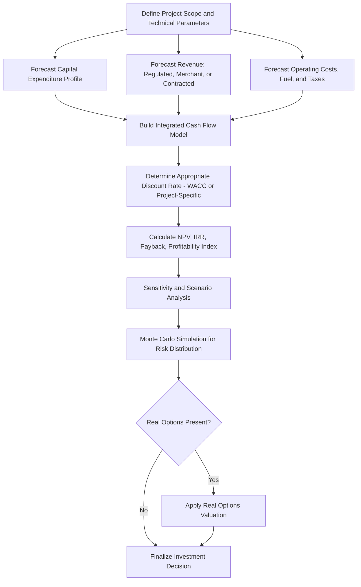

## Capital Budgeting for Energy Projects and Discounted Cash Flow

### Overview

Capital budgeting is the analytical process by which firms and investors evaluate whether a long-lived capital investment — a power plant, transmission line, pipeline, or energy efficiency program — creates value, and discounted cash flow (DCF) analysis is the primary quantitative framework used to make that determination. Energy projects present a distinctive application of standard corporate finance capital budgeting theory because of their unusually long asset lives, high upfront capital intensity, exposure to commodity and regulatory price risk, and (for many technologies) front-loaded capital spending followed by decades of comparatively predictable operating cash flow.

### Core DCF Framework

#### Net Present Value (NPV)

The foundational capital budgeting decision rule is Net Present Value: an investment creates value if the present value of its expected future cash flows exceeds its initial cost.

$$NPV = -C_0 + \sum_{t=1}^{n} \frac{CF_t}{(1+r)^t}$$

Where:

- $C_0$ = initial capital outlay (often spread over a multi-year construction period for energy projects, in which case each year's outlay is itself discounted)
- $CF_t$ = net cash flow in period $t$
- $r$ = the discount rate, typically the project's weighted average cost of capital (WACC) or a risk-adjusted hurdle rate
- $n$ = the project's economic life (often 20–60 years for major generation or transmission assets)

The standard decision rule: accept projects with $NPV > 0$; among mutually exclusive alternatives, prefer the one with the higher NPV (not necessarily the higher percentage return).

#### Internal Rate of Return (IRR)

IRR is the discount rate at which NPV equals zero:

0 = -C_0 + \sum_{t=1}^{n} \frac{CF_t}{(1+IRR)^t}$}

IRR is widely used in energy project screening because it expresses returns in a single percentage figure comparable across projects of different scale, but it has well-documented limitations relevant to energy projects specifically:

- **Multiple IRR problem**: projects with non-conventional cash flow patterns (e.g., a large negative cash flow at end-of-life for decommissioning, following the positive operating cash flows — see Decommissioning and waste management cost provisions) can have more than one mathematically valid IRR, or none, making the metric unreliable without careful cash flow sign-pattern checking.
- **Reinvestment rate assumption**: IRR implicitly assumes interim cash flows are reinvested at the IRR itself, which is often unrealistic; **Modified Internal Rate of Return (MIRR)** addresses this by assuming reinvestment at a specified, more realistic rate (often the firm's cost of capital).
- **Scale-blindness**: a small project with a very high IRR may create less absolute value than a large project with a more modest IRR, so IRR should not be used alone to rank mutually exclusive projects of different sizes — NPV is the theoretically preferred ranking criterion in that case.

#### Payback Period and Discounted Payback

Simple payback period (years until cumulative undiscounted cash flow turns positive) and discounted payback period (the same calculation using discounted cash flows) are widely used as supplementary screening metrics in energy project evaluation, particularly for distributed and efficiency investments, despite not being theoretically sound standalone investment criteria (since simple payback ignores the time value of money entirely and both variants ignore cash flows occurring after the payback point). They remain popular in practice because of their intuitive communicability to non-financial stakeholders and their use as a liquidity/risk-screening heuristic rather than a value-maximization criterion.

#### Profitability Index

$$PI = \frac{PV(\text{future cash flows})}{C_0}$$

Useful for capital-rationing situations (common when a utility or developer has a fixed capital budget and more positive-NPV projects than available capital), since it ranks projects by value created per dollar invested rather than by absolute NPV.

### Discount Rate Selection for Energy Projects

#### Weighted Average Cost of Capital (WACC)

$$WACC = \left(\frac{E}{V}\right) r_e + \left(\frac{D}{V}\right) r_d (1-\tau)$$

Where $E$ and $D$ are the market values of equity and debt, $V = E + D$, $r_e$ is the cost of equity, $r_d$ is the pre-tax cost of debt, and $\tau$ is the corporate tax rate. This is the same WACC formula referenced in Rate-of-return vs incentive/price-cap regulation, since regulators use it to set allowed revenue for regulated utilities, but in capital budgeting it is used prospectively as the discount rate applied to a specific project's expected cash flows.

#### Cost of Equity Estimation

The most common approach is the **Capital Asset Pricing Model (CAPM)**:

$$r_e = r_f + \beta \times (r_m - r_f)$$

Where $r_f$ is the risk-free rate, $\beta$ is the asset's systematic risk relative to the market, and $(r_m - r_f)$ is the equity market risk premium. For energy-specific project appraisal, analysts often use an **asset beta** (unlevered beta) reflecting the underlying business risk of the specific technology or asset class, then re-lever it to the project's actual capital structure using the Hamada equation or similar:

$$\beta_{levered} = \beta_{unlevered} \times \left[1 + (1-\tau)\frac{D}{E}\right]$$

#### Project-Specific vs Firm-Wide Discount Rates

A recurring practical issue in energy capital budgeting is whether to apply the parent company's firm-wide WACC or a project-specific discount rate reflecting the particular technology and jurisdiction's risk. Best practice, grounded in standard corporate finance theory, calls for project-specific discount rates when a project's risk differs materially from the firm's average risk — highly relevant in energy, where a single diversified energy company might simultaneously evaluate a low-risk regulated transmission asset, a merchant wholesale-market-exposed generation project, and a higher-risk international greenfield development, each warranting a distinct discount rate reflecting its own risk profile rather than a single blended corporate rate.

### Energy-Specific Cash Flow Modeling Considerations

#### Revenue-Side Modeling

Energy project cash flow projections must reflect the specific market or regulatory structure under which the asset will operate:

- **Regulated cost-of-service assets**: revenue is largely a function of the allowed revenue requirement (see Rate-of-return vs incentive/price-cap regulation), making cash flows comparatively predictable and reducing the appropriate discount rate relative to merchant assets.
- **Merchant/wholesale market assets**: revenue depends on projected wholesale electricity (and, where relevant, capacity and ancillary service) prices, requiring price forecasts often generated via production-cost or fundamentals-based market modeling, introducing substantially more cash flow uncertainty.
- **Contracted assets (PPAs, tolling agreements)**: revenue is fixed or formula-based under a long-term offtake contract, reducing merchant price risk but introducing counterparty credit risk as a distinct consideration in cash flow reliability assessment.

#### Cost-Side Modeling

- **Capital expenditure profile**: unlike many corporate investments with cash outlay concentrated near time zero, large energy projects (particularly nuclear and large hydro) have capital spending distributed over multi-year construction periods, requiring each tranche of capital to be discounted from its actual disbursement date, and interest during construction (IDC) to be modeled explicitly (see the IDC formula in Construction risk and cost overrun history).
- **Fuel and variable operating costs**: for fuel-consuming technologies, fuel price forecasts (and their correlation with revenue, in merchant markets where fuel and power prices often move together) materially affect projected margins; renewables and nuclear have comparatively low and more predictable variable costs.
- **Decommissioning and end-of-life costs**: for nuclear and, increasingly, wind and solar assets subject to end-of-life removal obligations, a terminal negative cash flow (or an ongoing accrual to a decommissioning fund, as discussed in Decommissioning and waste management cost provisions) must be incorporated into the cash flow model, which is the source of the multiple-IRR problem noted above.
- **Tax considerations**: depreciation schedules (e.g., Modified Accelerated Cost Recovery System, MACRS, in the US), investment tax credits, and production tax credits materially affect after-tax project cash flows and are a first-order determinant of project economics for many renewable energy investments in particular.

### Sensitivity, Scenario, and Risk Analysis

Given the wide range of input uncertainty in energy project cash flow forecasting (commodity prices, regulatory outcomes, construction cost and schedule, technology performance), DCF analysis for energy projects is rarely presented as a single-point estimate in professional practice; standard risk-analysis techniques layered onto the base DCF include:

- **Sensitivity analysis**: varying one input at a time (e.g., construction cost, capacity factor, power price) to identify which assumptions most affect NPV — often visualized via a tornado diagram.
- **Scenario analysis**: evaluating NPV under a small number of internally consistent, distinct future states (e.g., high-carbon-price/low-carbon-price scenarios, high/low demand growth), rather than varying inputs independently.
- **Monte Carlo simulation**: assigning probability distributions to key uncertain inputs and simulating many combinations to generate a distribution of possible NPV outcomes rather than a single figure, allowing explicit assessment of downside risk (e.g., probability of negative NPV) in addition to expected value.
- **Real options analysis**: recognizing that many energy investment decisions embed managerial flexibility — the option to delay, expand, abandon, or switch fuels/technology — which standard static DCF undervalues since it typically assumes a fixed, committed investment path; real options valuation (often using decision-tree or option-pricing techniques adapted from financial options theory) is particularly relevant for staged investments such as phased renewable buildouts or modular nuclear deployment (see Small modular reactor economics and prospects), where the ability to observe early results before committing to subsequent phases has genuine economic value not captured by a single NPV calculation.

### Capital Budgeting Process Flow

### Worked Example: Simplified Renewable Project NPV

A wind project requires an initial capital outlay of $100 million and is expected to generate net after-tax cash flow of $12 million per year for 20 years. The discount rate is 8%.

$$NPV = -100 + \sum_{t=1}^{20} \frac{12}{(1.08)^t}$$

Using the present value of an annuity formula:

$$PV_{annuity} = CF \times \frac{1 - (1+r)^{-n}}{r} = 12 \times \frac{1 - (1.08)^{-20}}{0.08} \approx 12 \times 9.818 \approx \$117.8 \text{ million}$$

$$NPV \approx -100 + 117.8 = \$17.8 \text{ million}$$

Since $NPV > 0$, the project would be accepted under the standard decision rule, and its IRR (the rate at which this NPV equals zero) can be found to be above 8%, confirming the same accept decision from the IRR criterion in this simple, conventional-cash-flow-pattern example. [Inference] Real project evaluations would layer in the additional cash flow modeling considerations, terminal decommissioning cash flow (where applicable), and risk analysis techniques described above rather than relying on this simplified, level-annuity representation, which is presented here purely to illustrate mechanical NPV calculation.

### Common Pitfalls in Energy Project Capital Budgeting

- **Confusing nominal and real cash flows/discount rates**: mixing a nominal discount rate with real (inflation-adjusted) cash flow projections, or vice versa, systematically distorts NPV; the discount rate and cash flows must be consistently either nominal (including expected inflation) or real (excluding it) throughout the model.
- **Ignoring optionality**: treating large, staged, or flexible investments as a single fixed commitment when the ability to delay, expand, or abandon has material economic value not captured by static NPV, as discussed above.
- **Terminal value mis-specification**: for assets with economic lives extending beyond the explicit forecast period, terminal value calculations (e.g., a Gordon growth perpetuity) must be handled carefully, since standard growing-perpetuity terminal value formulas assume indefinite continuation and can be a poor fit for assets with finite regulatory licenses, resource depletion, or defined decommissioning dates.
- **Underestimating construction-period cash outflow timing effects**: treating multi-year capital expenditure as a single lump sum at time zero rather than discounting each disbursement from its actual date understates the true present-value cost of long-construction-duration projects (a particularly material issue for nuclear, as discussed in Construction risk and cost overrun history).
- **Using a single discount rate across dissimilar risk components**: applying one blended discount rate to cash flows with genuinely different risk profiles (e.g., contracted, government-backed, and merchant-exposed revenue streams within a single project) can materially misstate value; risk-differentiated valuation approaches (e.g., valuing contracted and merchant cash flow streams separately at different discount rates) are considered better practice for projects with mixed revenue structures.

[Inference] The specific methodological refinements a given analysis warrants depend heavily on the project's actual risk structure and data availability; the pitfalls above reflect commonly cited errors in energy project finance practice rather than an exhaustive or universally applicable checklist for every project type.

### Related Topics

- Weighted average cost of capital (WACC) estimation for regulated and merchant energy assets
- Rate-of-return vs incentive/price-cap regulation (regulatory revenue certainty and discount rate linkage)
- Real options valuation applied to staged and modular energy investments
- Power purchase agreements (PPAs) and contracted revenue risk assessment
- Monte Carlo simulation techniques for energy project risk modeling
- Tax equity structures and depreciation-driven project finance (US renewable energy context)
- Construction risk and cost overrun history (capital expenditure profile modeling linkage)
- Levelized Cost of Electricity (LCOE) as a complementary project comparison metric
- Project finance structuring: non-recourse debt and special purpose vehicles in energy
- Capital rationing and portfolio-level investment prioritization for utilities and developers