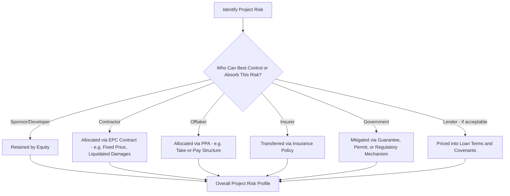
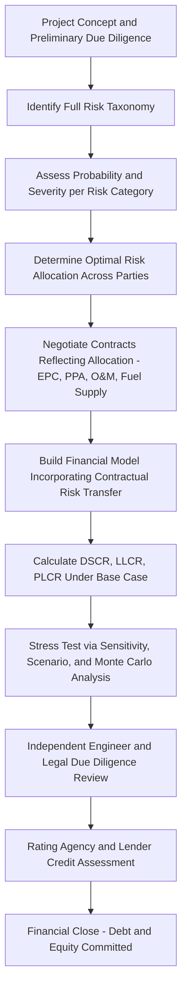

## Risk Assessment in Energy Project Finance

### Overview

Project finance — funding a specific energy asset primarily through debt and equity secured against the project's own cash flows and assets, rather than the sponsor's general balance sheet — depends fundamentally on rigorous risk identification and allocation. Because lenders in a project finance structure typically have limited or no recourse to the sponsoring company, the entire lending decision rests on a detailed assessment of which risks the project faces, how likely and severe each is, and — critically — which party in the transaction is best positioned to bear or mitigate each one. This item addresses the risk taxonomy and assessment methodology that underlies energy project finance, distinct from the discounted cash flow mechanics covered in Capital budgeting for energy projects and discounted cash flow.

### The Central Principle: Risk Allocation, Not Just Risk Identification

Project finance theory holds that project value and financeability are maximized not by eliminating risk (usually impossible) but by allocating each risk to the party best able to control, absorb, or price it. A risk allocated to a party unable to manage or afford it either goes unpriced (creating hidden fragility) or gets priced so expensively that the project becomes uneconomic. This principle underlies the structure of nearly every contract in a project finance transaction — the EPC contract, the offtake agreement, fuel supply agreements, and the financing documents themselves — each of which is, in substance, a risk-allocation instrument.

### Risk Taxonomy for Energy Projects

#### 1. Construction/Completion Risk

The risk that the project is not completed on time, on budget, or to specification. This is generally considered the single most significant risk category in project finance, since a project that never reaches commercial operation generates no revenue to service debt.

- **Mitigation mechanisms**: fixed-price, date-certain EPC (engineering-procurement-construction) contracts with liquidated damages provisions for late completion or performance shortfalls; completion guarantees from creditworthy sponsors or contractors; independent engineer oversight during construction; contingency reserves and standby equity/debt facilities.
- **Energy-sector specificity**: construction risk is empirically the most severe and best-documented in nuclear projects (see Construction risk and cost overrun history) but is present to varying degrees across all technologies — even comparatively fast-to-build renewable projects face interconnection delays, supply chain disruption (e.g., solar panel or wind turbine component shortages), and permitting risk.

#### 2. Technology and Performance Risk

The risk that the completed asset does not perform as designed — lower-than-expected capacity factor, heat rate, availability, or efficiency.

- **First-of-a-kind (FOAK) technology risk**: novel or unproven technologies (e.g., advanced nuclear designs, novel storage chemistries, offshore floating wind) carry materially higher performance risk than mature, widely deployed technologies, since there is less operating history from which to forecast performance reliably.
- **Mitigation mechanisms**: performance guarantees and warranties from equipment suppliers and EPC contractors; performance testing requirements prior to substantial completion/commercial operation date; technology insurance products where available (though these are typically limited or unavailable for genuinely novel technologies).

#### 3. Resource Risk

Specific to resource-dependent generation: the risk that the underlying energy resource (wind, solar irradiance, hydrological flow, geothermal reservoir characteristics) differs from pre-construction estimates.

- **Assessment methodology**: resource assessments typically rely on multi-year historical measurement campaigns combined with statistical modeling to generate probability-weighted output estimates, commonly expressed as P50, P90, and P99 values (the output level expected to be exceeded 50%, 90%, and 99% of the time, respectively) rather than a single deterministic figure.
- **Lender reliance on P90/P99**: because lenders require confidence that debt service can be met even in a below-average resource year, project finance debt sizing is typically based on the more conservative P90 or P99 output estimate rather than the P50 (expected-case) estimate used for equity return projections, embedding a deliberate margin of conservatism into the financing structure itself.

#### 4. Market/Price Risk

The risk that revenue is lower than projected due to adverse movements in wholesale electricity prices, capacity prices, or (for fuel-consuming plants) fuel-power price spreads.

- **Merchant exposure**: projects selling into wholesale markets without long-term contracts bear full exposure to this risk, generally commanding a materially higher cost of capital and lower achievable debt-to-equity leverage than contracted projects, reflecting lenders' unwillingness to size debt against volatile, unhedged revenue.
- **Contracted mitigation**: long-term power purchase agreements (PPAs), tolling agreements, or contracts for difference (CfDs) shift price risk to a creditworthy offtaker or counterparty, which is generally the single most important factor enabling high-leverage, non-recourse project financing for merchant-capable technologies.
- **Hedging**: financial hedges (fixed-for-floating swaps, price collars) can partially substitute for a physical PPA where liquid financial markets exist for the relevant commodity or power price index.

#### 5. Offtaker/Counterparty Credit Risk

Even with a signed long-term PPA, the value of that contract depends entirely on the offtaker's ability and willingness to pay over the contract's full term.

- **Assessment approach**: lenders and rating agencies assess offtaker creditworthiness (credit rating, financial statements, regulatory status for utility offtakers) as a core underwriting input, since a project with a "creditworthy" PPA but a financially weak offtaker effectively retains substantial market risk in practice.
- **Mitigation mechanisms**: parent company guarantees, letters of credit, or credit support structures where the offtaker's standalone credit is insufficient; offtaker diversification (multiple offtake counterparties) for larger projects, reducing concentration risk to any single counterparty.

#### 6. Fuel Supply Risk

Relevant to thermal (gas, coal) and nuclear projects: the risk of fuel unavailability, price volatility, or supply chain disruption.

- **Mitigation mechanisms**: long-term fuel supply agreements, often structured with price indexation mechanisms that correlate fuel cost changes with revenue (e.g., in tolling or cost-pass-through PPA structures) to preserve margin stability regardless of absolute fuel price level.
- **Nuclear-specific considerations**: as discussed in Fuel cycle economics and enrichment costs, nuclear fuel cost is a comparatively small share of total generation cost, somewhat reducing (though not eliminating) fuel price risk's relative importance for nuclear project finance relative to gas-fired projects, where fuel cost is the dominant variable cost driver.

#### 7. Regulatory and Political Risk

The risk of adverse changes in law, permitting requirements, tariff/subsidy structures, or broader political conditions affecting the project.

- **Regulatory risk**: changes to environmental regulations, safety requirements, tax policy (e.g., changes to renewable tax credit eligibility or value), or market rules (e.g., capacity market design changes) that were not anticipated at financial close.
- **Political risk**: particularly relevant for cross-border or emerging-market energy investments — risk of expropriation, currency inconvertibility, breach of government contracts, or civil unrest affecting project operation.
- **Mitigation mechanisms**: political risk insurance (available from institutions such as the Multilateral Investment Guarantee Agency, MIGA, and various export credit agencies and private political risk insurers); stabilization clauses in government agreements; structuring investments through jurisdictions with applicable bilateral investment treaties.

#### 8. Currency and Interest Rate Risk

- **Currency risk**: arises when project revenue and debt service are denominated in different currencies (common in emerging-market energy projects financed partly in hard currency), creating exposure to exchange rate movements; mitigated via currency hedges, local-currency financing where available, or revenue indexation to the financing currency (though the latter shifts currency risk onto the offtaker, which may itself introduce counterparty risk if the offtaker's own revenue is in local currency).
- **Interest rate risk**: relevant where project debt carries floating rates; typically hedged via interest rate swaps to fix debt service costs and preserve the debt service coverage ratios underwriting was based upon.

#### 9. Operating Risk

The risk of higher-than-expected operating and maintenance costs, unplanned outages, or operator underperformance over the project's operating life.

- **Mitigation mechanisms**: long-term operation and maintenance (O&M) agreements, often with performance incentives/penalties; reserve accounts sized to cover major maintenance events (e.g., turbine overhauls, steam generator replacement); insurance for unplanned outage/business interruption losses.

#### 10. Environmental and Social Risk

Risk arising from environmental compliance, community opposition, or social impact issues, increasingly assessed via structured frameworks such as the **Equator Principles** (a risk-management framework adopted by many project finance lenders for determining, assessing, and managing environmental and social risk in projects, based substantially on the International Finance Corporation's Performance Standards).

### Quantitative Risk Assessment Tools

#### Debt Service Coverage Ratio (DSCR)

The central credit metric in project finance, measuring the project's cash flow available for debt service relative to the debt service obligation itself in a given period:

$$DSCR_t = \frac{CFADS_t}{DS_t}$$

Where $CFADS_t$ is Cash Flow Available for Debt Service in period $t$ (operating cash flow after operating costs and taxes, before debt service) and $DS_t$ is total debt service (principal plus interest) due in that period. Lenders typically require a minimum DSCR (commonly in the range of roughly 1.2x–1.5x depending on technology, revenue certainty, and market conditions) throughout the loan tenor, with the specific minimum threshold reflecting the lender's assessment of the underlying revenue risk — contracted, low-volatility revenue streams generally support lower minimum DSCR requirements (and correspondingly higher leverage) than merchant-exposed revenue.

#### Loan Life Coverage Ratio (LLCR) and Project Life Coverage Ratio (PLCR)

$$LLCR = \frac{PV(CFADS \text{ over remaining loan life})}{\text{Outstanding Debt Balance}}$$

LLCR extends the DSCR concept across the entire remaining loan tenor rather than a single period, capturing whether projected cash flows over the full repayment schedule are sufficient in present-value terms — useful for identifying risk concentrated in specific future periods that a single-period DSCR might not reveal. PLCR performs the analogous calculation using the project's full remaining economic life rather than just the loan tenor, providing insight into the cushion available after scheduled debt repayment.

#### Sculpted Debt Repayment

Rather than a level (constant) debt repayment schedule, project finance debt is frequently "sculpted" — structured so that the repayment amount in each period varies to maintain a targeted constant DSCR across the loan tenor, accommodating projects with cash flows that vary predictably over time (e.g., declining resource output over an asset's life, or a PPA with pre-scheduled price escalation).

#### Break-Even Analysis

Determining the minimum sustained price, resource output, or cost level at which the project can still service its debt (DSCR = 1.0x) or achieve a minimum acceptable equity return, providing an intuitive risk-tolerance threshold distinct from a full probabilistic simulation.

#### Probabilistic (Monte Carlo) Risk Modeling

As discussed in Capital budgeting for energy projects and discounted cash flow, Monte Carlo simulation is widely used in project finance risk assessment to generate a full probability distribution of key credit metrics (DSCR, equity IRR) rather than relying solely on point estimates or a small number of discrete scenarios, allowing lenders to assess, for example, the probability of a DSCR breach under the joint distribution of resource, price, and cost uncertainty.

### Credit Rating Agency Frameworks

Rating agencies (S&P Global Ratings, Moody's, Fitch) apply structured project finance rating methodologies that generally assess:

- Construction phase risk (if applicable) separately from operating phase risk, since ratings are frequently assigned or revised at the construction-to-operation transition.
- Revenue certainty/contract structure (contracted vs merchant, offtaker credit quality)
- Technology and operating track record
- Financial structure (leverage, DSCR levels, reserve account sizing, refinancing risk if the debt does not fully amortize over the assessed rating horizon)
- Structural protections (cash flow waterfall provisions, distribution lock-up triggers tied to minimum DSCR thresholds, restrictions on additional indebtedness)

[Unverified] Specific rating agency methodology thresholds and criteria are periodically revised and vary by agency and by technology sector; readers requiring current, precise criteria should consult the relevant agency's published methodology documents directly rather than relying on generalized secondary descriptions, given the periodic nature of methodology updates.

### Risk Allocation Matrix (Illustrative)

| Risk Category | Typically Allocated To | Primary Mitigation Instrument |
| --- | --- | --- |
| Construction/completion | Contractor (via EPC), backstopped by sponsor | Fixed-price EPC with liquidated damages |
| Resource variability | Equity (with lender protection via P90/P99 debt sizing) | Conservative debt sizing, resource insurance where available |
| Market/merchant price | Sponsor/equity, or offtaker if contracted | PPA, CfD, or financial hedge |
| Offtaker credit | Lenders (priced into terms) | Offtaker credit support, guarantees, diversification |
| Fuel supply/price | Sponsor or offtaker, depending on contract structure | Long-term supply agreement with price indexation |
| Regulatory/political | Sponsor, government, or insurer | Political risk insurance, stabilization clauses |
| Currency | Sponsor or lender, depending on financing currency match | Currency hedges, local-currency financing |
| Operating performance | O&M contractor and sponsor | Long-term O&M agreement with performance incentives |
| Environmental/social | Sponsor | Equator Principles compliance, impact mitigation plans |

### Risk Assessment Workflow

### Related Topics

- Capital budgeting for energy projects and discounted cash flow (financial modeling foundation)
- Construction risk and cost overrun history (deep dive on the most severe risk category for nuclear specifically)
- Power purchase agreements (PPA) and contracts for difference structuring
- Nuclear liability regimes and insurance economics (specialized risk transfer mechanism example)
- Debt sizing methodology and sculpted repayment structures in project finance
- Political risk insurance and multilateral guarantee institutions (MIGA, export credit agencies)
- Equator Principles and environmental/social risk management frameworks
- Credit rating agency methodologies for project finance instruments
- Resource assessment methodology: P50/P90/P99 probabilistic output estimation
- Real options valuation and staged investment risk mitigation