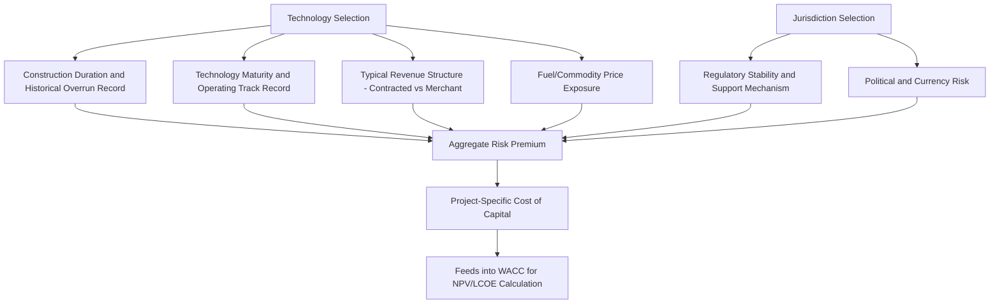

## Cost of Capital Differences Across Energy Technologies

### Overview

Different energy generation technologies systematically face different costs of capital in practice, even when evaluated by the same investor in the same market at the same point in time. This variation is not arbitrary — it reflects genuine, quantifiable differences in the risk characteristics of each technology's cash flows, construction profile, and market exposure. Because the discount rate is one of the most sensitive inputs in the Levelized Cost of Electricity (LCOE) and net present value calculations discussed in Capital budgeting for energy projects and discounted cash flow, understanding why cost of capital differs across technologies is essential to interpreting and comparing energy investment economics correctly.

### Why Cost of Capital Varies by Technology: The Underlying Drivers

#### 1. Construction Duration and Completion Risk

Technologies with longer, more uncertain construction periods carry higher risk premia. As detailed in Construction risk and cost overrun history, nuclear projects have historically exhibited the most severe and persistent construction risk of any mainstream generation technology, directly elevating the risk premium investors and lenders demand. Utility-scale solar and onshore wind, by contrast, typically have construction periods measured in months to roughly two years, with comparatively standardized, modular construction processes and a much larger base of completed projects from which to estimate realistic cost and schedule outcomes — both of which reduce construction-phase risk premia.

#### 2. Revenue Structure and Market Exposure

As discussed in Risk assessment in energy project finance, the presence and creditworthiness of a long-term offtake contract (PPA) is one of the single largest determinants of a project's effective cost of capital, largely independent of the underlying generation technology itself. A merchant (wholesale-market-exposed) gas plant and a merchant wind farm both face materially higher costs of capital than an equivalent contracted asset of either technology, because lenders and equity investors price the volatility and uncertainty of unhedged wholesale revenue into their required returns. However, in practice, technology and revenue structure are correlated: renewable projects are disproportionately financed under long-term PPAs or government-backed contracts-for-difference (particularly where feed-in tariffs, renewable portfolio standards, or CfD auction mechanisms are prevalent), which has historically allowed renewables to access notably favorable, low-cost project financing relative to what a purely merchant renewable project would command.

#### 3. Technology Maturity and Track Record

Mature, widely deployed technologies with extensive operating histories (large-scale onshore wind, utility solar PV, combined-cycle gas turbines) allow lenders and investors to underwrite performance risk with substantially more statistical confidence than novel or first-of-a-kind (FOAK) technologies. Nuclear new-build (particularly advanced/SMR designs, see Small modular reactor economics and prospects) and emerging technologies (e.g., novel long-duration storage chemistries, floating offshore wind, and green hydrogen production) generally carry a "technology risk premium" reflecting the absence of a large base of comparable completed, operating projects.

#### 4. Regulatory and Policy Support Structure

Technologies operating under stable, well-established regulatory support mechanisms (e.g., regulated cost-of-service recovery for transmission and some nuclear assets, as discussed in Rate-of-return vs incentive/price-cap regulation; or mature renewable support schemes such as long-running feed-in tariff or tax credit regimes) benefit from reduced policy risk relative to technologies dependent on political conditions perceived as more likely to change (e.g., technologies reliant on subsidy programs subject to periodic legislative renewal, or projects in jurisdictions with less established or more frequently revised energy policy frameworks).

#### 5. Fuel Price and Commodity Exposure

Technologies with material fuel-price exposure (gas-fired generation in particular) introduce a distinct risk factor — the correlation (or lack thereof) between fuel costs and power price revenue — that fuel-free technologies (wind, solar, and, to a lesser extent given its fuel cost is a small LCOE share, nuclear — see Fuel cycle economics and enrichment costs) do not face to the same degree. Where fuel and power price movements are well-correlated (common in gas-on-the-margin wholesale markets), some of this risk is naturally hedged; where they are not well correlated, or in bilateral/emerging-market contexts with less liquid hedging markets, this represents an additional risk premium source.

### Quantitative Illustration: Technology Risk Premium Layering

A stylized decomposition of how technology-specific risk premia might layer onto a risk-free rate to build up a project-specific cost of equity:

$$r_e = r_f + RP_{market} + RP_{construction} + RP_{technology} + RP_{market\_exposure} + RP_{regulatory} + RP_{country}$$

Where $r_f$ is the risk-free rate, $RP_{market}$ is the general equity market risk premium (as in standard CAPM), and the remaining terms represent additive risk premia specific to construction risk, technology maturity, merchant/contracted revenue exposure, regulatory stability, and (where relevant) country/political risk. [Inference] This additive decomposition is a simplified pedagogical framework for illustrating the qualitative sources of technology cost-of-capital differences; in practice, sophisticated project finance and equity risk pricing does not literally sum discrete, independently-estimated premia in this manner, but instead reflects market-clearing prices for debt and equity that implicitly incorporate these factors in ways that are not perfectly decomposable, and the actual observed spread between technologies at any point in time is an empirical market outcome rather than a value computable from this formula directly.

### Illustrative Relative Cost of Capital Ranking (Qualitative)

| Technology/Structure | Relative Cost of Capital | Primary Drivers |
| --- | --- | --- |
| Regulated transmission/distribution | Lowest | Guaranteed cost-of-service recovery, minimal construction and market risk |
| Contracted utility-scale solar/onshore wind (mature markets) | Low | Mature technology, standardized construction, long-term PPA/CfD revenue certainty |
| Regulated nuclear (existing fleet, life extension) | Low to moderate | Largely de-risked (amortized asset), but subject to regulatory and political uncertainty |
| Contracted gas-fired generation (tolling/PPA) | Moderate | Mature technology, but with fuel price and counterparty considerations |
| Merchant gas-fired or renewable generation | Moderate to high | Full exposure to wholesale price volatility |
| New-build nuclear (large-scale, merchant or quasi-merchant) | High | Severe construction risk, long lead times, and (absent RAB-style mechanisms) limited revenue certainty during construction |
| First-of-a-kind SMR/advanced nuclear | Highest among nuclear | Combines nuclear construction risk with unproven technology/performance risk |
| Emerging/pre-commercial technology (e.g., novel storage, green hydrogen at scale) | Highest overall | Limited operating track record, uncertain cost trajectory, evolving policy support |

[Unverified] This ranking reflects generalized, qualitative patterns commonly described in the energy finance literature and industry commentary; actual relative cost of capital at any given time and jurisdiction depends on prevailing capital market conditions, specific project characteristics, and policy environment, and can shift meaningfully — for example, rising interest rate environments, policy support changes, or a string of high-profile project failures in a given technology category can materially alter relative positioning within a short period. Current, project-specific figures should be sourced from recent market transactions or specialized energy finance data providers rather than inferred from this generalized table.

### Policy Mechanisms Designed to Reduce Cost of Capital

Because cost of capital is such a large driver of total project cost for capital-intensive, low/no-fuel-cost technologies (nuclear and most renewables), a substantial share of energy policy design in recent decades has been explicitly aimed at reducing technology-specific cost of capital rather than solely targeting operating cost or revenue support:

- **Contracts for Difference (CfDs)**: guarantee a fixed "strike price" to the generator regardless of wholesale market price movements, converting merchant price risk into a government/counterparty credit risk, substantially reducing revenue-related risk premia — used extensively in UK offshore wind auctions and increasingly proposed or used for new nuclear (e.g., discussed in relation to UK nuclear projects) and other low-carbon technologies.
- **Regulated Asset Base (RAB) models**: as discussed in Construction risk and cost overrun history, allow construction-period cost recovery from ratepayers, directly reducing the effective cost of capital by removing construction-phase revenue uncertainty — a mechanism specifically designed to counteract the highest-risk-premium phase of large nuclear projects identified in the ranking above.
- **Government loan guarantees**: (e.g., the US DOE Loan Programs Office) reduce lenders' credit risk exposure by shifting default risk partly onto the government, generally lowering achievable debt pricing and enabling higher leverage than would otherwise be available on a purely commercial basis.
- **Tax credits and accelerated depreciation**: (e.g., US Investment Tax Credit and Production Tax Credit for renewables, MACRS depreciation) do not directly reduce the discount rate but improve after-tax project economics in ways that have historically supported the growth of specialized "tax equity" financing structures for US renewables, effectively creating a distinct, relatively low-cost capital pool for tax-credit-eligible projects.
- **Sovereign/multilateral risk mitigation instruments**: political risk insurance and multilateral guarantees (as discussed in Risk assessment in energy project finance) specifically target the country/political risk premium component for emerging-market energy investment, without which many such projects would be unfinanceable at any price acceptable to private capital.

### Cost of Capital Determinants Flow

### Interaction With Comparative Technology Economics

Because LCOE calculations are highly sensitive to the discount rate used (given the front-loaded capital cost structure of most low-carbon technologies), differences in cost of capital across technologies can materially affect — and sometimes reverse — apparent cost competitiveness rankings depending on what discount rate assumption is applied:

$$\frac{\partial LCOE}{\partial r} > 0 \text{ generally, with the sensitivity increasing as the ratio of capital cost to operating cost increases}$$

This means capital-intensive, low-operating-cost technologies (nuclear, offshore wind, and to a lesser extent onshore wind/solar) show LCOE estimates that are disproportionately sensitive to discount rate assumptions relative to technologies with a larger share of ongoing fuel/operating cost (gas-fired generation), which is why published LCOE comparisons across technologies and studies can vary substantially depending on the discount rate assumption used — a frequently cited source of divergence between different published LCOE studies covering the same technologies. [Inference] Any cross-study LCOE comparison should therefore explicitly check whether a common discount rate assumption was applied before drawing conclusions about relative technology cost competitiveness, since a nuclear vs. renewables comparison using each technology's own "typical" empirically observed cost of capital will generally show a different result than the same comparison using a single, uniform discount rate assumption across both.

### Related Topics

- Capital budgeting for energy projects and discounted cash flow (WACC and CAPM foundations)
- Risk assessment in energy project finance (risk allocation mechanisms underlying cost-of-capital differences)
- Construction risk and cost overrun history (primary driver of nuclear's elevated risk premium)
- Rate-of-return vs incentive/price-cap regulation (regulatory structures affecting utility cost of capital)
- Contracts for Difference (CfD) and Regulated Asset Base (RAB) as cost-of-capital reduction mechanisms
- Tax equity financing structures for US renewable energy projects
- Levelized Cost of Electricity (LCOE) methodology and discount rate sensitivity
- Political risk insurance and multilateral guarantee institutions
- Small modular reactor economics and prospects (technology risk premium case study)
- Green hydrogen and emerging technology finance challenges