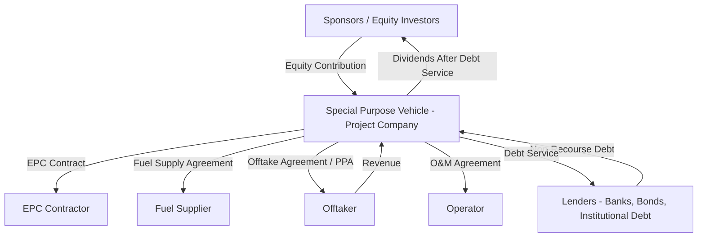
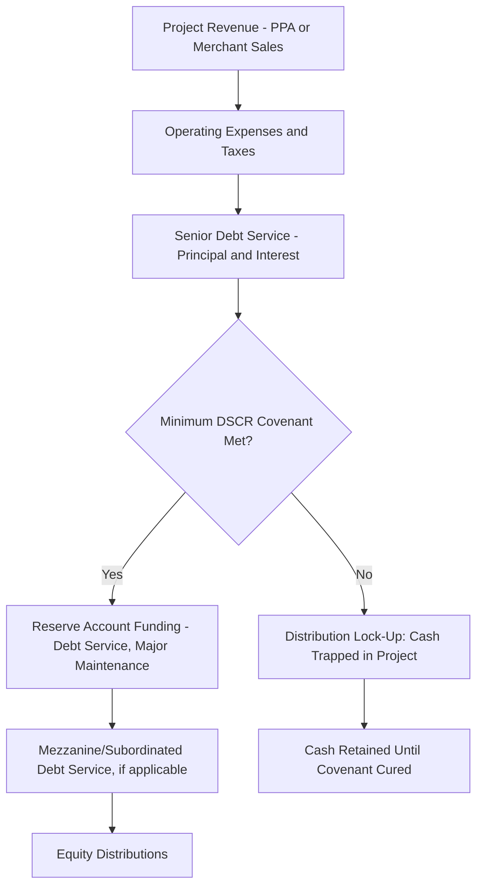

## Project Finance Structures for Large Energy Infrastructure

### Overview

Project finance is a specialized financing method in which a large capital investment — a power plant, pipeline, LNG terminal, or transmission line — is funded and secured against the specific project's own assets and cash flows, rather than the general creditworthiness of the sponsoring companies. This structural choice, rather than any single risk-mitigation technique, is what allows large energy infrastructure to be financed with high leverage despite carrying substantial construction and operating risk, and it is the organizing framework within which the risk allocation principles discussed in Risk assessment in energy project finance and the discount-rate considerations in Cost of capital differences across energy technologies actually get implemented contractually.

### Defining Characteristics of Project Finance

Project finance is distinguished from conventional corporate finance by several structural features:

- **Non-recourse or limited-recourse debt**: lenders' claim in the event of default is limited to the project's own assets and cash flows, with no (or only limited, contractually-defined) recourse to the sponsor's broader balance sheet. This contrasts with corporate finance, where a loan is backed by the full creditworthiness of the borrowing entity.
- **Off-balance-sheet treatment (historically)**: because the project is typically held in a legally separate entity, project debt has historically often not appeared on the sponsor's consolidated balance sheet under various accounting regimes, though the precise accounting treatment depends on the specific consolidation rules applicable (e.g., IFRS 10/12 or US GAAP variable interest entity rules) and the sponsor's actual degree of control and risk retention — this is a technical accounting determination rather than something achievable purely through legal structuring.
- **High leverage relative to corporate norms**: well-structured project finance transactions with strong contracted revenue can achieve debt-to-capital ratios substantially higher than would typically be available to the same sponsor for an equivalent corporate-level investment, precisely because the debt is secured against a single, well-understood, contractually de-risked cash flow stream rather than diluted across the sponsor's more diverse and less transparent overall business risk.
- **Extensive contractual risk allocation**: as discussed in Risk assessment in energy project finance, project finance structures rely on a dense web of interlocking contracts (EPC, O&M, offtake, fuel supply, financing documents) that collectively allocate essentially all foreseeable project risks to specific, named parties, since — unlike a diversified corporation with balance sheet capacity to absorb unexpected shocks — a single-asset project entity has no capacity to absorb risks not explicitly allocated and priced.

### The Special Purpose Vehicle (SPV)

#### Structure and Rationale

At the center of nearly every project finance transaction is a **Special Purpose Vehicle (SPV)** — sometimes called a Project Company — a legally distinct entity created solely to develop, own, and operate the specific project, holding no other assets or liabilities.

Isolating the project within an SPV serves several economically important purposes:

- **Risk ringfencing**: creditors of the SPV generally cannot pursue the sponsor's other assets, and — subject to appropriate structuring to avoid substantive consolidation or similar legal challenges — the sponsor's other creditors generally cannot reach the SPV's assets either, insulating each from the other's risks.
- **Transparent, dedicated cash flow analysis**: because the SPV holds only the project's assets, liabilities, and contracts, lenders can underwrite the transaction based on a clean, project-specific cash flow analysis without needing to assess or be diluted by the sponsor's broader (and often more complex or opaque) corporate financial position.
- **Enabling multiple sponsors/co-investors**: an SPV structure readily accommodates joint ventures among multiple sponsors with differing ownership stakes, since equity and governance rights can be cleanly defined at the SPV level independent of each sponsor's other business activities.

### Capital Structure Layers

#### Senior Debt

The largest financing layer in most project finance transactions, typically provided by commercial banks (often as a syndicate), institutional investors (via private placements), or capital markets (project bonds). Senior debt holders have first priority claim on project cash flows and security over project assets. Key features specific to project finance senior debt:

- **Sculpted amortization**: as discussed in Risk assessment in energy project finance, repayment schedules are frequently structured to match the project's projected cash flow profile (maintaining a target DSCR) rather than following a level repayment schedule.
- **Cash flow waterfall**: project revenue is distributed according to a strictly defined priority order (the "waterfall") — typically operating expenses, then senior debt service, then reserve account funding, then subordinated debt service (if any), then equity distributions — with distributions to equity contractually blocked ("locked up") if minimum coverage ratio covenants are not met in a given period.

#### Mezzanine/Subordinated Debt

An intermediate layer of financing, ranking below senior debt but above equity in the repayment priority (and correspondingly priced at a higher rate than senior debt but lower than pure equity returns). Used to increase overall leverage and reduce the required equity contribution, mezzanine debt is more common in transactions where senior lenders are unwilling to extend leverage to the level the sponsor desires, or where a value-added second layer of capital (sometimes provided by infrastructure funds or specialized mezzanine investors) can bridge that gap.

#### Equity

Provided by project sponsors (developers, utilities, infrastructure funds, or strategic industrial partners) and bearing the residual risk and return of the project after all debt obligations are met. Equity investors typically require materially higher returns than debt holders, reflecting their subordinate claim and full exposure to project underperformance, but retain the upside if the project outperforms the base case.

#### Tax Equity (US Renewable Context)

A financing structure specific to US renewable energy projects, in which an investor (often a large financial institution with substantial US tax liability) provides capital in exchange for the ability to monetize tax benefits (the Investment Tax Credit or Production Tax Credit, and accelerated depreciation) that the project generates but that the sponsor developer may be unable to fully use itself, given that many renewable developers do not generate sufficient taxable income to use these credits directly. Common structures include partnership flip structures (where the tax equity investor receives a large share of tax benefits and cash flow until achieving a target return, after which allocation "flips" predominantly to the sponsor) and sale-leaseback arrangements. [Inference] Tax equity structuring is a highly specialized and jurisdiction-specific (US tax code-dependent) area of project finance; the general description here is illustrative of the underlying economic rationale rather than a complete technical treatment of partnership flip mechanics, which involve substantial additional tax law complexity beyond the scope of a general finance overview.

### Financing Instrument Types

#### Bank Debt (Syndicated Loans)

Traditionally the dominant source of project finance debt, particularly for the construction phase, where banks' greater willingness and contractual flexibility to manage drawdowns, monitor construction progress, and address unforeseen issues (change orders, delay claims) makes bank debt often better suited to construction-phase risk than fixed-term bond financing.

#roperty#### Project Bonds

Debt securities issued directly by the SPV to capital markets investors (often institutional investors such as pension funds and insurance companies seeking long-duration, stable-yield assets matching their own long-dated liabilities). Increasingly used for operating-phase (post-construction) financing or refinancing, where cash flows are better established and more predictable, making the asset a better fit for buy-and-hold bond investors than for the more actively managed bank loan market. **Mini-perm** structures — an initial bank loan sized to cover the construction period and early operations, with an expectation of refinancing via bonds or other longer-term debt once the asset has demonstrated stable operating performance — are a common hybrid approach, allowing construction-phase flexibility while accessing potentially lower-cost, longer-tenor capital markets financing once operating risk has been substantially reduced.

#### Export Credit Agency (ECA) Financing

Government-backed export credit agencies (e.g., US EXIM Bank, UK Export Finance, Euler Hermes) provide financing or guarantees to support the export of their home country's goods and services (e.g., turbines, EPC services) to energy projects abroad, often at favorable terms and with a risk-mitigation function similar to that of the political risk insurance discussed in Risk assessment in energy project finance, since ECA involvement is generally understood by other lenders as signaling a degree of home-government support for the transaction's success.

#### Multilateral and Development Finance Institution (DFI) Financing

Institutions such as the World Bank Group (including the International Finance Corporation, IFC), regional development banks (e.g., Asian Development Bank, African Development Bank, European Bank for Reconstruction and Development), and national development finance institutions provide debt, guarantees, and political risk mitigation for energy projects, particularly in emerging markets, often playing a catalytic role that helps mobilize additional private commercial lending alongside their own participation (sometimes termed a "halo effect," where DFI involvement signals reduced political risk to other prospective lenders).

#### Green and Sustainability-Linked Bonds/Loans

Financing instruments where proceeds are earmarked for environmentally beneficial projects (green bonds/loans, governed by frameworks such as the Green Bond Principles) or where pricing is contractually linked to the borrower achieving specified sustainability performance targets (sustainability-linked loans). These have grown substantially as a share of energy infrastructure financing, particularly for renewable generation and transmission supporting decarbonization, and can in some cases access somewhat more favorable pricing ("greenium") reflecting strong investor demand for labeled sustainable debt instruments, though the size and persistence of any such pricing benefit varies by market conditions and instrument.

### Contractual Architecture

#### The EPC (Engineering, Procurement, and Construction) Contract

As discussed in Risk assessment in energy project finance, the EPC contract is the primary instrument allocating construction risk, typically structured on a **fixed-price, date-certain, turnkey** basis (sometimes called "EPC wrap"), under which the contractor bears responsibility for design, procurement, and construction for a fixed price and by a fixed date, with liquidated damages payable to the SPV for late completion or performance shortfalls, and (often) a completion guarantee or performance bond backing the contractor's obligations.

#### The Offtake Agreement (PPA/Tolling Agreement)

Establishes the revenue basis for the project — either a power purchase agreement (PPA, under which the SPV sells electricity, typically at a specified price or price formula, to a defined offtaker) or a tolling agreement (under which the SPV is paid a capacity/availability fee for making the plant available to convert fuel into electricity for a counterparty who separately supplies the fuel and sells the power, shifting spread risk primarily to the tolling counterparty rather than the SPV).

#### Direct Agreements and Step-In Rights

Lenders typically require **direct agreements** with key project counterparties (the EPC contractor, offtaker, and operator), granting lenders **step-in rights** — the contractual ability to substitute their own designated party into the SPV's role under a contract, or to cure a default themselves, if the SPV defaults — providing lenders a mechanism to protect and potentially rescue the value of the collateral (the project itself, via its contracts) rather than being limited solely to enforcing security and disposing of physical assets, which for a specialized single-purpose asset like a power plant may realize far less value than continued operation under the existing contract suite.

#### Intercreditor Agreements

Where multiple layers of debt exist (senior, mezzanine, potentially multiple senior tranches from different lender groups), an intercreditor agreement establishes the relative priority, voting, and enforcement rights among the different creditor classes, a necessary complement to the cash flow waterfall in governing what happens in default or restructuring scenarios rather than only in the ordinary-course cash distribution scenario the waterfall addresses.

### Refinancing Strategy

Given the differing risk-appetite and pricing profiles of bank debt (well-suited to construction-phase flexibility) versus capital markets debt (often better-priced for stable, established operating cash flows), a common strategic pattern in large energy infrastructure finance is to finance construction with bank debt (or a mini-perm structure) and then refinance into lower-cost, longer-tenor capital markets debt (project bonds) once the asset has achieved commercial operation and established an operating track record, capturing the reduced risk premium that comes with the transition from construction to operating phase — directly reflecting the reduction in construction-phase risk premium discussed in Cost of capital differences across energy technologies.

### Illustrative Capital Structure and Waterfall Diagram

### Project Finance vs Corporate Finance: Summary Comparison

| Dimension | Project Finance | Corporate (Balance Sheet) Finance |
| --- | --- | --- |
| Recourse | Limited/non-recourse to sponsor | Full recourse to borrowing entity |
| Security | Project assets and contracts specifically | General corporate assets |
| Leverage achievable | Often higher, given contracted, ring-fenced cash flows | Typically lower, reflecting diversified but less transparent risk |
| Underwriting basis | Standalone project cash flow analysis | Consolidated corporate financial statements |
| Contractual complexity | High — extensive risk-allocation contract suite required | Lower — standard corporate credit documentation |
| Best suited to | Large, single-asset, long-lived, separable infrastructure | Diversified companies, smaller or less separable investments |

### Related Topics

- Risk assessment in energy project finance (the risk allocation this structure operationalizes)
- Cost of capital differences across energy technologies (financing structure impact on achievable pricing)
- Capital budgeting for energy projects and discounted cash flow (underlying cash flow modeling)
- Tax equity partnership flip structures for US renewable energy in depth
- Export credit agency and multilateral development finance institution roles in energy finance
- Green bonds, sustainability-linked loans, and labeled sustainable debt markets
- Intercreditor agreements and subordination mechanics in layered capital structures
- Mini-perm financing and construction-to-operations refinancing strategy
- Power purchase agreements (PPA) and tolling agreement contract structuring
- Special Purpose Vehicle (SPV) accounting consolidation rules (IFRS 10/12, US GAAP VIE)