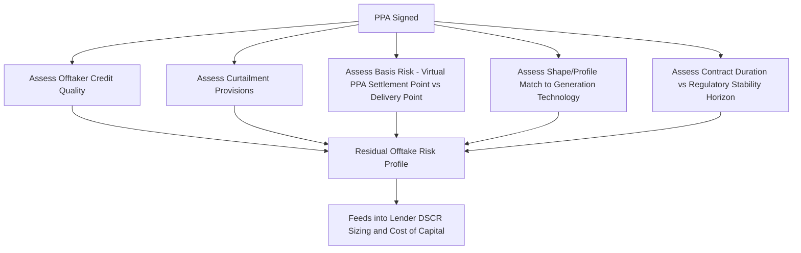

## Power Purchase Agreements and Offtake Risk

### Overview

A Power Purchase Agreement (PPA) is a long-term contract under which a generator agrees to sell — and an offtaker agrees to purchase — electricity (and often associated environmental attributes) on pre-agreed terms over an extended period, commonly 10–25 years for utility-scale projects. As established in Project finance structures for large energy infrastructure and Risk assessment in energy project finance, the PPA is frequently the single most important contract determining a project's financeability, since it converts uncertain wholesale market revenue into a comparatively predictable cash flow stream that lenders can underwrite with confidence. This item addresses PPA structures and the specific risks — collectively termed offtake risk — that persist even once a PPA is in place.

### Why PPAs Matter Economically

#### Revenue Certainty and Financeability

Absent a PPA, a generator selling into wholesale markets faces full exposure to price volatility, as discussed in the merit-order and cannibalization dynamics covered in Nuclear's role in low-carbon electricity portfolios. A PPA shifts this price risk (fully or partially, depending on structure) to the offtaker or to a fixed formula, which:

- Reduces the volatility of projected cash flows available for debt service, allowing lenders to size debt against a materially more predictable revenue stream.
- Directly reduces the project's effective cost of capital, per the risk-premium framework discussed in Cost of capital differences across energy technologies, since revenue-structure risk is one of the largest identified drivers of cost-of-capital variation across otherwise similar projects.
- Enables higher leverage (debt-to-capital ratio) than a merchant project of the same technology could typically achieve, since lenders can underwrite against a known, contracted cash flow rather than a probabilistic wholesale price forecast.

#### The Basic Economic Trade-off

A PPA is fundamentally a risk-transfer instrument, and like any such instrument, the party assuming risk is compensated for bearing it. A generator selling under a fixed-price PPA gives up potential upside if wholesale prices rise above the contract price, in exchange for protection against downside if prices fall below it. The PPA price itself reflects, in principle, the expected value of wholesale prices over the contract term plus a risk premium reflecting how much value each party places on the price certainty being exchanged — meaning the "right" PPA price is not simply today's wholesale price extrapolated forward, but a negotiated allocation of price risk between two parties with potentially different risk tolerances and views of future market conditions.

### Core PPA Structures

#### Physical (Bundled) PPA

The generator delivers physical electricity directly to the offtaker, typically requiring the offtaker to be within the same electricity market or grid interconnection as the generator, or requiring the offtaker to be a load-serving entity (such as a utility) capable of taking physical delivery. Common in regulated utility procurement and in markets where the corporate offtaker is itself an electricity retailer or large industrial consumer directly connected to the relevant grid.

#### Virtual (Financial) PPA / Contract for Differences

The generator continues to sell its physical output into the wholesale market at the prevailing spot price, while the PPA itself is a purely financial contract: if the wholesale market price is below the agreed PPA (strike) price, the offtaker pays the generator the difference; if the market price is above the strike price, the generator pays the offtaker the difference. This structure allows corporate offtakers (particularly the technology and data center companies discussed in Small modular reactor economics and prospects) to contract for renewable or nuclear generation output without needing physical interconnection to the specific project or being located in the same power market, since only a financial settlement — not physical electricity delivery — passes between the parties. The mechanism is functionally very similar to the Contracts for Difference (CfD) structure discussed in Cost of capital differences across energy technologies, differing primarily in that CfDs are typically government-counterparty policy instruments while virtual PPAs are bilateral commercial contracts, though the underlying financial settlement logic is essentially identical.

$$\text{Settlement Payment} = (P_{strike} - P_{market}) \times Q$$

Where a positive result represents a payment from offtaker to generator (market price below strike) and a negative result represents a payment from generator to offtaker (market price above strike), and $Q$ is the contracted volume.

#### Tolling Agreement

As introduced in Project finance structures for large energy infrastructure, a tolling agreement is a variant in which the offtaker (the "toller") supplies fuel and receives all output, paying the generator (typically the asset owner/operator) a capacity or availability fee for converting that fuel into electricity — shifting fuel-price and spark-spread risk primarily onto the toller rather than the generator. More common for thermal (particularly gas-fired) generation than for renewable or nuclear assets, given the central role of fuel supply in the structure.

#### Sleeved/Retail PPA

An arrangement in which a utility or licensed retailer acts as an intermediary ("sleeving" the transaction) between a generator and a corporate offtaker that is not itself licensed to transact directly in wholesale electricity markets, handling the physical delivery, balancing, and market interaction on the corporate offtaker's behalf while passing through the economics of the underlying PPA. Common where regulatory market structure requires transactions to flow through a licensed market participant.

### Key PPA Pricing and Volume Mechanisms

#### Fixed-Price PPA

A constant price (sometimes with a pre-agreed escalation schedule, e.g., tied to inflation) is paid per unit of energy delivered, providing maximum revenue certainty to the generator but also fully insulating the offtaker from the specific technology's output-timing profile relative to market prices (an issue increasingly relevant for variable renewables, discussed below).

#### Pay-as-Produced vs Baseload/Shaped PPA

- **Pay-as-produced**: the offtaker purchases whatever volume the generator actually produces at each point in time, common for variable renewable (wind/solar) PPAs, since a generator cannot guarantee a fixed output shape from an inherently variable resource.
- **Baseload or shaped PPA**: the offtaker contracts for a specified, typically flatter or demand-matched output profile, requiring the generator (if relying on variable renewable generation) to source balancing volume from other resources or storage to meet the contracted shape — shifting shape/profile risk from the offtaker to the generator, who must then manage it via a portfolio of resources or a financial balancing mechanism.

#### As-Available vs Take-or-Pay

- **Take-or-pay**: the offtaker is obligated to pay for a contracted volume of energy (or capacity/availability) regardless of whether it actually needs or uses that electricity, providing the generator with strong revenue certainty and shifting demand-risk to the offtaker.
- **As-available/take-if-offered**: the offtaker's payment obligation is more closely tied to actual delivery or its own actual need, providing less revenue certainty to the generator but more flexibility to the offtaker.

### Offtake Risk: The Persistent Risk Even With a Signed PPA

A PPA transfers price risk, but it does not eliminate all revenue risk — it replaces market price risk with a different set of risks collectively termed **offtake risk**, which lenders and equity investors must still assess even for a fully contracted project.

#### 1. Offtaker Credit Risk

As discussed in Risk assessment in energy project finance, the value of any PPA is only as good as the offtaker's ability and willingness to pay over the full contract term. A PPA with an investment-grade utility or highly-rated corporate offtaker supports materially better financing terms than an equivalent PPA with a financially weaker or less established counterparty, and lenders typically assess offtaker credit quality as a core underwriting input independent of the contract's other terms.

- **Mitigation**: parent guarantees, letters of credit, credit support riders tied to the offtaker's credit rating, offtaker diversification across multiple counterparties for larger projects.

#### 2. Curtailment Risk

The risk that the generator's output is not fully accepted or paid for due to grid congestion, system operator curtailment orders (common for renewables during periods of oversupply or transmission constraint), or offtaker-initiated curtailment rights embedded in the PPA itself. Whether curtailed volumes are still compensated (as if delivered) or simply go unpaid depends entirely on the specific PPA's curtailment provisions, making this a critical negotiated term rather than a standardized market practice.

#### 3. Basis Risk (for Virtual/Financial PPAs)

Arises when the settlement price index specified in the PPA (often a hub or trading-point price) differs from the actual price the generator realizes at its own physical delivery point (often called the "node" in nodal wholesale markets), due to transmission congestion or losses between the two locations. If this basis (the spread between the settlement index and the generator's actual realized price) widens or becomes more volatile than anticipated at contract signing, the generator can find itself financially exposed even though it holds a nominally "fully hedged" PPA, since the financial settlement and its actual physical market revenue no longer move together as assumed.

#### 4. Shape/Profile Risk

Particularly relevant to variable renewable generators under baseload or shaped PPA structures (as discussed above): the risk that the generator's actual output profile diverges from the contracted delivery shape, requiring the generator to purchase or sell balancing volume in the wholesale market at potentially unfavorable prices to true up the difference — a risk that has grown in prominence as renewable penetration increases and the value of "as-produced" renewable output during high-renewable-output hours has declined (the cannibalization effect discussed in Nuclear's role in low-carbon electricity portfolios), making shaped PPA structures increasingly attractive to offtakers precisely because they push this cost back onto the generator.

#### 5. Volume Risk

The risk that actual delivered volume differs from the volume assumed in project financial modeling — driven by resource risk (for renewables, as discussed in Risk assessment in energy project finance's P50/P90/P99 framework) or by outages/availability shortfalls (for thermal or nuclear generators).

#### 6. Regulatory and Contract Duration Mismatch Risk

The risk that regulatory changes (e.g., changes to market rules, transmission tariff structures, or environmental attribute/renewable certificate policy) affecting the PPA's underlying economics occur during the contract's multi-decade term but were not, or could not have been, fully anticipated or addressed at signing — a particular concern given that PPA terms (often 15–25 years) frequently exceed the effective forecasting horizon for regulatory and market structure stability.

#### 7. Early Termination and Force Majeure Risk

Most PPAs include termination rights and force majeure provisions addressing circumstances (extended outages, regulatory changes rendering performance illegal or commercially impracticable, catastrophic events) under which either party may terminate or suspend performance; the specific allocation of termination payment obligations in such scenarios is a heavily negotiated term with direct implications for how much residual risk lenders perceive in the financing.

### PPA Structure Comparison Table

| Structure | Physical Delivery Required? | Primary Risk Retained by Generator | Primary Risk Retained by Offtaker |
| --- | --- | --- | --- |
| Physical (bundled) PPA | Yes | Volume/resource risk | Basis/locational risk (implicitly, via delivery point) |
| Virtual (financial) PPA / CfD-style | No | Basis risk (settlement index vs actual realized price) | None on physical delivery; retains market exposure on own actual consumption |
| Tolling agreement | Yes (fuel supplied by toller) | Availability/performance risk | Fuel price and spark-spread risk |
| Pay-as-produced | Yes/No (structure-dependent) | None on shape; volume follows actual output | Shape/profile risk |
| Baseload/shaped | Yes/No (structure-dependent) | Shape/profile risk (must balance to contracted shape) | None on shape |
| Take-or-pay | Yes/No (structure-dependent) | Minimal volume risk | Demand/usage risk |

### Offtake Risk Assessment Flow

### Corporate PPAs and the Rise of Non-Utility Offtakers

A significant structural evolution in PPA markets over the past decade, accelerating further with the AI/data-center-driven demand growth discussed in Small modular reactor economics and prospects, has been the emergence of large corporate offtakers — particularly technology companies — as direct PPA counterparties, alongside or instead of traditional utility offtakers. This has several economic implications:

- **Credit profile diversification**: many large technology companies carry very strong credit ratings, in some cases comparable to or exceeding traditional utility offtakers, which has generally supported strong project financing terms for corporate-PPA-backed projects.
- **Preference for virtual/financial PPA structures**: because corporate offtakers are frequently not located in the same power market or grid as the generating project, and are typically not licensed electricity market participants themselves, virtual PPA structures have become the dominant mechanism for this category of offtake, as described above.
- **Growing appetite for firm, dispatchable offtake**: the same demand growth driving corporate PPA activity has also driven increased corporate interest in firm/dispatchable generation offtake (including nuclear and advanced nuclear, per the Google-Kairos Power and Amazon-X-energy arrangements discussed in Small modular reactor economics and prospects), reflecting corporate offtakers' own reliability requirements for data center operations, distinct from the variable-renewable-dominated corporate PPA market of the prior decade.

### Related Topics

- Project finance structures for large energy infrastructure (PPA's role within the broader contract architecture)
- Risk assessment in energy project finance (offtaker credit risk within the broader risk taxonomy)
- Cost of capital differences across energy technologies (PPA's effect on achievable financing terms)
- Nuclear's role in low-carbon electricity portfolios (cannibalization dynamics driving shaped PPA demand)
- Small modular reactor economics and prospects (corporate PPA-backed nuclear offtake case studies)
- Contracts for Difference (CfD) as a government policy analog to virtual PPAs
- Basis risk and locational marginal pricing in nodal wholesale electricity markets
- Renewable energy certificates and environmental attribute tracking within PPA structures
- Corporate renewable and clean energy procurement strategy
- Curtailment economics and compensation mechanisms in high-renewable-penetration grids