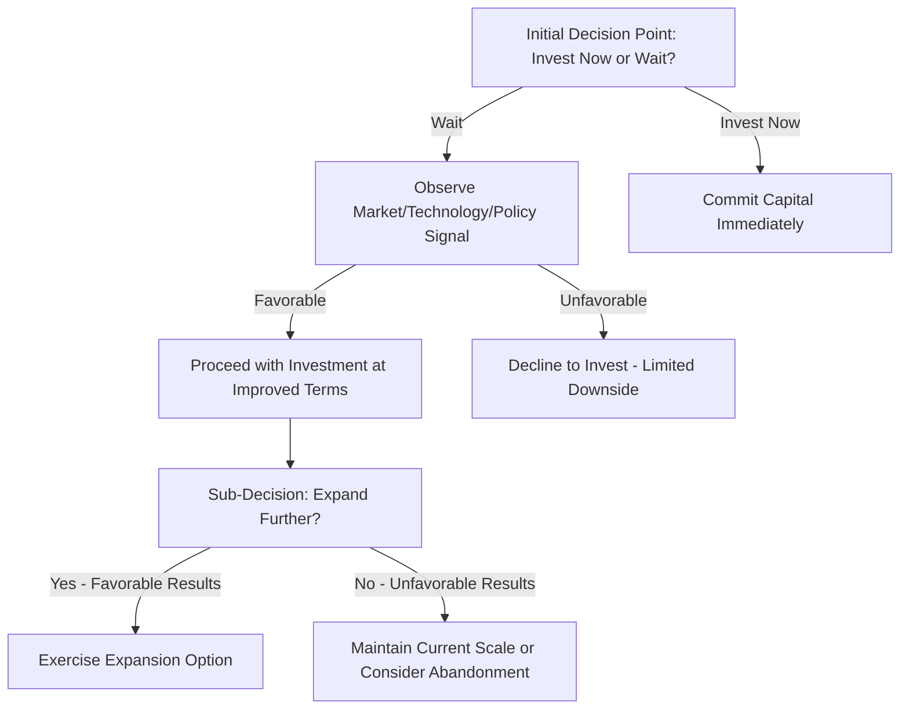
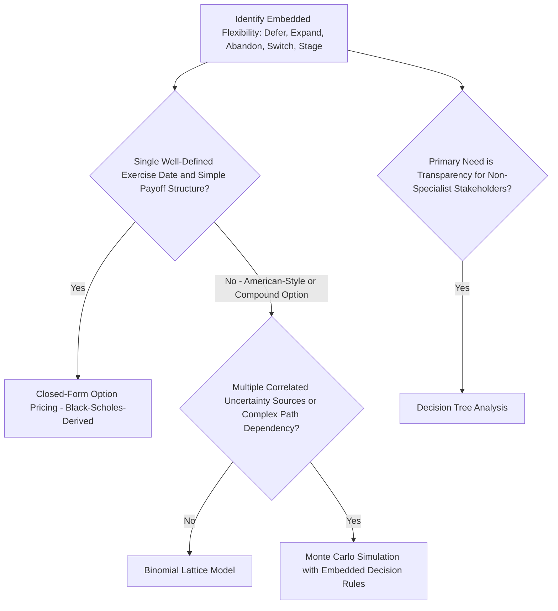

## Real Options Theory Applied to Energy Investment Timing

### Overview

Real options theory extends option pricing concepts from financial economics to real (physical/operational) investment decisions, providing a framework for valuing managerial flexibility that standard discounted cash flow (DCF) analysis, as covered in Capital budgeting for energy projects and discounted cash flow, systematically undervalues. Energy investments are particularly well-suited to real options analysis because they frequently involve large, partially irreversible capital commitments made under significant uncertainty, with genuine opportunities to delay, stage, expand, contract, switch, or abandon that a static NPV calculation treats as a single fixed decision rather than a sequence of contingent choices.

### Why Standard NPV Undervalues Flexibility

#### The Core Limitation

Traditional NPV analysis, as presented in Capital budgeting for energy projects and discounted cash flow, implicitly assumes a **now-or-never, all-or-nothing** investment decision: either the project is undertaken today as specified, or it is not undertaken at all. In reality, energy investment decisions frequently embed genuine choices that management can exercise *after* observing how uncertainty resolves — waiting for better information before committing, building capacity in stages, or abandoning a project if conditions turn unfavorable. Because these choices have asymmetric payoffs (management will only exercise them when doing so is favorable, and can simply decline to exercise them otherwise), they have positive economic value analogous to a financial option, and ignoring this value systematically understates a flexible project's true worth relative to a rigid, single-path alternative.

#### The Analogy to Financial Options

| Financial Option Concept | Real Option Equivalent in Energy Investment |
| --- | --- |
| Underlying asset price | Project value (PV of expected future cash flows) |
| Strike price | Investment cost required to exercise |
| Time to expiration | Period during which the investment opportunity remains available |
| Volatility of underlying | Uncertainty in project value (price, cost, technology, regulatory uncertainty) |
| Option value | Value of the flexibility itself, separate from the underlying project's static NPV |

The core insight is that **higher uncertainty increases option value** — a result that runs counter to standard intuition from static NPV analysis, where increased uncertainty (typically modeled via a higher discount rate or lower expected cash flow) usually reduces or is neutral to project value. Under real options logic, more uncertainty about future conditions makes the *option to wait and see* more valuable, because management retains the ability to only proceed if conditions turn out favorably while avoiding commitment if they do not.

### Core Real Options Relevant to Energy Investment

#### 1. Option to Defer (Timing Option)

The right, but not the obligation, to delay an investment decision to a future date, allowing the developer to observe resolution of key uncertainties (technology cost trajectories, commodity prices, regulatory/policy clarity, demand growth) before committing capital.

$$NPV_{expanded} = NPV_{static} + Value(\text{Option to Defer})$$

This is highly relevant to large, long-lived, high-capital-intensity energy investments — particularly new nuclear construction (see Construction risk and cost overrun history), where the combination of high sunk-cost exposure once construction begins and genuine ongoing uncertainty about future policy support, technology alternatives (e.g., SMR cost trajectories, per Small modular reactor economics and prospects), and demand growth creates substantial deferral option value that a simple "build now or never" NPV comparison would ignore.

#### 2. Option to Expand (Growth Option)

The right to increase project scale or output in the future in response to favorable conditions, without being obligated to do so. Modular and staged energy investments — phased renewable buildouts, multi-unit SMR sites designed for sequential unit additions (as with the Darlington BWRX-300 program discussed in Small modular reactor economics and prospects, where a first unit precedes and informs the decision on subsequent units), and transmission infrastructure built with excess initial capacity — are frequently structured explicitly to preserve this option value, even at some incremental upfront cost, because the ability to scale up conditional on observed early performance and demand realization has value beyond what a fixed-scale, one-time investment would capture.

#### 3. Option to Abandon

The right to cease operations or exit an investment if conditions deteriorate sufficiently, capturing salvage or alternative-use value rather than continuing to operate (or complete construction) at a loss. Relevant to merchant generation assets facing prolonged unfavorable wholesale price environments (see the cannibalization dynamics discussed in Nuclear's role in low-carbon electricity portfolios) and to construction-phase decisions where a project experiencing severe cost overruns (as documented extensively in Construction risk and cost overrun history) may have positive option value in abandoning construction and recovering whatever salvage value exists, rather than being contractually or psychologically committed to completing a project that has become value-destructive (a dynamic related to, though analytically distinct from, the behavioral "sunk cost fallacy," since real options analysis provides a rigorous economic — not merely behavioral — basis for evaluating abandonment even after substantial capital has already been spent, since sunk costs are irrelevant to the forward-looking abandonment decision).

#### 4. Option to Switch (Input or Output Flexibility)

The right to change an input (e.g., fuel source) or output (e.g., product mix) in response to relative price or policy changes. Dual-fuel-capable generation, flexible industrial facilities capable of switching between grid electricity and on-site generation, and multi-product energy facilities (e.g., a facility capable of producing either hydrogen or direct electricity output depending on relative market value) embed switching option value that a single-configuration project evaluation would miss.

#### 5. Option to Stage (Sequential/Compound Options)

Large projects developed in discrete phases — where each phase's completion generates information relevant to the decision on whether and how to proceed to the next phase — create a **compound option** (an option on an option), where the value of an early-stage investment includes not just its own direct cash flows but the value of the decision rights it creates regarding subsequent stages. This is directly relevant to phased approaches in SMR deployment, where an initial demonstration or first unit provides operational and cost information materially reducing uncertainty for subsequent unit investment decisions, as discussed in Small modular reactor economics and prospects.

### Valuation Approaches

#### Decision Tree Analysis

The most commonly used and most intuitively accessible real options valuation method in practice, particularly for energy project appraisal, since it does not require the more restrictive assumptions of formal option-pricing models. A decision tree explicitly maps out sequential decision points and the probability-weighted outcomes following each, discounting the resulting cash flows back to present value while incorporating the optimal decision (proceed, delay, abandon, expand) at each node based on information available at that point.

#### Black-Scholes-Derived Option Pricing Models

Adapted from financial option pricing, these models can be applied where the underlying uncertainty can be reasonably modeled as following a standard stochastic process (commonly geometric Brownian motion) and where sufficient data exists to estimate volatility. A simplified real-option adaptation of the Black-Scholes framework for a deferral option might value the option as:

$$C = S_0 N(d_1) - Ke^{-rT}N(d_2)$$

$$d_1 = \frac{\ln(S_0/K) + (r + \sigma^2/2)T}{\sigma\sqrt{T}}, \quad d_2 = d_1 - \sigma\sqrt{T}$$

Where $S_0$ is the current value of the underlying project (PV of expected cash flows if built today), $K$ is the investment cost (analogous to strike price), $r$ is the risk-free rate, $\sigma$ is the volatility of project value, $T$ is the time horizon over which the investment opportunity remains available, and $N(\cdot)$ is the cumulative standard normal distribution function. [Inference] Direct application of Black-Scholes-style formulas to real energy investment decisions requires several simplifying assumptions (constant volatility, a single well-defined exercise date rather than a genuinely American-style continuous exercise opportunity, and the ability to meaningfully estimate $\sigma$ for a real, illiquid asset) that are often imperfectly satisfied in practice; binomial lattice methods and Monte Carlo-based approaches (discussed below) are frequently preferred in energy-sector applications specifically because they can more flexibly accommodate the path-dependency, multiple uncertainty sources, and American-style (exercisable at any time) features that are common in real energy investment decisions but awkward to capture in a closed-form Black-Scholes-style formula.

#### Binomial Lattice Models

Model the evolution of project value over discrete time steps as a branching "tree" of possible up/down movements, allowing the optimal exercise decision to be evaluated at each node by working backward from the final period, a computationally tractable approach well-suited to American-style options (exercisable at any point, not just a single fixed date) and staged/compound option structures common in energy project development.

#### Monte Carlo Simulation for Real Options

As discussed in Capital budgeting for energy projects and discounted cash flow and Risk assessment in energy project finance, Monte Carlo simulation can be extended to real options valuation by simulating many possible future paths of the relevant uncertainty (prices, costs, demand) and, for each simulated path, applying the optimal decision rule (proceed, delay, expand, abandon) at each decision point, then averaging the resulting discounted payoffs across all simulated paths to estimate the option's value — particularly useful where multiple, correlated sources of uncertainty and complex, path-dependent decision rules make lattice or closed-form approaches impractical.

### Application to Specific Energy Investment Timing Decisions

#### Renewable Energy Technology Adoption Timing

Given well-documented historical declines in solar PV, wind, and battery storage costs, a developer or utility considering a large renewable investment faces a genuine option-to-defer question: investing today captures current policy incentives and locks in a known cost, while waiting may capture further cost declines but risks losing current incentive eligibility or missing near-term demand/capacity needs. [Inference] Real options analysis provides a rigorous framework for evaluating this trade-off explicitly (incorporating the probability distribution of future cost declines and policy availability), rather than relying on simple rules of thumb such as "always wait for costs to fall further" or "always invest immediately to capture current incentives," since the economically optimal timing depends on the specific shape and confidence of the cost-decline and policy-availability expectations rather than being a universal, technology-independent answer.

#### Fossil Fuel Asset Retirement and Life Extension Timing

Utilities evaluating whether and when to retire an existing fossil (or, per Nuclear's role in low-carbon electricity portfolios, nuclear) asset face an abandonment/continuation option: continuing operation preserves the option to benefit from potentially favorable future price or policy conditions (e.g., a future capacity market price spike, or extended-life relicensing value as discussed in the nuclear life-extension economics section of that item), while retiring locks in whatever value remains today (potentially including tax or environmental compliance benefits from early retirement) and avoids the risk of continued operating losses if conditions do not improve.

#### Nuclear New-Build and SMR Deployment Sequencing

As discussed in Small modular reactor economics and prospects, the FOAK/NOAK cost-reduction dynamic central to SMR economics is itself fundamentally a compound-option structure: an initial FOAK unit's high cost can be understood partly as the "premium" paid for the option to learn — from actual construction and operating experience — whether and how quickly subsequent units can achieve the projected NOAK cost reductions, informing the decision on whether to proceed with a larger multi-unit program. This reframes the common criticism that FOAK SMR costs are "too high to be competitive" as potentially missing that the appropriate comparison is not FOAK cost against a hypothetical mature-fleet cost, but the value of the staged-learning option against the alternative of either committing to a large multi-unit program immediately (foregoing the option to learn and adjust) or not pursuing the technology at all (foregoing the option's potential upside entirely).

### Common Critiques and Practical Limitations

- **Estimating volatility for illiquid, project-specific value**: unlike a publicly traded financial asset with an observable market price and historical volatility, an energy project's "underlying asset value" is not directly observable, and estimating its volatility for use in formal option-pricing models requires proxy approaches (e.g., using volatility of a relevant commodity price, comparable public company equity volatility, or Monte Carlo-derived output distributions) that introduce their own estimation uncertainty.
- **Model complexity vs decision-maker usability**: formal option-pricing techniques can be substantially more complex to communicate to non-specialist decision-makers than a standard NPV figure, creating a practical adoption barrier even where the underlying economic logic is sound; decision-tree approaches are often preferred in practice specifically because they are more transparent and intuitively auditable than closed-form option-pricing formulas.
- **Risk of overstating flexibility value**: [Inference] because real options analysis can produce materially higher valuations than static NPV by explicitly monetizing flexibility, there is a documented risk in both academic and practitioner literature of the framework being used to justify marginal or negative-NPV projects by asserting large, difficult-to-verify option values, and careful, disciplined estimation of the underlying uncertainty and decision-rule assumptions is necessary to avoid this form of analytical overreach; the framework's rigor depends entirely on the quality and honesty of its input assumptions, just as with standard DCF.
- **Interaction with contractual and organizational constraints**: real option value is only realizable if management (or the relevant contracts) actually preserve the flexibility being valued — for example, an EPC contract structured on a rigid, non-modifiable basis (see Project finance structures for large energy infrastructure) may foreclose expansion or switching options that would otherwise have value, meaning real options value must be assessed against the actual contractual and organizational structure in place, not an idealized assumption of unconstrained managerial flexibility.

### Real Options Valuation Method Selection

### Related Topics

- Capital budgeting for energy projects and discounted cash flow (static NPV baseline this framework extends)
- Risk assessment in energy project finance (Monte Carlo methodology shared with real options valuation)
- Small modular reactor economics and prospects (FOAK/NOAK sequencing as a compound-option case study)
- Construction risk and cost overrun history (abandonment option relevance during severe cost escalation)
- Nuclear's role in low-carbon electricity portfolios (life extension vs retirement as an abandonment/continuation option)
- Cost of capital differences across energy technologies (volatility estimation challenges for illiquid project assets)
- Binomial lattice and Monte Carlo methods in derivative and real asset valuation
- Behavioral finance and the sunk cost fallacy versus rigorous real options abandonment analysis
- Technology learning curves and their interaction with investment timing decisions
- Compound options and multi-stage infrastructure development sequencing