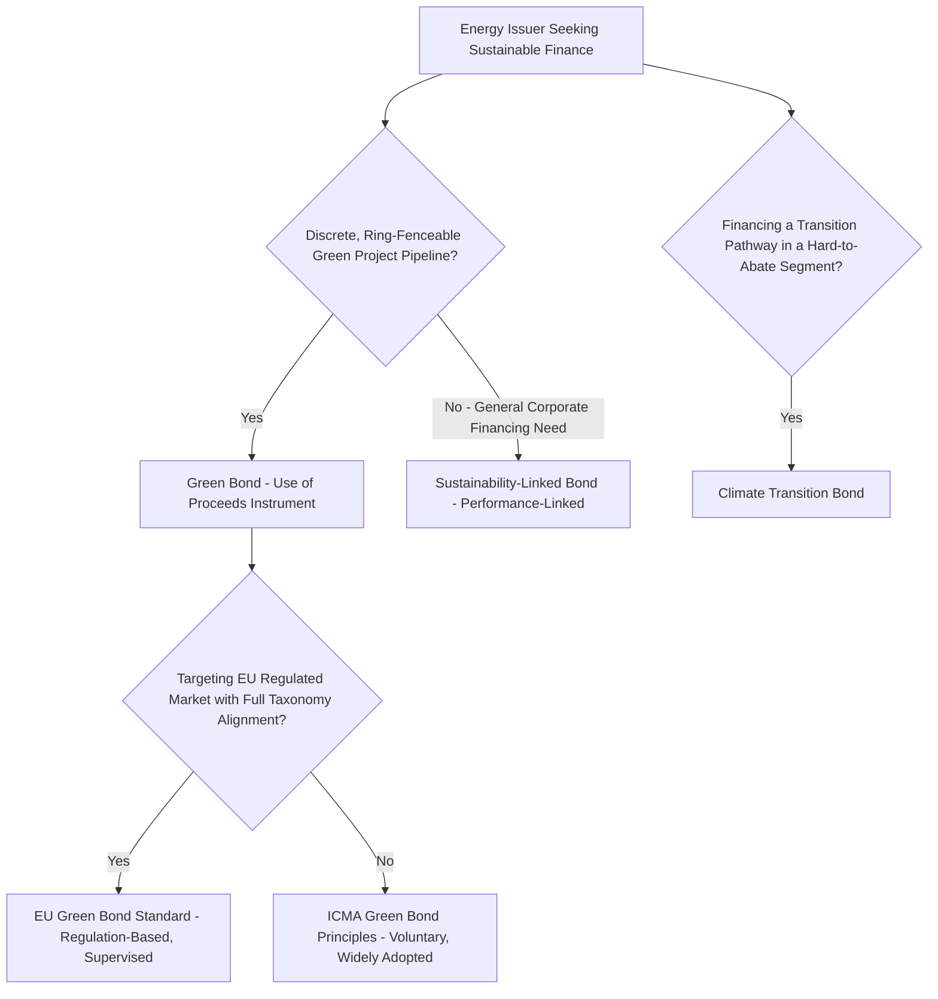

## Green Bonds and Sustainable Finance Instruments

### Overview

Green bonds and the broader family of sustainable finance instruments provide a labeled, standards-based channel for directing capital specifically toward environmentally beneficial projects — including the renewable, nuclear life-extension, transmission, and efficiency investments discussed throughout this chapter. As of 2026, this market has moved from a niche instrument to a large and increasingly standardized segment of global debt capital markets, though it operates through a patchwork of voluntary, principle-based frameworks and newer, regulation-based standards whose relationship to one another is still evolving.

### Market Scale and Growth (2026 Snapshot)

Global green bond issuance reached USD 653.5 billion in 2025, the second-highest annual total on record, according to the Climate Bonds Initiative's Sustainable Debt Global State of the Market report published in March 2026. Cumulative green bond issuance has passed USD 4 trillion, and total labelled sustainable debt — green, social, sustainability, and sustainability-linked bonds combined — reached USD 6.8 trillion by the end of 2025. [Unverified] These figures represent a snapshot from the cited March 2026 report; given the market's continued growth trajectory, current-year figures should be checked against the latest Climate Bonds Initiative or equivalent market-tracking publication for any application requiring up-to-date totals.

### The ICMA Principles Framework

#### Governing Body and Scope

The International Capital Market Association (ICMA) provides the secretariat for the Green Bond Principles (GBP), Social Bond Principles (SBP), Sustainability Bond Guidelines (SBG), and Sustainability-Linked Bond Principles (SLBP) — collectively known as "the Principles" — which function as the de facto global issuance standard for the international sustainable bond market, referenced by 96% of issuers in 2025. ICMA has more recently added complementary guidance for Climate Transition Bonds, alongside a comparison of the Principles' standards with the EU Green Bond Standard and a paper addressing structural demand for sustainable bonds, announced at the Principles' Annual General Meeting in June 2026.

#### The Four Core Components of the Green Bond Principles

The Green Bond Principles rest on four components: **use of proceeds**, meaning funds must go to defined eligible green projects; a **process for project evaluation and selection**; **management of proceeds**, requiring issuers to track and, in most cases, ring-fence the funds raised; and **reporting**, requiring issuers to disclose annually how proceeds were allocated and, where feasible, their environmental impact. ICMA published its most recent update to the Green Bond Principles in June 2025, expanding the definition of eligible green projects to include "activities" alongside assets and investments — a scope broadening relevant to energy-sector issuers whose environmental benefit may derive from an operational activity (e.g., a demand-response program) rather than solely a discrete capital asset.

Because the Green Bond Principles are voluntary and self-reported, a "green bond" label does not by itself guarantee third-party verification; investors typically look for an external review (a second-party opinion, verification, certification, or rating) to corroborate an issuer's own claims of Principles alignment.

### Green Bonds vs Sustainability-Linked Bonds: A Structural Distinction

#### Green Bonds (Use-of-Proceeds Instruments)

Green bonds are debt issuances in which proceeds are ring-fenced and used exclusively to finance or re-finance, in whole or in part, new and/or existing projects that further environmentally sustainable activities. The defining feature is that the *use of proceeds* is contractually and operationally restricted to eligible green projects, verified through the process, management, and reporting components described above. In an energy context, this directly supports project finance structures (see Project finance structures for large energy infrastructure) for renewable generation, transmission upgrades enabling renewable integration, and — increasingly, subject to taxonomy debates discussed below — nuclear new-build and life extension.

#### Sustainability-Linked Bonds (Performance-Linked Instruments)

By contrast, **sustainability-linked bonds (SLBs)** do not restrict use of proceeds at all — the issuer can use the funds for general corporate purposes — but instead tie the bond's financial terms (typically the coupon rate) to the issuer achieving predefined Sustainability Performance Targets (SPTs) by a specified date, with a coupon step-up (or, less commonly, step-down) penalty/incentive mechanism if targets are missed or met. This structural difference matters economically: an SLB provides an issuer without a discrete "green project" pipeline (e.g., a utility financing general operations while committing to fleet-wide emissions reduction targets) a mechanism to access sustainable finance markets and investor demand without the tracking and ring-fencing obligations a use-of-proceeds green bond requires.

### The EU Green Bond Standard (EU GBS) and Taxonomy

#### Regulatory vs Voluntary Approaches

The EU Green Bond Standard (EU GBS) took effect on 21 December 2024, representing a materially different regulatory philosophy from the ICMA Principles: while traditional green bonds under the ICMA framework are principle-based (voluntary, self-reported, though typically externally reviewed), the EU GBS is regulation-based and subject to supervision. Under the EU GBS, issuers must demonstrate environmental impact via alignment (or a defined pathway toward future alignment) with the **EU Taxonomy** for financed activities, accompanied by a strict duty to report and to obtain external verification — a requirement that goes beyond what ICMA's Green Bond Principles mandate.

#### Market Adoption and Coexistence

As of the current EU sustainable finance state of play, ICMA-labelled green bonds remain the more commonly used instrument, both for European and non-European issuers transacting in the European market, and it remains an open question whether the EU GBS will ultimately establish itself as a "gold standard" or whether the two frameworks will simply coexist. Market adoption of the EU GBS specifically outside utilities, (quasi-)sovereigns, development banks, and financial institutions remains limited compared with the more established ICMA and Loan Market Association (LMA) frameworks, reflecting the additional implementation complexity that Taxonomy-alignment and EU GBS supervisory requirements impose relative to the more flexible ICMA approach. [Unverified] The relative market share and trajectory of EU GBS adoption versus ICMA-labelled issuance is an actively developing area; current figures should be checked against the latest ICMA or European Commission sustainable finance market reporting.

#### Relevance to Energy Sector Taxonomy Classification

The EU Taxonomy's treatment of specific energy technologies — most notably the contested classification of nuclear power and natural gas as "transitional" activities eligible for green/taxonomy-aligned financing under certain conditions — has direct practical relevance to energy issuers seeking EU GBS-compliant financing for nuclear projects (see Small modular reactor economics and prospects and Nuclear's role in low-carbon electricity portfolios), since taxonomy eligibility (or ineligibility) materially affects which financing instruments and investor pools are accessible for a given technology.

### Instrument Family Comparison

| Instrument | Use of Proceeds Restricted? | Financial Terms Tied to Performance? | Best Suited For |
| --- | --- | --- | --- |
| Green Bond | Yes — ring-fenced to eligible projects | No | Issuers with a defined pipeline of discrete green/renewable energy projects |
| Social Bond | Yes — ring-fenced to eligible social projects | No | Projects with primarily social (rather than environmental) benefit |
| Sustainability Bond | Yes — ring-fenced to a mix of green and social projects | No | Issuers combining environmental and social project financing needs |
| Sustainability-Linked Bond (SLB) | No — general corporate purposes | Yes — coupon tied to Sustainability Performance Targets | Issuers without a discrete green project pipeline seeking sustainable-finance market access |
| Climate Transition Bond | Yes, typically — proceeds tied to a credible transition pathway | Varies by structure | Issuers in hard-to-abate sectors financing a transition trajectory rather than a purely "green" activity |

### Application to Energy Infrastructure Financing

#### Alignment with Project Finance Structures

As discussed in Project finance structures for large energy infrastructure, green bonds are frequently used as an operating-phase or refinancing instrument, particularly well-suited to institutional bond investors (pension funds, insurers) seeking long-duration, stable-yield assets, since a completed, operating renewable or transmission asset with established cash flows fits both the green-bond use-of-proceeds framework and the risk profile such investors seek. Green project bonds can function within the broader mini-perm refinancing strategy discussed in that item, with an initial bank-financed construction phase refinanced via a green bond once the asset reaches commercial operation.

#### The "Greenium" — Pricing Effect of Green Labeling

Green and labeled sustainable debt instruments have, in various market conditions, been observed to price at a modest yield discount relative to otherwise-comparable conventional bonds from the same issuer — a phenomenon commonly termed the **"greenium."** [Inference] The existence and persistence of a measurable greenium has been documented in various market studies, though its magnitude appears to vary meaningfully by market conditions, issuer type, and time period, and it should not be assumed to be a large, stable, or universally available pricing benefit for any given energy issuer; the decision to pursue green-labeled financing is generally better justified by considerations of investor base diversification, reporting/disclosure benefits, and strategic positioning than by a greenium alone, given its variability.

#### Interaction with Other Financing Mechanisms Discussed in This Chapter

Green bonds and sustainability-linked structures are complementary to, rather than substitutes for, the other financing mechanisms discussed elsewhere in this chapter:

- They can fund the equity or (more commonly) refinance the senior debt layer of a project finance SPV structure (see Project finance structures for large energy infrastructure).
- They do not replace the risk-allocation contracts (EPC, PPA, O&M) discussed in Risk assessment in energy project finance and Power purchase agreements and offtake risk — a green bond's environmental labeling does not itself alter the project's underlying construction, market, or offtake risk profile, which must still be assessed through standard project finance credit analysis.
- Sustainability-linked structures, given their unrestricted use of proceeds, are more relevant to diversified energy companies seeking to finance a broader decarbonization strategy (potentially spanning both direct project investment and other capital needs) than to single-asset project finance transactions, which are more naturally suited to a discrete-use-of-proceeds green bond.

### Sustainable Finance Instrument Selection Flow

### Key Considerations and Risks for Energy Issuers and Investors

- **Greenwashing risk**: given the voluntary, self-reported nature of the core ICMA framework, investors and regulators have increasingly focused on external verification and impact reporting quality as safeguards against greenwashing — labeling proceeds as "green" without a substantive underlying environmental benefit or credible reporting.
- **Taxonomy divergence across jurisdictions**: energy issuers operating internationally may face differing taxonomy definitions (e.g., the EU Taxonomy's treatment of nuclear and gas versus other jurisdictions' green taxonomies, such as Singapore's Monetary Authority-led Singapore-Asia Taxonomy), requiring careful navigation of which framework(s) a given bond issuance is designed to satisfy.
- **Reporting and administrative burden**: the management-of-proceeds and reporting obligations under both ICMA and (more stringently) EU GBS frameworks impose ongoing administrative costs that issuers must weigh against the financing and reputational benefits of green labeling.
- **Instrument-technology fit**: as discussed above, use-of-proceeds green bonds fit most naturally with discrete, identifiable capital projects (new renewable generation, transmission, energy efficiency retrofits), while sustainability-linked structures may better fit diversified energy companies pursuing broader transition strategies without a single, clean project to ring-fence.

### Related Topics

- Project finance structures for large energy infrastructure (green bond application to SPV refinancing)
- Cost of capital differences across energy technologies (potential greenium effect on technology-specific financing costs)
- Power purchase agreements and offtake risk (revenue certainty underlying green bond-financed project cash flows)
- EU Taxonomy treatment of nuclear and natural gas as transitional activities
- Climate Bonds Initiative market tracking and certification standards
- ESG ratings and data providers: methodology and regulatory oversight (IOSCO Codes of Conduct)
- Sustainability-Linked Loans and their relationship to bond-market SLB structures
- Climate Transition Bonds and hard-to-abate sector financing
- Second-party opinions and external review providers in sustainable debt verification
- Comparative national/regional green taxonomies (EU, Singapore-Asia, and others)