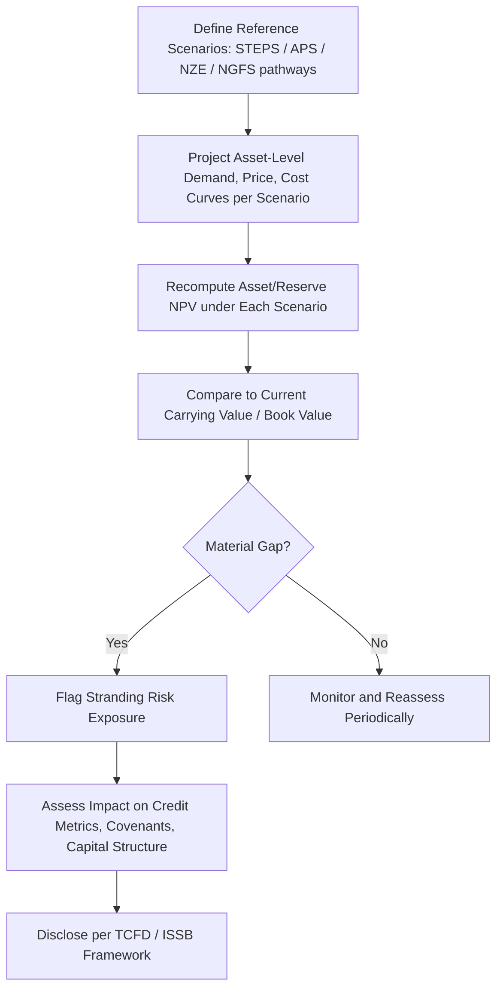

## Stranded Asset Risk and Transition Finance

### Overview

Stranded asset risk refers to the possibility that energy assets—reserves, generation plants, infrastructure—suffer premature write-downs, devaluation, or conversion to liabilities before the end of their expected economic life, primarily due to energy transition dynamics. Transition finance encompasses the capital markets instruments, frameworks, and investment strategies designed to fund the shift toward lower-carbon energy systems while managing this risk.

**Key Points**

- Stranding can arise from policy, technology, market, or physical/litigation channels, often interacting simultaneously
- Fossil fuel reserves face the most-discussed stranding risk, but midstream, power generation, and energy-intensive industrial assets are also exposed
- Transition finance instruments (green bonds, transition bonds, sustainability-linked loans) attempt to bridge financing gaps for hard-to-abate sectors
- Quantifying stranded asset exposure requires scenario analysis rather than point estimates, given deep uncertainty about policy and technology pathways
- Financial regulators increasingly require climate-related financial disclosure covering stranding risk

### Defining Stranded Assets

A stranded asset is one that experiences unanticipated or premature write-downs, devaluations, or conversion to liabilities, distinguishing it from ordinary depreciation or planned retirement. The concept applies most prominently to:

- **Fossil fuel reserves**: coal, oil, and gas reserves that may become uneconomic to extract under carbon-constrained scenarios ("unburnable carbon")
- **Upstream and midstream infrastructure**: pipelines, LNG terminals, and processing facilities built on multi-decade utilization assumptions
- **Thermal power generation**: coal and, to a lesser extent, gas-fired plants facing early retirement under decarbonization policy or renewable cost competition
- **Energy-intensive industrial assets**: steel, cement, and petrochemical facilities reliant on carbon-intensive processes
- **Downstream/retail assets**: internal combustion engine-dependent infrastructure (e.g., fuel retail networks) facing long-term demand erosion from electrification

### Channels of Stranding Risk

#### 1. Policy and Regulatory Channel

- Carbon pricing (carbon taxes, cap-and-trade systems) raises the operating cost of emissions-intensive assets, compressing margins and asset values
- Direct regulatory phase-outs (e.g., coal plant retirement mandates, internal combustion engine sales bans) impose hard end-of-life dates that can precede full capital recovery
- Divergence between announced government pledges (e.g., Nationally Determined Contributions under the Paris Agreement) and current policy creates valuation uncertainty, since asset values embedded in company disclosures may assume continuation of current policy rather than pledged tightening

#### 2. Technology Channel

- Declining renewable and battery storage costs erode the competitiveness of incumbent thermal generation on a pure cost basis in many markets, independent of policy
- Electrification of transport and heating reduces long-run demand assumptions embedded in oil and gas infrastructure planning
- Grid-scale storage and demand response reduce the value of peaking gas plants historically built for reliability services

#### 3. Market and Financial Channel

- Capital reallocation by institutional investors (divestment campaigns, ESG mandates) can raise the cost of capital for carbon-intensive issuers independent of underlying asset economics, a self-reinforcing channel sometimes termed the "financial channel" of stranding
- Insurance withdrawal from carbon-intensive projects raises operating costs and can constrain project financeability
- Credit rating agencies increasingly incorporate transition risk into ratings methodologies for fossil fuel issuers, affecting debt costs

#### 4. Legal and Litigation Channel

- Climate litigation against companies and governments (e.g., disclosure adequacy suits, tort claims linking emissions to damages) creates contingent liability risk that can accelerate write-downs or impose new costs on carbon-intensive asset owners

### Scenario Analysis Frameworks

Because stranding risk depends on future policy and technology pathways that cannot be forecast with confidence, standard practice uses scenario analysis rather than single-point valuation.

**Common reference scenario sets:**

- **International Energy Agency (IEA)**: Stated Policies Scenario (STEPS), Announced Pledges Scenario (APS), and Net Zero Emissions by 2050 Scenario (NZE)
- **Network for Greening the Financial System (NGFS)**: scenarios spanning orderly transition, disorderly transition, and "hot house world" (failed transition) pathways, used widely by central banks and financial supervisors for climate stress testing

**Typical analytical approach:**

1. Model asset-level or portfolio-level cash flows under each scenario's demand, price, and cost assumptions
2. Compare resulting asset valuations (e.g., NPV of reserves or generation assets) against carrying values on the balance sheet
3. Identify the value at risk as the gap between business-as-usual carrying value and the scenario-adjusted valuation
4. Stress test debt service coverage and covenant headroom under each pathway for leveraged issuers

### Quantitative Illustration: Reserve Valuation Under Divergent Scenarios

Consider an oil reserve base with 500 million barrels of proved reserves, a breakeven cost of $40/barrel, and a discount rate of 10%.

Under a business-as-usual price scenario averaging $75/barrel over the asset life:

$$NPV_{BAU} = \sum_{t=1}^{n} \frac{Q_t \times (P_t - C_t)}{(1+r)^t}$$

where $Q_t$ is annual production, $P_t$ is price, $C_t$ is cost, and $r$ is the discount rate.

Under an accelerated transition scenario (e.g., NGFS disorderly transition) where demand destruction compresses long-run prices toward $45/barrel and a portion of reserves become uneconomic to develop before the modeled end of asset life, the effective recoverable reserve base and per-unit margin both decline. The resulting NPV gap between scenarios represents the reserve's stranding exposure. [Inference: this is a stylized illustration of the standard scenario-comparison methodology; actual valuation requires firm-specific cost curves, decline curves, and scenario price paths that vary significantly by basin and operator]

### Transition Finance Instruments

#### Green Bonds

- Proceeds are ring-fenced for eligible green projects (renewables, grid infrastructure, energy efficiency)
- Governed by voluntary frameworks such as the ICMA Green Bond Principles, requiring use-of-proceeds tracking and impact reporting
- Well-suited to pure-play renewable developers and utilities funding discrete green capex, but less applicable to companies needing to fund the transition of existing carbon-intensive operations

#### Transition Bonds

- Designed for issuers in hard-to-abate sectors (steel, cement, shipping, oil and gas) that cannot meet strict green bond taxonomy criteria but are financing credible decarbonization pathways
- Less standardized than green bonds; credibility depends heavily on issuer-specific transition plans and third-party verification, and the label has faced criticism over "transition-washing" risk where proceeds fund only marginal efficiency gains rather than substantive decarbonization [Inference: this criticism is well-documented in market commentary and academic literature, though views on any individual bond's credibility are issuer-specific]

#### Sustainability-Linked Loans and Bonds (SLLs/SLBs)

- Do not restrict use of proceeds; instead, coupon or margin steps up or down based on achievement of predefined Sustainability Performance Targets (SPTs), such as emissions intensity reduction
- Allow issuers to raise general-purpose capital while embedding financial consequences for missing decarbonization targets
- Governed by frameworks such as the ICMA Sustainability-Linked Bond Principles and LMA/LSTA/APLMA Sustainability-Linked Loan Principles
- Criticized when SPTs are set at levels the issuer would likely achieve regardless of the instrument (limited "additionality"), or when the penalty for missing targets is financially immaterial

#### Blended Finance and Concessional Capital

- Combines concessional capital (from development finance institutions, philanthropic sources) with commercial capital to improve risk-adjusted returns on transition projects in emerging markets, where policy and currency risk otherwise deter private investment
- Structures include first-loss tranches, guarantees, and viability gap funding

#### Just Transition Financing

- Addresses the socioeconomic dimension of transition, funding worker retraining, community economic diversification, and support for regions dependent on fossil fuel employment, increasingly incorporated into sovereign and corporate transition plans

### Disclosure and Regulatory Frameworks

- **Task Force on Climate-related Financial Disclosures (TCFD)**: established a widely-adopted framework covering governance, strategy, risk management, and metrics/targets for climate-related financial risk, including scenario analysis of transition risk; the TCFD formally disbanded in 2023 with its monitoring role transferred to the IFRS Foundation, and its recommendations were consolidated into the ISSB's IFRS S2 standard [Unverified: confirm current jurisdictional adoption status, as implementation timelines vary by regulator]
- **IFRS S2 (Climate-related Disclosures)**: issued by the International Sustainability Standards Board (ISSB), building directly on TCFD's four-pillar structure and increasingly referenced or mandated in jurisdictional sustainability reporting requirements
- **EU Taxonomy Regulation**: establishes technical screening criteria determining which economic activities qualify as environmentally sustainable, directly affecting which assets can be financed under EU-aligned green and transition instruments
- **Central bank climate stress tests**: several central banks and supervisors (coordinated in part through the NGFS) have conducted climate stress tests on financial institutions using scenario pathways to assess transition and physical risk exposure in loan and investment portfolios

### Asset-Level Risk Mitigation Strategies

**Key Points**

- Diversification away from single-commodity exposure reduces concentration in stranding-prone asset classes
- Shorter-duration financing structures reduce exposure to long-horizon policy uncertainty
- Optionality-preserving capital allocation avoids large irreversible commitments to long-lived carbon-intensive assets under high policy uncertainty
- Active engagement (shareholder resolutions, board-level climate risk oversight) is used by investors as an alternative to divestment

| Strategy | Mechanism | Typical Adopter |
| --- | --- | --- |
| Portfolio diversification | Reduce single-asset-class concentration | Diversified energy majors, utilities |
| Shorter debt tenors | Limit exposure to long-horizon policy shifts | Midstream, project sponsors in policy-uncertain markets |
| Real options / staged capex | Preserve flexibility to abandon or delay projects | Upstream developers in frontier basins |
| Divestment | Exit carbon-intensive holdings entirely | Institutional investors, pension funds |
| Active ownership/engagement | Influence transition planning as shareholder | Large asset managers |
| Insurance and hedging | Transfer specific transition-linked risks | Project sponsors, lenders |

### Common Pitfalls and Misconceptions

- Treating stranded asset risk as solely a fossil fuel reserve issue, when midstream, industrial, and even underprepared renewable assets (e.g., poorly sited projects, curtailment risk) can also strand
- Assuming scenario analysis produces a single "correct" valuation rather than a range reflecting genuine pathway uncertainty
- Conflating green bonds and transition bonds, which serve different issuer profiles and carry different proceeds restrictions
- Assuming sustainability-linked instruments guarantee decarbonization outcomes, when the mechanism only creates a financial incentive, not an enforceable delivery obligation
- Underestimating the financial channel of stranding, where capital cost increases can precede and independently reinforce physical or policy-driven asset devaluation

**Related Topics**

- Carbon pricing mechanisms and their asset valuation impact
- NGFS climate scenario methodology in depth
- TCFD-to-ISSB (IFRS S2) transition and disclosure convergence
- EU Taxonomy technical screening criteria for energy activities
- Reserve-based lending sensitivity to transition risk
- Just transition financing and workforce/community impact
- Divestment versus engagement strategies in institutional portfolios
- Real options valuation for irreversible energy investments
- Climate litigation trends affecting corporate liability
- Carbon capture and hydrogen as stranding-mitigation technologies