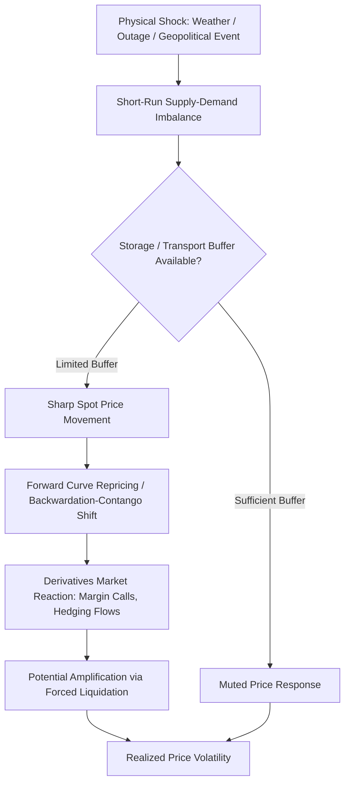

## Sources of Energy Price Volatility

### Overview

Energy prices exhibit substantially higher volatility than most other commodity and financial asset classes due to a combination of inelastic short-run supply and demand, storage constraints, geopolitical exposure, and weather sensitivity. Understanding the distinct sources of volatility is foundational to designing hedging programs, structuring derivatives, and pricing risk premia in energy markets.

**Key Points**

- Short-run price inelasticity of both supply and demand amplifies the price impact of even small physical imbalances
- Storage and transport constraints prevent smooth intertemporal and interregional arbitrage, producing sharp regional and seasonal price dislocations
- Weather is a first-order driver for natural gas, power, and to a lesser extent refined products
- Geopolitical events affect energy markets more acutely than most commodities due to production concentration in politically sensitive regions
- Financialization of energy markets (derivatives, ETFs, algorithmic trading) has added a distinct volatility channel layered on top of physical fundamentals

### Structural Sources of Volatility

#### 1. Short-Run Price Inelasticity

Energy supply and demand are both slow to adjust to price signals in the short run:

- **Supply-side rigidity**: Upstream oil and gas production involves multi-year lead times between investment decisions and output; producers cannot quickly ramp production in response to price spikes, and shutting in existing production is often costly or technically undesirable (e.g., reservoir damage risk)
- **Demand-side rigidity**: Transportation fuel and heating demand are relatively insensitive to short-term price changes because substitution options (switching vehicles, insulating buildings) require time and capital
- Because both curves are steep in the short run, even small quantity shocks—an unplanned refinery outage, a pipeline disruption—can produce disproportionately large price moves

$$\%\Delta P \approx \frac{\%\Delta Q}{\epsilon_s - \epsilon_d}$$

where $\epsilon_s$ and $\epsilon_d$ are short-run supply and demand elasticities (both small in absolute value for energy), meaning small $\%\Delta Q$ shocks translate into large $\%\Delta P$ movements. [Inference: this is a standard simplified elasticity framework used pedagogically; real-world price formation involves additional factors including inventory behavior and expectations]

#### 2. Storage Constraints and Physical Delivery Characteristics

- **Crude oil**: storable and globally transportable, which dampens (but does not eliminate) regional and seasonal volatility relative to other energy commodities
- **Natural gas**: storage is regionally constrained (underground storage facilities, LNG terminal capacity), and pipeline-dependent markets can experience severe regional price dislocations when transport capacity is constrained, as seen historically in Northeast U.S. winter gas price spikes
- **Electricity**: cannot be stored economically at scale (excluding limited battery and pumped-hydro capacity), meaning supply must equal demand instantaneously; this makes power the most volatile major energy commodity, with wholesale prices capable of moving from near-zero to price caps (e.g., $9,000/MWh in some U.S. markets) within hours
- **Refined products**: storable but regionally segmented by refining capacity and specification requirements (e.g., regional gasoline blend mandates), creating localized volatility distinct from crude oil movements

#### 3. Weather Sensitivity

- Natural gas and power demand are driven substantially by heating and cooling degree days, making winter cold snaps and summer heat waves major short-term price drivers
- Renewable generation (wind, solar) introduces supply-side weather dependency into power markets, with low-wind or low-sun periods requiring dispatch of higher marginal-cost thermal generation or triggering price spikes in tight markets
- Hurricane activity in the Gulf of Mexico affects both upstream production and refining capacity, historically producing sharp, short-duration price spikes in crude, gasoline, and natural gas
- Hydroelectric generation is exposed to precipitation and snowpack variability, materially affecting power prices in hydro-dependent regions

#### 4. Geopolitical and Geographic Concentration Risk

- Oil and gas production and reserves are concentrated in a relatively small number of countries and chokepoints (e.g., Strait of Hormuz, Strait of Malacca), creating supply risk disproportionate to production share
- OPEC+ coordinated production decisions directly influence global oil supply and are a recurring source of price volatility, given the group's ability to withhold meaningful spare capacity from the market
- Sanctions regimes (affecting major producers at various points) can abruptly remove or reroute significant supply volumes, with historically variable and hard-to-predict effects on realized price
- Armed conflict near production or transit infrastructure introduces both direct supply disruption risk and a geopolitical risk premium reflected in forward pricing even absent an actual disruption

#### 5. Inventory Dynamics and the Convenience Yield

- Commercial inventory levels (e.g., EIA weekly crude and product stock reports) are closely watched because low inventory relative to seasonal norms reduces the buffer against supply disruptions, amplifying price sensitivity to news
- The convenience yield—the benefit of holding physical inventory versus a forward contract—rises when inventories are tight, contributing to backwardation (near-term prices above longer-dated prices) and reflects the market's willingness to pay for immediate physical availability
- Inventory-driven volatility interacts with storage constraints: when storage capacity approaches physical limits (as occurred with WTI crude in April 2020), prices can become extremely volatile or even trade negative, since holders lacking storage face acute pressure to sell at any price

#### 6. Refining and Transformation Bottlenecks

- Refining capacity utilization, unplanned refinery outages, and maintenance ("turnaround") schedules affect the crack spread independently of crude price movements
- Seasonal specification changes (e.g., summer-grade gasoline requirements) create scheduled but still market-moving supply transitions
- Loss of refining capacity in a region (e.g., following extreme weather events or permanent closures) can cause persistent, localized product price volatility distinct from underlying crude market conditions

#### 7. Regulatory and Policy Shocks

- Renewable portfolio standards, carbon pricing changes, and subsidy/tax credit modifications can shift the relative economics of generation sources with limited advance notice priced fully into forward curves
- Export/import policy changes (e.g., export ban modifications, tariff changes) can rapidly alter regional supply-demand balances
- Strategic Petroleum Reserve releases and similar government inventory actions are used as a volatility-dampening tool but can themselves become a source of market uncertainty around timing and magnitude

#### 8. Financialization and Market Microstructure

- Growth in energy derivatives trading, commodity index investment, and algorithmic/systematic trading strategies has added liquidity but also introduced flow-driven volatility not directly tied to physical fundamentals
- Position concentration and margin call dynamics can amplify moves during periods of stress, as forced liquidation of leveraged positions accelerates price movements independent of underlying supply-demand changes [Inference: the extent to which financialization amplifies versus merely reflects fundamental volatility remains debated in the academic literature]
- Expiration-driven volatility occurs around futures contract roll dates and expiry, particularly in physically-settled contracts where market participants must either take delivery or close positions

### Comparative Volatility Across Energy Commodities

| Commodity | Typical Volatility Driver Profile | Relative Volatility |
| --- | --- | --- |
| Crude oil (WTI/Brent) | Geopolitical, OPEC+ decisions, macro demand | Moderate-High |
| Natural gas (Henry Hub) | Weather, storage levels, regional pipeline constraints | High |
| Electricity (wholesale) | Weather, non-storability, renewable intermittency, grid constraints | Very High |
| Refined products (gasoline, diesel) | Refining bottlenecks, seasonal specs, crude pass-through | Moderate |
| Coal | Long-term contracts dominate; less spot-traded volatility globally | Lower (varies by region) |

*Relative rankings are illustrative and can shift materially during periods of acute market stress or structural change. [Unverified: precise volatility rankings depend on measurement period and should be confirmed against current historical volatility data if used for specific analysis]*

### Volatility Transmission Diagram

### Illustrative Example: Natural Gas Winter Price Spike

Consider a regional natural gas market where:

- Baseline winter demand is met with pipeline capacity at 90% utilization under normal weather
- An extreme cold event increases heating demand by 25% over a short period
- Pipeline capacity cannot expand in the short run, and regional storage withdrawal is already near typical seasonal rates

Because both supply (pipeline throughput) and demand (heating load) are highly inelastic in this window, the imbalance cannot be resolved through quantity adjustment and must instead clear through price. Historically, such conditions have produced multi-fold spot price spikes over a period of days before moderating as the cold event passes and demand normalizes—the defining signature of energy price volatility driven by short-run inelasticity combined with a binding physical constraint.

### Common Pitfalls and Misconceptions

- Treating all energy commodities as having similar volatility profiles, when non-storability makes electricity structurally distinct from storable commodities like crude oil
- Attributing price spikes solely to "speculation" without accounting for the underlying physical inelasticity that financial positioning operates on top of
- Assuming OPEC+ decisions mechanically translate into proportional price changes, when market reaction depends heavily on prevailing inventory levels and spare capacity perceptions
- Overlooking regional price dislocation (e.g., basis differentials) by focusing only on benchmark prices like WTI or Henry Hub

**Related Topics**

- Futures curve structure: contango and backwardation dynamics
- Volatility measurement: historical vs. implied volatility in energy derivatives
- Energy derivatives: futures, options, swaps, and structured hedges
- OPEC+ decision-making and spare capacity analysis
- Electricity market design and locational marginal pricing
- Storage economics and the theory of storage
- Weather derivatives and degree-day contracts
- Value-at-Risk (VaR) and stress testing for energy trading portfolios
- Basis risk in regional energy hedging
- Strategic Petroleum Reserve and government market intervention mechanisms