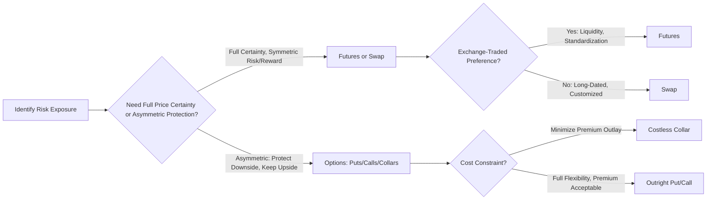

## Energy Derivatives: Futures, Options, and Swaps

### Overview

Energy derivatives allow producers, consumers, marketers, and financial participants to manage price risk, speculate on price direction, and express views on volatility and spread relationships across energy commodities. The three core instrument classes—futures, options, and swaps—differ in exchange listing, settlement mechanics, and payoff structure, but share the common function of transferring price risk between counterparties.

**Key Points**

- Futures are exchange-traded, standardized, and centrally cleared, offering high liquidity and low counterparty risk
- Options provide asymmetric payoff protection at the cost of an upfront premium, suiting risk-averse hedgers who want to preserve upside
- Swaps are typically over-the-counter (OTC) instruments used to fix prices or exchange cash flows over extended periods, common in producer and utility hedging programs
- Physical versus financial settlement is a critical distinction affecting delivery obligations and basis risk
- Energy derivatives markets have deepened significantly with the growth of algorithmic trading, clearing mandates, and expanded product suites (spreads, weather derivatives, environmental products)

### Futures Contracts

#### Mechanics and Structure

A futures contract is a standardized, exchange-traded agreement to buy or sell a specified quantity of a commodity at a predetermined price on a specified future date.

- **Standardization**: contract size, quality specification, delivery location, and expiration are fixed by the exchange (e.g., NYMEX WTI crude futures are for 1,000 barrels of a specified grade delivered at Cushing, Oklahoma)
- **Central clearing**: a clearinghouse becomes the counterparty to every trade, substantially reducing bilateral counterparty risk
- **Margining**: participants post initial margin at trade inception and variation margin daily as the contract is marked-to-market, meaning gains and losses are realized daily rather than only at expiration
- **Settlement**: contracts may be physically settled (requiring actual delivery if held to expiration) or cash settled (settled against a reference price index)

#### Key Energy Futures Contracts

| Contract | Exchange | Underlying | Settlement |
| --- | --- | --- | --- |
| WTI Crude Oil | NYMEX (CME Group) | Light sweet crude, Cushing, OK | Physical delivery |
| Brent Crude | ICE | North Sea crude basket | Cash-settled (ICE Brent) |
| Henry Hub Natural Gas | NYMEX | Natural gas, Henry Hub, LA | Physical delivery |
| RBOB Gasoline | NYMEX | Reformulated gasoline blendstock | Physical delivery |
| ULSD (Heating Oil) | NYMEX | Ultra-low sulfur diesel | Physical delivery |
| Power futures (regional) | ICE, Nodal Exchange | Regional wholesale electricity | Cash-settled |

#### Contango, Backwardation, and the Futures Curve

The shape of the futures curve reflects storage costs, convenience yield, and market expectations:

$$F_{t,T} = S_t \times e^{(r + u - y)(T-t)}$$

where $F_{t,T}$ is the futures price for delivery at $T$, $S_t$ is the spot price, $r$ is the risk-free rate, $u$ is the storage cost, and $y$ is the convenience yield.

- **Contango**: futures prices increase with maturity ($F_{t,T} > S_t$), typically reflecting ample inventory and low convenience yield
- **Backwardation**: futures prices decrease with maturity ($F_{t,T} < S_t$), typically reflecting tight inventory and high convenience yield, common in oil markets during supply-constrained periods

#### Basis Risk

Basis is the difference between the spot price at a hedger's physical location and the futures price used to hedge:

$$Basis = S_{local} - F_{futures}$$

Because most energy futures reference a specific delivery point (e.g., Cushing for WTI, Henry Hub for gas), hedgers with exposure at other locations retain residual basis risk even after establishing a futures hedge, since local and benchmark prices do not move in perfect lockstep.

### Options Contracts

#### Mechanics and Payoff Structures

An option grants the buyer the right, but not the obligation, to buy (call) or sell (put) the underlying at a specified strike price, in exchange for an upfront premium paid to the seller (writer).

**Payoff at expiration:**

$$\text{Call payoff} = \max(S_T - K, 0)$$

$$\text{Put payoff} = \max(K - S_T, 0)$$

where $S_T$ is the underlying price at expiration and $K$ is the strike price.

- Buyers have limited downside (premium paid) and unlimited/large upside potential
- Sellers (writers) receive premium income but carry substantial risk if the market moves against the position
- Options can be written on futures contracts (most common in energy markets) rather than directly on physical spot prices

#### Common Energy Option Strategies

- **Protective put**: a producer buys puts to establish a price floor while retaining upside if prices rise, commonly used in E&P hedging programs
- **Covered call**: a producer sells calls against physical production to generate premium income, capping upside in exchange for immediate cash flow
- **Collar (costless collar)**: simultaneously buying a put and selling a call, often structured so premium received offsets premium paid, establishing a price band (floor and ceiling) at no net upfront cost; widely used in reserve-based lending hedging requirements
- **Straddle/strangle**: buying both a call and put (same or different strikes) to profit from large price moves in either direction, used to express a volatility view rather than a directional price view

#### Option Pricing Considerations

Energy options are frequently priced using variants of the Black-76 model (Black's model for options on futures), given that most energy options are written on futures rather than spot:

$$C = e^{-rT}[F \cdot N(d_1) - K \cdot N(d_2)]$$

$$d_1 = \frac{\ln(F/K) + (\sigma^2/2)T}{\sigma\sqrt{T}}, \quad d_2 = d_1 - \sigma\sqrt{T}$$

where $F$ is the futures price, $K$ is the strike, $\sigma$ is implied volatility, $T$ is time to expiration, and $N(\cdot)$ is the cumulative standard normal distribution.

Energy markets often exhibit pronounced volatility skew and seasonality in implied volatility (e.g., elevated natural gas implied volatility ahead of winter withdrawal season), and behavior can deviate from simple lognormal assumptions during periods of extreme market stress. [Inference: standard options theory applies with well-documented energy-specific adjustments; the degree of skew and seasonality varies by commodity, contract month, and prevailing market conditions]

### Swaps

#### Mechanics and Structure

A swap is an OTC agreement to exchange cash flows based on a floating (market-referenced) price against a fixed price over a defined period, without an exchange of the underlying physical commodity in most cases.

**Basic fixed-for-floating commodity swap payoff to the fixed-price payer per period:**

$$\text{Payoff} = (P_{floating} - P_{fixed}) \times Q$$

where $Q$ is the notional quantity for the period.

- A producer wishing to lock in a sale price enters a swap as the **fixed-price receiver**, paying floating and receiving fixed, effectively converting floating physical sale revenue into a fixed cash flow
- A consumer (e.g., an airline hedging jet fuel, a utility hedging gas purchases) enters as the **fixed-price payer**, paying fixed and receiving floating, locking in a purchase cost
- Swaps are typically cash-settled against a published index price (e.g., NYMEX settlement, Platts assessments) rather than requiring physical delivery

#### Swap Variants

- **Basis swaps**: exchange cash flows based on the price differential between two locations or grades (e.g., WTI-Brent basis swap, regional natural gas basis swaps), used to hedge locational basis risk not addressed by benchmark futures
- **Crack spread swaps**: hedge the refining margin by referencing the differential between crude oil and refined product prices
- **Calendar spread swaps**: hedge the price differential between two delivery months of the same commodity
- **Total return swaps**: exchange the total return of a commodity index for a fixed or floating financing rate, used by financial investors seeking commodity exposure without holding futures directly

#### Clearing and Regulatory Considerations

Following post-2008 financial reforms, a substantial share of standardized commodity swaps are subject to mandatory central clearing and reporting requirements in major jurisdictions (e.g., under Dodd-Frank in the U.S. and EMIR in the EU), reducing bilateral counterparty risk relative to the pre-reform OTC swap market, though bespoke and non-standard swaps often remain bilaterally cleared. [Unverified: specific clearing mandate thresholds and exemptions vary by jurisdiction, product, and counterparty type, and should be verified against current regulatory rules for any specific application]

### Comparative Summary

| Feature | Futures | Options | Swaps |
| --- | --- | --- | --- |
| Venue | Exchange-traded | Exchange-traded or OTC | Primarily OTC (increasingly cleared) |
| Standardization | High | High (exchange) / Variable (OTC) | Variable, often customized |
| Upfront cost | Margin only | Premium paid by buyer | Typically none (mark-to-market only) |
| Obligation | Bilateral obligation | Buyer has right, not obligation | Bilateral obligation |
| Counterparty risk | Low (central clearing) | Low (exchange) / Variable (OTC) | Reduced where cleared; variable otherwise |
| Primary use case | Directional hedging/speculation | Asymmetric risk management | Long-dated price fixing, spread hedging |

### Instrument Selection and Payoff Diagram

### Illustrative SVG: Option Payoff Diagrams (svg_diagram)

<svg xmlns="http://www.w3.org/2000/svg" viewBox="0 0 780 320">
\<style\>
.axis{stroke:#555;stroke-width:1.5;}
.line{stroke-width:2.5;fill:none;}
.lbl{font-family:Arial,sans-serif;font-size:12px;fill:#1a1a1a;}
.title{font-family:Arial,sans-serif;font-size:15px;font-weight:bold;fill:#1a1a1a;}
\</style\>
<text x="390" y="22" text-anchor="middle" class="title">Long Put, Short Call, and Collar Payoff Profiles (svg_diagram)</text>

<text x="120" y="45" text-anchor="middle" class="lbl">Long Put (Protective Floor)</text>

<line x1="30" y1="130" x2="240" y2="130" class="axis" />

<line x1="30" y1="70" x2="30" y2="150" class="axis" />

<polyline points="30,90 130,130 240,130" class="line" stroke="`#2266cc`" />

<text x="10" y="75" class="lbl">Payoff</text>

<text x="245" y="150" class="lbl">Price</text>

<text x="60" y="145" class="lbl">Floor set by strike</text>

<text x="390" y="45" text-anchor="middle" class="lbl">Short Call (Cap on Upside)</text>

<line x1="290" y1="130" x2="500" y2="130" class="axis" />

<line x1="290" y1="70" x2="290" y2="150" class="axis" />

<polyline points="290,130 390,130 500,90" class="line" stroke="`#cc4422`" transform="scale(1,-1) translate(0,220)" />

<text x="320" y="145" class="lbl">Premium income, capped gain</text>

<text x="660" y="45" text-anchor="middle" class="lbl">Costless Collar</text>

<line x1="550" y1="130" x2="760" y2="130" class="axis" />

<line x1="550" y1="70" x2="550" y2="150" class="axis" />

<polyline points="550,150 590,150 690,90 760,90" class="line" stroke="`#228844`" />

<text x="570" y="165" class="lbl">Floor</text>

<text x="700" y="80" class="lbl">Ceiling</text>

<text x="30" y="280" class="lbl" font-style="italic">Illustrative payoff shapes only; not to scale and excludes premium netting effects.</text>

</svg>

### Worked Example: Producer Collar Hedge

An independent E&P producer expects to sell 100,000 barrels of oil over the next quarter and wants downside protection without paying upfront premium.

- Current futures price: $75/barrel
- Producer buys puts at a $65 strike (cost: $2.50/barrel premium)
- Producer sells calls at a $88 strike (premium received: $2.50/barrel)
- Net premium: $0 (costless collar)

**Resulting outcomes at expiration:**

- If price settles at $55: producer exercises the put, realizing an effective $65/barrel floor (put payoff of $10 offsets the $20 market decline from $75, achieving the $65 floor)
- If price settles at $75: no options exercised; producer sells at prevailing market price of $75
- If price settles at $95: the call is exercised against the producer, capping the effective realized price at $88/barrel despite the higher market price

This structure illustrates the core trade-off in options-based hedging: the producer sacrifices upside above $88 in exchange for a guaranteed floor at $65, without paying cash premium upfront.

### Common Pitfalls and Misconceptions

- Assuming futures hedges eliminate all price risk, when basis risk between the hedger's physical location/grade and the futures delivery point often remains
- Treating options premium as a sunk cost that should be avoided entirely, overlooking that premium purchases genuine asymmetric protection unavailable through futures or swaps
- Confusing exchange-traded energy options (options on futures) with standard equity-style options, which differ in underlying mechanics and settlement
- Assuming all commodity swaps are now centrally cleared; bespoke and non-standard structures frequently remain bilateral
- Underestimating that a "costless" collar is not risk-free—it caps upside and still carries the counterparty and basis risk inherent in any derivative position

**Related Topics**

- Reserve-based lending hedging covenants and collar structures
- Volatility surface construction for energy options
- Crack spread and calendar spread trading strategies
- Central clearing and margin requirements under Dodd-Frank/EMIR
- Value-at-Risk (VaR) for energy derivatives portfolios
- Weather derivatives and degree-day contracts
- Basis risk management across regional energy markets
- Physical versus financial settlement mechanics in commodity contracts
- Real options analysis for energy asset investment decisions
- Structured products: swaptions and exotic energy derivatives