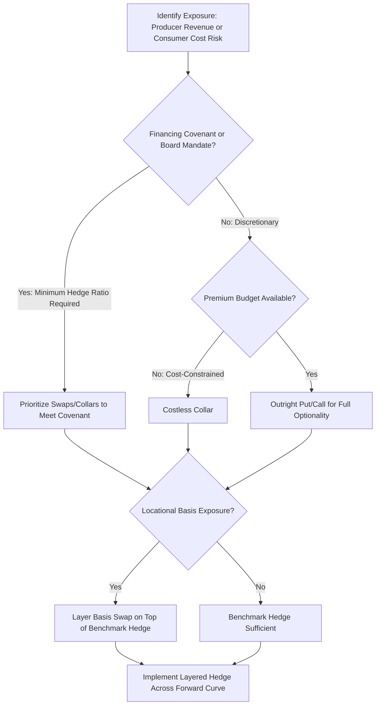

## Hedging Strategies for Producers and Consumers

### Overview

Hedging strategies allow energy producers and consumers to manage exposure to price volatility by locking in prices, establishing price bands, or transferring risk to counterparties willing to bear it. Producers and consumers face symmetric but opposite exposures—producers are hurt by falling prices, consumers by rising prices—and their hedging programs are structured accordingly using the futures, options, and swaps instruments available in energy derivatives markets.

**Key Points**

- Hedging objectives differ by participant type: producers hedge revenue, consumers hedge cost, and both often face third-party requirements (lenders, boards) mandating minimum hedge ratios
- Strategy selection depends on risk tolerance, cost of protection, balance sheet flexibility, and the presence of financing covenants
- No hedging strategy eliminates risk entirely; each involves a trade-off between cost, protection level, and retained upside/downside
- Hedge accounting treatment (cash flow hedge designation) affects how hedging gains/losses flow through financial statements
- Portfolio-level hedging programs typically combine multiple instrument types and layer hedges across time horizons rather than relying on a single strategy

### Producer Hedging Strategies

Producers (E&P companies, power generators) are exposed to falling prices reducing revenue below breakeven or target return levels.

#### 1. Outright Forward Sale / Swap

- The producer locks in a fixed sale price for a defined volume and period by entering a swap as fixed-price receiver or selling futures contracts
- Provides full price certainty and eliminates both downside risk and upside potential
- Commonly mandated by reserve-based lending (RBL) covenants, which often require hedging a minimum percentage (e.g., 50-75%) of projected production from proved developed producing (PDP) reserves for a specified forward period [Unverified: specific covenant percentages vary significantly by lender, facility, and market conditions]

#### 2. Protective Put (Floor Strategy)

- The producer purchases put options at a chosen strike, establishing a minimum realized price while retaining full upside if market prices rise above the strike
- Requires upfront premium payment, which is the explicit cost of preserving upside optionality
- Preferred by producers with strong balance sheets who can afford premium outlay and want to participate in price rallies

#### 3. Costless Collar

- Combines a purchased put (floor) with a sold call (ceiling), with strikes chosen so premium received from the call offsets premium paid for the put
- Eliminates upfront cash cost but caps upside above the call strike
- Widely used to satisfy RBL hedging covenants without consuming cash for premium, making it one of the most common structures in upstream hedging programs

#### 4. Three-Way Collar

- Adds a sold put (at a lower strike than the purchased put) to the standard collar, generating additional premium that can widen the collar band (raise the floor or raise the ceiling)
- Introduces a "gap risk" region: if prices fall below the sold put's strike, the producer loses the floor protection and is exposed to further downside, since the net position below that strike resembles an unhedged position
- Used when producers want a higher floor than a standard costless collar would allow, accepting reintroduced tail risk in exchange

#### 5. Basis Hedging

- Producers with production at locations distant from benchmark delivery points (e.g., Permian Basin gas relative to Henry Hub) layer basis swaps on top of benchmark hedges to address the locational price differential
- Without basis hedging, a benchmark-only hedge leaves the producer exposed to widening or narrowing regional differentials independent of the benchmark price itself

#### 6. Volumetric Production Payment (VPP) and Prepay Structures

- A producer sells a defined future production stream to a counterparty for an upfront cash payment, effectively monetizing future production today
- Functions as both a financing tool and a hedge, since the producer transfers price risk on the sold volumes to the buyer
- More complex than standard derivative hedges, involving actual conveyance of production rights rather than a purely financial contract

### Consumer Hedging Strategies

Consumers (airlines, utilities, industrial energy users, fuel retailers) are exposed to rising prices increasing input costs.

#### 1. Outright Forward Purchase / Swap

- The consumer locks in a fixed purchase price by entering a swap as fixed-price payer or buying futures contracts
- Provides full cost certainty; commonly used by utilities hedging natural gas purchases for power generation or heating supply obligations

#### 2. Protective Call (Cap Strategy)

- The consumer purchases call options at a chosen strike, establishing a maximum purchase price while retaining the benefit of lower prices if the market falls below the strike
- Airlines hedging jet fuel costs frequently use call options or call-heavy structures to cap fuel expense while preserving some benefit from falling oil prices, given intense competitive pressure to pass through fuel savings

#### 3. Costless Collar (Consumer Version)

- Combines a purchased call (ceiling on cost) with a sold put (floor), with strikes set so premiums offset
- Caps maximum cost while giving up some benefit from prices falling below the sold put's strike
- Common among utilities and industrial consumers seeking budget certainty without premium outlay

#### 4. Swaptions

- An option to enter into a swap at a future date, giving the consumer the right (not obligation) to lock in a fixed price later
- Useful when a consumer has anticipated but not yet contracted future demand (e.g., a planned facility expansion) and wants optionality on hedging without committing immediately

#### 5. Layered/Laddered Hedging

- Rather than hedging a full volume at a single point in time, both producers and consumers commonly layer hedges incrementally across multiple months or quarters ahead of the exposure period
- Reduces timing risk (the risk of hedging an entire position at a single unfavorable price point) by dollar-cost-averaging the hedge price across multiple entry points

### Comparative Strategy Selection

| Objective | Producer Strategy | Consumer Strategy |
| --- | --- | --- |
| Full price certainty | Swap / futures short | Swap / futures long |
| Downside protection, retain upside | Long put | Long call |
| Zero-premium protection with capped upside/downside | Costless collar (short call/long put) | Costless collar (long call/short put) |
| Wider band, accept tail risk | Three-way collar | Three-way collar (inverse structure) |
| Locational risk management | Basis swap | Basis swap |
| Deferred hedge decision | N/A (typically uses puts) | Swaption |

### Strategy Selection Framework

### Worked Example: Airline Jet Fuel Hedging Program

An airline projects consumption of 10 million gallons of jet fuel over the next year and wants to manage cost volatility while remaining price-competitive.

**Layered approach:**

- Quarter 1 (near-term, high certainty needed): 70% hedged via fixed-price swaps referencing a crude oil proxy (jet fuel-specific futures liquidity is limited, so airlines commonly cross-hedge using WTI/Brent or heating oil as a proxy, accepting basis risk between crude-based products and actual jet fuel prices)
- Quarter 2-3 (medium-term): 50% hedged via costless collars, capping cost increases while allowing some benefit if prices fall
- Quarter 4 (longer-dated, higher uncertainty): 25% hedged via call options only, preserving maximum flexibility given greater uncertainty in the demand forecast that far out

This layered, declining hedge ratio by time horizon is a standard structure. [Inference: specific hedge ratios and layering schedules are illustrative; actual airline hedging programs vary substantially by carrier risk appetite, balance sheet strength, and historical hedging philosophy, and some carriers deliberately hedge minimally or not at all]

### Hedge Accounting Considerations

- Hedging instruments can be designated as **cash flow hedges** under applicable accounting standards (e.g., ASC 815 in the U.S., IFRS 9 internationally) when they meet specific criteria linking the hedge to a forecasted transaction
- Effective cash flow hedge designation allows mark-to-market gains/losses on the derivative to be deferred in other comprehensive income (OCI) and recognized in earnings when the hedged transaction occurs, reducing reported earnings volatility
- Hedges that fail effectiveness testing, or are entered for trading/speculative purposes rather than as designated hedges, must generally be marked to market through earnings immediately, creating reported earnings volatility even when the underlying economic exposure is well-managed
- Documentation requirements (hedge designation memos, effectiveness testing methodology) must generally be established at hedge inception to qualify for hedge accounting treatment [Unverified: specific documentation and effectiveness testing requirements should be confirmed against the applicable accounting standard and jurisdiction, as requirements have evolved over time]

### Common Pitfalls and Misconceptions

- Treating hedging as a profit center rather than a risk management tool; hedges will show losses in favorable price environments by design, which is not evidence of a "failed" hedge
- Over-hedging relative to actual physical production/consumption volumes, creating a net speculative position rather than a true hedge
- Ignoring basis risk when using proxy hedges (e.g., crude oil hedges for jet fuel), which can leave meaningful residual exposure even with a fully "hedged" notional position
- Assuming three-way collars provide the same protection as standard collars, overlooking the reintroduced gap risk below the sold put strike
- Failing to reassess hedge programs as production/consumption forecasts change, leading to over- or under-hedged positions relative to actual physical exposure

**Related Topics**

- Energy derivatives instrument mechanics: futures, options, and swaps in depth
- Reserve-based lending hedging covenant structures
- Basis risk and regional price differential hedging
- Hedge accounting standards: ASC 815 and IFRS 9
- Value-at-Risk (VaR) for hedged versus unhedged portfolios
- Volumetric production payments and prepay financing structures
- Airline and industrial fuel cost risk management case studies
- Volatility trading versus directional hedging strategies
- Counterparty credit risk in OTC hedging relationships
- Dynamic hedging and hedge ratio rebalancing methodologies