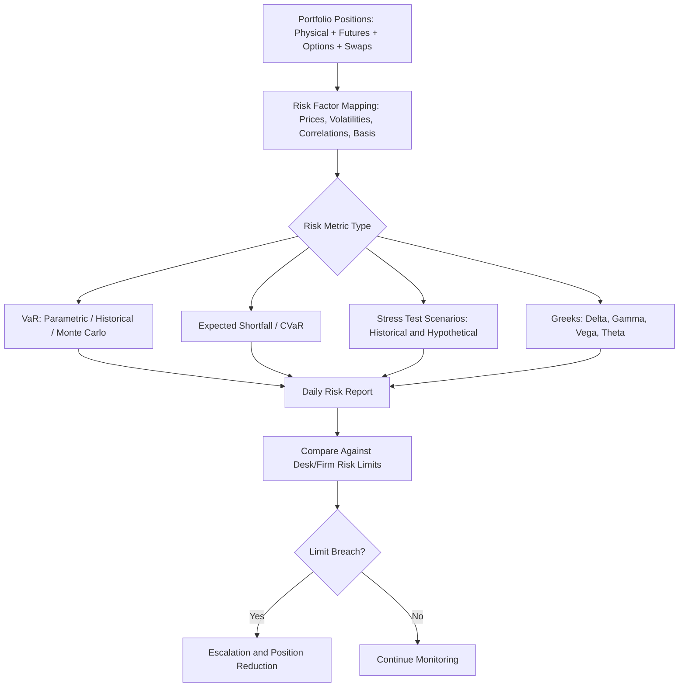

## Value-at-Risk and Portfolio Risk Metrics in Energy Trading

### Overview

Energy trading portfolios—spanning physical positions, futures, options, and swaps across multiple commodities, locations, and time horizons—require quantitative risk metrics to measure potential losses, allocate risk limits, and satisfy regulatory and counterparty reporting requirements. Value-at-Risk (VaR) is the most widely used summary metric, but energy trading risk management relies on a broader toolkit given the sector's unique volatility characteristics, including fat tails, jump risk, and non-normal price distributions.

**Key Points**

- VaR summarizes potential loss over a defined time horizon at a specified confidence level but does not capture the magnitude of losses beyond that threshold
- Energy price distributions frequently exhibit fat tails and jump risk (especially power and natural gas), making VaR calculation methodology choice consequential
- Complementary metrics—Expected Shortfall, stress testing, and Greeks-based sensitivity measures—address VaR's known limitations
- Physical and optionality positions (storage, generation assets, transportation contracts) require specialized risk measurement beyond standard financial VaR frameworks
- Risk limits are typically set and monitored at multiple levels: desk, commodity, and firm-wide

### Value-at-Risk (VaR) Fundamentals

#### Definition and Interpretation

VaR estimates the maximum expected loss over a given time horizon at a specified confidence level under normal market conditions.

$$P(\Delta V \leq -VaR_\alpha) = 1 - \alpha$$

where $\Delta V$ is the change in portfolio value, and $\alpha$ is the confidence level (e.g., 95% or 99%).

**Interpretation example**: A 1-day 95% VaR of $2 million means that, under the model's assumptions, the portfolio is expected to lose no more than $2 million on 95% of trading days, implying a loss exceeding $2 million on approximately 1 in 20 trading days.

#### VaR Calculation Methodologies

**1. Parametric (Variance-Covariance) VaR**

Assumes portfolio returns follow a normal (or other parametric) distribution and uses the portfolio's volatility and correlation structure:

$$VaR_\alpha = z_\alpha \times \sigma_p \times \sqrt{t} \times V$$

where $z_\alpha$ is the z-score for the chosen confidence level, $\sigma_p$ is portfolio volatility, $t$ is the time horizon, and $V$ is portfolio value.

- Computationally efficient and easy to implement
- Poorly suited to energy portfolios containing options (non-linear payoffs) or commodities with fat-tailed, skewed return distributions, since the normality assumption systematically underestimates tail risk

**2. Historical Simulation VaR**

Applies actual historical price changes (e.g., the past 250-500 trading days) to the current portfolio to generate a distribution of hypothetical P&L outcomes, from which the VaR percentile is read directly.

- Does not assume any particular distributional form, capturing fat tails and skewness present in the historical data
- Fully captures non-linear option payoffs when full revaluation is used
- Limited by the historical window used: a lookback period that excludes extreme events (e.g., a calm period preceding a major price shock) will understate tail risk, while including such events can produce unrepresentative volatility going forward

**3. Monte Carlo Simulation VaR**

Generates a large number of simulated future price paths using a specified stochastic process (e.g., geometric Brownian motion, mean-reverting jump-diffusion models common for power and gas), then computes the resulting portfolio value distribution.

- Most flexible methodology, capable of capturing complex payoffs, path dependency, and specified volatility/correlation structures
- Computationally intensive, particularly for large portfolios with many risk factors and long simulation horizons
- Model risk is a key concern: results are only as good as the specified underlying stochastic process, which for energy commodities often requires jump-diffusion or regime-switching models to capture observed price spike behavior [Inference: this reflects standard quantitative finance practice for commodities exhibiting spike behavior; the specific model choice and calibration approach vary by institution and commodity]

#### Comparison of VaR Methodologies

| Method | Handles Non-Normal Distributions | Handles Options/Non-Linearity | Computational Cost | Key Weakness |
| --- | --- | --- | --- | --- |
| Parametric | No (assumes normality) | Poorly (unless delta-approximated) | Low | Understates fat-tail risk |
| Historical Simulation | Yes (uses actual history) | Yes (with full revaluation) | Moderate | Limited by historical window |
| Monte Carlo | Yes (model-dependent) | Yes | High | Model risk, calibration sensitivity |

### Limitations of VaR

- **Not sub-additive** in general: portfolio VaR can exceed the sum of individual position VaRs in certain cases, violating a desirable diversification property, though this is more of a theoretical concern for portfolios with heavy tail dependence than a routine occurrence
- **No information beyond the threshold**: VaR indicates the loss will not exceed a certain amount at the given confidence level, but says nothing about the severity of losses in the tail beyond that point
- **Backward-looking bias**: historical and parametric approaches rely on historical data that may not capture unprecedented future events (structural breaks, unprecedented weather events, geopolitical shocks)
- **Procyclicality**: VaR estimates tend to be low during calm periods (understating risk just before stress events) and spike sharply after volatility increases (potentially forcing risk reduction at the worst time)

### Expected Shortfall (Conditional VaR)

Expected Shortfall (ES), also called Conditional VaR (CVaR), addresses VaR's tail-blindness by measuring the average loss given that the loss exceeds the VaR threshold:

$$ES_\alpha = E[\Delta V \mid \Delta V \leq -VaR_\alpha]$$

- Provides insight into the severity of tail losses, not just their probability threshold
- Is a coherent risk measure (satisfies sub-additivity), making it theoretically preferable to VaR for portfolio risk aggregation
- Increasingly favored by regulators and risk committees as a complement to, or replacement for, VaR in market risk frameworks, though VaR remains widely used in practice due to its longer history and simpler communication [Unverified: relative adoption of ES versus VaR varies by jurisdiction, regulatory framework, and institution type]

### Stress Testing and Scenario Analysis

Given VaR's limitations in capturing extreme, low-probability events, energy trading risk frameworks routinely supplement VaR with stress testing:

- **Historical scenario stress tests**: apply the price moves observed during past extreme events (e.g., 2008 financial crisis, 2020 negative WTI pricing, 2021 Texas winter storm power price spikes) to the current portfolio
- **Hypothetical scenario stress tests**: construct plausible but unprecedented scenarios (e.g., simultaneous supply disruption across multiple regions, extreme cold combined with generation outages) based on risk committee judgment
- **Reverse stress testing**: works backward from a specified loss threshold to identify what combination of market moves would be required to produce that loss, helping identify hidden concentration risk

### Sensitivity-Based Metrics (Greeks) in Energy Portfolios

For portfolios containing significant options exposure, Greeks-based sensitivity measures complement VaR:

- **Delta**: sensitivity of portfolio value to a change in the underlying price; aggregate delta indicates net directional exposure across the portfolio
- **Gamma**: rate of change of delta with respect to the underlying price; high gamma indicates delta will shift rapidly with price moves, relevant for portfolios with significant near-the-money option positions
- **Vega**: sensitivity to changes in implied volatility, particularly important given the pronounced volatility seasonality in natural gas and power markets
- **Theta**: sensitivity to the passage of time, relevant for option-heavy books approaching expiration

$$\Delta = \frac{\partial V}{\partial S}, \quad \Gamma = \frac{\partial^2 V}{\partial S^2}, \quad \nu = \frac{\partial V}{\partial \sigma}, \quad \Theta = \frac{\partial V}{\partial t}$$

### Energy-Specific Risk Measurement Challenges

#### Physical and Optionality Positions

- **Storage assets**: the value of a storage facility embeds optionality (the ability to inject when prices are low and withdraw when prices are high), which must be valued using optimization or Monte Carlo techniques rather than simple linear position risk
- **Generation assets**: power plants embed a "spark spread option" (the option to run when power price exceeds fuel cost plus operating cost), requiring option-based valuation and risk measurement rather than treating capacity as a static position
- **Transportation contracts**: pipeline capacity and transmission rights carry locational basis optionality that standard VaR frameworks may not capture without location-specific risk factor modeling

#### Liquidity Risk

- Many energy contracts, particularly longer-dated power and basis products, trade in comparatively illiquid markets, meaning the price used for mark-to-market valuation may not be realizable in size without significant market impact
- Liquidity-adjusted VaR approaches incorporate bid-ask spread and estimated liquidation time into the risk estimate, rather than assuming instantaneous liquidation at the mid-market mark

#### Credit and Counterparty Risk Interaction

- OTC and bilateral energy positions carry counterparty credit risk in addition to market risk; **Potential Future Exposure (PFE)** and **Credit Valuation Adjustment (CVA)** metrics quantify the risk that a counterparty defaults while a position is in-the-money to the firm
- Wrong-way risk—where counterparty credit quality deteriorates precisely when the firm's exposure to that counterparty increases (e.g., a producer counterparty whose credit weakens during a price crash that simultaneously increases the firm's swap exposure to them)—is a particular concern in energy markets given the correlation between commodity prices and producer/consumer counterparty credit quality

### Worked Example: Historical Simulation VaR Calculation

A trading desk holds a portfolio with a current mark-to-market value of $50 million, primarily exposed to natural gas price movements.

**Methodology:**

1. Collect the daily percentage price changes in the relevant risk factors (Henry Hub futures, basis, implied volatility) over the past 250 trading days
2. Apply each historical day's percentage change to the current portfolio to generate 250 hypothetical daily P&L outcomes
3. Rank the resulting P&L outcomes from worst to best
4. The 95% 1-day VaR is read as the loss at the 5th percentile of the distribution (the 12th or 13th worst outcome out of 250)

If the 13th worst simulated outcome represents a loss of $1.8 million, the 1-day 95% VaR is reported as $1.8 million, meaning historical experience suggests a 5% chance of losing more than this amount on any given day. Expected Shortfall would then be calculated as the average of the losses in the worst 5% of outcomes (roughly the worst 12-13 days), typically producing a materially higher figure than the VaR point estimate itself given fat-tailed energy price behavior. [Inference: this is a standard illustrative historical simulation methodology; actual desk implementations vary in lookback window length, weighting schemes, and risk factor granularity]

### Risk Limit Structures

| Limit Type | Purpose | Typical Scope |
| --- | --- | --- |
| VaR limits | Cap aggregate potential loss | Desk, commodity, firm-wide |
| Notional/volumetric limits | Cap gross position size | Individual trader, desk |
| Stop-loss limits | Force position reduction after realized losses | Individual trader, desk |
| Concentration limits | Prevent excessive exposure to single counterparty/location | Firm-wide |
| Greeks limits (delta, vega) | Cap sensitivity exposures | Options desks |

### Common Pitfalls and Misconceptions

- Treating VaR as the "worst-case loss" rather than a probabilistic threshold that will be exceeded by design at the stated frequency
- Applying parametric (normal distribution) VaR to portfolios with significant optionality or to commodities like power and natural gas that exhibit pronounced jump/spike behavior
- Relying solely on VaR without complementary stress testing, leaving tail risk from unprecedented scenarios unaddressed
- Ignoring liquidity risk in VaR calculations for less liquid regional or longer-dated contracts
- Overlooking wrong-way risk when assessing counterparty credit exposure in commodity-linked bilateral contracts

**Related Topics**

- Jump-diffusion and mean-reverting stochastic models for energy price simulation
- Spark spread and dark spread option valuation for generation assets
- Storage asset valuation using real options and optimization techniques
- Credit Valuation Adjustment (CVA) and counterparty risk frameworks
- Regulatory capital requirements for commodity trading (e.g., FRTB implications)
- Liquidity risk measurement in illiquid energy markets
- Backtesting methodologies for VaR model validation
- Extreme value theory applications in energy risk management
- Basis risk quantification across regional energy markets
- Enterprise risk management frameworks for integrated energy companies