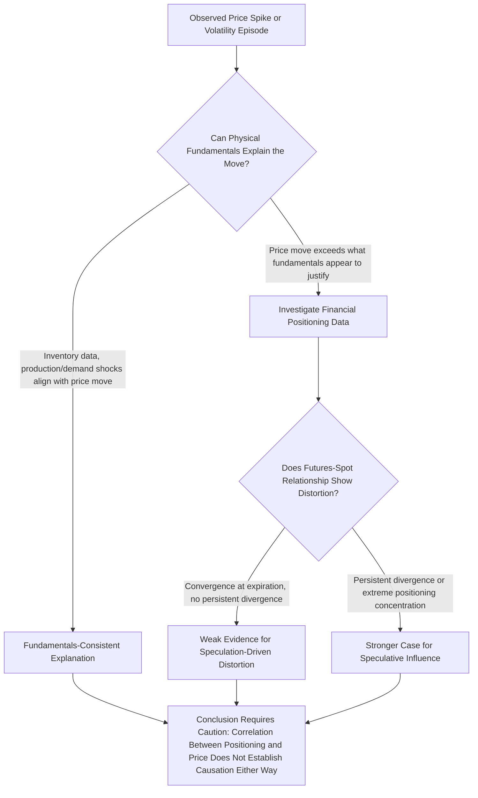

## Speculation vs Fundamentals Debate in Energy Markets

### Overview

The speculation versus fundamentals debate concerns whether energy price movements—and particularly episodes of sharp volatility or sustained price rallies—are driven primarily by physical supply-demand fundamentals or by financial speculative activity in derivatives markets. This debate has recurred prominently after major price spikes (2007-2008 oil price surge, periodic natural gas spikes, 2021-2022 energy crisis) and has direct implications for regulatory policy, position limits, and market structure design.

**Key Points**

- The debate is empirically contested, with academic and regulatory studies reaching different conclusions depending on methodology, data period, and market examined
- "Speculation" is not inherently distinct from "fundamentals" in efficient markets theory, since speculators trading on fundamental information contribute to price discovery
- The Masters Hypothesis (index fund flows driving the 2007-2008 oil spike) remains a central and heavily scrutinized case study
- Position limits and reporting requirements (e.g., CFTC Commitments of Traders data) emerged partly in response to this debate, aiming to increase transparency without necessarily resolving the underlying causal question
- Financialization has structurally increased the volume of financial participation in energy markets relative to physical hedging volume, independent of whether this participation causes excess volatility

### Defining the Terms of the Debate

#### What "Speculation" Means in This Context

- **Narrow definition**: trading by participants without an underlying physical position, motivated by expected price appreciation/depreciation rather than hedging a physical exposure
- **Broader definition** (used in some regulatory contexts): any position that exceeds what would be needed for pure hedging purposes, including large financial index positions with no physical delivery intent

#### What "Fundamentals" Means in This Context

- Physical supply and demand balances, inventory levels, production costs, geopolitical supply risk, and weather—the factors that would determine price in a market with no financial derivatives trading at all
- The core question is whether observed price levels and volatility can be fully explained by these physical factors, or whether financial positioning adds an independent, non-fundamental component to price

### The Efficient Markets Counter-Argument

Standard financial theory holds that in efficient markets, speculators trading on private information about future fundamentals *improve* price discovery by incorporating that information into current prices faster than would otherwise occur. Under this view:

- Speculation and fundamentals are not opposing forces; speculative trading is one of the mechanisms through which fundamental information gets reflected in price
- Speculators bear risk that hedgers wish to transfer, and the risk premium they earn is compensation for providing this liquidity and risk-bearing service, a function long recognized in commodity futures theory (Keynes's theory of normal backwardation)
- Excess speculation would only distort prices away from fundamental value if speculative positioning is large enough relative to market liquidity to move prices independent of information content, and if that mispricing is not quickly arbitraged away

This framework implies that establishing genuine "excess speculation" requires demonstrating price deviation from what fundamentals justify, not merely observing large speculative position sizes, which is empirically more difficult than simply measuring trading volumes or position data.

### The Masters Hypothesis and the 2007-2008 Oil Price Spike

#### The Hypothesis

Following the 2008 U.S. Senate testimony of hedge fund manager Michael Masters, a hypothesis emerged that large inflows into commodity index funds (which take long positions in futures to replicate commodity index returns for institutional investors) contributed substantially to the run-up in oil prices to nearly $147/barrel in July 2008, independent of physical supply-demand fundamentals.

**Core argument**: Commodity index investment grew substantially in the years preceding 2008 as institutional investors sought commodities as an asset class, and this "wall of money" flowing into long futures positions pushed prices above levels justified by physical fundamentals.

#### Empirical Evidence and Counterarguments

The Masters Hypothesis prompted extensive academic and regulatory investigation, with mixed findings:

- **Supporting evidence direction**: some studies found correlation between index fund position growth and price levels during the run-up period, and noted that index funds are structurally long-only (they do not take short positions), potentially creating persistent one-directional demand pressure independent of price-based signals
- **Counter-evidence direction**: multiple studies, including analysis by the U.S. Commodity Futures Trading Commission (CFTC) and various academic researchers, found that if index fund positioning drove prices, one would expect measurable divergence between futures and spot prices, or between markets with heavy index participation versus those without, and that such divergence was not robustly observed
- A commonly cited counter-argument notes that the price spike and subsequent collapse (from ~$147 to under $40/barrel within months) coincided closely with the deteriorating global demand outlook amid the 2008 financial crisis, consistent with a fundamentals-driven explanation
- The debate remains genuinely unresolved in the sense that reasonable researchers examining similar data have reached different conclusions, reflecting the inherent difficulty of establishing causation in complex, multi-factor commodity price formation [Inference: this characterization reflects the well-documented persistence of disagreement in the academic and regulatory literature; specific individual study conclusions should be verified against current sources if citing a particular finding]

### Position Limits and Regulatory Response

In response to the speculation debate, several regulatory measures have been implemented or proposed:

- **CFTC Commitments of Traders (COT) reports**: publish weekly data on positions held by different trader categories (commercial/hedgers, non-commercial/speculators, and index traders in supplemental reports), intended to increase market transparency and enable empirical study of the relationship between positioning and prices
- **Position limits**: the Dodd-Frank Act mandated the CFTC to establish position limits on certain physical commodity derivatives to prevent "excessive speculation," though implementation was subject to extended legal and regulatory processes, with final position limit rules for certain commodities finalized in subsequent years [Unverified: current position limit rule status and specific commodity coverage should be verified against current CFTC regulations given the extended and evolving implementation history]
- **Bona fide hedge exemptions**: position limit frameworks generally exempt positions that qualify as legitimate hedges of physical commercial risk, reflecting the regulatory acknowledgment that hedging and speculative activity serve different market functions even when using identical instruments

### Financialization of Energy Markets

Independent of the causal debate around any specific price episode, energy derivatives markets have undergone measurable structural financialization:

- Growth in commodity index fund assets under management from the early 2000s onward substantially increased the volume of long-only financial positioning in oil and other commodity futures relative to prior decades
- Growth of algorithmic and systematic trading strategies (trend-following, statistical arbitrage) has increased the volume and speed of financial trading activity in energy futures markets
- Exchange-traded products (commodity ETFs, ETNs) provide retail and institutional investors direct access to commodity exposure without requiring futures account infrastructure, further broadening financial market participation
- This financialization is well-documented as a structural trend; whether it has increased *volatility* or *distorted* price levels away from fundamentals, versus simply adding liquidity and market depth, remains the contested empirical question rather than a settled conclusion [Inference: the fact of financialization is well-established; its causal effect on volatility and price levels is the genuinely disputed component]

### Framework for Evaluating Specific Episodes

### Illustrative Example: Natural Gas Price Spikes and the Speculation Question

When regional natural gas prices spike sharply during extreme winter weather events, the speculation-versus-fundamentals framework can be applied:

- **Fundamentals check**: Did heating degree days spike above historical norms? Did pipeline flow data show capacity constraints? Did storage withdrawal rates exceed the five-year average?
- **Speculation check**: Did open interest and non-commercial (speculative) positioning increase disproportionately ahead of the price move, or did positioning changes lag the price move (consistent with speculators reacting to, rather than causing, the fundamental shock)?

In most well-documented extreme weather-driven gas price spikes, the physical fundamentals (degree days, storage, pipeline constraints) provide a substantial and often sufficient explanation for the magnitude of the move, though this does not preclude financial positioning from amplifying the speed or peak magnitude of the price response once the fundamental shock is underway. [Inference: this reflects a common finding pattern in weather-driven gas price episodes; the relative contribution of amplification effects is case-specific and not universally quantified]

### Balanced Assessment

| Argument for Significant Speculative Influence | Argument for Fundamentals-Dominant Explanation |
| --- | --- |
| Large, correlated growth in index fund AUM preceded major price rallies | Futures-spot convergence at expiration is generally observed, arguing against persistent distortion |
| Long-only index flows create structurally asymmetric buying pressure | Price spikes and collapses closely track independently observable physical data (inventories, demand shocks) |
| High-frequency and algorithmic trading can amplify short-term volatility | Cross-country/cross-market comparisons often show similar price patterns in markets with differing speculative participation levels |
| Position concentration data occasionally shows unusually large speculative holdings ahead of price moves | Cost-of-storage and convenience yield models can explain most curve shape behavior without invoking speculation |

### Common Pitfalls and Misconceptions

- Treating "speculator" as synonymous with "market manipulator," when the vast majority of speculative activity is legal, transparent, and serves a legitimate risk-transfer and liquidity-provision function
- Assuming large speculative position sizes alone prove price distortion, without examining whether the futures-spot relationship or physical inventory data shows evidence of actual mispricing
- Conflating the general fact of market financialization (well-established) with the specific and contested claim that financialization caused any particular price episode
- Ignoring that hedgers and speculators are counterparties to the same trades by definition—one side's position size cannot be assessed as "excessive" without reference to the other side's genuine hedging demand
- Overgeneralizing conclusions from one price episode (e.g., 2008) to all subsequent energy price volatility, when each episode has distinct fundamental and positioning characteristics requiring separate analysis

**Related Topics**

- Keynes's theory of normal backwardation and risk premia in futures markets
- CFTC Commitments of Traders report interpretation methodology
- Position limits and bona fide hedge exemption criteria under Dodd-Frank
- Commodity index investment structures and their market impact
- Algorithmic and high-frequency trading in energy futures markets
- Futures-spot convergence and arbitrage mechanisms
- Case study: 2007-2008 oil price spike and collapse
- Case study: 2021-2022 European energy crisis price dynamics
- Market manipulation regulation and enforcement in energy trading
- Behavioral finance perspectives on commodity price bubbles