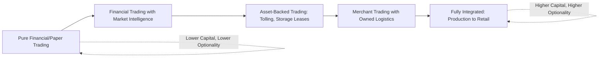
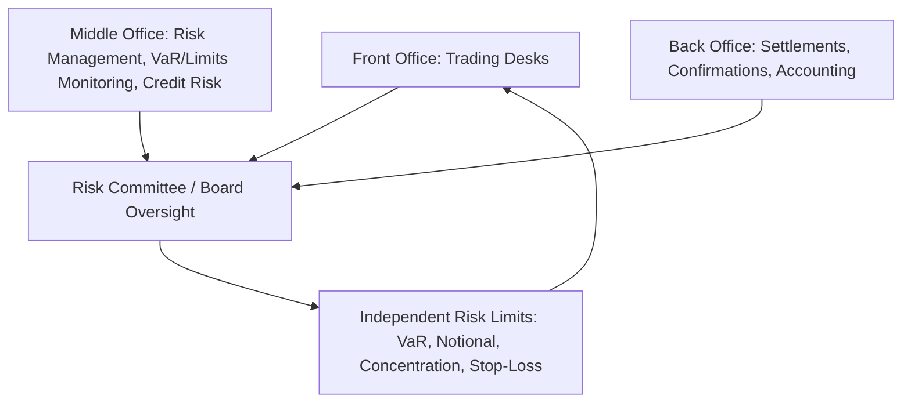

## Energy Trading Firm Business Models

### Overview

Energy trading firms operate across a spectrum of business models ranging from pure financial speculation to physically integrated merchant trading, each with distinct capital requirements, risk profiles, and value-creation mechanisms. Understanding these models clarifies how different market participants generate returns, why certain firms hold physical assets while others trade purely financial instruments, and how risk management practices differ across firm types.

**Key Points**

- Business models range along a spectrum from pure financial/paper trading to fully integrated physical merchants owning production, transport, and storage assets
- Physical asset ownership provides optionality value and informational advantages but requires substantially more capital and operational expertise
- Revenue generation mechanisms differ fundamentally: directional risk-taking, arbitrage/spread capture, market-making, and asset optimization
- Independent trading houses, bank trading desks, and integrated energy companies represent distinct organizational archetypes with different regulatory treatment and capital structures
- Risk management infrastructure (credit, market, operational risk) scales with model complexity and physical asset exposure

### The Physical-to-Financial Spectrum

### Pure Financial Trading Firms

#### Model Characteristics

- Trade exclusively in futures, options, swaps, and other financial derivatives without holding physical commodity positions or transportation/storage assets
- Generate returns through directional views (price speculation), relative value/spread trades, volatility trading, and systematic/algorithmic strategies
- Include proprietary trading firms, hedge funds with commodity strategies, and commodity trading advisors (CTAs)

#### Revenue Mechanisms

- **Directional trading**: taking outright long or short positions based on fundamental or technical views of price direction
- **Spread/relative value trading**: capturing mispricings between related contracts (calendar spreads, crack spreads, inter-commodity spreads, regional basis) without taking outright directional price risk
- **Systematic/quantitative strategies**: trend-following, mean-reversion, and statistical arbitrage models applied algorithmically across energy futures markets
- **Volatility trading**: options-based strategies expressing views on implied versus realized volatility rather than price direction

#### Capital and Risk Profile

- Lower capital intensity than physically integrated models, since positions are financially settled and margined rather than requiring asset ownership or working capital for physical inventory
- Risk concentrated almost entirely in market risk (price, volatility, basis) and counterparty/clearing risk, with minimal operational risk relative to physical operators
- Subject to exchange margin requirements and, for larger funds, potential regulatory position limits

### Bank and Financial Institution Trading Desks

#### Model Characteristics

- Historically, major banks operated substantial physical commodity trading and even physical asset ownership (power plants, metal warehouses, oil storage) alongside financial derivatives trading, particularly in the years leading up to the 2008 financial crisis
- Following the financial crisis, increased regulatory scrutiny (including Federal Reserve restrictions on physical commodity activities for bank holding companies in the U.S.) led several major banks to substantially reduce or exit physical commodity trading and asset ownership, shifting toward primarily financial derivatives market-making and client-facing hedging services [Unverified: specific regulatory changes and their timing affected different institutions differently; current physical commodity activity levels at specific banks should be verified against current disclosures]

#### Revenue Mechanisms

- **Client hedging facilitation**: structuring and executing derivative hedges for corporate clients (airlines, utilities, producers), earning bid-ask spread and structuring fees
- **Market-making**: providing liquidity in futures, options, and OTC swap markets, profiting from bid-ask spreads while managing resulting inventory risk
- **Research and advisory**: providing market intelligence and structuring advice as part of broader client relationships

### Merchant Energy Trading Companies

#### Model Characteristics

Merchant trading firms combine trading expertise with ownership or long-term control of physical assets—storage facilities, transportation capacity, generation assets, or processing infrastructure—to capture optionality value unavailable to pure financial traders.

- Own or control assets specifically for the informational and optionality advantages they provide to the trading operation, sometimes described as trading "around" physical assets
- Include large independent trading houses (commodity merchants), as well as trading arms of integrated energy companies and utilities

#### Revenue Mechanisms

- **Storage arbitrage**: capturing the spread between purchase and sale prices across time by injecting commodity into storage when prices are low and withdrawing when prices are high, monetizing contango in the futures curve
- **Transportation/locational arbitrage**: capturing basis differentials by moving commodity from lower-priced to higher-priced regions, constrained by available pipeline, shipping, or transmission capacity
- **Tolling arrangements**: contracting for the right to convert one commodity into another (e.g., a tolling agreement granting rights to a power plant's conversion spread, or a refining tolling arrangement), capturing the processing margin without owning the underlying asset outright
- **Structured/optimization trading**: using proprietary models to optimize dispatch, storage injection/withdrawal, and transportation scheduling decisions across a portfolio of physical assets and contracts in real time

#### Asset-Backed Optionality: Illustrative Example

A merchant trader controls natural gas storage capacity with 1 Bcf of working gas capacity and a maximum injection/withdrawal rate of 50 MMcf/day.

- If the current futures curve shows summer prices at $2.50/MMBtu and winter prices at $4.00/MMBtu (a contango structure), the trader can inject gas during summer, incurring storage costs, and withdraw during winter to capture the spread
- The value of the storage asset is not simply the current spread, but the *option value* of flexibility to inject or withdraw based on evolving price conditions over the contract period, typically valued using stochastic optimization or Monte Carlo methods rather than a static spread calculation
- This optionality value generally exceeds what a purely financial calendar spread trade would capture, since physical storage control allows dynamic response to price changes throughout the storage season rather than commitment to a single point-in-time spread trade [Inference: this reflects standard commodity trading theory regarding the incremental value of physical optionality; actual realized value depends on execution quality and how price paths evolve relative to the optimization model's assumptions]

### Integrated Energy Companies (Producer-Marketers)

#### Model Characteristics

- Oil and gas majors, large independent producers, and utilities operate trading desks that market their own production/generation while also engaging in third-party trading to optimize logistics, capture arbitrage opportunities, and manage price risk across the value chain
- Trading operations provide a natural information advantage from proprietary knowledge of the company's own production, transportation, and storage positions
- Often described as having a "captive" physical flow (own production/generation) that anchors the trading operation, distinguishing them from pure merchant traders who must source physical positions entirely through market transactions or contracted assets

#### Revenue Mechanisms

- **Netback optimization**: maximizing realized value for owned production by choosing optimal sale points, timing, and counterparties across the marketing network
- **Third-party origination**: purchasing third-party volumes to fill excess transportation or processing capacity, generating incremental margin
- **Risk management overlay**: using the trading desk's market expertise to execute the company's broader corporate hedging program more effectively than would be possible through a purely administrative treasury function

### Retail and Downstream Energy Marketers

#### Model Characteristics

- Retail electricity and natural gas providers purchase wholesale supply and manage the price risk of serving fixed-price or capped-price retail customer contracts
- Load-serving entities face **volumetric risk** in addition to price risk: actual customer usage varies with weather and economic conditions, meaning the hedged volume may not match actual delivery obligations
- The combination of price risk and volumetric risk creates a distinctive risk profile requiring weather-linked hedging strategies (weather derivatives, load-following swaps) beyond standard commodity price hedges

### Comparative Business Model Summary

| Model | Physical Asset Ownership | Primary Risk Exposure | Primary Return Driver | Capital Intensity |
| --- | --- | --- | --- | --- |
| Pure financial trading | None | Market, counterparty/clearing | Directional views, spread capture, systematic strategies | Low-Moderate |
| Bank trading desk | Minimal (post-crisis) | Market, client credit | Bid-ask spread, structuring fees | Moderate |
| Merchant trading house | Storage, transport, tolling rights | Market, operational, asset optimization | Physical optionality, arbitrage | High |
| Integrated producer-marketer | Production/generation assets | Market, operational, production | Netback optimization, third-party origination | Very High |
| Retail/downstream marketer | Minimal (contracts, not upstream assets) | Price and volumetric | Retail margin, risk management efficiency | Low-Moderate |

### Organizational Risk Management Structure

Regardless of model, energy trading firms typically maintain a three-lines-of-defense risk governance structure:

- **Front office**: executes trading strategy within approved limits
- **Middle office**: independently measures and monitors risk exposure (VaR, Greeks, credit exposure) and enforces limit compliance, organizationally separate from trading to preserve independence
- **Back office**: handles trade confirmation, settlement, and financial reporting

### Key Success Factors by Model Type

**Key Points**

- Financial trading firms succeed through superior analytical models, execution speed, and risk discipline rather than physical market access
- Merchant traders succeed through securing advantaged physical asset positions (favorable storage/transport contracts) combined with sophisticated optimization capability
- Integrated producer-marketers succeed through effective coordination between operational (production/generation) and trading functions, avoiding organizational silos that prevent full value capture
- All models depend critically on robust risk management infrastructure scaled appropriately to the complexity of positions held

### Common Pitfalls and Misconceptions

- Assuming all "energy trading" involves speculative directional risk-taking, when much of merchant and integrated trading activity is fundamentally about optimizing physical logistics and capturing arbitrage rather than betting on price direction
- Underestimating the capital and operational complexity required to run a merchant trading model relative to pure financial trading, given physical delivery, storage, and transportation logistics
- Treating bank commodity trading desks as unchanged since the pre-2008 era, when regulatory changes have materially altered the physical asset ownership landscape at many institutions
- Overlooking volumetric risk in retail/load-serving business models, focusing only on commodity price risk while ignoring weather-driven usage variability
- Assuming physical asset ownership automatically generates trading profit, when the value depends on sophisticated optimization capability to actually monetize the embedded optionality

**Related Topics**

- Storage and tolling asset valuation using real options methodology
- Three lines of defense risk governance frameworks in trading organizations
- Regulatory treatment of bank physical commodity activities post-financial crisis
- Volumetric risk and weather derivatives for retail energy marketers
- Spark spread and dark spread optimization for generation asset trading
- Basis and locational arbitrage trading strategies
- Credit risk management and counterparty exposure in trading operations
- Systematic and algorithmic trading strategies in commodity markets
- Netback pricing and marketing optimization for integrated producers
- Commodity trading house case studies and market structure evolution