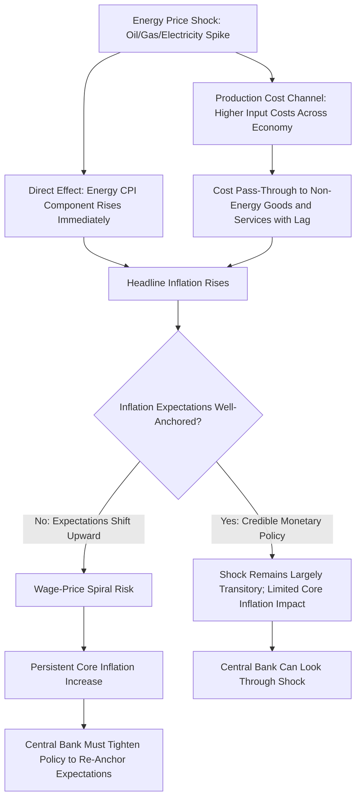

## Energy Price Shocks and Inflation Transmission

### Overview

Energy price shocks transmit to broader inflation through multiple direct and indirect channels, making energy one of the most closely watched components in macroeconomic and monetary policy analysis. Understanding these transmission mechanisms is central to forecasting headline versus core inflation, assessing monetary policy responses, and evaluating the macroeconomic vulnerability of different economies to energy price volatility.

**Key Points**

- Energy price shocks transmit through direct (first-round) effects on energy-related CPI components and indirect (second-round) effects through production costs and inflation expectations
- The distinction between headline and core inflation measures reflects deliberate methodological choices about how to treat volatile energy (and food) prices
- Transmission speed and magnitude depend on energy intensity of the economy, exchange rate regime, fiscal subsidy policies, and the credibility of monetary policy anchoring inflation expectations
- Second-round effects (wage-price spirals, expectation de-anchoring) are the primary channel through which temporary energy shocks can become persistent inflation problems
- Central bank responses to energy shocks involve a genuine trade-off between accommodating a supply shock (avoiding unnecessary output loss) and preventing inflation expectations from becoming unanchored

### Direct (First-Round) Transmission Channels

#### Energy Component of Consumer Price Indices

Energy prices enter headline inflation measures directly through categories such as gasoline, electricity, natural gas, and heating oil, which typically carry meaningful weights in consumer price index (CPI) baskets (commonly in the range of 6-9% of the overall basket in many advanced economies, though weights vary by country and over time based on consumption pattern surveys). [Unverified: exact CPI energy weights vary by country, survey period, and methodology; specific figures should be confirmed against current national statistics agency data for any particular economy]

- Because energy commodities are among the most volatile price series in the economy, this direct pass-through is typically the fastest and most visible transmission channel, showing up in headline CPI within the same reporting period as the underlying price move
- Gasoline/motor fuel prices are particularly immediate, given retail pricing that adjusts rapidly to wholesale price changes and daily/weekly price surveys used in many CPI calculations

#### Headline vs. Core Inflation

$$\pi_{headline} = w_{energy}\pi_{energy} + w_{food}\pi_{food} + w_{core}\pi_{core}$$

where $w$ denotes the CPI basket weight of each component.

- **Core inflation** measures typically exclude food and energy specifically because these components exhibit high volatility driven by supply-side factors only loosely connected to the underlying pace of demand-driven or monetary inflation that policy is intended to address
- Central banks generally monitor both measures: headline inflation for its direct relevance to household purchasing power and inflation expectations, and core inflation as a signal of underlying inflation momentum less distorted by transient supply shocks
- A pure energy price shock, in principle, shows up sharply in headline inflation while having a much more muted and delayed effect on core inflation—the degree to which it "leaks" into core measures is itself informative about second-round effect strength

### Indirect (Second-Round) Transmission Channels

#### Production Cost Pass-Through

- Energy is an input to virtually all production and distribution processes (manufacturing, transportation, agriculture), meaning higher energy costs raise input costs across the economy with a lag as businesses pass costs through to final goods and services prices
- The degree of pass-through depends on the energy intensity of specific industries, competitive conditions (ability to pass costs to consumers versus absorbing margin compression), and the persistence of the price shock (temporary spikes are more likely to be absorbed; sustained increases are more likely passed through)
- Transportation and logistics costs, heavily energy-dependent, transmit energy price changes into the broader cost structure of goods delivered to market, affecting a wide range of CPI categories beyond direct energy components

#### Wage-Price Dynamics

- If energy-driven inflation raises the cost of living meaningfully, workers may seek higher nominal wages to preserve real purchasing power, and if achieved, this raises business costs further, potentially creating a self-reinforcing wage-price spiral
- The likelihood and severity of this channel depends heavily on labor market institutions (wage indexation mechanisms, collective bargaining structures) and the tightness of labor markets at the time of the shock
- Historically, the 1970s oil shocks are the most commonly cited example where wage-price spiral dynamics substantially amplified and prolonged the inflationary impact of energy price increases in several advanced economies, though the specific institutional features (widespread wage indexation, different monetary policy frameworks at the time) that enabled this dynamic have changed considerably in many economies since [Inference: this reflects widely-documented economic history and macroeconomic literature regarding the 1970s episodes; applicability of the same dynamics to current economies depends on institutional features that vary by country and time period]

#### Inflation Expectations Channel

- If households and businesses expect elevated inflation to persist (rather than viewing an energy shock as temporary), this expectation itself can become self-fulfilling as it feeds into wage negotiations, pricing decisions, and consumption/saving behavior
- Central bank credibility plays a central role: if the public trusts that the central bank will act to bring inflation back to target, temporary energy shocks are more likely to remain "first-round only," whereas eroded credibility increases the risk that a temporary shock de-anchors expectations and becomes persistent

### Transmission Pathway Diagram

### Structural Factors Affecting Transmission Magnitude

#### Energy Intensity of the Economy

- Economies with higher energy consumption per unit of GDP, or with a larger share of energy-intensive manufacturing, experience larger real-economy impacts from a given percentage energy price shock
- Energy intensity has generally declined over recent decades in many advanced economies due to efficiency improvements and structural shifts toward services, which has reduced (though not eliminated) the macroeconomic sensitivity to energy shocks compared to the 1970s

#### Net Energy Importer vs. Exporter Status

- **Net importers**: an energy price spike represents a negative terms-of-trade shock, transferring real income to foreign producers and typically depressing both growth and (via cost pass-through) raising inflation simultaneously—a classic stagflationary supply shock
- **Net exporters**: an energy price spike can be expansionary for the domestic economy (higher export revenue, currency appreciation, government revenue), while still raising domestic energy-linked inflation, producing a different and sometimes more favorable growth-inflation trade-off than importers face

#### Exchange Rate Regime and Currency Effects

- Since energy commodities are typically priced in U.S. dollars internationally, currency depreciation against the dollar amplifies the domestic-currency cost of energy imports, compounding an underlying dollar-denominated price shock
- Countries experiencing simultaneous currency weakness and global energy price increases face compounded inflationary pressure through this channel, distinct from the pure commodity price effect

#### Fiscal Policy and Subsidy Responses

- Government fuel subsidies, price caps, or tax reductions can suppress the direct pass-through of international energy prices to domestic consumer prices, muting the measured inflation impact while shifting the cost to public finances
- Subsidy removal (often necessary for fiscal sustainability) can then produce a delayed, one-time inflation adjustment when suppressed prices are allowed to catch up to market levels, a dynamic observed in various emerging market subsidy reform episodes

### Monetary Policy Response Considerations

#### The "Look Through" vs. "Tighten" Dilemma

Central banks facing an energy price shock confront a genuine policy trade-off:

- **Looking through the shock**: treating a temporary, supply-driven energy price increase as something monetary policy should not react to aggressively, since tightening policy would address a supply shock with a demand-suppressing tool, potentially causing unnecessary output loss without addressing the shock's actual (supply-side) cause
- **Tightening in response**: raising rates to prevent the energy shock from de-anchoring inflation expectations or triggering second-round wage-price effects, accepting some near-term growth cost to preserve medium-term price stability

The appropriate choice depends on the central bank's assessment of the shock's persistence, the state of inflation expectations, and labor market conditions—there is no universally correct response, and views on the appropriate policy stance during any specific episode are a matter of ongoing macroeconomic and policy debate rather than settled consensus.

#### Core Inflation as a Policy Guide

Many central banks explicitly reference core inflation measures (excluding food and energy) partly to avoid over-reacting to first-round energy price effects that monetary policy cannot efficiently offset, while still monitoring headline inflation and inflation expectations closely for evidence that second-round effects are emerging.

### Illustrative Example: Oil Price Shock Transmission Estimate

Consider a hypothetical stylized transmission model where a 50% increase in oil prices is estimated to add approximately 0.5-1.0 percentage points to headline CPI inflation in a moderately energy-intensive advanced economy over the following 12 months, through a combination of direct gasoline/heating price effects and indirect transportation/production cost pass-through, before fading as the price level effect drops out of year-over-year comparisons (assuming no further price increases and no second-round wage effects). [Inference: this range is a stylized illustration consistent with commonly cited historical pass-through estimates in macroeconomic literature; actual magnitude varies substantially by country, time period, energy intensity, and the presence or absence of accompanying currency and subsidy effects, and should not be treated as a precise forecasting rule]

### Common Pitfalls and Misconceptions

- Assuming core inflation excludes energy because energy prices "don't matter," when the exclusion reflects a deliberate choice to filter out transient supply-side volatility from a measure intended to capture underlying inflation momentum
- Treating all energy price shocks as symmetric in their macroeconomic impact, when net importer versus exporter status can produce materially different growth and inflation outcomes from an identical global price move
- Overlooking the role of fiscal subsidies in temporarily masking (and potentially later amplifying, via delayed pass-through) the measured inflation impact of an energy shock
- Assuming 1970s-style wage-price spiral dynamics automatically apply to current economies, without accounting for structural changes in wage-setting institutions and monetary policy frameworks since that period
- Conflating "temporary" and "small" when assessing shock persistence—a shock can be temporary in the sense of not permanently altering the price level's growth rate while still being large enough to meaningfully affect near-term headline inflation readings

**Related Topics**

- Terms-of-trade shocks and their macroeconomic effects for importers versus exporters
- Central bank inflation targeting frameworks and credibility
- Historical case study: 1970s oil shocks and stagflation
- Exchange rate pass-through to domestic inflation
- Fiscal subsidy design and phase-out strategies for energy prices
- Core versus headline inflation measurement methodology
- Wage indexation mechanisms and labor market institutions
- Energy intensity trends and decoupling from GDP growth
- Case study: 2021-2022 global energy crisis and inflation dynamics
- Supply shock versus demand shock monetary policy responses