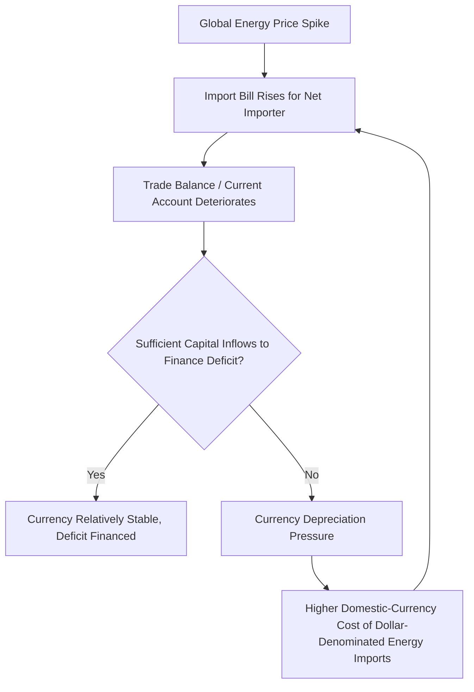

## Energy Dependence and Trade Balance Effects

### Overview

Energy dependence—the extent to which a country relies on imported energy to meet domestic consumption—has direct and substantial effects on the trade balance, current account position, currency dynamics, and broader macroeconomic vulnerability to external price shocks. The relationship between energy trade flows and macroeconomic outcomes has shifted significantly in several economies as production technology, particularly shale oil and gas development, has altered historical import/export patterns.

**Key Points**

- Energy trade balance is the difference between the value of energy exports and imports, and can be a dominant component of the overall trade balance for both heavily import-dependent and heavily export-dependent economies
- Energy price volatility interacts with dependence levels to create asymmetric current account and currency exposure between net importers and net exporters
- The "resource curse" and Dutch disease phenomena describe specific macroeconomic risks associated with resource export dependence
- Structural shifts in energy production (e.g., U.S. shale revolution) can transform a country's trade balance composition and macroeconomic exposure profile over a relatively short period
- Energy security policy (diversification, strategic reserves, domestic production incentives) is often motivated as much by trade balance and currency stability concerns as by pure supply security

### Defining Energy Dependence and Trade Balance Linkage

#### Energy Dependence Ratio

A standard measure of energy dependence is the net energy import ratio:

$$\text{Energy Dependence Ratio} = \frac{\text{Net Energy Imports}}{\text{Gross Energy Consumption}}$$

- A ratio approaching or exceeding 100% indicates near-total or complete reliance on imports for domestic energy needs
- A negative ratio indicates the country is a net energy exporter, producing more than it consumes domestically

#### Trade Balance Decomposition

$$TB = TB_{energy} + TB_{non-energy}$$

For heavily energy-dependent importers or exporters, $TB_{energy}$ can be large enough to dominate swings in the overall trade balance, even when non-energy trade remains relatively stable, meaning overall trade balance volatility is often primarily an energy price and volume story rather than a broader trade competitiveness story.

### Net Importer Dynamics

#### Trade Balance and Current Account Exposure

- A rise in global energy prices directly worsens the trade balance of a net importer, holding import volumes constant, since the same physical volume of imported energy now costs more in domestic currency terms
- This creates a mechanical linkage where energy price spikes simultaneously worsen the trade balance and raise domestic inflation (as discussed in energy price shock transmission), a classic negative terms-of-trade shock
- Persistent energy trade deficits can contribute to broader current account deficits, which over time may require external financing (foreign borrowing or asset sales) and can create currency vulnerability if financing becomes harder to obtain

#### Currency Feedback Loop

- Because energy commodities are typically priced internationally in U.S. dollars, currency depreciation for a net importer compounds the direct price shock, creating a potential adverse feedback loop where currency weakness and energy import costs reinforce each other
- Countries with less credible monetary policy or weaker external financing positions are more vulnerable to this feedback loop becoming severe during global energy price spikes

#### Diversification and Energy Security Policy

Net importers commonly pursue strategies to reduce trade balance vulnerability to energy price shocks:

- **Supplier diversification**: reducing dependence on any single supplier or region to limit both price and geopolitical supply risk
- **Strategic petroleum reserves**: government-held inventories intended to buffer against acute supply disruptions, reducing (though not eliminating) short-term price and volume vulnerability
- **Domestic production incentives**: policies encouraging domestic energy production (conventional or renewable) to reduce the import dependence ratio over time
- **Renewable energy deployment**: since renewable generation displaces imported fossil fuel consumption (particularly relevant for countries importing both oil and gas), renewable buildout has a direct energy dependence and trade balance dimension beyond its climate policy rationale
- **Efficiency policy**: reducing energy intensity per unit of GDP lowers the volume of energy (and therefore energy imports) required to sustain a given level of economic activity

### Net Exporter Dynamics

#### Trade Balance and Current Account Benefits

- Energy price increases improve the trade balance and current account of net exporters, generating a positive terms-of-trade shock
- This typically supports currency appreciation, increased government revenue (particularly where energy resources are state-owned or heavily taxed), and can support higher domestic consumption and investment during high-price periods

#### The Resource Curse and Dutch Disease

Despite the apparent trade balance benefit, heavy energy export dependence carries well-documented macroeconomic risks:

**Dutch Disease mechanism:**

1. A resource export boom (energy price spike or major discovery) generates large foreign currency inflows
2. This drives currency appreciation, making the country's other (non-resource) export sectors less internationally competitive
3. Non-resource tradeable sectors (manufacturing, agriculture) contract as they lose competitiveness, a phenomenon named after the Netherlands' experience following North Sea gas discoveries in the 1960s
4. The economy becomes increasingly concentrated in the resource sector, raising vulnerability to future price declines and complicating long-term economic diversification

**Resource curse (broader concept):**

- Refers to the empirical observation that resource-abundant economies have sometimes underperformed resource-poor peers in long-run growth and development outcomes, attributed to a combination of Dutch disease effects, governance and institutional quality challenges, revenue volatility management difficulties, and reduced incentives for broader economic diversification
- The resource curse is not universal or deterministic: several resource-rich economies have avoided severe symptoms through strong institutions, sovereign wealth fund mechanisms, and deliberate diversification policy, meaning the outcome depends heavily on domestic policy and institutional quality rather than resource abundance alone being inherently harmful [Inference: this reflects the substantial academic literature nuancing the original resource curse hypothesis, which has moved from a deterministic claim toward a conditional one dependent on institutional factors]

#### Sovereign Wealth Funds and Revenue Management

- Many resource-exporting nations establish sovereign wealth funds to save a portion of resource export revenue during high-price periods, smoothing government spending across price cycles and building a financial buffer against future price declines or resource depletion
- These funds also serve a currency management function, since investing revenue abroad rather than converting it entirely to domestic currency reduces the appreciation pressure that would otherwise exacerbate Dutch disease dynamics

### Case Study Pattern: The U.S. Shale Revolution and Trade Balance Transformation

The development of hydraulic fracturing and horizontal drilling technology applied to shale formations substantially increased U.S. domestic oil and natural gas production beginning in the mid-2000s and accelerating through the 2010s.

**Trade balance transformation:**

- The U.S. shifted from a substantial net petroleum importer to, at various points, a net petroleum exporter on an annual basis, representing a structural change in trade balance composition rather than a temporary price-driven fluctuation
- This transformation reduced U.S. macroeconomic exposure to the currency feedback loop described above for net importers, since a smaller (or reversed) net import position means energy price spikes have a correspondingly smaller (or even favorable) direct trade balance effect
- The shift also had geopolitical trade balance implications, altering historical energy trading relationships and enabling U.S. LNG export growth to new international markets [Inference: the general direction and substantial magnitude of this shift is well-documented; precise current net import/export status fluctuates with production and consumption trends and should be verified against current EIA data for precise figures]

### Comparative Summary: Importer vs. Exporter Trade Balance Exposure

| Factor | Net Energy Importer | Net Energy Exporter |
| --- | --- | --- |
| Effect of price spike on trade balance | Deteriorates | Improves |
| Effect of price spike on currency | Depreciation pressure | Appreciation pressure |
| Effect of price spike on inflation | Raises inflation (cost-push) | Mixed (may raise domestic energy costs but improves fiscal/external position) |
| Key structural risk | Current account vulnerability, financing dependence | Dutch disease, resource curse, revenue volatility |
| Common policy response | Diversification, efficiency, domestic production incentives | Sovereign wealth funds, diversification of non-resource sectors |

### Illustrative Example: Trade Balance Sensitivity Calculation

A country consumes 2 million barrels of oil equivalent per day and imports 60% of this consumption (net import dependence ratio of 60%), with the remainder from domestic production.

- Daily net imports: $2,000,000 \times 0.60 = 1,200,000$ barrels
- If global oil prices rise by $20/barrel, the additional daily import cost is:

$$\Delta \text{Import Cost} = 1,200,000 \times \$20 = \$24,000,000 \text{ per day}$$

- Annualized, this represents an approximate $8.76 billion additional trade balance deterioration purely from the price effect, holding import volume constant—illustrating how a relatively modest per-barrel price move can translate into a materially significant trade balance impact for a large, import-dependent economy. [Inference: this is a simplified illustrative calculation holding volume constant; actual trade balance effects also reflect demand response to price changes and are not purely mechanical]

### Common Pitfalls and Misconceptions

- Assuming energy export dependence is unambiguously beneficial for a country's macroeconomic position, when Dutch disease and resource curse risks are well-documented empirical phenomena affecting many resource-dependent economies
- Treating the energy dependence ratio as a static, permanent characteristic, when structural shifts (like the U.S. shale revolution) demonstrate that production technology and investment can transform a country's position over a relatively short period
- Overlooking the currency feedback loop for import-dependent economies, which can make an initial energy price shock materially worse than the direct import cost effect alone would suggest
- Assuming sovereign wealth funds automatically prevent resource curse dynamics, when their effectiveness depends heavily on governance quality, withdrawal rule discipline, and investment management
- Conflating overall trade balance improvements from energy exports with genuine broad-based economic development, when Dutch disease can mean overall trade gains coincide with non-resource sector decline

**Related Topics**

- Dutch disease case studies: Netherlands, Norway, and other resource economies
- Sovereign wealth fund design and revenue management best practices
- U.S. shale revolution: technology, production growth, and market impact
- Current account sustainability and external financing vulnerability
- Exchange rate pass-through and currency feedback loops in commodity-dependent economies
- Energy price shock transmission to domestic inflation
- LNG export infrastructure and global gas trade pattern shifts
- Strategic petroleum reserves and energy security policy design
- Economic diversification strategies for resource-dependent economies
- OPEC+ production policy and its effect on exporter trade balances