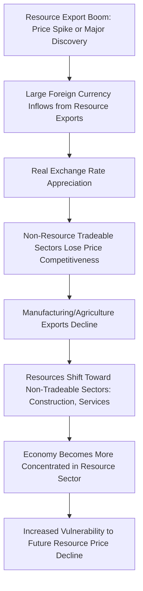
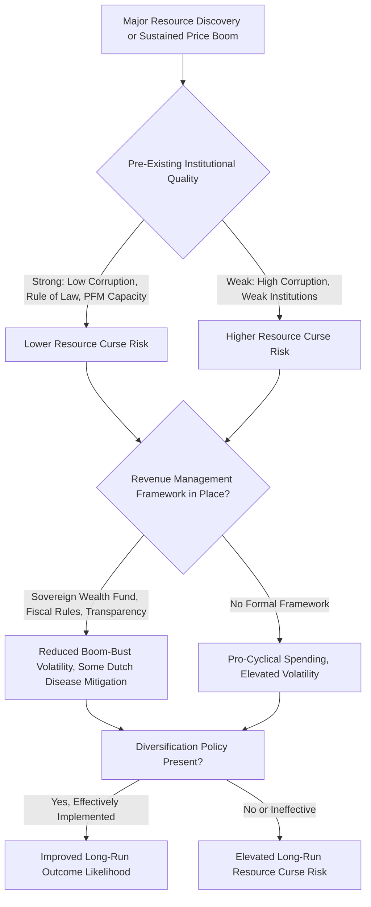

## Resource Curse and Dutch Disease Dynamics

### Overview

The resource curse describes the empirical puzzle whereby countries richly endowed with natural resources—particularly oil, gas, and minerals—have sometimes experienced slower long-run economic growth, weaker institutional development, and greater economic volatility than resource-poor peers. Dutch disease is the specific economic mechanism most commonly cited as a proximate cause, describing how resource export booms can undermine the competitiveness of a country's other tradeable sectors. Together these concepts form a central framework for understanding the macroeconomic and developmental risks facing resource-dependent economies.

**Key Points**

- Dutch disease is a specific, well-defined economic mechanism (currency appreciation crowding out non-resource tradeables); the resource curse is a broader, more contested empirical hypothesis about long-run development outcomes
- The resource curse is not deterministic—many resource-rich economies have avoided its worst effects through strong institutions and deliberate policy design
- Key contributing channels beyond currency appreciation include revenue volatility, rent-seeking and governance erosion, and reduced incentives for economic diversification
- Sovereign wealth funds, fiscal rules, and revenue transparency initiatives represent the primary policy toolkit for managing resource curse risk
- The empirical literature has evolved from treating the resource curse as a robust stylized fact toward a more conditional view dependent on institutional quality and policy choices

### Dutch Disease: Mechanism and Origin

#### Historical Origin

The term originated from the Netherlands' economic experience following the discovery and development of the Groningen natural gas field in the 1960s, when the resulting export boom and currency effects were observed to coincide with difficulties in the country's manufacturing sector.

#### The Core Mechanism

Dutch disease operates through a well-defined sequence of economic effects:

**Two distinct sub-channels are typically identified in the formal economic literature:**

1. **Spending effect**: increased resource revenue raises domestic demand (government spending, private consumption from resource-linked income), which raises prices of non-tradeable goods and services (real estate, domestic services) relative to tradeable goods, causing a real exchange rate appreciation even without nominal currency movement
2. **Resource movement effect**: the booming resource sector draws labor and capital away from other tradeable sectors (particularly manufacturing) directly, as these sectors cannot compete with resource-sector wages and returns during the boom, independent of the currency channel

#### Real Exchange Rate Appreciation

$$RER = \frac{P_{domestic}}{P_{foreign}} \times NER$$

where $NER$ is the nominal exchange rate and $P$ represents relevant price levels. Real appreciation can occur through nominal currency appreciation, domestic price level increases (particularly in non-tradeable sectors), or both simultaneously—meaning Dutch disease effects can manifest even under a fixed nominal exchange rate regime, through domestic inflation in non-tradeable prices instead.

### Distinguishing Dutch Disease from the Broader Resource Curse

| Dimension | Dutch Disease | Resource Curse |
| --- | --- | --- |
| Scope | Specific mechanism: currency/competitiveness effect on tradeable sectors | Broader hypothesis: overall long-run growth and development underperformance |
| Mechanism clarity | Well-defined, mathematically tractable | Multi-causal, contested attribution |
| Empirical status | Reasonably well-established as an economic mechanism | More debated; conditional on institutional factors |
| Policy remedy | Sterilization, sovereign wealth funds, exchange rate management | Broader institutional and governance reform, in addition to macroeconomic tools |

Dutch disease is best understood as one of several contributing mechanisms that can feed into the broader resource curse outcome, rather than being synonymous with it.

### Additional Resource Curse Channels

Beyond Dutch disease, the broader resource curse literature identifies several additional contributing mechanisms:

#### Revenue Volatility and Fiscal Management Challenges

- Resource revenues (especially from oil and gas) are highly volatile due to underlying commodity price volatility, creating boom-bust fiscal cycles that are difficult to manage
- Governments that expand spending commitments (infrastructure, public sector employment, subsidies) during high-price periods often face painful fiscal adjustment when prices decline, sometimes triggering broader macroeconomic instability
- Pro-cyclical fiscal policy (spending more when revenue is high, cutting sharply when revenue falls) tends to amplify rather than smooth the underlying commodity price cycle's effect on the domestic economy

#### Rent-Seeking and Institutional Quality Erosion

- Large, geographically concentrated resource rents can create strong incentives for rent-seeking behavior, corruption, and weakened accountability, particularly where institutional checks are already fragile
- Resource revenue can reduce a government's reliance on broad-based taxation of its citizens, potentially weakening the accountability relationship between government and citizens that domestic taxation is theorized to help sustain (sometimes described as a "no taxation, less representation" dynamic in the political economy literature) [Inference: this reflects a recognized strand of political economy literature regarding the relationship between taxation and government accountability; the strength and universality of this specific mechanism remains debated]
- Resource wealth can also increase the stakes of political conflict over control of the state and its resource revenue, contributing in some documented cases to civil conflict risk, though this relationship is highly context-dependent and not observed uniformly across resource-rich states

#### Reduced Diversification Incentives

- When resource rents provide substantial and relatively easy revenue, both government and private sector incentives to invest in developing other competitive industries may weaken, a dynamic sometimes reinforcing the direct competitiveness effects of Dutch disease
- This can create long-run structural vulnerability: an economy with underdeveloped non-resource sectors has fewer alternatives to fall back on when resource revenues eventually decline due to price cycles or resource depletion

#### Human Capital and Investment Composition Effects

- Some research suggests resource booms can skew investment and education incentives toward resource-sector-linked activities at the expense of broader human capital development, though the empirical robustness and universality of this specific channel is less consistently established across country studies than the more direct Dutch disease and fiscal volatility channels [Unverified: this channel is less consistently supported across the empirical literature compared to fiscal volatility and currency effects, and findings vary by study methodology and country sample]

### Evidence That the Resource Curse Is Conditional, Not Deterministic

Several resource-rich economies have avoided the most severe resource curse symptoms, and the academic literature has increasingly emphasized that outcomes depend on institutional quality and policy choices rather than resource abundance being inherently harmful:

- **Strong institutional and governance frameworks**: countries with robust rule of law, low corruption, and strong public financial management institutions prior to major resource development have generally managed resource wealth more effectively
- **Sovereign wealth fund mechanisms with strong governance**: funds with clear, rules-based deposit and withdrawal rules, transparent reporting, and insulation from short-term political pressure have helped some resource exporters smooth fiscal policy and avoid the worst Dutch disease and boom-bust dynamics
- **Deliberate economic diversification policy**: active industrial policy aimed at developing non-resource tradeable sectors, sometimes funded in part by resource revenue itself, has been pursued with varying degrees of success by different resource-exporting economies
- **Fiscal rules**: formal rules limiting the share of resource revenue that can be spent in the current budget year (as opposed to saved or invested), designed to reduce pro-cyclical fiscal behavior

The overall pattern in the literature has shifted from an early view of the resource curse as a robust, near-universal stylized fact toward a more nuanced view: resource abundance creates elevated risk of these negative outcomes, but institutional quality and policy choices are the primary determinants of whether that risk materializes in any specific country case. [Inference: this characterization of the literature's evolution is consistent with the broader trajectory of resource curse scholarship; specific country classifications as "successes" or "failures" involve judgment calls and are contested in individual cases]

### Illustrative Framework: Resource Curse Risk Assessment

### Illustrative Example: Stylized Dutch Disease Sequence

Consider a hypothetical economy where a major offshore gas discovery is announced and begins large-scale production and export over several years.

1. Foreign currency inflows from gas exports increase substantially as production ramps up
2. The domestic currency appreciates in real terms, partly through nominal appreciation and partly through rising domestic non-tradeable prices (construction, services) as gas-sector income flows into the broader economy
3. The country's textile and agricultural export sectors, previously competitive at the prior exchange rate, find their exports less price-competitive internationally
4. Employment and investment shift away from these tradeable sectors toward gas-sector-linked construction and services
5. When gas prices eventually decline or reserves deplete, the country finds its previously competitive tradeable sectors substantially diminished, with re-entry into international markets requiring renewed investment and time to rebuild competitiveness

This stylized sequence illustrates the core Dutch disease mechanism; actual country experiences vary considerably based on the speed of resource development, the scale of revenue relative to the overall economy, and policy responses implemented during the boom period. [Inference: this is an illustrative stylized narrative constructed to demonstrate the standard theoretical mechanism, not a description of any specific documented country case]

### Common Pitfalls and Misconceptions

- Treating "resource curse" and "Dutch disease" as interchangeable terms, when Dutch disease is one specific, well-defined mechanism within the broader and more contested resource curse hypothesis
- Assuming resource abundance deterministically causes poor economic outcomes, when the modern literature emphasizes conditionality on institutional quality and policy choices
- Overlooking that Dutch disease effects can occur even under fixed exchange rate regimes through non-tradeable sector price inflation rather than nominal currency movement
- Assuming sovereign wealth funds alone are sufficient to prevent resource curse dynamics, when fund effectiveness depends heavily on governance quality and adherence to withdrawal rules, which have varied considerably across different funds
- Ignoring the resource movement effect (labor/capital reallocation) as a distinct channel from the exchange rate/spending effect, when both contribute to tradeable sector decline

**Related Topics**

- Sovereign wealth fund governance structures and fiscal rule design
- Real exchange rate determination and non-tradeable sector price dynamics
- Case study: Norway's Government Pension Fund Global as a resource curse mitigation model
- Rent-seeking behavior and institutional economics of resource governance
- Energy dependence and trade balance effects for exporters
- Fiscal policy pro-cyclicality in commodity-exporting economies
- Extractive Industries Transparency Initiative (EITI) and revenue transparency frameworks
- Economic diversification policy design for resource-dependent economies
- Civil conflict risk and natural resource governance literature
- Comparative case studies: successful versus unsuccessful resource management