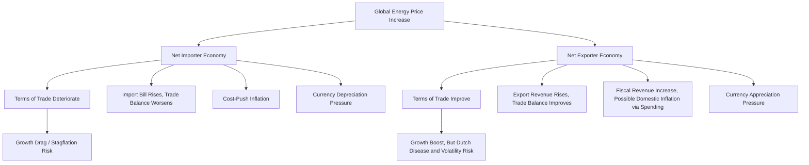

## Energy Exporters vs Importers: Differing Macro Exposures

### Overview

Net energy exporters and net energy importers face fundamentally asymmetric macroeconomic exposures to the same global energy price movements, with implications spanning growth, inflation, fiscal policy, currency behavior, and financial stability. This asymmetry means a single global price shock produces divergent, often opposite, macroeconomic consequences depending on which side of the trade balance a country sits on, a distinction central to understanding cross-country differences in policy response and economic outcomes during energy price cycles.

**Key Points**

- Energy price increases represent a positive terms-of-trade shock for exporters and a negative terms-of-trade shock for importers, with corresponding opposite effects on growth, currency, and external accounts
- Importers face a classic stagflationary combination (higher inflation, growth drag) while exporters face a growth-inflation trade-off that is generally more favorable but introduces distinct risks (Dutch disease, fiscal pro-cyclicality)
- Fiscal exposure differs sharply: exporters often have resource-linked government revenue directly exposed to price cycles, while importers face fiscal pressure primarily through subsidy costs or social support measures during price spikes
- Financial market and currency behavior diverges: exporter currencies tend to appreciate during price upswings while importer currencies face depreciation pressure, compounding the underlying real economy effects
- Diversified economies with mixed or balanced energy trade positions experience more muted versions of these effects, while heavily specialized economies at either extreme experience the sharpest exposures

### Comparative Macroeconomic Transmission Framework

### Growth and Output Effects

#### Net Importers

- Energy price spikes act as a negative supply shock, raising production costs across the economy while simultaneously reducing real household purchasing power (higher share of income spent on energy leaves less for other consumption)
- This combination—reduced real income plus higher costs—typically produces a growth drag that can coincide with elevated inflation, the classic "stagflationary" pattern that makes energy shocks particularly difficult for policymakers to address, since conventional demand management tools (monetary easing to support growth vs. tightening to fight inflation) point in opposite directions
- Energy-intensive industries (manufacturing, transportation, chemicals) within importing economies bear disproportionate direct impact, with potential knock-on effects for employment in those sectors

#### Net Exporters

- Energy price spikes generally boost growth through higher export revenue, increased investment in the energy sector, and often expansionary fiscal policy funded by higher resource revenue
- However, this growth boost is not without risk: overreliance on the resource sector during high-price periods can crowd out other tradeable sectors (Dutch disease dynamics) and create structural vulnerability when prices eventually decline
- The volatility of resource-sector-driven growth tends to be higher than in diversified economies, since the same price sensitivity that provides upside during booms creates downside during price declines

### Inflation Dynamics Comparison

| Dimension | Net Importer | Net Exporter |
| --- | --- | --- |
| Direct energy CPI effect | Rises (imported energy costs pass through) | Rises (energy is still consumed domestically at global-linked prices in many cases) |
| Currency channel | Depreciation adds to imported inflation | Appreciation partially offsets domestic price pressure from other imports |
| Demand-side channel | Real income squeeze dampens broader demand | Resource revenue can boost government/private spending, adding demand-side inflation pressure |
| Net inflation outcome | Typically clearly negative (stagflationary) | Mixed: energy-linked inflation still present, but often less severe overall given offsetting currency and income effects |

Net exporters are not immune to energy-price-driven inflation, particularly where domestic energy prices are linked to international levels rather than fully insulated by subsidies, but the overall macroeconomic inflation picture tends to be less uniformly negative than for importers given offsetting currency appreciation and positive income effects.

### Fiscal Policy Exposure

#### Net Importers

- Fiscal exposure during energy price spikes often manifests through subsidy costs (if the government subsidizes retail energy prices to shield consumers) or through demands for fiscal support measures (targeted transfers, tax relief) to offset the cost-of-living impact on households
- Countries with extensive fuel or electricity subsidies face a direct fiscal cost that rises mechanically with global prices if retail prices are held below market levels, creating fiscal strain precisely when the broader economy is also under growth pressure
- Import-dependent countries with limited fiscal space are particularly vulnerable to this compounding effect, sometimes requiring difficult trade-offs between subsidy maintenance (protecting near-term consumer welfare) and fiscal sustainability

#### Net Exporters

- Government revenue in many resource-exporting economies is directly and substantially linked to resource export receipts (through royalties, production-sharing agreements, or state ownership of resource companies), meaning price spikes translate relatively directly into higher fiscal revenue
- This creates the fiscal pro-cyclicality risk discussed in resource curse literature: governments may expand spending commitments during high-price periods that become difficult to sustain when prices decline, a pattern observed across numerous historical resource price cycles
- Sovereign wealth funds and fiscal rules (discussed in resource curse and Dutch disease contexts) are the primary policy tools used by well-managed exporters to smooth this fiscal exposure across price cycles

### Currency and Financial Market Behavior

#### Exchange Rate Sensitivity

- Exporter currencies (sometimes termed "commodity currencies" in market terminology, applicable to major oil and gas exporters as well as broader commodity exporters) frequently exhibit positive correlation with global energy prices, appreciating during price upswings and depreciating during downswings
- Importer currencies frequently exhibit the opposite pattern, facing depreciation pressure during energy price spikes (compounding the direct cost impact, as discussed in energy dependence and trade balance transmission) and potential appreciation support during price declines
- This differential currency sensitivity means foreign exchange markets can serve as a leading indicator of energy price expectations for economies with pronounced net exporter or importer positions, though this relationship is influenced by many other macroeconomic factors simultaneously and should not be treated as a clean, isolated signal [Inference: the general directional relationship is well-documented in currency market literature and practice; the strength and reliability of this relationship varies by country, time period, and the presence of confounding macro factors]

#### Sovereign Credit and Financial Stability

- Rating agencies and financial markets often incorporate energy dependence status directly into sovereign credit assessments, given the demonstrated linkage between energy price cycles and fiscal/external balance sustainability for both importers (external financing vulnerability) and exporters (revenue volatility and fiscal sustainability)
- Banking sector exposure to energy-linked sectors (oil and gas lending in exporter economies, or energy-intensive industrial lending in importer economies) can create financial stability risks that amplify during severe or prolonged price cycles in either direction

### Policy Response Divergence

**Key Points**

- Net importers facing a price spike typically confront a genuine monetary policy dilemma between accommodating a supply shock and defending against inflation/currency pressure
- Net exporters facing a price spike face a different but equally consequential challenge: managing pro-cyclical fiscal temptation and Dutch disease risk during the boom phase
- Both importers and exporters benefit from diversification strategies, though the specific diversification goal differs (reducing import dependence for importers; developing non-resource tradeable sectors for exporters)
- Strategic reserves serve importers primarily as a supply-security and price-smoothing buffer, while sovereign wealth funds serve exporters primarily as a revenue-smoothing and intergenerational savings mechanism

| Policy Tool | Primary User | Primary Objective |
| --- | --- | --- |
| Strategic petroleum reserves | Importers | Buffer against acute supply disruption, smooth price spikes |
| Fuel/energy subsidies | Importers (heavily used in many emerging markets) | Shield consumers from price pass-through, at fiscal cost |
| Sovereign wealth funds | Exporters | Smooth fiscal revenue, save for intergenerational equity |
| Fiscal rules (revenue-linked) | Exporters | Limit pro-cyclical spending during price booms |
| Domestic production incentives | Importers | Reduce import dependence over time |
| Export sector diversification policy | Exporters | Mitigate Dutch disease, reduce resource concentration |

### Illustrative Example: Divergent Responses to a Common Price Shock

Consider a global oil price increase from $70 to $100 per barrel occurring simultaneously across two hypothetical economies:

**Importer economy** (imports 70% of consumption): experiences a direct increase in import costs, a widening trade deficit, upward pressure on headline inflation through both direct fuel prices and transportation cost pass-through, and currency depreciation risk if the trade deficit is not readily financed—prompting a central bank policy dilemma between tightening to control inflation and accommodating what is fundamentally a negative supply shock to growth.

**Exporter economy** (exports 40% of production, government captures substantial royalty/tax revenue from production): experiences a substantial increase in export revenue and government fiscal receipts, currency appreciation pressure, and increased capacity for government spending, but faces the policy challenge of avoiding excessive pro-cyclical fiscal expansion and managing the currency appreciation's effect on non-resource export competitiveness.

The same $30/barrel global price move thus produces largely opposite macroeconomic policy challenges for the two economies, illustrating why energy price cycles cannot be assessed as uniformly positive or negative without reference to a country's specific trade position. [Inference: this is a stylized illustrative comparison constructed to demonstrate the general asymmetric mechanism; actual country-specific magnitudes depend on numerous additional factors including subsidy policy, fiscal rules already in place, and financial market conditions]

### Diversified and Mixed-Position Economies

- Economies with roughly balanced energy trade (near-zero net import/export position) or highly diversified energy sourcing/production experience more muted versions of both the importer and exporter dynamics described above
- Economies that are net importers of one energy commodity (e.g., oil) while being net exporters of another (e.g., natural gas) can experience genuinely mixed and sometimes offsetting effects from a broad-based energy price cycle, requiring disaggregated analysis by specific commodity rather than a single aggregate energy trade balance figure
- The degree of diversification across energy types, suppliers, and the broader economy's sectoral composition is a key determinant of overall macroeconomic resilience to energy price volatility, independent of whether the net position is import or export-oriented

### Common Pitfalls and Misconceptions

- Assuming all countries experience energy price shocks identically, when net importer versus exporter status fundamentally reverses the direction of growth, currency, and fiscal effects
- Treating exporter status as unambiguously macroeconomically favorable, when Dutch disease, fiscal pro-cyclicality, and revenue volatility risks are well-documented costs that can offset apparent trade balance benefits
- Overlooking those countries with mixed positions across different energy commodities (e.g., net oil importer but net gas exporter), which require commodity-specific rather than aggregate energy trade analysis
- Assuming currency movements in commodity-linked currencies are driven solely by energy prices, when many other macroeconomic and capital flow factors influence exchange rates simultaneously
- Ignoring that subsidy policy in importer economies can substantially alter the domestic transmission of an international price shock, delaying but not eliminating the underlying fiscal or economic cost

**Related Topics**

- Energy dependence and trade balance transmission mechanisms
- Resource curse and Dutch disease dynamics in exporter economies
- Energy price shocks and inflation transmission channels
- Sovereign wealth fund design and fiscal rule frameworks
- Commodity currency behavior and foreign exchange market dynamics
- Strategic petroleum reserves and energy security policy
- Fuel subsidy design, fiscal cost, and reform strategies
- Sovereign credit rating methodology for resource-dependent economies
- Terms-of-trade shock analysis in open-economy macroeconomics
- Cross-commodity energy trade position analysis (oil vs. gas vs. coal)