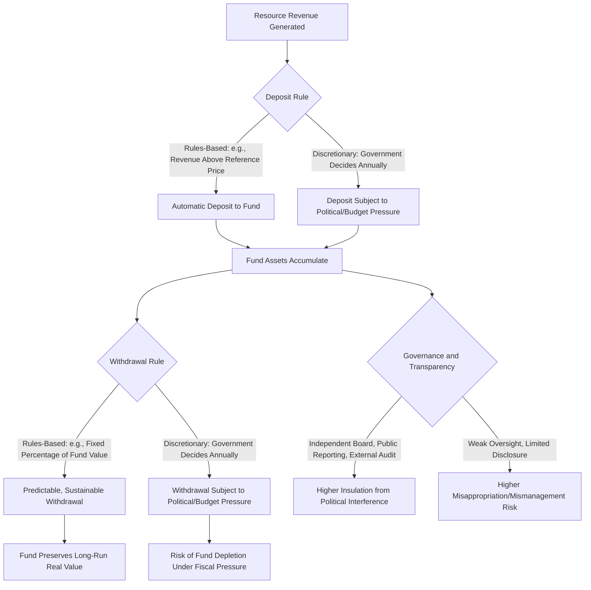

## Sovereign Wealth Funds and Resource Revenue Management

### Overview

Sovereign wealth funds (SWFs) are state-owned investment vehicles that manage accumulated national wealth, with resource-revenue-funded SWFs representing one of the largest and most consequential categories globally. These funds serve as the primary institutional mechanism through which resource-exporting nations attempt to smooth fiscal revenue volatility, mitigate Dutch disease effects, preserve wealth for future generations, and impose spending discipline during commodity price booms.

**Key Points**

- Resource-based SWFs are generally classified by primary objective: stabilization funds (smoothing near-term fiscal volatility) and savings/intergenerational funds (preserving wealth for future generations)
- Fund effectiveness depends heavily on governance structure, including clear and enforced deposit/withdrawal rules, transparency, and insulation from short-term political pressure
- Well-governed funds can materially mitigate resource curse and Dutch disease risks; poorly governed funds have in some cases failed to prevent the very problems they were designed to address
- The Santiago Principles represent the primary international voluntary governance framework for SWFs
- Fund design choices (funding rules, withdrawal rules, investment mandate, governance structure) each carry distinct trade-offs relevant to a country's specific fiscal and developmental circumstances

### Fund Typology by Primary Objective

#### Stabilization Funds

- Designed to smooth government spending and the domestic economy against short-to-medium-term commodity price volatility, by saving revenue during high-price periods and drawing down during low-price periods
- Typically hold more liquid, lower-risk assets given the need for potential near-term withdrawal, prioritizing capital preservation and liquidity over long-run return maximization
- Often structured with rules-based deposit and withdrawal triggers linked to a reference commodity price (e.g., depositing revenue earned above a benchmark price, withdrawing when actual price falls below it)

#### Savings / Intergenerational Funds

- Designed to convert a depleting, finite natural resource into a permanent, diversified financial asset that continues generating returns for future generations after the resource itself is exhausted or its economic value declines
- Typically hold a more diversified, growth-oriented portfolio (public equities, fixed income, real assets, alternative investments) given a longer investment horizon and lower near-term liquidity needs
- The underlying philosophy reflects an intergenerational equity principle: since natural resource extraction depletes a finite national asset, converting extraction proceeds into financial wealth aims to ensure future generations, not just the current one, benefit from resource wealth

#### Hybrid and Multi-Objective Funds

- Many funds combine stabilization and savings functions within a single structure or through multiple sub-funds with distinct mandates and rules, reflecting the reality that governments often need both near-term fiscal buffering and long-run wealth preservation simultaneously

### Fund Governance Design Elements

#### Deposit Rules

- **Rules-based deposit mechanisms**: automatically direct resource revenue above a defined reference price or threshold into the fund, reducing discretion and the associated risk of political pressure to spend windfall revenue immediately
- **Discretionary deposit mechanisms**: leave the deposit decision to annual budget processes, which provides flexibility but is more vulnerable to political pressure to spend rather than save during high-revenue periods

#### Withdrawal Rules

- **Fixed percentage of fund value (endowment-style)**: withdraws a set percentage of the fund's total value (or a moving average of its value) each year, providing a smoothed, sustainable income stream that adjusts gradually to fund performance rather than to short-term commodity price swings directly
- **Real return-based withdrawal**: withdraws only the fund's estimated real (inflation-adjusted) return, intended to preserve the fund's real value in perpetuity—a common design principle for intergenerational savings funds
- **Fixed price-based withdrawal**: withdraws revenue earned below a reference commodity price to top up the budget during downturns, more common in stabilization-fund designs

#### Investment Mandate and Risk Tolerance

- Stabilization funds generally mandate conservative, liquid investment portfolios (government bonds, high-grade fixed income) given potential need for near-term withdrawal
- Savings funds generally mandate more diversified, growth-oriented portfolios given longer investment horizons, though governance frameworks typically specify permitted asset classes, geographic diversification requirements, and risk limits to prevent excessive risk-taking with national wealth

### The Santiago Principles

The Santiago Principles are a set of 24 voluntary generally accepted principles and practices for sovereign wealth funds, developed through an international working group process and endorsed by a substantial number of SWFs globally, covering areas including:

- Legal framework and objectives clarity
- Institutional governance structure and accountability
- Investment and risk management policies
- Transparency and public reporting standards

The principles were developed partly in response to concerns among recipient countries about the objectives and governance of growing SWF investment flows, aiming to promote transparency and reduce concerns about SWFs being used for non-commercial or geopolitical purposes rather than legitimate investment objectives. [Unverified: specific current membership, compliance assessment status, and any recent updates to the principles should be verified against current International Forum of Sovereign Wealth Funds materials, as institutional details evolve over time]

### Case Study Patterns: Divergent Fund Outcomes

#### Well-Governed Fund Characteristics (Illustrative Pattern)

Funds generally cited as successful examples in the literature tend to share several common features:

- Strong rules-based deposit and withdrawal frameworks with limited political discretion to override them
- High transparency, including regular public reporting of holdings, performance, and governance decisions
- Independent professional management insulated from direct political control over individual investment decisions
- Clear legal and constitutional protections establishing the fund's purpose and limiting its use for purposes outside its mandate
- Established prior to or early in the resource revenue boom, allowing disciplined saving from the outset rather than attempting to retrofit discipline onto already-established spending patterns

#### Weaker Governance Outcomes (Illustrative Pattern)

Funds cited as less successful or as cautionary examples in the literature tend to share different characteristics:

- Discretionary deposit and withdrawal rules subject to override during fiscal pressure or political transitions
- Limited transparency, making independent assessment of fund performance and holdings difficult
- Direct political control over specific investment decisions, creating vulnerability to non-commercial allocation of fund resources
- Establishment after significant spending commitments were already made, limiting the fund's ability to build a meaningful buffer before fiscal pressures emerged

The divergence between these outcome patterns is widely attributed in the literature primarily to governance and institutional design quality rather than to differences in the underlying resource endowment or fund objectives, reinforcing the broader resource curse literature's emphasis on institutions as the key conditioning variable. [Inference: this represents a synthesis of the widely-observed pattern in comparative SWF governance literature; specific fund performance assessments are contested and should be evaluated against current, fund-specific data rather than general characterizations]

### Fiscal Rule Integration

Resource revenue management is most effective when SWF mechanics are integrated with broader fiscal rule frameworks:

$$\text{Non-Resource Fiscal Balance} = \text{Total Government Revenue} - \text{Resource Revenue} - \text{Government Expenditure}$$

- Some countries explicitly budget based on a **non-resource fiscal balance** or **structural fiscal balance** concept, which excludes volatile resource revenue from the baseline budget calculation and requires resource revenue to flow through the SWF mechanism rather than directly into annual spending
- This approach directly operationalizes the stabilization objective: government spending is anchored to a smoothed, sustainable revenue base rather than fluctuating directly with commodity prices, with the SWF serving as the buffer absorbing the difference between actual and smoothed revenue

### Illustrative Example: Stylized Withdrawal Rule Mechanics

Consider a hypothetical resource-exporting country's SWF with the following simplified rules:

- Fund value at start of year: $100 billion
- Withdrawal rule: 4% of the prior year-end fund value (a real-return-based withdrawal approach)
- Permitted annual withdrawal: $100B \times 0.04 = \$4$ billion

If resource revenue that year is $8 billion (well above the government's budgeted $4 billion draw), the additional $4 billion is deposited into the fund, growing it to $104 billion (before investment returns) for the following year's calculation. If resource revenue instead falls to $1 billion due to a price decline, the government still draws its budgeted $4 billion, with the $3 billion shortfall funded from the fund's existing balance—illustrating how the rules-based mechanism decouples annual government spending from year-to-year commodity price volatility, at the cost of gradually drawing down the fund during sustained low-price periods if revenue does not recover. [Inference: this is a simplified illustrative example of standard SWF withdrawal rule mechanics; actual rules incorporate additional complexity including investment return assumptions, inflation adjustments, and specific legal formulas that vary by fund]

### Risks and Limitations of SWF Mechanisms

**Key Points**

- SWFs address revenue volatility and savings objectives but do not, by themselves, resolve Dutch disease currency effects unless specifically designed with sterilization (holding revenue in foreign assets rather than converting to domestic currency) as an explicit objective
- Fund independence can be eroded gradually over time even in initially well-designed frameworks if legal protections are weakened or political pressure intensifies during severe fiscal stress
- Large funds can create governance challenges of their own, including questions about accountability for investment decisions and potential use of fund assets for politically motivated rather than purely commercial investment objectives
- Funds cannot substitute for broader economic diversification policy; they address revenue and fiscal volatility management but do not directly build alternative competitive industries

### Common Pitfalls and Misconceptions

- Assuming the mere existence of a sovereign wealth fund guarantees resource curse mitigation, when governance quality and rule adherence determine actual effectiveness far more than the fund's existence alone
- Conflating stabilization funds and savings funds as interchangeable, when their differing objectives imply different appropriate withdrawal rules, investment mandates, and risk tolerances
- Overlooking that SWF mechanisms address fiscal and revenue volatility but do not automatically resolve currency appreciation (Dutch disease) unless foreign asset holding is an explicit part of the fund's design
- Assuming a fund's stated rules are automatically enforced in practice; several documented cases show rules being overridden or weakened during periods of fiscal stress or political transition
- Treating SWFs as a substitute for economic diversification policy rather than a complementary tool addressing a different (revenue/fiscal volatility) dimension of resource dependence risk

**Related Topics**

- Santiago Principles and international SWF governance standards in depth
- Resource curse and Dutch disease theoretical frameworks
- Fiscal rules and structural/non-resource balance budgeting frameworks
- Case study: Norway's Government Pension Fund Global governance model
- Case study comparisons of stabilization versus savings fund performance
- Energy exporter macroeconomic exposure and policy response
- Intergenerational equity theory in natural resource economics
- Central bank foreign reserve management versus SWF investment mandates
- Political economy of resource revenue and rent-seeking behavior
- Extractive Industries Transparency Initiative and revenue disclosure standards